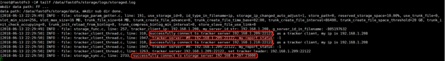

## 前言

接着上篇博客：[详细的最新版fastdfs单机版搭建](https://www.cnblogs.com/youzhibing/p/9160690.html)，今天来讲讲fastdfs的集群搭建，限于篇幅，今天先搭建stoarge集群，并实现统一的http访问方式；

没看我上篇博客的小伙伴，最好先去瞅一眼，这篇博客很多都是基于上篇博客的；

不懂fastfds原理的，可以先去看看：[分布式文件系统FastDFS设计原理](http://blog.chinaunix.net/uid-20196318-id-4058561.html)，了解了原理之后，再来看这篇博客会轻松很多；

## 环境准备

###  1、机器准备

VIP：192.168.1.200

centos211（192.168.1.211）：nginx + keepalived master

centos212（192.168.1.212：nginx + keepalived backup

centos210（192.168.1.210）：tracker

fastdfs4（192.168.1.209）：tracker

fastdfs3（192.168.1.208）：storage(group2) + fastdfs-nginx-module + nginx

fastdfs2（192.168.1.207）：storage(group2) + fastdfs-nginx-module + nginx

fastdfs1（192.168.1.206）：storage(group1) + fastdfs-nginx-module + nginx

fastdfs （192.168.1.205）：storage(group1) + fastdfs-nginx-module + nginx

###  2、最终各组件之间的关系图如下

## fastdfs安装

无论是tracker还是storage的搭建，都是在fastdfs的基础上进行的，安装好了fastdfs之后，配置tracker或者storage就可以启动tracker服务或者storage服务了；fastdfs安装可参考[详细的最新版fastdfs单机版搭建](https://www.cnblogs.com/youzhibing/p/9160690.html)

## tracker配置

本文只是简单利用了tracker集群上传了图片，更多的tracker集群 + nginx配置我放在下篇博客讲解

两台tracker机器配置可以完全一致，只需要在trackerd.conf修改如下配置项

base_path=/data/fastdfs/tracker

创建数据目录并启动tracker服务，注意是两台

[root@centos210 fdfs]# mkdir -p /data/fastdfs/tracker

[root@fastdfs4 ~]# /usr/bin/fdfs_trackerd /etc/fdfs/tracker.conf restart

## storage配置

###  group1

两台机器配置可以完全一样，修改storage.conf如下配置项

base_path=/data/fastdfs/storage

store_path0=/data/fastdfs/storage

tracker_server=192.168.1.209:22122

tracker_server=192.168.1.210:22122

group_name=group1

启动group1的两台，并查看日志

[root@fastdfs data]# /usr/bin/fdfs_storaged /etc/fdfs/storage.conf

[root@fastdfs logs]# tailf /data/fastdfs/storage/logs/storaged.log

fastdfs(205)

fastdfs1(206)

###  group2

两台机器配置可以完全一样，修改storage.conf如下配置项

base_path=/data/fastdfs/storage

store_path0=/data/fastdfs/storage

tracker_server=192.168.1.209:22122

tracker_server=192.168.1.210:22122

group_name=group2

启动group2的两台，并查看日志

[root@fastdfs data]# /usr/bin/fdfs_storaged /etc/fdfs/storage.conf

[root@fastdfs logs]# tailf /data/fastdfs/storage/logs/storaged.log

fastdfs2(207)

fastdfs3(208)

可以看到storage都已全部连上tracker，其中tracker 209作为tracker leader

###  tracker高可用性

从上图中我们可以看到192.168.1.209这台设备是作为tracker的leader的，我们现在人为关掉192.168.1.209的tracker

[root@fastdfs4 data]# /usr/bin/stop.sh /usr/bin/fdfs_trackerd
/etc/fdfs/tracker.conf

storage上日志

[root@fastdfs3 ~]# tailf /data/fastdfs/storage/logs/storaged.log

fastdfs3(208)

fastdfs2(207)

fastdfs1(206)

fastdfs(205)

210已经作为tracker leader了，而tracker 209已经连不上了，因为209的tracker服务停了；再启动209的tracker服务

[root@fastdfs4 ~]# /usr/bin/fdfs_trackerd /etc/fdfs/tracker.conf

storage上日志

fastdfs3(208)

fastdfs2(207)

fastdfs1(206)

fastdfs(205)

可以看到4台storage机器都已经重新连接上209的tracker了，只是tracker leader仍是110

## java-client图片上传

上传实现可参考上篇博客中实现，只是这次tracker是集群，包括两台机器；我示例是一张图片上传了两次，输出信息如下：

    
    
    2
    组名：group2
    路径: M00/00/00/wKgBz1shMB2Abls1AABHO7x65CM887.jpg
    2
    组名：group2
    路径: M00/00/00/wKgB0FshMB2AIBQXAABHO7x65CM071.jpg

根据输出信息可知：group2的两台机器上有图片，而group1的机器上没有，我看具体到机器上看下

group2/M00/00/00/wKgB0FshMB2AIBQXAABHO7x65CM071.jpg，其中group1表示这张图片被保存在了哪个组当中，M00代表磁盘目录，如果电脑只有一个磁盘那就只有M00，
如果有多个磁盘，那就M01、M02...等等

## fastdfs-nginx-module配置

到目前为止，我们只是实现了通过java-client上传图片，还是不能通过http来访问图片，通过配置fastdfs-nginx-
module和nginx来实现http的图片访问

FastDFS 通过 Tracker 服务器，将文件放在 Storage 服务器存储，但是同组存储服务器之间需要进入文件复制流程，有同步延迟的问题。假设
Tracker 服务器将文件上传到了 192.168.1.207，上传成功后文件 ID已经返回给客户端，此时 FastDFS
存储集群机制会将这个文件同步到同组存储 192.168.1.208，在文件还没有复制完成的情况下，客户端如果用这个文件 ID 在
192.168.1.208上取文件，就会出现文件无法访问的错误。而 fastdfs-nginx-module
可以重定向文件连接到源服务器（192.168.1.207）上取文件，避免客户端由于复制延迟导致的文件无法访问错误。

在storage服务所在的机器配置fastdfs-nginx-module，4台机器的配置基本一样，示例中则只展示一台机器（fastdfs3）的配置

解压图中fastdfs-nginx-module-master.zip

[root@fastdfs2 00]# cd /opt

[root@fastdfs2 opt]# unzip -o fastdfs-nginx-module-master.zip -d /usr/local

拷贝配置文件

[root@fastdfs2 opt]# cd /usr/local/fastdfs-nginx-module-master/src

[root@fastdfs2 src]# cp mod_fastdfs.conf /etc/fdfs/

编辑配置文件

[root@fastdfs2 src]# cd /etc/fdfs/

[root@fastdfs2 fdfs]# vi mod_fastdfs.conf

修改的地方如下：

    
    
    base_path=/data/fastdfs/storage
    connect_timeout=10                        #保留默认值也可以
    tracker_server=192.168.1.209:22122
    tracker_server=192.168.1.210:22122
    url_have_group_name = true                #url中是否加上group名
    store_path0=/data/fastdfs/storage
    group_name=group2                        #当前storage所属的组名
    group_count = 2                    #组的数量，示例中共两组：group1、group2
    
    [group1]
    group_name=group1
    storage_server_port=23000
    store_path_count=1
    store_path0=/data/fastdfs/storage
    
    [group2]
    group_name=group2
    storage_server_port=23000
    store_path_count=1
    store_path0=/data/fastdfs/storage

View Code

同组的storage上的mod_fastdfs.conf想通，异组的mod_fastdfs.conf也只是group_name不同，各个storage上的mod_fastdfs.conf具体修改项如下：

fastdfs2(207)，与fastdfs3同组，mod_fastdfs.conf修改项一样

    
    
    base_path=/data/fastdfs/storage
    connect_timeout=10                        #保留默认值也可以
    tracker_server=192.168.1.209:22122
    tracker_server=192.168.1.210:22122
    url_have_group_name = true                #url中是否加上group名
    store_path0=/data/fastdfs/storage
    group_name=group2                        #当前storage所属的组名
    group_count = 2                    #组的数量，示例中共两组：group1、group2
    
    [group1]
    group_name=group1
    storage_server_port=23000
    store_path_count=1
    store_path0=/data/fastdfs/storage
    
    [group2]
    group_name=group2
    storage_server_port=23000
    store_path_count=1
    store_path0=/data/fastdfs/storage

View Code

fastdfs1(206)与fastdfs(205)同组，mod_fastdfs.conf修改项一样

    
    
    base_path=/data/fastdfs/storage
    connect_timeout=10                        #保留默认值也可以
    tracker_server=192.168.1.209:22122
    tracker_server=192.168.1.210:22122
    url_have_group_name = true                #url中是否加上group名
    store_path0=/data/fastdfs/storage
    group_name=group1                    #当前storage所属的组名
    group_count = 2                    #组的数量，示例中共两组：group1、group2
    
    [group1]
    group_name=group1
    storage_server_port=23000
    store_path_count=1
    store_path0=/data/fastdfs/storage
    
    [group2]
    group_name=group2
    storage_server_port=23000
    store_path_count=1
    store_path0=/data/fastdfs/storage

View Code

## nginx安装与配置

###  storage方的nginx

fastdfs-nginx-
module配置好了之后，还是不能通过http请求访问storage中的图片，因为没有http服务；部署nginx提供http服务，集成fastdfs-
nginx-
module；具体可参考我的博客：[详细的最新版fastdfs单机版搭建](https://www.cnblogs.com/youzhibing/p/9160690.html)，里面有讲到集成过程。所有的storage服务器都需要配置

集成好了，配置nginx配置文件：nginx-fdfs.conf

fastdfs(205)

    
    
    user root;
    worker_processes 1;
    events {
        use epoll;
    
        worker_connections  1024;
    }
    http {
        server {
            listen       8888;
            server_name  192.168.1.205;
    
            location ~/group[1]/M00/{
                    #root /home/FastDFS/fdfs_storage/data;
                    ngx_fastdfs_module;
            }
        }
        server {
            listen 8080;
            server_name 192.168.1.205;
            location / {
                root   html;
                index  index.html index.htm;
            }
        }
    }

View Code

fastdfs(206)

    
    
    user root;
    worker_processes 1;
    events {
        use epoll;
    
        worker_connections  1024;
    }
    http {
        server {
            listen       8888;
            server_name  192.168.1.206;
    
            location ~/group[1]/M00/{
                    #root /home/FastDFS/fdfs_storage/data;
                    ngx_fastdfs_module;
            }
        }
        server {
            listen 8080;
            server_name 192.168.1.206;
            location / {
                root   html;
                index  index.html index.htm;
            }
        }
    }

View Code

fastdfs(207)

    
    
    user root;
    worker_processes 1;
    events {
        use epoll;
    
        worker_connections  1024;
    }
    http {
        server {
            listen       8888;
            server_name  192.168.1.207;
    
            location ~/group[2]/M00/{
                    #root /home/FastDFS/fdfs_storage/data;
                    ngx_fastdfs_module;
            }
        }
        server {
            listen 8080;
            server_name 192.168.1.207;
            location / {
                root   html;
                index  index.html index.htm;
            }
        }
    }

View Code

fastdfs(208)

    
    
    user root;
    worker_processes 1;
    events {
        use epoll;
    
        worker_connections  1024;
    }
    http {
        server {
            listen       8888;
            server_name  192.168.1.208;
    
            location ~/group[2]/M00/{
                    #root /home/FastDFS/fdfs_storage/data;
                    ngx_fastdfs_module;
            }
        }
        server {
            listen 8080;
            server_name 192.168.1.208;
            location / {
                root   html;
                index  index.html index.htm;
            }
        }
    }

View Code

以nginx-fdfs.conf为配置文件来启动storage上的nginx：

[root@fastdfs3 sbin]# /usr/local/nginx/sbin/nginx -c
/usr/local/nginx/conf/nginx-fdfs.conf

自此storage方的nginx就配置好了

###  对外提供服务的nginx

VIP：192.168.1.200

centos211：nginx + keepalived master

centos212：nginx + keepalived backup

两台nginx实现对外服务的高可用，具体搭建过程可参考：[nginx实现请求的负载均衡 +
keepalived实现nginx的高可用](https://www.cnblogs.com/youzhibing/p/7327342.html)

nginx的配置文件一样：

    
    
    user  root;
    worker_processes  1;
    events {
        worker_connections  1024;
        use epoll;
    }
    http {
        include       mime.types;
        default_type  application/octet-stream;
        #log_format  main  "$remote_addr - $remote_user [$time_local] "$request" "
        #                  "$status $body_bytes_sent "$http_referer" "
        #                  ""$http_user_agent" "$http_x_forwarded_for"";
        #access_log  logs/access.log  main;
        sendfile       on;
        tcp_nopush     on;
        keepalive_timeout  65;
        #gzip on;
    
        #设置 group1 的服务器
        upstream fdfs_group1 {
             server 192.168.1.205:8888 weight=1 max_fails=2 fail_timeout=30s;
             server 192.168.1.206:8888 weight=1 max_fails=2 fail_timeout=30s;
        }
    
        #设置 group2 的服务器
        upstream fdfs_group2 {
             server 192.168.1.207:8888 weight=1 max_fails=2 fail_timeout=30s;
             server 192.168.1.208:8888 weight=1 max_fails=2 fail_timeout=30s;
        }
    
        server {
            listen       80;
            server_name  localhost;
            #charset koi8-r;
            #access_log  logs/host.access.log  main;
    
            #设置 group 的负载均衡参数
            location /group1/M00 {
                proxy_set_header Host $host;
                proxy_set_header X-Real-IP $remote_addr;
                proxy_pass http://fdfs_group1;
            }
    
            location /group2/M00 {
                proxy_set_header Host $host;
                proxy_set_header X-Real-IP $remote_addr;
                proxy_pass http://fdfs_group2;
            }
    
            #error_page  404              /404.html;
            # redirect server error pages to the static page /50x.html
            #
            error_page   500 502 503 504  /50x.html;
            location = /50x.html {
                root html; 
            }
        } 
    }

View Code

nginx、keepalived都配置好了后，先启动nginx，再启动keepalived

###  最终效果

访问http://192.168.1.200/group2/M00/00/00/wKgB0FshMB2AIBQXAABHO7x65CM071.jpg，出现如下美女

## 总结

1、了解fastdfs的原理很重要，只有理解了搭建起来才顺畅；

2、fastdfs-nginx-module的作用要了解清楚，不是充当nginx的角色哦；

3、对于内存太小的机器，我觉得还是没必要搭建这个集群了；我8G内存，启8个虚拟机中途直接死机了一次......

