# [Flume（一）Flume原理解析](https://www.cnblogs.com/zhangyinhua/p/7803486.html)

**阅读目录(Content)**

  * [一、Flume简介](https://www.cnblogs.com/zhangyinhua/p/7803486.html#_label0)
  * [二、Flume特点](https://www.cnblogs.com/zhangyinhua/p/7803486.html#_label1)
  * [三、Flume的一些核心概念](https://www.cnblogs.com/zhangyinhua/p/7803486.html#_label2)
    * [3.1、Agent结构 ](https://www.cnblogs.com/zhangyinhua/p/7803486.html#_lab2_2_0)
    * [3.2、source](https://www.cnblogs.com/zhangyinhua/p/7803486.html#_lab2_2_1)
    * [3.3、Channel](https://www.cnblogs.com/zhangyinhua/p/7803486.html#_lab2_2_2)
    * [3.4、Sink](https://www.cnblogs.com/zhangyinhua/p/7803486.html#_lab2_2_3)
  * [四、Flume拦截器、数据流以及可靠性](https://www.cnblogs.com/zhangyinhua/p/7803486.html#_label3)
    * [4.1、Flume拦截器](https://www.cnblogs.com/zhangyinhua/p/7803486.html#_lab2_3_0)
    * [4.2、Flume数据流](https://www.cnblogs.com/zhangyinhua/p/7803486.html#_lab2_3_1)
    * [4.3、Flume可靠性](https://www.cnblogs.com/zhangyinhua/p/7803486.html#_lab2_3_2)
  * [五、Flume使用场景](https://www.cnblogs.com/zhangyinhua/p/7803486.html#_label4)
    * [5.1、多个agent顺序连接](https://www.cnblogs.com/zhangyinhua/p/7803486.html#_lab2_4_0)
    * [5.2、多个Agent的数据汇聚到同一个Agent](https://www.cnblogs.com/zhangyinhua/p/7803486.html#_lab2_4_1)
    * [5.3、多级流](https://www.cnblogs.com/zhangyinhua/p/7803486.html#_lab2_4_2)
  * [六、Flume核心组件](https://www.cnblogs.com/zhangyinhua/p/7803486.html#_label5)
    * [6.1、Source](https://www.cnblogs.com/zhangyinhua/p/7803486.html#_lab2_5_0)
    * [6.2、Channel](https://www.cnblogs.com/zhangyinhua/p/7803486.html#_lab2_5_1)
    * [6.3、Sink](https://www.cnblogs.com/zhangyinhua/p/7803486.html#_lab2_5_2)

**前言**

最近有一点浮躁，遇到了很多不该发生在我身上的事情。没有，忘掉这些。好好的学习，才是正道！

[回到顶部(go to
top)](https://www.cnblogs.com/zhangyinhua/p/7803486.html#_labelTop)

# 一、Flume简介

flume 作为 cloudera 开发的实时日志收集系统，受到了业界的认可与广泛应用。Flume 初始的发行版本目前被统称为 Flume
OG（original generation），属于 cloudera。

但随着 FLume 功能的扩展，Flume OG 代码工程臃肿、核心组件设计不合理、核心配置不标准等缺点暴露出来，尤其是在 Flume OG
的最后一个发行版本 0.9.4. 中，日

志传输不稳定的现象尤为严重，为了解决这些问题，2011 年 10 月 22 号，cloudera 完成了 Flume-728，对 Flume
进行了里程碑式的改动：重构核心组件、核心配置以

及代码架构，重构后的版本统称为 Flume NG（next generation）；改动的另一原因是将 Flume 纳入 apache
旗下，cloudera Flume 改名为 Apache Flume。

备注：Flume参考资料

官方网站： http://flume.apache.org/  
用户文档： http://flume.apache.org/FlumeUserGuide.html  
开发文档： http://flume.apache.org/FlumeDeveloperGuide.html

[回到顶部(go to
top)](https://www.cnblogs.com/zhangyinhua/p/7803486.html#_labelTop)

# 二、Flume特点

flume是一个分布式、可靠、和高可用的海量日志采集、聚合和传输的系统。支持在日志系统中定制各类数据发送方，用于收集数据;同时，Flume提供对数据进行简单处理，

并写到各种数据接受方(比如文本、HDFS、Hbase等)的能力 。  
flume的数据流由事件(Event)贯穿始终。事件是Flume的基本数据单位，它携带日志数据(字节数组形式)并且携带有头信息，这些Event由Agent外部的Source生成，当

Source捕获事件后会进行特定的格式化，然后Source会把事件推入(单个或多个)Channel中。你可以把Channel看作是一个缓冲区，它将保存事件直到Sink处理完该事件。

Sink负责持久化日志或者把事件推向另一个Source。  
  
1）flume的可靠性  
当节点出现故障时，日志能够被传送到其他节点上而不会丢失。Flume提供了三种级别的可靠性保障，从强到弱依次分别为：end-to-
end（收到数据agent首先将

event写到磁盘上，当数据传送成功后，再删除；如果数据发送失败，可以重新发送。），Store on
failure（这也是scribe采用的策略，当数据接收方crash时，将

数据写到本地，待恢复后，继续发送），Besteffort（数据发送到接收方后，不会进行确认）。

2）flume的可恢复性  
还是靠Channel。推荐使用FileChannel，事件持久化在本地文件系统里(性能较差)。

[回到顶部(go to
top)](https://www.cnblogs.com/zhangyinhua/p/7803486.html#_labelTop)

# 三、Flume的一些核心概念

Client：Client生产数据，运行在一个独立的线程。

Event： 一个数据单元，消息头和消息体组成。（Events可以是日志记录、 avro 对象等。）  
Flow： Event从源点到达目的点的迁移的抽象。  
Agent： 一个独立的Flume进程，包含组件Source、 Channel、 Sink。（Agent使用JVM
运行Flume。每台机器运行一个agent，但是可以在一个agent中包含

多个sources和sinks。）  
Source： 数据收集组件。（source从Client收集数据，传递给Channel）  
Channel： 中转Event的一个临时存储，保存由Source组件传递过来的Event。（Channel连接 sources 和 sinks
，这个有点像一个队列。）  
Sink： 从Channel中读取并移除Event，
将Event传递到FlowPipeline中的下一个Agent（如果有的话）（Sink从Channel收集数据，运行在一个独立线程。）

## 3.1、Agent结构

Flume 运行的核心是
Agent。Flume以agent为最小的独立运行单位。一个agent就是一个JVM。它是一个完整的数据收集工具，含有三个核心组件，分别是

source、 channel、 sink。通过这些组件， Event 可以从一个地方流向另一个地方，如下图所示。

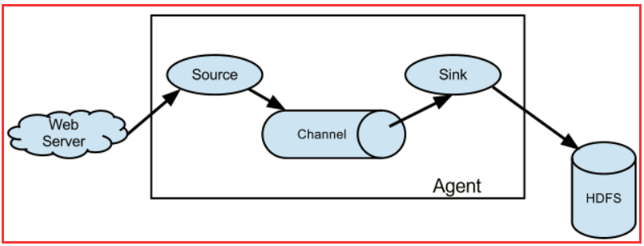

## 3.2、source

Source是数据的收集端，负责将数据捕获后进行特殊的格式化，将数据封装到事件（event） 里，然后将事件推入Channel中。
Flume提供了很多内置的  
Source， 支持 Avro， log4j， syslog 和 http
post(body为json格式)。可以让应用程序同已有的Source直接打交道，如AvroSource，  
SyslogTcpSource。 如果内置的Source无法满足需要， Flume还支持自定义Source。  
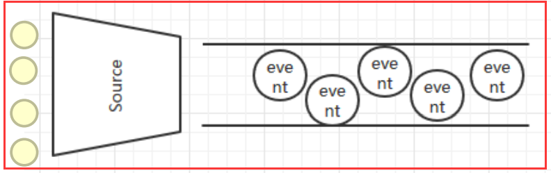

source类型：

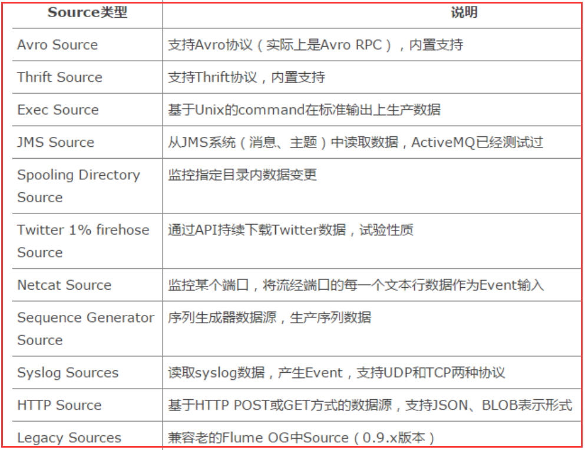

## 3.3、Channel

Channel是连接Source和Sink的组件，大家可以将它看做一个数据的缓冲区（数据队列），它可以将事件暂存到内存中也可以持久化到本地磁盘上， 直  
到Sink处理完该事件。介绍两个较为常用的Channel， MemoryChannel和FileChannel。  

Channel类型：

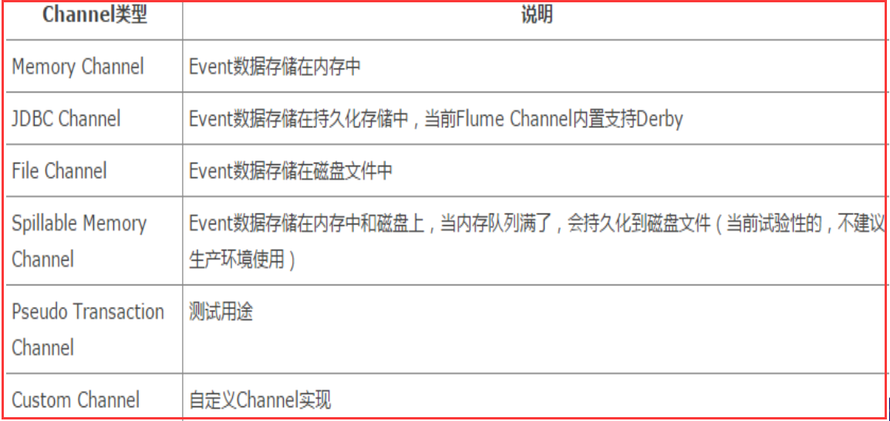

## 3.4、Sink

Sink从Channel中取出事件，然后将数据发到别处，可以向文件系统、数据库、 hadoop存数据，
也可以是其他agent的Source。在日志数据较少时，可  
以将数据存储在文件系统中，并且设定一定的时间间隔保存数据。

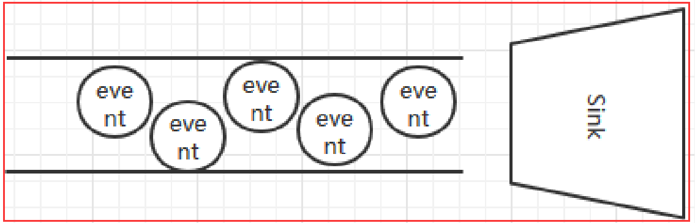

Sink类型：

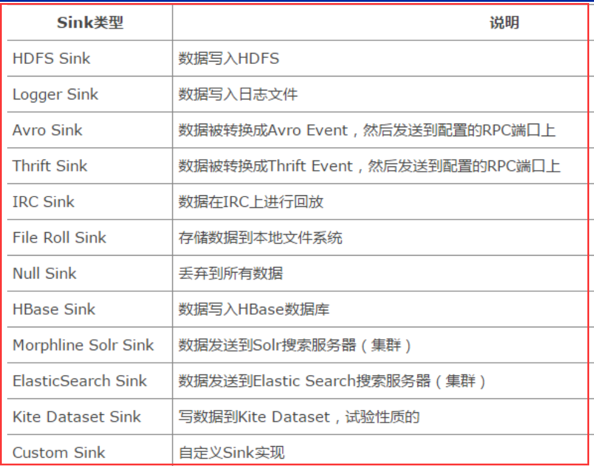

[回到顶部(go to
top)](https://www.cnblogs.com/zhangyinhua/p/7803486.html#_labelTop)

# 四、Flume拦截器、数据流以及可靠性

## 4.1、Flume拦截器

当我们需要对数据进行过滤时，除了我们在Source、 Channel和Sink进行代码修改之外， Flume为我们提供了拦截器，拦截器也是chain形式的。

拦截器的位置在Source和Channel之间，当我们为Source指定拦截器后，我们在拦截器中会得到event，根据需求我们可以对event进行保留还是

抛弃，抛弃的数据不会进入Channel中。

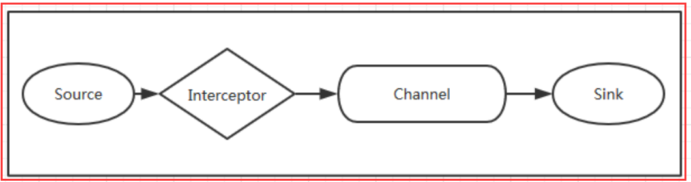

## 4.2、Flume数据流

1）Flume 的核心是把数据从数据源收集过来，再送到目的地。为了保证输送一定成功，在送到目的地之前，会先缓存数据，待数据真正到达目的地后，

删除自己缓存的数据。  
2） Flume 传输的数据的基本单位是 Event，如果是文本文件，通常是一行记录，这也是事务的基本单位。 Event 从 Source，流向
Channel，再到 Sink，

本身为一个 byte 数组，并可携带 headers 信息。 Event 代表着一个数据流的最小完整单元，从外部数据源来，向外部的目的地去。  
  
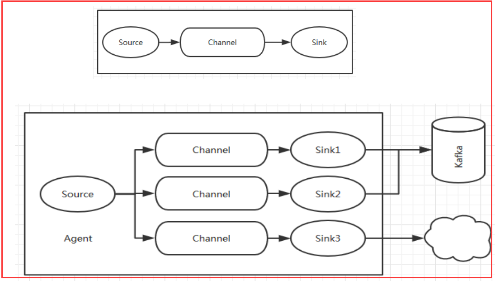

值得注意的是，Flume提供了大量内置的Source、Channel和Sink类型。不同类型的Source,Channel和Sink可以自由组合。组合方式基于用户设置的配置文件，非常灵活。

比如：Channel可以把事件暂存在内存里，也可以持久化到本地硬盘上。Sink可以把日志写入HDFS,
HBase，甚至是另外一个Source等等。Flume支持用户建立多级流，

也就是说，多个agent可以协同工作，并且支持Fan-in、Fan-out、Contextual Routing、Backup
Routes，这也正是Flume强大之处。如下图所示：

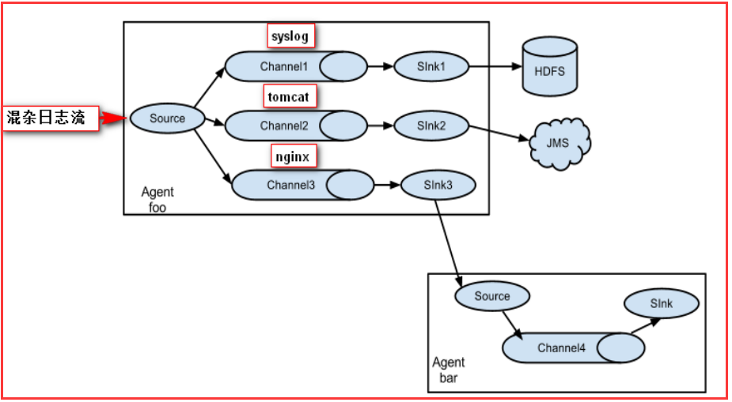

## 4.3、Flume可靠性

Flume 使用事务性的方式保证传送Event整个过程的可靠性。 Sink 必须在Event 被存入 Channel
后，或者，已经被传达到下一站agent里，又或者，

已经被存入外部数据目的地之后，才能把 Event 从 Channel 中 remove 掉。这样数据流里的 event 无论是在一个 agent 里还是多个
agent 之间流转，

都能保证可靠，因为以上的事务保证了 event 会被成功存储起来。比如 Flume支持在本地保存一份文件 channel 作为备份，而memory
channel 将

event存在内存 queue 里，速度快，但丢失的话无法恢复。

[回到顶部(go to
top)](https://www.cnblogs.com/zhangyinhua/p/7803486.html#_labelTop)

# 五、Flume使用场景

Flume在英文中的意思是水道， 但Flume更像可以随意组装的消防水管，下面根据官方文档，展示几种Flow。

## 5.1、多个agent顺序连接

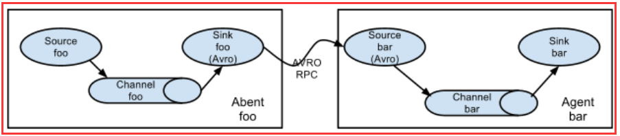

可以将多个Agent顺序连接起来，将最初的数据源经过收集，存储到最终的存储系统中。这是最简单的情况，一般情况下，应该控制这种顺序连接的  
Agent 的数量，因为数据流经的路径变长了，如果不考虑failover的话，出现故障将影响整个Flow上的Agent收集服务。  

## 5.2、多个Agent的数据汇聚到同一个Agent  

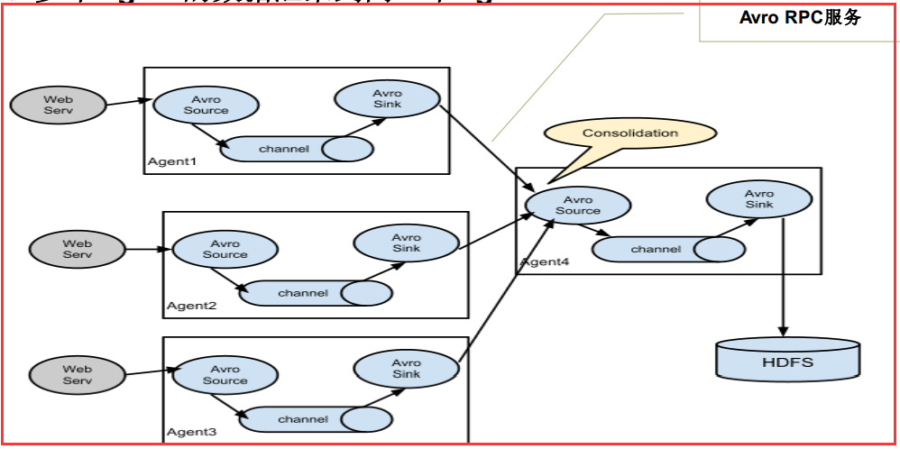

这种情况应用的场景比较多，比如要收集Web网站的用户行为日志， Web网站为了可用性使用的负载集群模式，每个节点都产生用户行为日志，可以为  
每 个节点都配置一个Agent来单独收集日志数据，然后多个Agent将数据最终汇聚到一个用来存储数据存储系统，如HDFS上。

## 5.3、多级流

Flume还支持多级流，什么多级流？结合在云开发中的应用来举个例子，当syslog， java， nginx、
tomcat等混合在一起的日志流开始流入一个agent  
后，可以agent中将混杂的日志流分开，然后给每种日志建立一个自己的传输通道。

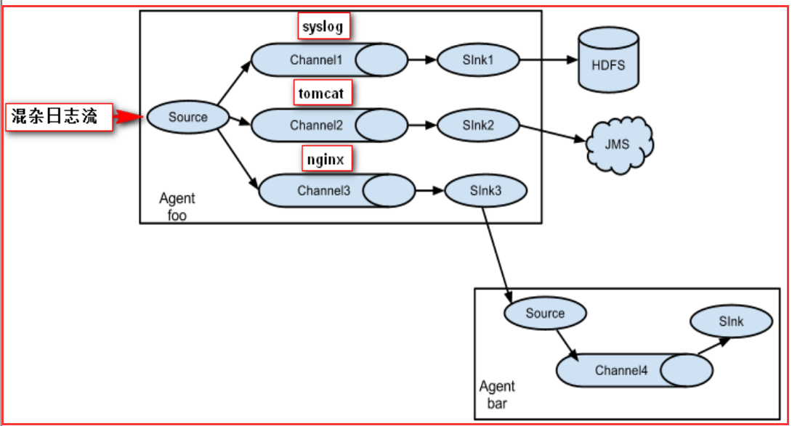

5.4、load balance功能

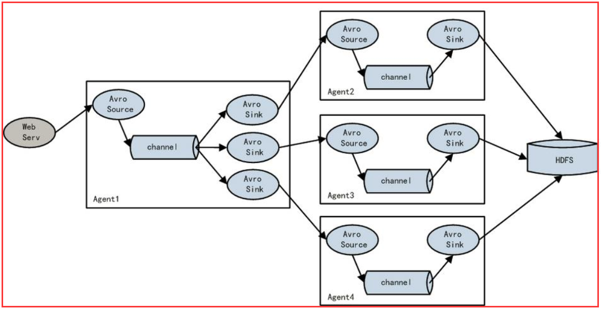

上图Agent1是一个路由节点，负责将Channel暂存的Event均衡到对应的多个Sink组件上，而每个Sink组件分别连接到一个独立的Agent上 。  

[回到顶部(go to
top)](https://www.cnblogs.com/zhangyinhua/p/7803486.html#_labelTop)

# 六、Flume核心组件

Flume主要由3个重要的组件构成：  
1）Source： 完成对日志数据的收集，分成transtion 和 event 打入到channel之中  
Flume提供了各种source的实现，包括Avro Source、 Exce Source、 Spooling  
Directory Source、 NetCat Source、 Syslog Source、 Syslog TCP Source、  
Syslog UDP Source、 HTTP Source、 HDFS Source， etc。  
2）Channel： Flume Channel主要提供一个队列的功能，对source提供中的数据进行简单的缓存。  
Flume对于Channel， 则提供了Memory Channel、 JDBC Chanel、 File Channel，etc

3）Sink： Flume Sink取出Channel中的数据，进行相应的存储文件系统，数据库，或者提交到远程服务器。  
包括HDFS sink、 Logger sink、 Avro sink、 File Roll sink、 Null sink、 HBasesink，
etc。

## 6.1、Source

Spool Source 如何使用？  
在实际使用的过程中，可以结合log4j使用，使用log4j的时候，将log4j的文件分割机制设为1分钟一次，将文件拷贝到spool的监控目录。

log4j有一个TimeRolling的插件，可以把log4j分割的文件到spool目录。基本实现了实时的监控。 Flume在传完文件之后，将会修 改文

件的后缀，变为.COMPLETED（后缀也可以在配置文件中灵活指定）  
  
Exec Source 和Spool Source 比较  
1） ExecSource可以实现对日志的实时收集，但是存在Flume不运行或者指令执行出错时，将无法收集到日志数据，无法何证日志数据

的完整性。  
2） SpoolSource虽然无法实现实时的收集数据，但是可以使用以分钟的方式分割文件，趋近于实时。  
3）总结：如果应用无法实现以分钟切割日志文件的话，可以两种 收集方式结合使用。

## 6.2、Channel

1）MemoryChannel可以实现高速的吞吐， 但是无法保证数据完整性  
2）MemoryRecoverChannel在官方文档的建议上已经建义使用FileChannel来替换。  
FileChannel保证数据的完整性与一致性。在具体配置不现的FileChannel时，建议FileChannel设置的目录和程序日志文件保存的目录

设成不同的磁盘，以便提高效率。  

## 6.3、Sink

Flume Sink在设置存储数据时，可以向文件系统中，数据库中， hadoop中储数据，在日志数据较少时，可以将数据存储在文件系中，并

且设定一定的时间间隔保存数据。在日志数据较多时，可以将相应的日志数据存储到Hadoop中，便于日后进行相应的数据分析。

