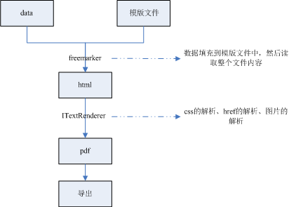

## 前言

项目中有个需求，需要将合同内容导出成pdf。上网查阅到了 iText ， iText
是一个生成PDF文档的开源Java库，能够动态的从XML或者数据库生成PDF，同时还可以对文档进行加密，权限控制，并且还支持Java/C#等，但是iText本身提供的HTML解析器还是不够强大，许多HTML标签和属性无法识别，更悲催的是简单的CSS它不认识，排版调整样式让人头大。那么有没有什么方式能够支持css呢，又查阅到了
flying-saucer， flying-
saucer也是导出PDF的一种解决方案，并且是基于iText的开源API，并且实现了CSS解析器，能够很好的支持CSS2.1，以及少量的CSS。最终解决方案定为：
flying-saucer + iText + Freemarker。

## 具体实现

流程如下

 pom.xml

    
    
    <project xmlns="http://maven.apache.org/POM/4.0.0" xmlns:xsi="http://www.w3.org/2001/XMLSchema-instance"
        xsi:schemaLocation="http://maven.apache.org/POM/4.0.0 http://maven.apache.org/maven-v4_0_0.xsd">
        <modelVersion>4.0.0</modelVersion>
        <groupId>com.yzb.lee</groupId>
        <artifactId>itextpdf</artifactId>
        <packaging>war</packaging>
        <version>0.0.1-SNAPSHOT</version>
        <name>itextpdf Maven Webapp</name>
        <url>http://maven.apache.org</url>
        <dependencies>
            <dependency>
                <groupId>org.freemarker</groupId>
                <artifactId>freemarker</artifactId>
                <version>2.3.20</version>
            </dependency>
    
            <dependency>
                <groupId>com.itextpdf.tool</groupId>
                <artifactId>xmlworker</artifactId>
                <version>5.5.1</version>
            </dependency>
            
            <!-- 支持中文 -->
            <dependency>
                <groupId>com.itextpdf</groupId>
                <artifactId>itext-asian</artifactId>
                <version>5.2.0</version>
            </dependency>
            <!-- 支持css样式渲染 -->
            <dependency>
                <groupId>org.xhtmlrenderer</groupId>
                <artifactId>flying-saucer-pdf-itext5</artifactId>
                <version>9.0.3</version>
            </dependency>
    
            <!-- https://mvnrepository.com/artifact/org.apache.commons/commons-lang3 -->
            <dependency>
                <groupId>org.apache.commons</groupId>
                <artifactId>commons-lang3</artifactId>
                <version>3.4</version>
            </dependency>
    
            <dependency>
                <groupId>junit</groupId>
                <artifactId>junit</artifactId>
                <version>4.12</version>
                <scope>test</scope>
            </dependency>
        </dependencies>
        <build>
            <finalName>itextpdf</finalName>
        </build>
    </project>

###  1、html内容的输出

模版文件fileTemplate.html

    
    
    <html>
    <head>
    <title>${title}</title>
    <!-- link链接应该写文件服务器地址， 出于演示，这里用的localhost -->
    <link type="text/css" rel="stylesheet" href="http://localhost:8080/itextpdf/css/pdf.css" />
    
    </head>
    <body>
        <h1>Just a blank page.</h1>
        

            

                <h1>${title}</h1>
                <!-- src链接应该写文件服务器地址， 出于演示，这里用的localhost -->
                
            

            <table>
                <tr>
                    <td><b>Name</b></td>
                    <td><b>Age</b></td>
                    <td><b>Sex</b></td>
                </tr>
                <#list userList as user>
                <tr>
                    <td>${user.name}</td>
                    <td>${user.age}</td>
                    <td><#if user.sex = 1> male <#else> female </#if></td>
                </tr>
                </#list>
            </table>
        

        

            <a href="https://www.baidu.com/" target="_blank">百度</a>
        

    </body>
    </html>

View Code

动态数据的获取

    
    
        public Map<String, Object> getContent() throws IOException {
    
            // 从数据库中获取数据， 出于演示目的， 这里数据不从数据库获取， 而是直接写死
            
            Map<String, Object> variables = new HashMap<String, Object>(3);
    
            List<User> userList = new ArrayList<User>();
    
            User tom = new User("Tom", 19, 1);
            User amy = new User("Amy", 28, 0);
            User leo = new User("Leo", 23, 1);
    
            userList.add(tom);
            userList.add(amy);
            userList.add(leo);
    
            variables.put("title", "用户列表");
            variables.put("userList", userList);
            
            return variables;
        }

动态数据的绑定，html内容的输出

    
    
    /**
         * Generate html string.
         * 
         * @param template
         *            the name of freemarker teamlate.
         * @param variables
         *            the data of teamlate.
         * @return htmlStr
         * @throws Exception
         */
        public static String generate(String template, Map<String, Object> variables)
                throws Exception {
            Configuration config = FreemarkerConfiguration.getConfiguation();
            Template tp = config.getTemplate(template);
            StringWriter stringWriter = new StringWriter();
            BufferedWriter writer = new BufferedWriter(stringWriter);
            tp.setEncoding("UTF-8");
            tp.process(variables, writer);
            String htmlStr = stringWriter.toString();
            writer.flush();
            writer.close();
            return htmlStr;
        }

###  2、pdf的导出

    
    
        private void generatePdf(String htmlStr, OutputStream out)
                throws IOException, DocumentException {
            //final ServletContext servletContext = getServletContext();
    
            Document document = new Document(PageSize.A4, 30, 30, 30, 30);
            document.setMargins(30, 30, 30, 30);
            PdfWriter writer = PdfWriter.getInstance(document, out);
            document.open();
    
            // html内容解析
            HtmlPipelineContext htmlContext = new HtmlPipelineContext(
                    new CssAppliersImpl(new XMLWorkerFontProvider() {
                        @Override
                        public Font getFont(String fontname, String encoding,
                                float size, final int style) {
                            Font font = null;
                            if (fontname == null) {
                                //字体  
                                String fontCn = getChineseFont();  
                                BaseFont bf;
                                try {
                                    //注意这里有一个,1 
                                    bf = BaseFont.createFont(fontCn+",1", 
                                             BaseFont.IDENTITY_H, BaseFont.NOT_EMBEDDED);
                                    font = new Font(bf, size, style);
                                } catch (DocumentException e) {
                                    e.printStackTrace();
                                } catch (IOException e) {
                                    e.printStackTrace();
                                }  
                                
                            }
                            return font;
                        }
                    })) {
                @Override
                public HtmlPipelineContext clone()
                        throws CloneNotSupportedException {
                    HtmlPipelineContext context = super.clone();
                    try {
                        ImageProvider imageProvider = this.getImageProvider();
                        context.setImageProvider(imageProvider);
                    } catch (NoImageProviderException e) {
                    }
                    return context;
                }
            };
    
            // 图片解析
            htmlContext.setImageProvider(new AbstractImageProvider() {
    
                // String rootPath = servletContext.getRealPath("/");
    
                @Override
                public String getImageRootPath() {
                    return "";
                }
    
                @Override
                public Image retrieve(String src) {
                    if (StringUtils.isEmpty(src)) {
                        return null;
                    }
                    try {
                        // String imageFilePath = new File(rootPath, src).toURI().toString();
                        Image image = Image.getInstance(src);
                        image.setAbsolutePosition(400, 400);
                        if (image != null) {
                            store(src, image);
                            return image;
                        }
                    } catch (Throwable e) {
                        e.printStackTrace();
                    }
                    return super.retrieve(src);
                }
            });
            htmlContext.setAcceptUnknown(true).autoBookmark(true)
                    .setTagFactory(Tags.getHtmlTagProcessorFactory());
    
            // css解析
            CSSResolver cssResolver = XMLWorkerHelper.getInstance()
                    .getDefaultCssResolver(true);
            cssResolver.setFileRetrieve(new FileRetrieve() {
                @Override
                public void processFromStream(InputStream in,
                        ReadingProcessor processor) throws IOException {
                    try (InputStreamReader reader = new InputStreamReader(in,
                            CHARSET_NAME)) {
                        int i = -1;
                        while (-1 != (i = reader.read())) {
                            processor.process(i);
                        }
                    } catch (Throwable e) {
                    }
                }
    
                // 解析href
                @Override
                public void processFromHref(String href, ReadingProcessor processor)
                        throws IOException {
                    // InputStream is = servletContext.getResourceAsStream(href);
                    URL url = new URL(href);
                    HttpURLConnection conn = (HttpURLConnection) url.openConnection();
                    conn.setRequestMethod("GET");
                    conn.setConnectTimeout(5 * 1000);
                    InputStream is = conn.getInputStream();
    
                    try (InputStreamReader reader = new InputStreamReader(is,
                            CHARSET_NAME)) {
                        int i = -1;
                        while (-1 != (i = reader.read())) {
                            processor.process(i);
                        }
                    } catch (Throwable e) {
                        e.printStackTrace();
                    }
                }
            });
    
            HtmlPipeline htmlPipeline = new HtmlPipeline(htmlContext,
                    new PdfWriterPipeline(document, writer));
            Pipeline<?> pipeline = new CssResolverPipeline(cssResolver,
                    htmlPipeline);
            XMLWorker worker = null;
            worker = new XMLWorker(pipeline, true);
            XMLParser parser = new XMLParser(true, worker,
                    Charset.forName(CHARSET_NAME));
            try (InputStream inputStream = new ByteArrayInputStream(
                    htmlStr.getBytes())) {
                parser.parse(inputStream, Charset.forName(CHARSET_NAME));
            }
            document.close();
        }

###  3、生成的pdf

[1508383793597.pdf](https://files.cnblogs.com/files/youzhibing/1508383793597.pdf)

## 注意点

1、博客中的代码不是一个完整工程，只依赖博客中的代码是运行不起来的；

2、文件路径的获取，本地文件与远程文件的获取是有区别的， 另外本地文件的获取又存在多种方式；

3、完整工程地址：[itextpdf](https://github.com/youzhibing/itextpdf)，仔细阅读readme.txt，
工程中存在多个版本， 而本博客对应的是版本4；

4、推荐将SIMSUN.TTC放到工程中， 这就不依赖操作系统了， 可移植性更强；

## 参考

[获取java项目根目录](http://blog.csdn.net/mydreamongo/article/details/8220577)

[freemarker+Flying sauser +Itext
整合生成PDF](http://jeemiss.iteye.com/blog/1112765)

