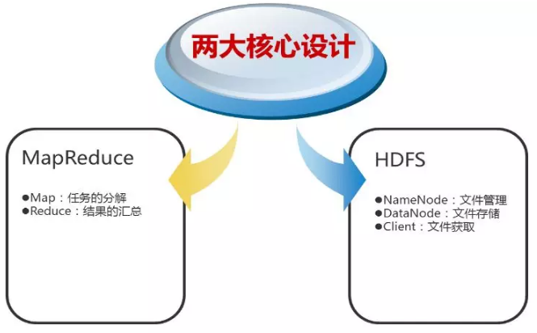

> hadoop 简单来说就是用 java写的分布式 ，处理大数据的框架，主要思想是 “分组合并” 思想。

分组：比如 有一个大型数据，那么他就会将这个数据按照算法分成多份，每份存储在
从属主机上，并且在从属主机上进行计算，主节点主要负责Hadoop两个关键功能模块HDFS、Map Reduce的监督。  
合并：将每个机器上的计算结果合并起来 再在一台机器上计算，得到最终结果。这就是mapreduce 算法。

Hadoop主要的任务部署分为3个部分，分别是：Client机器，主节点和从节点。主节点主要负责Hadoop两个关键功能模块HDFS、Map
Reduce的监督。当Job Tracker使用Map
Reduce进行监控和调度数据的并行处理时，名称节点则负责HDFS监视和调度。从节点负责了机器运行的绝大部分，担当所有数据储存和指令计算的苦差。每个从节点既扮演者数据节点的角色又冲当与他们主节点通信的守护进程。守护进程隶属于Job
Tracker，数据节点在归属于名称节点。

1、Hadoop的整体框架

Hadoop由HDFS、MapReduce、HBase、Hive和ZooKeeper等成员组成，其中最基础最重要元素为底层用于存储集群中所有存储节点文件的文件系统HDFS（Hadoop
Distributed File System）来执行MapReduce程序的MapReduce引擎。

（1）Pig是一个基于Hadoop的大规模数据分析平台，Pig为复杂的海量数据并行计算提供了一个简单的操作和编程接口；

（2）Hive是基于Hadoop的一个工具，提供完整的SQL查询，可以将sql语句转换为MapReduce任务进行运行；

（3）ZooKeeper:高效的，可拓展的协调系统，存储和协调关键共享状态；

（4）HBase是一个开源的，基于列存储模型的分布式数据库；

（5）HDFS是一个分布式文件系统，有着高容错性的特点，适合那些超大数据集的应用程序；

（6）MapReduce是一种编程模型，用于大规模数据集（大于1TB）的并行运算。  
下图是一个典型的Hadoop集群的部署结构：

接着给出Hadoop各组件依赖共存关系：

2、Hadoop的核心设计

（1）HDFS

HDFS是一个高度容错性的分布式文件系统，可以被广泛的部署于廉价的PC上。它以流式访问模式访问应用程序的数据，这大大提高了整个系统的数据吞吐量，因而非常适合用于具有超大数据集的应用程序中。

HDFS的架构如图所示。HDFS架构采用主从架构（master/slave）。一个典型的HDFS集群包含一个NameNode节点和多个DataNode节点。NameNode节点负责整个HDFS文件系统中的文件的元数据的保管和管理，集群中通常只有一台机器上运行NameNode实例，DataNode节点保存文件中的数据，集群中的机器分别运行一个DataNode实例。在HDFS中，NameNode节点被称为名称节点，DataNode节点被称为数据节点。DataNode节点通过心跳机制与NameNode节点进行定时的通信。

•NameNode

可以看作是分布式文件系统中的管理者，存储文件系统的meta-data，主要负责管理文件系统的命名空间，集群配置信息，存储块的复制。

•DataNode

是文件存储的基本单元。它存储文件块在本地文件系统中，保存了文件块的meta-data，同时周期性的发送所有存在的文件块的报告给NameNode。

•Client

就是需要获取分布式文件系统文件的应用程序。

以下来说明HDFS如何进行文件的读写操作：

文件写入：

1\. Client向NameNode发起文件写入的请求

2\. NameNode根据文件大小和文件块配置情况，返回给Client它所管理部分DataNode的信息。

3\. Client将文件划分为多个文件块，根据DataNode的地址信息，按顺序写入到每一个DataNode块中。

文件读取：

1\. Client向NameNode发起文件读取的请求

2\. NameNode返回文件存储的DataNode的信息。

3\. Client读取文件信息。

（2）MapReduce

MapReduce是一种编程模型，用于大规模数据集的并行运算。Map（映射）和Reduce（化简），采用分而治之思想，先把任务分发到集群多个节点上，并行计算，然后再把计算结果合并，从而得到最终计算结果。多节点计算，所涉及的任务调度、负载均衡、容错处理等，都由MapReduce框架完成，不需要编程人员关心这些内容。  
下图是MapReduce的处理过程：

用户提交任务给JobTracer，JobTracer把对应的用户程序中的Map操作和Reduce操作映射至TaskTracer节点中；输入模块负责把输入数据分成小数据块，然后把它们传给Map节点；Map节点得到每一个key/value对，处理后产生一个或多个key/value对，然后写入文件；Reduce节点获取临时文件中的数据，对带有相同key的数据进行迭代计算，然后把终结果写入文件。

如果这样解释还是太抽象，可以通过下面一个具体的处理过程来理解：（WordCount实例）

Hadoop的核心是MapReduce，而MapReduce的核心又在于map和reduce函数。它们是交给用户实现的，这两个函数定义了任务本身。

map函数：接受一个键值对（key-value
pair）（例如上图中的Splitting结果），产生一组中间键值对（例如上图中Mapping后的结果）。Map/Reduce框架会将map函数产生的中间键值对里键相同的值传递给一个reduce函数。  
reduce函数：接受一个键，以及相关的一组值（例如上图中Shuffling后的结果），将这组值进行合并产生一组规模更小的值（通常只有一个或零个值）（例如上图中Reduce后的结果）

但是，Map/Reduce并不是万能的，适用于Map/Reduce计算有先提条件：

（1）待处理的数据集可以分解成许多小的数据集；

（2）而且每一个小数据集都可以完全并行地进行处理；

若不满足以上两条中的任意一条，则不适合适用Map/Reduce模式。

