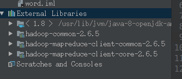

Java.io.URL

1、编写java程序

    
    
    package com.company;
    import java.io.IOException;
    import java.io.InputStream;
    import java.net.MalformedURLException;
    import java.net.URL;
    import org.apache.hadoop.fs.FsUrlStreamHandlerFactory;
    import org.apache.hadoop.io.IOUtils;
    
    public class Main {
        static {
            URL.setURLStreamHandlerFactory(new FsUrlStreamHandlerFactory());
        }
    
        public static void main(String[] args) throws MalformedURLException,IOException {
            InputStream in=null;
            try{
                in = new URL(args[0]).openStream();
                IOUtils.copyBytes(in,System.out,4096,false);
            }finally {
                IOUtils.closeStream(in);
            }
        }
    }

2、打包为javaWrkspace.jar

3、simon@simon-Lenovo-G400:~/software/hadoop$

bin/hadoop jar
/home/simon/javaWrkspace/out/artifacts/javaWrkspace_jar/javaWrkspace.jar
hdfs://localhost:9000/test/hello  
  

org.apache.hadoop.fs.FileSystem

1、

    
    
    import java.io.IOException;
    import java.io.InputStream;
    import java.net.URI;
    import org.apache.hadoop.conf.Configuration;
    import org.apache.hadoop.fs.FileSystem;
    import org.apache.hadoop.fs.Path;
    import org.apache.hadoop.io.IOUtils;
    public class hdfsclient {
        public static void main(String[] args) throws IOException{
            String uri="hdfs://localhost:9000/test/hello";
            Configuration conf=new Configuration();
            FileSystem fs = FileSystem.get(URI.create(uri),conf);
            InputStream in=null;
            try{
                in = fs.open(new Path(uri));
                IOUtils.copyBytes(in,System.out,4096,false);
            }finally {
                IOUtils.closeStream(in);
            }
        }
    }

2、打包为javaWrkspace.jar

3、simon@simon-Lenovo-G400:~/software/hadoop$

bin/hadoop jar
/home/simon/javaWrkspace/out/artifacts/javaWrkspace_jar2/javaWrkspace.jar
hdfsclient

