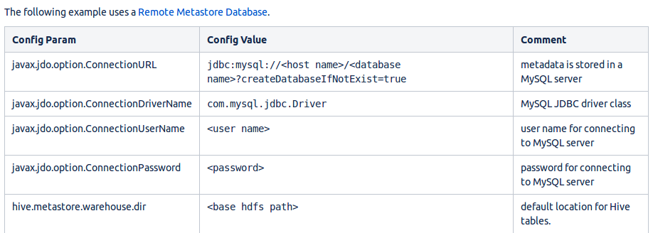

https://cwiki.apache.org/confluence/display/Hive/AdminManual+MetastoreAdmin#AdminManualMetastoreAdmin-
RemoteMetastoreDatabase

hive-site.xml

    
    
    <?xml version="1.0" encoding="UTF-8" standalone="no"?>
    <?xml-stylesheet type="text/xsl" href="configuration.xsl"?>
    <configuration>
      <property>
        <name>javax.jdo.option.ConnectionURL</name>
        <value>jdbc:mysql://localhost:3306/hive?createDatabaseIfNotExist=true</value>
      </property>
        <property>
        <name>javax.jdo.option.ConnectionDriverName</name>
        <value>com.mysql.jdbc.Driver</value>
      </property>
        <property>
        <name>javax.jdo.option.ConnectionUserName</name>
        <value>root</value>
      </property>
        <property>
        <name>javax.jdo.option.ConnectionPassword</name>
        <value>123456</value>
      </property>
    </configuration>

