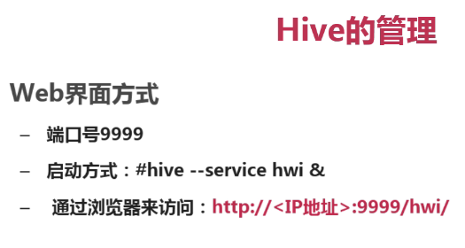
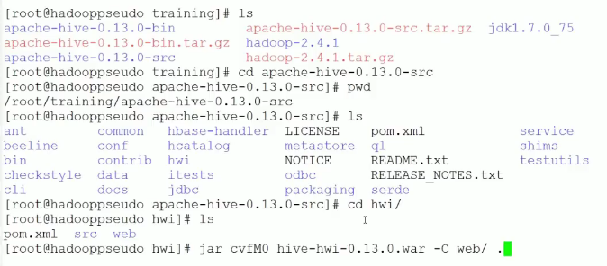
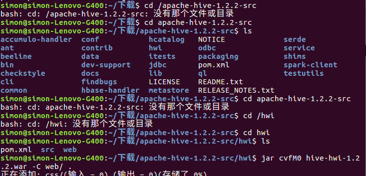
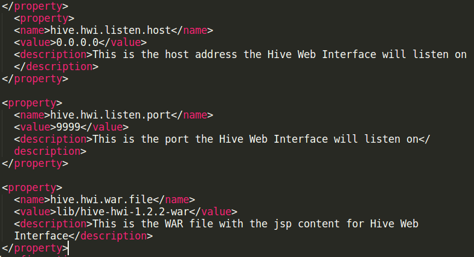

老版本使用

访问<Hive Server Address>:9999/hwi

1、首先下载对应版本的src文件，本机使用apache-hive-1.2.2-src.tar.gz

2、解压缩 tar -zxvf apache-hive-1.2.2-src.tar.gz

3、进入到解压缩之后的文件中去 cd apache-hive-1.2.2-src

4、cd hwi  
5、jar cvfM0 hive-hwi-1.2.2.war -C web/ .  
6、sudo cp hive-hwi-1.2.2.war /opt/apache-hive-1.2.2-bin/lib  
7、修改hive-site.xml文件  
https://cwiki.apache.org/confluence/display/Hive/HiveWebInterface

    
    
    <property>
      <name>hive.hwi.listen.host</name>
      <value>0.0.0.0</value>
      <description>This is the host address the Hive Web Interface will listen on</description>
    </property>
     
    <property>
      <name>hive.hwi.listen.port</name>
      <value>9999</value>
      <description>This is the port the Hive Web Interface will listen on</description>
    </property>
     
    <property>
      <name>hive.hwi.war.file</name>
      <value>${HIVE_HOME}/lib/hive-hwi-<version>.war</value>
      <description>This is the WAR file with the jsp content for Hive Web Interface</description>
    </property>

8、拷贝jdk的tools.jar包到hive/lib下

sudo cp /usr/lib/jvm/java-8-openjdk-amd64/lib/tools.jar /opt/apache-
hive-1.2.2-bin/lib  
9、hive --service hwi

