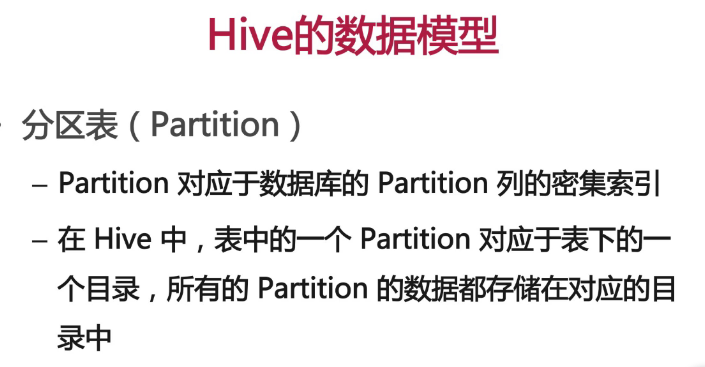
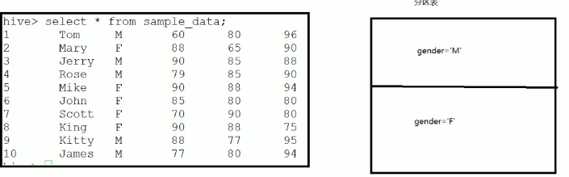
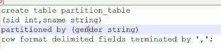
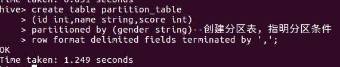
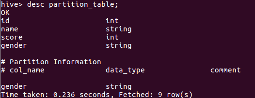

分区表创建

row format delimited fields terminated by ",";指明以逗号作为分隔符

依靠插入表创建分区表 从表sample_table选择 满足分区条件的 列插入到分区表中

insert into table partition_table partition(gender="M") select id,name from
sample_table where gender="M";  
insert into table partition_table partition(gender="F") select id,name from
sample_table where gender="F";

explain可以查看执行计划

$ explain select *from sample_table where gender = "M";

$ explain select *from partition_table where gender = "M";

