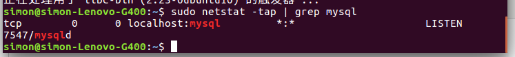

1、安装MYSQL

simon@simon-Lenovo-G400:~$ sudo apt-get install mysql-server

simon@simon-Lenovo-G400:~$ sudo apt install mysql-client

simon@simon-Lenovo-G400:~$ sudo apt install libmysqlclient-dev

测试是否成功

simon@simon-Lenovo-G400:~$ sudo netstat -tap | grep mysql

使用 service 启动MYSQL ：

simon@simon-Lenovo-G400:~$ service mysql start

进入Mysql：mysql -u 用户名 -p 密码

simon@simon-Lenovo-G400:~$ mysql -uroot -p123456 或者 simon@simon-Lenovo-G400:~$
mysql -u root -p  
enter passward:123456

2、 **新建hive数据库，用来保存hive的元数据**

` mysql> create database hive;`

**`将hive数据库下的所有表的所有权限赋给root用户，并配置123456为hive-site.xml中的连接密码，然后``刷新系统权限关系表`**

mysql > CREATE USER "root"@"%" IDENTIFIED BY "123456";

mysql> GRANT ALL PRIVILEGES ON *.* TO "root"@"%" WITH GRANT OPTION;

mysql> flush privileges;

3、 **修改hive-site.xml，设置MySQL为默认的meta数据库**

    
    
     <?xml version="1.0" encoding="UTF-8" standalone="no"?>
    <?xml-stylesheet type="text/xsl" href="configuration.xsl"?>
    <configuration>
      <property>
        <name>javax.jdo.option.ConnectionURL</name>
        <value>jdbc:mysql://localhost:3306/hive?createDatabaseIfNotExist=true</value>
      </property>
        <property>
        <name>javax.jdo.option.ConnectionDriverName</name>
        <value>com.mysql.jdbc.Driver</value>
      </property>
        <property>
        <name>javax.jdo.option.ConnectionUserName</name>
        <value>root</value>
      </property>
        <property>
        <name>javax.jdo.option.ConnectionPassword</name>
        <value>123456</value>
      </property>
    </configuration>

若出现错误，没啥意思

    
    
    Tue Aug 07 10:38:44 CST 2018 WARN: Establishing SSL connection without 
    server"s identity verification is not recommended. According to MySQL 5.5.45+, 
    5.6.26+ and 5.7.6+ requirements SSL connection must be established by default
     if explicit option isn"t set. For compliance with existing applications not using SSL 
    the verifyServerCertificate property is set to "false". You need either to explicitly disable 
    SSL by setting useSSL=false, or set useSSL=true and provide truststore for
     server certificate verification.

<value>jdbc:mysql://localhost:3306/hive?createDatabaseIfNotExist=true?useSSL=true</value>

配置hive-env.sh

    
    
    export JAVA_HOME=/usr/lib/jvm/java-8-openjdk-amd64
    export HADOOP_HOME=/home/simon/software/hadoop2

**配置环境变量/etc/profile**

    
    
     export HIVE_HOME=/home/simon/software/hive
    export PATH=$HIVE_HOME/bin:$PATH

simon@simon-Lenovo-G400:~$ source /etc/profile

**将mysql-connector-java-8.0.11.jar，复制到hive安装目录下的lib下**

链接: https://pan.baidu.com/s/1UziLW3WQ4frcCX9nyzKcrA 密码: yp7m

4、启动hadoop

simon@simon-Lenovo-G400:~$ start-all.sh  
hive元数据库初始化

simon@simon-Lenovo-G400:~$ schematool -dbType mysql -initSchema  
执行hive

simon@simon-Lenovo-G400:~$hive

hive>

hive> create table stu(id int,name string);  
OK  
Time taken: 1.361 seconds  
hive> desc stu;  
OK  
id int  
name string  
Time taken: 0.115 seconds, Fetched: 2 row(s)  
  

