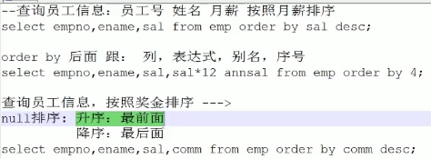

1、升序排序

hive > select id,name,sal from emp order by sal;

2、降序 添加关键字desc

hive > select id,name,sal from emp order by sal desc;

3、按表达式排序

hive > select id,name,sal，sal*12 from emp order by sal*12;

4、按别名排序

hive > select id,name,sal，sal *12 annasl from emp order by annasl;

5、按序号排序

需要设置hive > set hive.groupby.orderby.position.alias=true;

hive > select id,name,sal, sal*12 from emp order by 4;  

