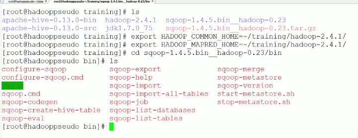
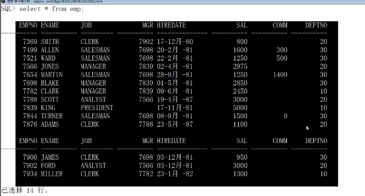
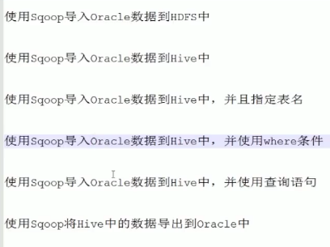
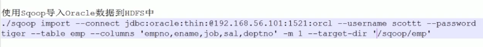
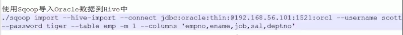
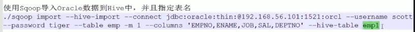
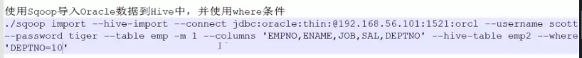
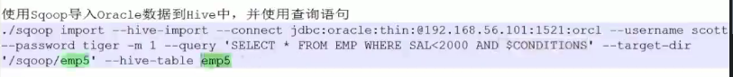
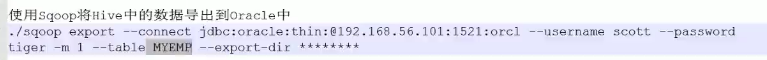
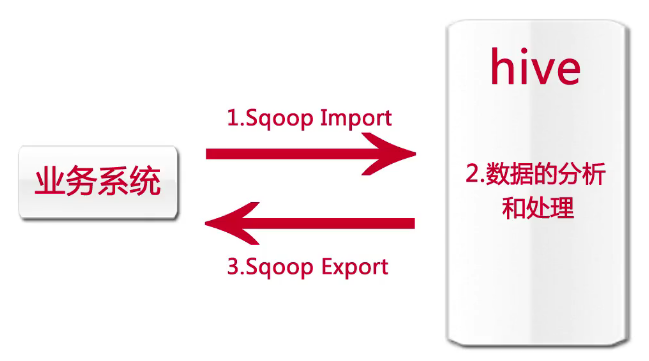

下载Sqoop ，直接解压缩;然后导入2个环境变量

1、导入oracle数据库中表emp的数据到hive表中

1、导入到HDFS中

    
    
    $ sqoop import --connect jdbc:mysql://database.example.com/employees \
        --username aaron --password 12345  
    --connect用来链接数据库，--table选择一个表，--colums选择列，-m选择mapreduce任务数量，--target-dir选择导入到HDFS的路径  
    2、导入Hive数据仓库中

3、制定表的名字，导入到hive中指定的表中

4、制定条件

\--hive-table导入到hive"中制定的emp2表中，若不存在，则创建，--where指明条件

5、查询语句 query

6、导出数据

