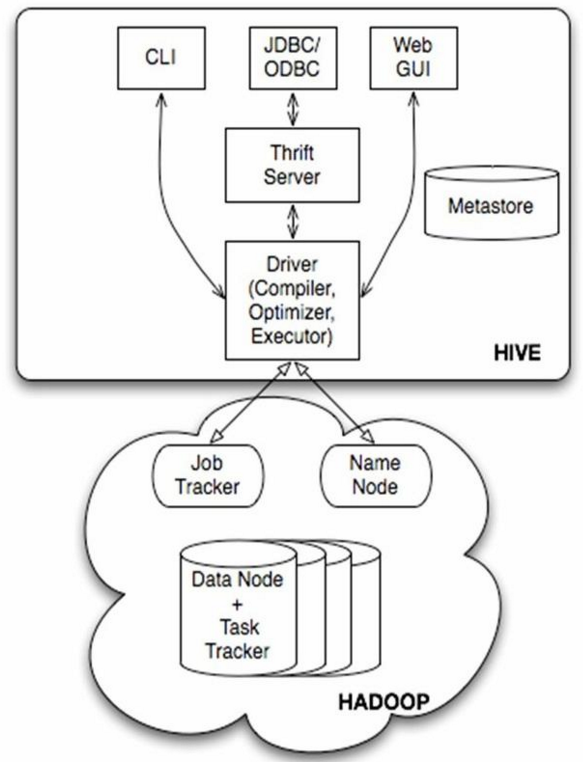
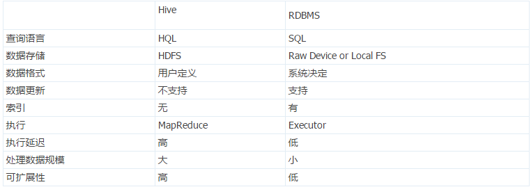
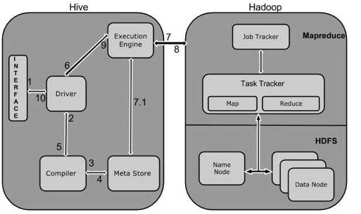
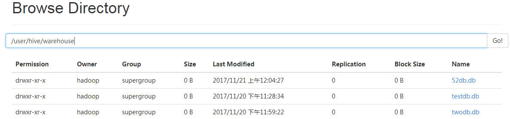
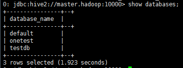
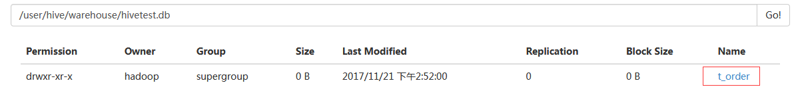
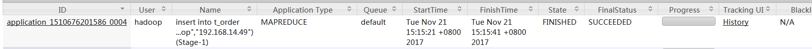
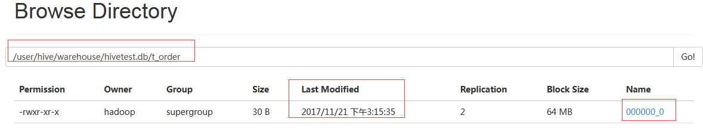

## http://www.51niux.com/

## 一、Hive介绍

Hive官网：https://hive.apache.org/

### 1.1 hive简介

Hive是一个数据仓库基础工具在Hadoop中用来处理结构化数据。它架构在Hadoop之上，总归为大数据，并使得查询和分析方便。并提供简单的sql查询功能，可以将sql语句转换为MapReduce任务进行运行。

最初，Hive是由Facebook开发，后来由Apache软件基金会开发，并作为进一步将它作为名义下Apache Hive为一个开源项目。Hive
没有专门的数据格式。 Hive 可以很好的工作在 Thrift 之上，控制分隔符，也允许用户指定数据格式。Hive不适用于在线事务处理。
它最适用于传统的数据仓库任务。

Hive 构建在基于静态批处理的Hadoop 之上，Hadoop 通常都有较高的延迟并且在作业提交和调度的时候需要大量的开销。因此，Hive
并不能够在大规模数据集上实现低延迟快速的查询，例如，Hive 在几百MB 的数据集上执行查询一般有分钟级的时间延迟。因此，  
Hive 并不适合那些需要低延迟的应用，例如，联机事务处理（OLTP）。Hive 查询操作过程严格遵守Hadoop MapReduce
的作业执行模型，Hive 将用户的HiveQL 语句通过解释器转换为MapReduce 作业提交到Hadoop 集群上，Hadoop
监控作业执行过程，然后返回作业执行结果给用户。Hive 并非为联机事务处理而设计，Hive 并不提供实时的查询和基于行级的数据更新操作。Hive
的最佳使用场合是大数据集的批处理作业，例如，网络日志分析。

### 1.2 Hive的特点：

  1. 通过SQL轻松访问数据的工具，从而实现数据仓库任务（如提取/转换/加载（ETL），报告和数据分析）。

  2. 一种对各种数据格式施加结构的机制

  3. 访问直接存储在Apache HDFS或其他数据存储系统（如Apache HBase）中的文件

  4. 通过Apache Tez，Apache Spark或MapReduce执行查询

  5. 程序语言与HPL-SQL

  6. 通过Hive LLAP，Apache YARN和Apache Slider进行亚秒级查询检索。

Bash

    
    
    Hive提供了标准的SQL功能，其中包括许多后来用于分析的SQL：2003和SQL：2011功能。
    Hive的SQL还可以通过用户定义的函数（UDF），用户定义的聚合（UDAF）和用户定义的表函数（UDTF）用用户代码进行扩展。
    没有一个数据必须存储的“Hive格式”。 Hive带有用于逗号和制表符分隔值（CSV / TSV）文本文件，Apache Parquet，Apache ORC和其他格式的内置连接器。用户可以使用其他格式的连接器来扩展Hive。
    Hive不适用于联机事务处理（OLTP）工作负载。它最适用于传统的数据仓库任务。
    Hive旨在最大限度地提高可伸缩性（在Hadoop集群中动态添加更多机器的规模），性能，可扩展性，容错性以及与输入格式的松散耦合。
    Hive的组件包括HCatalog和WebHCat。
    HCatalog是Hive的一个组件。这是Hadoop的表和存储管理层，使用不同数据处理工具（包括Pig和MapReduce）的用户可以更方便地在网格上读写数据。
    WebHCat提供的服务可以用来运行Hadoop MapReduce（或YARN），Pig，Hive作业或使用HTTP（REST风格）接口执行Hive元数据操作。

### 1.3 Hive架构与基本组成

#### Hive的体系结构：

#上图为Hive的体系结构，可以分为以下几个部分：

  1. 用户接口主要有三个：CLI，Client和WUI.其中最常用的是CLI，CLI启动的时候，会同时启动一个Hive副本。Client是Hive的客户端，用户连接至Hive Server。在启动Client模式的时候，需要指出Hive Server所在节点，并且在该节点启动Hive Server。WUI是通过浏览器访问Hive。

  2. Hive将元数据存储在数据库中，如mysql、derby。Hive中的元数据包括表的名字，表的列和分区以及属性，表的属性（是否为外部表等），表的数据所在目录等。

  3. 解释器、编辑器、优化器完成HQL查询语句从词法分析、语法分析、编译、优化以及查询计划的生成。生成的查询计划存储在HDFS中，并在随后有MapReduce调用执行。

  4. Hive的数据存储在HDFS中，大部分的查询、计算由MapReduce完成。

#### 服务端和客户端组件：

由上图可知，hadoop和mapreduce是hive架构的根基。Hive架构包括如下组件：CLI（command line
interface）、JDBC/ODBC、Thrift Server、WEB
GUI、metastore和Driver(Complier、Optimizer和Executor)，这些组件我可以分为两大类：服务端组件和客户端组件。

服务端组件：

Bash

    
    
    Driver组件：该组件包括Complier、Optimizer和Executor，它的作用是将我们写的HiveQL（类SQL）语句进行解析、编译优化，生成执行计划，然后调用底层的mapreduce计算框架。
    Metastore组件：元数据服务组件，这个组件存储hive的元数据，hive的元数据存储在关系数据库里，hive支持的关系数据库有derby、mysql。元数据对于hive十分重要，因此hive支持把metastore服务独立出来，安装到远程的服务器集群里，从而解耦hive服务和metastore服务，保证hive运行的健壮性，这个方面的知识，我会在后面的metastore小节里做详细的讲解。
    Thrift服务：thrift是facebook开发的一个软件框架，它用来进行可扩展且跨语言的服务的开发，hive集成了该服务，能让不同的编程语言调用hive的接口。

客户端组件：

Bash

    
    
    　CLI：command line interface，命令行接口。
    　Thrift客户端：上面的架构图里没有写上Thrift客户端，但是hive架构的许多客户端接口是建立在thrift客户端之上，包括JDBC和ODBC接口。
    　WEBGUI：hive客户端提供了一种通过网页的方式访问hive所提供的服务。这个接口对应hive的hwi组件（hive web interface），使用前要启动hwi服务。

#### Hive的metastore组件

Hive的metastore组件是hive元数据集中存放地。Metastore组件包括两个部分：metastore服务和后台数据的存储。后台数据存储的介质就是关系数据库，例如hive默认的嵌入式磁盘数据库derby，还有mysql数据库。Metastore服务是建立在后台数据存储介质之上，并且可以和hive服务进行交互的服务组件，默认情况下，metastore服务和hive服务是安装在一起的，运行在同一个进程当中。我也可以把metastore服务从hive服务里剥离出来，metastore独立安装在一个集群里，hive远程调用metastore服务，这样我们可以把元数据这一层放到防火墙之后，客户端访问hive服务，就可以连接到元数据这一层，从而提供了更好的管理性和安全保障。使用远程的metastore服务，可以让metastore服务和hive服务运行在不同的进程里，这样也保证了hive的稳定性，提升了hive服务的效率。

#### 连接到数据库的模式：

有三种模式可以连接到数据库：

  1. 单用户模式。此模式连接到一个In-memory 的数据库Derby，一般用于Unit Test。

  2. 多用户模式。通过网络连接到一个数据库中，是最经常使用到的模式。

  3. 远程服务器模式。用于非Java客户端访问元数据库，在服务器端启动MetaStoreServer，客户端利用Thrift协议通过MetaStoreServer访问元数据库。

Bash

    
    
     对于数据存储，Hive没有专门的数据存储格式，也没有为数据建立索引，用户可以非常自由的组织Hive中的表，只需要在创建表的时候告诉Hive数据中的列分隔符和行分隔符，Hive就可以解析数据。
     Hive中所有的数据都存储在HDFS中，存储结构主要包括数据库、文件、表和视图。Hive中包含以下数据模型：Table内部表，External Table外部表，Partition分区，Bucket桶。
     Hive默认可以直接加载文本文件，还支持sequence file 、RCFile。

#### Hive的数据模型介绍：

官网介绍：https://cwiki.apache.org/confluence/display/Hive/Tutorial

  1. Hive数据库。 类似传统数据库的DataBase，在第三方数据库里实际是一张表。简单示例命令行 hive > create database test_database;

  2. 内部表。 Hive的内部表与数据库中的Table在概念上是类似。每一个Table在Hive中都有一个相应的目录存储数据。例如一个表pvs，它在HDFS中的路径为/wh/pvs，其中wh是在hive-site.xml中由${hive.metastore.warehouse.dir} 指定的数据仓库的目录，所有的Table数据（不包括External Table）都保存在这个目录中。删除表时，元数据与数据都会被删除。 内部表简单示例如下：

Bash

    
    
        创建数据文件：test_inner_table.txt
        创建表：create table test_inner_table (key string)
        加载数据：LOAD DATA LOCAL INPATH ‘filepath’ INTO TABLE test_inner_table
        查看数据：select * from test_inner_table;  select count(*) from test_inner_table
        删除表：drop table test_inner_table

3\. 外部表。
外部表指向已经在HDFS中存在的数据，可以创建Partition。它和内部表在元数据的组织上是相同的，而实际数据的存储则有较大的差异。内部表的创建过程和数据加载过程这两个过程可以分别独立完成，也可以在同一个语句中完成，在加载数据的过程中，实际数据会被移动到数据仓库目录中；之后对数据对访问将会直接在数据仓库目录中完成。删除表时，表中的数据和元数据将会被同时删除。而外部表只有一个过程，加载数据和创建表同时完成（CREATE
EXTERNAL TABLE ……LOCATION），实际数据是存储在LOCATION后面指定的 HDFS
路径中，并不会移动到数据仓库目录中。当删除一个External Table时，仅删除该链接。 外部表简单示例：

Bash

    
    
        创建数据文件：test_external_table.txt
        创建表：create external table test_external_table (key string)
        加载数据：LOAD DATA INPATH ‘filepath’ INTO TABLE test_inner_table
        查看数据：select * from test_external_table;  •select count(*) from test_external_table
        删除表：drop table test_external_table

4\. 分区。
Partition对应于数据库中的Partition列的密集索引，但是Hive中Partition的组织方式和数据库中的很不相同。在Hive中，表中的一个Partition对应于表下的一个目录，所有的Partition的数据都存储在对应的目录中。例如pvs表中包含ds和city两个Partition，则对应于ds
= 20090801, ctry = US 的HDFS子目录为/wh/pvs/ds=20090801/ctry=US；对应于 ds = 20090801,
ctry = CA 的HDFS子目录为/wh/pvs/ds=20090801/ctry=CA。分区表简示例

Bash

    
    
        创建数据文件：test_partition_table.txt
        创建表：create table test_partition_table (key string) partitioned by (dt string)
        加载数据：LOAD DATA INPATH ‘filepath’ INTO TABLE test_partition_table partition (dt=‘2006’)
        查看数据：select * from test_partition_table;  select count(*) from test_partition_table
        删除表：drop table test_partition_table

5\. 桶
。Buckets是将表的列通过Hash算法进一步分解成不同的文件存储。它对指定列计算hash，根据hash值切分数据，目的是为了并行，每一个Bucket对应一个文件。例如将user列分散至32个bucket，首先对user列的值计算hash，对应hash值为0的HDFS目录为/wh/pvs/ds=20090801/ctry=US/part-00000；hash值为20的HDFS目录为/wh/pvs/ds=20090801/ctry=US/part-00020。如果想应用很多的Map任务这样是不错的选择。
桶的简单示例：

Bash

    
    
        创建数据文件：test_bucket_table.txt
        创建表：create table test_bucket_table (key string) clustered by (key) into 20 buckets
        加载数据：LOAD DATA INPATH ‘filepath’ INTO TABLE test_bucket_table
        查看数据：select * from test_bucket_table;  set hive.enforce.bucketing = true;

6\.
Hive的视图。视图与传统数据库的视图类似。视图是只读的，它基于的基本表，如果改变，数据增加不会影响视图的呈现；如果删除，会出现问题。如果不指定视图的列，会根据select语句后的生成。示例：

Bash

    
    
        create view test_view as select * from test

### 1.4 Hive和数据库的异同：

由于Hive采用了SQL的查询语言HQL，因此很容易将Hive理解为数据库。其实从结构上来看，Hive和数据库除了拥有类似的查询语言，再无类似之处。数据库可以用在Online的应用中，但是Hive是为数据仓库而设计的，清楚这一点，有助于从应用角度理解Hive的特性。Hive和数据库的比较如下表：

#从上如可以看到它们之间的差别。

  1. 查询语言。由于 SQL 被广泛的应用在数据仓库中，因此专门针对Hive的特性设计了类SQL的查询语言HQL。熟悉SQL开发的开发者可以很方便的使用Hive进行开发。

  2. 数据存储位置。Hive是建立在Hadoop之上的，所有Hive的数据都是存储在HDFS中的。而数据库则可以将数据保存在块设备或者本地文件系统中。

  3. 数据格式。Hive中没有定义专门的数据格式，数据格式可以由用户指定，用户定义数据格式需要指定三个属性：列分隔符（通常为空格、”\t”、”\x001″）、行分隔符（”\n”）以及读取文件数据的方法（Hive中默认有三个文件格式TextFile，SequenceFile以及RCFile）。由于在加载数据的过程中，不需要从用户数据格式到Hive定义的数据格式的转换，因此，  
Hive在加载的过程中不会对数据本身进行任何修改，而只是将数据内容复制或者移动到相应的HDFS目录中。  
而在数据库中，不同的数据库有不同的存储引擎，定义了自己的数据格式。所有数据都会按照一定的组织存储，因此，数据库加载数据的过程会比较耗时。

  4. 数据更新。由于Hive是针对数据仓库应用设计的，而数据仓库的内容是读多写少的。因此，Hive中不支持对数据的改写和添加，所有的数据都是在加载的时候中确定好的。而数据库中的数据通常是需要经常进行修改的，因此可以使用INSERT INTO ... VALUES添加数据，使用UPDATE ... SET修改数据。

  5. 索引。之前已经说过，Hive在加载数据的过程中不会对数据进行任何处理，甚至不会对数据进行扫描，因此也没有对数据中的某些Key建立索引。Hive要访问数据中满足条件的特定值时，需要暴力扫描整个数据，因此访问延迟较高。由于MapReduce的引入， Hive可以并行访问数据，因此即使没有索引，对于大数据量的访问，Hive仍然可以体现出优势。数据库中，通常会针对一个或者几个列建立索引，因此对于少量的特定条件的数据的访问，数据库可以有很高的效率，较低的延迟。由于数据的访问延迟较高，决定了Hive不适合在线数据查询。

  6. 执行。Hive中大多数查询的执行是通过Hadoop提供的MapReduce来实现的（类似select * from tbl的查询不需要MapReduce）。而数据库通常有自己的执行引擎。

  7. 执行延迟。之前提到，Hive在查询数据的时候，由于没有索引，需要扫描整个表，因此延迟较高。另外一个导致Hive执行延迟高的因素是MapReduce框架。由于MapReduce本身具有较高的延迟，因此在利用MapReduce执行Hive查询时，也会有较高的延迟。相对的，数据库的执行延迟较低。当然，这个低是有条件的，即数据规模较小，当数据规模大到超过数据库的处理能力的时候，Hive的并行计算显然能体现出优势。

  8. 可扩展性。由于Hive是建立在Hadoop之上的，因此Hive的可扩展性是和Hadoop的可扩展性是一致的。而数据库由于ACID语义的严格限制，扩展行非常有限。

  9. 数据规模。由于Hive建立在集群上并可以利用MapReduce进行并行计算，因此可以支持很大规模的数据；对应的，数据库可以支持的数据规模较小。

### 1.5 Hive工作原理

#上图描述了Hive和Hadoop之间的工作流程，下面是Hive和Hadoop框架的交互方式：

Hive和Hadoop框架的交互方式：

  1. Execute Query。Hive接口，如命令行或Web UI发送查询驱动程序（任何数据库驱动程序，如JDBC，ODBC等）来执行。

  2. Get Plan。在驱动程序帮助下查询编译器，分析查询检查语法和查询计划或查询的要求。

  3. Get Metadata。编译器发送元数据请求到Metastore（任何数据库）。

  4. Send Metadata。Metastore发送元数据，以编译器的响应。

  5. Send Plan。编译器检查要求，并重新发送计划给驱动程序。到此为止，查询解析和编译完成。

  6. Execute Plan。驱动程序发送的执行计划到执行引擎。

  7. Execute Job。在内部，执行作业的过程是一个MapReduce工作。执行引擎发送作业给JobTracker，在名称节点并把它分配作业到TaskTracker，这是在数据节点。在这里，查询执行MapReduce工作。(7.1 Metadata Ops:与此同时，在执行时，执行引擎可以通过Metastore执行元数据操作。)

  8. Fetch Result. 执行引擎接收来自数据节点的结果。

  9. Send Results. 执行引擎发送这些结果值给驱动程序。

  10. Send Results。驱动程序将结果发送给Hive接口。

执行过程就是：

Bash

    
    
    HiveQL通过CLI/web UI或者thrift 、 odbc 或 jdbc接口的外部接口提交，经过complier编译器，运用Metastore中的元数据进行类型检测和语法分析，生成一个逻辑方案(logical plan),然后通过简单的优化处理，产生一个以有向无环图DAG数据结构形式展现的map-reduce任务。

Hive构建在Hadoop之上，Hive的执行原理：

  1. HQL中对查询语句的解释、优化、生成查询计划是由Hive完成的

  2. 所有的数据都是存储在Hadoop中

  3. 查询计划被转化为MapReduce任务，在Hadoop中执行（有些查询没有MR任务，如：select * from table）

  4. Hadoop和Hive都是用UTF-8编码的

查询编译器(query complier),用云存储中的元数据来生成执行计划，步骤如下：

  1. 解析（parse）-anlr解析其生成语法树AST(hibernate也是这个)：将HQL转化为抽象语法树AST

  2. 类型检查和语法分析(type checking and semantic analysis):将抽象语法树转换此查询块(query block tree),并将查询块转换成逻辑查询计划(logic plan Generator);

  3. 优化(optimization):重写查询计划(logical optimizer)–>将逻辑查询计划转成物理计划(physical plan generator)–>选择最佳的join策略(physical optimizer)

博文来自：www.51niux.com

## 二、Hive的安装

### 2.1 Hive的下载并解压到指定位置

hadoop的安装前面已经说过了，注意：Hive版本1.2以上需要Java 1.7或更高版本。 Hive版本0.14到1.1也适用于Java 1.6。
强烈建议用户开始转向Java 1.8。Hadoop 2.x（首选），1.x（不支持Hive 2.0.0以上版本）。  
Hive版本0.13也支持Hadoop 0.20.x，0.23.x。Hive常用于生产Linux和Windows环境。 Mac是一个常用的开发环境。

#Hadoop集群的搭建前面已经介绍了，现在再次基础上安装Hive。

# wget mirrors.hust.edu.cn/apache/hive/stable/apache-hive-1.2.2-bin.tar.gz

# tar zxf apache-hive-1.2.2-bin.tar.gz -C /home/hadoop/  
# ln -s /home/hadoop/apache-hive-1.2.2-bin /home/hadoop/apache-hive  
# vim /etc/profile

Bash

    
    
    ##########hive#################
    export HIVE_HOME=/home/hadoop/apache-hive
    export PATH=$PATH:$HIVE_HOME/bin

# source /etc/profile

### 2.2 Metastore安装

Bash

    
    
    metastore是Hive元数据集中存放地。它包括两部分：服务和后台数据存储。有三种方式配置metastore：内嵌metastore、本地metastore以及远程metastore。
    （1）默认情况下，metastore服务和hive服务运行在同一个JVM中，它包含一个内嵌的以本地磁盘作为存储的Derby数据库实例（也就是内嵌metastore）。但是，只使用一个内嵌Derby数据库每次只能访问一个磁盘上的数据库文件。
    （2）如果要支持多会话需要使用一个独立的数据库，即本地metastore。任何JDBC兼容的数据库都可以通过一些配置属性来用matastore使用。
    （3）还有一种matastore配置成为远程matastore，这种配置下，一个或多个matastore服务器和Hive服务运行在不同进程内，通过这种方式可将数据库层完全置于防火墙后，从而更好得管理。
    Hive没有将matastore保存在HDFS上，而是保存在关系数据库中是为了当Hive需要访问matastore的时候，可低延迟的快速的访问到需要的元数据信息（HDFS的访问延迟一般都比较大）。
    但当HiveSQL之后生成的matastore任务在运行的时候如果需要访问元数据信息时，并不会直接访问matastore。当生成的物理计划序列化到plan.xml的时候，就已将相应的元数据信息保存到了plan.xml中。
    而plan.xml文件之后会被放入Hadoop的分布式缓存中，MapReduce任务就可以从分布式缓存中获得需要的元数据信息。 本文采用MySQL作为Hive的metastore。

#这里我们选择搭建一台节点搭建mysql服务器来存储这些元数据。

#mysql的搭建可以yum可以编译这里就不写安装过程了。我线上是编译的，这里为了快速就yum安装了。

#vi /etc/my.cnf #加上下面两句

Bash

    
    
    [mysqld]
    skip-name-resolve     #参数的目的是不再进行反解析（ip不反解成域名），这样可以加快数据库的反应时间。 
    sql_mode=NO_ENGINE_SUBSTITUTION,STRICT_TRANS_TABLES    #默认用的是严格模式,mysql 5.6默认用innodb ，所以用STRICT_TRANS_TABLES也容易理解。用了这个选项的话， 那么数据库中如果是非空值的话就得设置默认值了，否则是报错的

# service mariadb start #启动mysqld服务

# mysqladmin -u root password "123456" #更改root的密码，应该复杂一点

# mysql -uroot -p123456 -e "show databases;" #查看一下是否生效

# mysql -uroot -p123456 #登录mysql做个hadoop用户授权

Bash

    
    
    MariaDB [(none)]> create database hive;  
    MariaDB [(none)]> grant all privileges on hive.* to hive@"192.168.14.%" identified by "hive";  #如果hive服务端不在本机要设置这么一条
    MariaDB [(none)]> grant all privileges on hive.* to hive@localhost identified by "hive";
    MariaDB [(none)]> flush privileges;
    MariaDB [(none)]> exit

# mysql -uhive -phive -h 192.168.14.49 -e "show databases;" #分别验证一下。  
# mysql -uhive -phive -h localhost -e "show databases;"

### 2.3 下载JDBC驱动

# wget https://dev.mysql.com/get/Downloads/Connector-J/mysql-connector-
java-5.1.31.tar.gz  
# tar zxf mysql-connector-java-5.1.31.tar.gz  
# cp mysql-connector-java-5.1.31/mysql-connector-java-5.1.31-bin.jar
/home/hadoop/apache-hive/lib/

### 2.4 配置Hive配置文件

# cp /home/hadoop/apache-hive/conf/hive-env.sh.template /home/hadoop/apache-
hive/conf/hive-env.sh  
# vim /home/hadoop/apache-hive/conf/hive-env.sh

Bash

    
    
    # export HADOOP_HEAPSIZE=1024
    export HADOOP_HEAPSIZE=10240
    # HADOOP_HOME=${bin}/../../hadoop
    export HADOOP_HOME=/home/hadoop/hadoop
    # export HIVE_CONF_DIR=
    export HIVE_CONF_DIR=/home/hadoop/apache-hive/conf
    export HADOOP_CLIENT_OPTS="$HADOOP_CLIENT_OPTS  -Xmx${HADOOP_HEAPSIZE}m -XX:PermSize=256m -XX:MaxPermSize=4096m"

# vim /home/hadoop/apache-hive/conf/hive-site.xml
#这里直接编辑了，查看详细配置可以查看/home/hadoop/apache-hive/conf/hive-default.xml.template

Bash

    
    
    <?xml version="1.0" encoding="UTF-8" standalone="no"?>
    <?xml-stylesheet type="text/xsl" href="configuration.xsl"?><!--
       Licensed to the Apache Software Foundation (ASF) under one or more
       contributor license agreements.  See the NOTICE file distributed with
       this work for additional information regarding copyright ownership.
       The ASF licenses this file to You under the Apache License, Version 2.0
       (the "License"); you may not use this file except in compliance with
       the License.  You may obtain a copy of the License at
    
           http://www.apache.org/licenses/LICENSE-2.0
    
       Unless required by applicable law or agreed to in writing, software
       distributed under the License is distributed on an "AS IS" BASIS,
       WITHOUT WARRANTIES OR CONDITIONS OF ANY KIND, either express or implied.
       See the License for the specific language governing permissions and
       limitations under the License.
    -->
    <configuration>
                    <!--Hive的元数据库，这是连接master.hadoop:3306端口的hive数据库，如果库不存在就可以创建-->
            <property>
                    <name>javax.jdo.option.ConnectionURL</name>
                    <value>jdbc:mysql://master.hadoop:3306/hive?createDatabaseIfNotExist=true</value>
            </property>
            <!--连接元数据的驱动名-->
            <property>
                    <name>javac.jdo.option.ConnectionDriverName</name>
                    <value>com.mysql.jdbc.Driver</value>
            </property>
            <!--数据库的用户名-->
            <property>
                    <name>javax.jdo.option.ConnectionUserName</name>
                    <value>hive</value>
            </property>
            <!--数据库的密码-->
            <property>
                    <name>javax.jdo.option.ConnectionPassword</name>
                    <value>hive</value>
            </property>
            <!--表示数据在hdfs中的存储位置-->
            <property>
                    <name>hive.metastore.warehouse.dir</name>
                    <value>hdfs://mycluster/user/hive/warehouse</value>
            </property>
            <!--动态分区的模式，默认strict，表示必须指定至少一个分区为静态分区，nonstrict模式表示允许所有的分区字段都可以使用动态分区。-->
            <property>
                    <name>hive.exec.dynamic.partition.mode</name>
                    <value>nonstrict</value>
            </property>
            <!--默认情况下，HiveServer2以提交查询的用户执行查询（true），如果hive.server2.enable.doAs设置为false，查询将以运行hiveserver2进程的用户运行。-->
            <property>
                    <name>hive.server2.enable.doAs</name>
                    <value>false</value>
            </property>
             <!-- hive.metastore.schema.verification值为false即可解决“Caused by: MetaException(message:Version information not found in metastore.)”-->
            <property>  
                    <name>hive.metastore.schema.verification</name>  
                    <value>false</value>  
            </property>
    </configuration>

# chown -R hadoop:hadoop /home/hadoop/apache-hive-1.2.2-bin

$ /home/hadoop/apache-hive/bin/schematool -dbType mysql -initSchema
#在mysql中初始化hive的schema

Bash

    
    
    Metastore connection URL:     jdbc:mysql://master.hadoop:3306/hive?createDatabaseIfNotExist=true
    Metastore Connection Driver :     org.apache.derby.jdbc.EmbeddedDriver
    Metastore connection User:     hive
    Starting metastore schema initialization to 1.2.0
    Initialization script hive-schema-1.2.0.mysql.sql
    Initialization script completed
    schemaTool completed

# mysql -uroot -p123456 -e "use hive;show tables;" #查看一下hive库里面产生了一堆元数据相关的表

Bash

    
    
    +---------------------------+
    | Tables_in_hive            |
    +---------------------------+
    | BUCKETING_COLS            |
    | CDS                       |
    | COLUMNS_V2                |
    | COMPACTION_QUEUE          |
    | COMPLETED_TXN_COMPONENTS  |
    | DATABASE_PARAMS           |
    | DBS                       |
    | DB_PRIVS                  |
    | DELEGATION_TOKENS         |
    | FUNCS                     |
    | FUNC_RU                   |
    | GLOBAL_PRIVS              |
    | HIVE_LOCKS                |
    | IDXS                      |
    | INDEX_PARAMS              |
    | MASTER_KEYS               |
    | NEXT_COMPACTION_QUEUE_ID  |
    | NEXT_LOCK_ID              |
    | NEXT_TXN_ID               |
    | NOTIFICATION_LOG          |
    | NOTIFICATION_SEQUENCE     |
    | NUCLEUS_TABLES            |
    | PARTITIONS                |
    | PARTITION_EVENTS          |
    | PARTITION_KEYS            |
    | PARTITION_KEY_VALS        |
    | PARTITION_PARAMS          |
    | PART_COL_PRIVS            |
    | PART_COL_STATS            |
    | PART_PRIVS                |
    | ROLES                     |
    | ROLE_MAP                  |
    | SDS                       |
    | SD_PARAMS                 |
    | SEQUENCE_TABLE            |
    | SERDES                    |
    | SERDE_PARAMS              |
    | SKEWED_COL_NAMES          |
    | SKEWED_COL_VALUE_LOC_MAP  |
    | SKEWED_STRING_LIST        |
    | SKEWED_STRING_LIST_VALUES |
    | SKEWED_VALUES             |
    | SORT_COLS                 |
    | TABLE_PARAMS              |
    | TAB_COL_STATS             |
    | TBLS                      |
    | TBL_COL_PRIVS             |
    | TBL_PRIVS                 |
    | TXNS                      |
    | TXN_COMPONENTS            |
    | TYPES                     |
    | TYPE_FIELDS               |
    | VERSION                   |
    +---------------------------+

博文来自：www.51niux.com

### 2.5 进入hive shell测试

$ /home/hadoop/apache-hive/bin/hive

Bash

    
    
    ls: 无法访问/home/hadoop/spark/lib/spark-assembly-*.jar: 没有那个文件或目录
    Logging initialized using configuration in file:/home/hadoop/apache-hive-1.2.2-bin/conf/hive-log4j.properties
    hive>

#上面的ls: 无法访问/home/hadoop/spark/lib/spark-assembly-*.jar: 没有那个文件或目录要解决一下：

Bash

    
    
    其主要的原因是：在hive.sh的文件中，发现了这样的命令，原来初始当spark存在的时候，进行spark中相关的JAR包的加载。
    而自从spark升级到2.0.0之后，原有的lib的整个大JAR包已经被分散的小JAR包的替代，所以肯定没有办法找到这个spark-assembly的JAR包。这就是问题所在。

解决：

$ vim /home/hadoop/apache-hive/bin/hive

Bash

    
    
     #sparkAssemblyPath=`ls ${SPARK_HOME}/lib/spark-assembly-*.jar`   #上面的注释掉改为下面的那句话
     sparkAssemblyPath=`ls ${SPARK_HOME}/jars/*.jar`

$ hive

Bash

    
    
    hive> CREATE SCHEMA testdb;
    OK
    Time taken: 1.131 seconds
    hive> SHOW DATABASES;
    OK
    default
    testdb
    Time taken: 0.307 seconds, Fetched: 2 row(s)
    hive> quit;   #退出

### 2.6 Hive服务端的启动

#$ hive --service metastore & #要启动metastore服务

$ /home/hadoop/apache-hive/bin/hive --service metastore >/home/hadoop/apache-
hive/hive_metastore.log 2>&1 #当然更好的方式是指定日志后台启动

$ jps

Bash

    
    
    17420 RunJar   #多了一个进程

$ netstat -lntup|grep 9083 #默认启动的是9083端口

Bash

    
    
    tcp        0      0 0.0.0.0:9083            0.0.0.0:*               LISTEN      17420/java

#### 2.7 Hive客户端的测试

#注意：我这里测试是有问题的，跟生产是不符的，如果直接hive
shell操作，是不用启动Runjar这个进程的，直接配置文件指定了mysql的数据库用户名密码什么的就可以操作了。启动RunJar这个进程服务，启动9083端口或者下面提到的10000端口，都是为了让其他的客户端工具（例如spark）来使用hive读写hdfs上面的数据，才需要下面的hive-
site.xml配置。

$scp -r /home/hadoop/apache-hive-1.2.2-bin 192.168.14.52:/home/hadoop/
#发送到一个datanode客户端

$ vim /home/hadoop/apache-hive-1.2.2-bin/conf/hive-site.xml #客户端的配置文件修改成下面的内容

Bash

    
    
    <configuration>
        <property>
            <name>hive.metastore.uris</name>
            <value>thrift://master.hadoop:9083</value>
            </property>
    </configuration>

[hadoop@smaster conf] $ /home/hadoop/apache-hive-1.2.2-bin/bin/hive #客户端访问测试

Bash

    
    
    hive> create database 52db;
    OK
    hive> show databases;
    OK
    52db
    default
    twodb
    Time taken: 0.024 seconds, Fetched: 3 row(s)

#由上图可以看到创建的数据库都已经存在了hdfs对应的目录下面。

### 2.8 语言手册命令

Bash

    
    
    quit/exit        #使用quit或exit离开交互式shell。
    reset             #将配置重置为默认值。在命令行中使用set命令或-hiveconf参数设置的任何配置参数都将重置为默认值。请注意，这不适用于在set命令中为密钥名称（由于历史原因）使用“hiveconf：”前缀设置的配置参数。
    set <key>=<value>  #设置特定配置变量（键）的值。注意：如果拼错变量名称，CLI不会显示错误。
    set       #打印由用户或Hive覆盖的配置变量的列表。
    set -v    #打印所有Hadoop和Hive配置变量。
    add FILE[S] <filepath> <filepath>* 
    add JAR[S] <filepath> <filepath>* 
    add ARCHIVE[S] <filepath> <filepath>*   #将一个或多个文件，jar或存档添加到分布式缓存中的资源列表中。
    add FILE[S] <ivyurl> <ivyurl>* 
    add JAR[S] <ivyurl> <ivyurl>* 
    add ARCHIVE[S]<ivyurl> <ivyurl>*    #从Hive 1.2.0开始，使用形式为ivy://group:module:version？query_string的Ivy URL将一个或多个文件，jar或存档添加到分布式缓存中的资源列表。 
    list FILE[S] 
    list JAR[S] 
    list ARCHIVE[S]    #列出已添加到分布式缓存的资源。
    list FILE[S] <filepath>* 
    list JAR[S] <filepath>* 
    list ARCHIVE[S] <filepath>*   #检查给定资源是否已经添加到分布式缓存中。
    delete FILE[S] <filepath>* 
    delete JAR[S] <filepath>* 
    delete ARCHIVE[S] <filepath>*   #从分布式缓存中删除资源。
    delete FILE[S] <ivyurl> <ivyurl>* 
    delete JAR[S] <ivyurl> <ivyurl>* 
    delete ARCHIVE[S] <ivyurl> <ivyurl>*   #从Hive 1.2.0开始，从分布式缓存中删除使用<ivyurl>添加的资源。
    ! <command>    #从Hive shell执行一个shell命令。
    dfs <dfs command>   #从Hive shell执行一个dfs命令。
    <query string>   #执行Hive查询并将结果打印到标准输出
    source FILE <filepath>   #在CLI中执行脚本文件。
    compile `<groovy string>` AS GROOVY NAMED <name>   #这允许内联Groovy代码被编译并用作UDF（从Hive 0.13.0开始）。

用法举例：

Bash

    
    
     hive> set mapred.reduce.tasks=32;
     hive> set;
     hive> select a.* from tab1;
     hive> !ls;
     hive> dfs -ls;

$ hive -H

Bash

    
    
    usage: hive
    -d,--define <key=value>   #变量替换适用于配置单元命令。 例如 -d A = B或--define A = B
       --database <databasename>   #指定要使用的数据库
    -e <quoted-query-string>      #SQL从命令行
    -f <filename>   #来自文件的SQL
    -H,--help   #打印帮助信息
       --hiveconf <property=value>   #使用给定属性的值
       --hivevar <key=value>  #变量替换适用于配置单元命令。 例如 --hivevar A = B
    -i <filename>    #初始化SQL文件
    -S,--silent    #交互式shell中的寂静模式
    -v,--verbose   #详细模式（echo向控制台执行SQL）

#HiveServer2（在Hive 0.11中引入）有自己的叫做Beeline的CLI，它是一个基于SQLLine的JDBC客户端。
由于新的开发集中在HiveServer2上，Hive CLI很快将被弃用，以支持Beeline。

### 2.9 登录Beeline的使用实例

#HiveServer2客户端(beeline)：[https://cwiki.apache.org/confluence/display/Hive/HiveServer2+Clients#HiveServer2Clients-
Beeline–NewCommandLineShell](https://cwiki.apache.org/confluence/display/Hive/HiveServer2+Clients#HiveServer2Clients-
Beeline%E2%80%93NewCommandLineShell)

Beeline工作模式有两种，即本地嵌入模式和远程模式。嵌入模式情况下，它返回一个嵌入式的Hive（类似于Hive
CLI）。而远程模式则是通过Thrift协议与某个单独的HiveServer2进程进行连接通信。

#### 服务端启动服务（启动ThifServer）：

#正常的hive仅允许使用HiveQL执行查询、更新等操作，并且该方式比较笨拙单一。幸好Hive提供了轻客户端的实现，通过HiveServer或者HiveServer2，客户端可以在不启动CLI的情况下对Hive中的数据进行操作，

两者都允许远程客户端使用多种编程语言如Java、Python向Hive提交请求，取回结果 使用jdbc协议连接hive的thriftserver服务器.

$ /home/hadoop/apache-hive/bin/hive --service hiveserver2 10000>/dev/null
2>/dev/null &  
$ netstat -lntup|grep 10000

Bash

    
    
    tcp        0      0 0.0.0.0:10000           0.0.0.0:*               LISTEN      836/java

#### 客户端登录：

$ /home/hadoop/apache-hive/bin/beeline

Bash

    
    
    beeline> show databases;  #得进行连接
    #No current connection
    beeline> !connect jdbc:hive2://master.hadoop:10000   #连接hive服务端
    #Connecting to jdbc:hive2://master.hadoop:10000
    Enter username for jdbc:hive2://master.hadoop:10000:   #输入用户名如果没设置密码回车就可
    Enter password for jdbc:hive2://master.hadoop:10000:   #输入密码如果没有设置密码回车就可
    #Connected to: Apache Hive (version 1.2.2)
    #Driver: Hive JDBC (version 1.2.2)
    #Transaction isolation: TRANSACTION_REPEATABLE_READ
    0: jdbc:hive2://master.hadoop:10000> show databases;   #查看数据库

自定义HiveServer2的用户安全认证：<http://lxw1234.com/archives/2016/01/600.htm>

## 三、Hive基本操作

官网文档：<https://cwiki.apache.org/confluence/display/Hive/LanguageManual+DDL>

### 3.1 创建/删除/修改/使用数据库

$ /home/hadoop/apache-hive-1.2.2-bin/bin/hive  
  
创建数据库：

Bash

    
    
    hive> create database hivetest;

#上面是建立了一个新的数据库hivetest,然后再HDFS的/user/hive/warehouse/中生成一个hivetest.db文件夹。

删除数据库：

Bash

    
    
    hive> drop database hivetest;   #删除hivetest的数据库，下面是提示
    
    Moved: "hdfs://mycluster/user/hive/warehouse/hivetest.db" to trash at: hdfs://mycluster/user/hadoop/.Trash/Current
    OK
    Time taken: 0.997 seconds

修改数据库：

Bash

    
    
    ALTER (DATABASE|SCHEMA) database_name SET DBPROPERTIES (property_name=property_value, ...);
    ALTER (DATABASE|SCHEMA) database_name SET OWNER [USER|ROLE] user_or_role; 
    ALTER (DATABASE|SCHEMA) database_name SET LOCATION hdfs_path;

使用数据库：

Bash

    
    
    hive> show databases;  #展示现在有的数据库
    hive> use twodb;   #使用twodb数据库

### 3.2 创建/删除/查看表

创建表：

Bash

    
    
    hive> create table t_order(id int,name string,ipaddr string);   #创建了一个t_order表

#在hdfs的hivetest.db目录下面会产生个新的目录t_order。

删除表：

Bash

    
    
    hive> drop table t_order;

插入表：

Bash

    
    
    hive> create table t_order(id int,name string,ipaddr string);
    hive> insert into t_order  values(1,"master.hadoop","192.168.14.49");   #插入一条数据

insert操作会产生一个mr作业：

Bash

    
    
    Query ID = hadoop_20171121151517_8fe24555-d798-4de2-9e7b-8587f50c9980
    Total jobs = 3
    Launching Job 1 out of 3
    Number of reduce tasks is set to 0 since there"s no reduce operator
    Starting Job = job_1510676201586_0004, Tracking URL = http://slave01.hadoop:8088/proxy/application_1510676201586_0004/
    Kill Command = /home/hadoop/hadoop/bin/hadoop job  -kill job_1510676201586_0004
    Hadoop job information for Stage-1: number of mappers: 1; number of reducers: 0
    2017-11-21 15:15:29,701 Stage-1 map = 0%,  reduce = 0%
    2017-11-21 15:15:40,402 Stage-1 map = 100%,  reduce = 0%, Cumulative CPU 7.52 sec
    MapReduce Total cumulative CPU time: 7 seconds 520 msec
    Ended Job = job_1510676201586_0004
    Stage-4 is selected by condition resolver.
    Stage-3 is filtered out by condition resolver.
    Stage-5 is filtered out by condition resolver.
    Moving data to: hdfs://mycluster/user/hive/warehouse/hivetest.db/t_order/.hive-staging_hive_2017-11-21_15-15-17_483_5747452280618734415-1/-ext-10000
    Loading data to table hivetest.t_order
    Table hivetest.t_order stats: [numFiles=2, numRows=1, totalSize=262, rawDataSize=29]
    MapReduce Jobs Launched: 
    Stage-Stage-1: Map: 1   Cumulative CPU: 7.52 sec   HDFS Read: 3847 HDFS Write: 102 SUCCESS
    Total MapReduce CPU Time Spent: 7 seconds 520 msec
    OK
    Time taken: 25.685 seconds

查看表：

Bash

    
    
    hive> select * from t_order;   #查看t_order表，下面是输出
    OK
    1    master.hadoop    192.168.14.49
    Time taken: 0.409 seconds, Fetched: 10 row(s)

查看表结构：

hive> desc t_order; #下面为输出

Bash

    
    
    OK
    id                      int                                         
    name                    string                                      
    ipaddr                  string                                      
    Time taken: 0.059 seconds, Fetched: 3 row(s)

