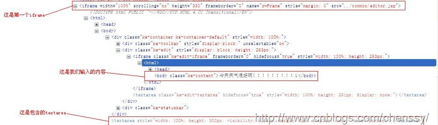

在使用Kindeditor的时候，想要利用Ajax传值，但是通过editor封装的方法是行不通的，原因在于编辑器我们是放在另一个jsp页面，通过iframe来加载的，同时这个iframe的display=”none”的，要通过一个事件来触发。

    
    
    <iframe src="../common/editor.jsp" frameborder="0" scrolling="no" style="margin: 0"
        width="100%" height="300" name="zwFrame" id="zwFrameId"></iframe>

既然原本方法行不通，那我就只好通过jQuery来获取了。首先我想到的是读取内容“textarea”里面的内容，即：$(“#editor”).html()，但是这样是获取不到的。于是我想通过获取iframe里面的内容来获取，也没有获取到，最后通过firefox的debug查看找到最终结果：

从上面这个图中可以看出，要获取“今天天气很好”这个内容，我们只需要获取指定body里面的内容即可。

处理流程：首先获取最外层的iframe，通过iframe取里面的子元素iframe，在进入一层取里面的body即可。如下：

    
    
    var editorText = $(window.frames["zwFrame"].document).find("iframe").contents().find("body");
    var contents = editorText.html();

其中contents():查找匹配元素内部所有的子节点（包括文本节点）。如果元素是一个iframe，则查找文档内容。

下面提供几种获取iframe里面元素内容的方法：

    
    
    $(document.getElementsByTagName("iframe")[0].contentWindow.document.body).html();

显示iframe中body元素的内容

    
    
    $(document.getElementById("iframeId").contentWindow.document.body).html();

获取iframe中textarea元素的内容

    
    
    $(window.frames["iframeName"].document).find("#textareaId").html();

