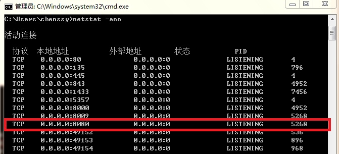
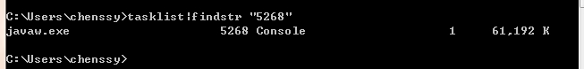

今天部署项目过程中tomcat报如下异常：

    
    
    java.net.SocketException: Unrecognized Windows Sockets error: 0: JVM_Bind
    
        at java.net.PlainSocketImpl.socketBind(Native Method)
    
        at java.net.PlainSocketImpl.bind(PlainSocketImpl.java:359)
    
        at java.net.ServerSocket.bind(ServerSocket.java:319)
    
        at java.net.ServerSocket.<init>(ServerSocket.java:185)
    
        at java.net.ServerSocket.<init>(ServerSocket.java:141)
    
        at org.apache.tomcat.util.net.DefaultServerSocketFactory.createSocket(DefaultServerSocketFactory.java:50)
    
        at org.apache.tomcat.util.net.JIoEndpoint.init(JIoEndpoint.java:494)
    
        at org.apache.tomcat.util.net.JIoEndpoint.start(JIoEndpoint.java:513)
    
        at org.apache.coyote.http11.Http11Protocol.start(Http11Protocol.java:202)
    
        at org.apache.catalina.connector.Connector.start(Connector.java:1132)
    
        at org.apache.catalina.core.StandardService.start(StandardService.java:457)
    
        at org.apache.catalina.core.StandardServer.start(StandardServer.java:710)
    
        at org.apache.catalina.startup.Catalina.start(Catalina.java:552)
    
        at sun.reflect.NativeMethodAccessorImpl.invoke0(Native Method)
    
        at sun.reflect.NativeMethodAccessorImpl.invoke(NativeMethodAccessorImpl.java:39)
    
        at sun.reflect.DelegatingMethodAccessorImpl.invoke(DelegatingMethodAccessorImpl.java:25)
    
        at java.lang.reflect.Method.invoke(Method.java:597)
    
        at org.apache.catalina.startup.Bootstrap.start(Bootstrap.java:288)
    
        at org.apache.catalina.startup.Bootstrap.main(Bootstrap.java:413)
    
    2012-11-27 17:13:51 org.apache.catalina.startup.Catalinastart
    

Google下发现原来是端口被占用。对于这个异常其实很容易解决，不外乎两种解决方法：

1、 更改tomcat端口

2、 关掉占用该端口的进程。

一、更改tomcat端口

首先到安装目录（或者解压目录）下找到conf文件夹，在里面找到server.xml的文件，找到

    
    
    1 <Connector port="8080" maxThreads="150" minSpareThreads="25" maxSpareThreads="75"
    2 enableLookups="false" redirectPort="8443" acceptCount="100"
    3 debug="0" connectionTimeout="20000" 
    4 disableUploadTimeout="true" />

将port="8080"改为其它的就可以了

二、关闭占用该端口的进程

1、首先进入命令行查看端口是否被占用

使用命令： netstat –ano。如下：

我的服务器端口是：8080。从上面可以看出8080端口已经被PID为5268的进程占用。

2、查看该PID为 5268的进程

使用命令：tasklist|findstr "5268"。如下

从上面看出PID为5268的进程为javaw.exe。

第一种解决办法是：把javaw.exe进程关掉

第二种解决办法是：直接通过任务管理器查看PID为5268的进程，然后关掉windows任务管理器->查看->选择列选中PID
然后查看任务管理器，关掉PID为5268的进程。

