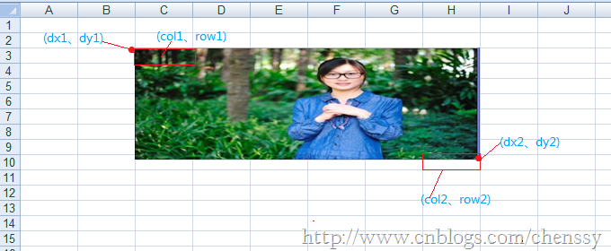
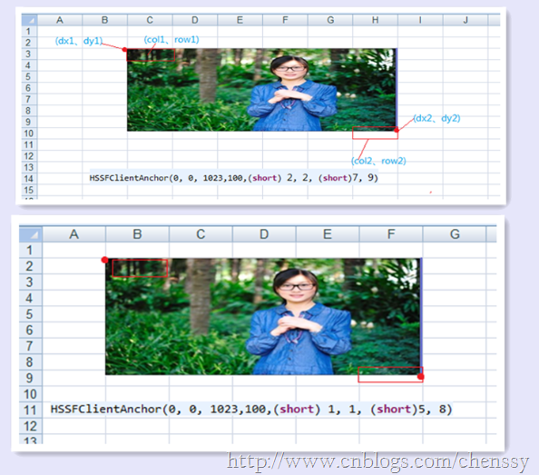
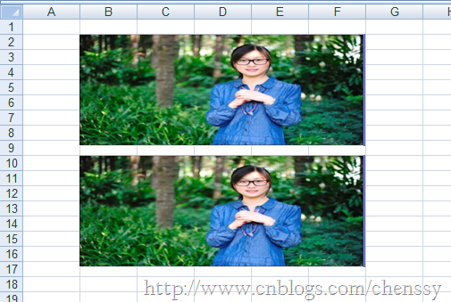

做Web开发免不了要与Excel打交道。今天老大给我一个任务-
导出Excel。开始想的还是蛮简单的，无非就是查找，构建Excel，response下载即可。但是有一点不同，就是要加入图片，就是这个加入图片搞了好久。同时网络上确实没有发现比较好的资料，所以写这篇博文记录之，供自己和博友们查询，参考。

在POI中有HSSFPatriarch对象，该对象为画图的顶级管理器，它的createPicture(anchor,
pictureIndex)方法就能够在Excel插入一张图片。所以要在Excel中插入图片，三步就可以搞定。一、获取HSSFPatriarch对象，二、new
HSSFClientAnchor对象，三、调用createPicture方法即可。实现倒是非常容易实现，如果想把它做好还是有点儿难度的。这里我们先插入一张图片：

    
    
    public class ExcelImageTest {
        public static void main(String[] args) {
             FileOutputStream fileOut = null;   
             BufferedImage bufferImg = null;   
            //先把读进来的图片放到一个ByteArrayOutputStream中，以便产生ByteArray  
            try {
                ByteArrayOutputStream byteArrayOut = new ByteArrayOutputStream();   
                bufferImg = ImageIO.read(new File("F:/图片/照片/无名氏/小昭11.jpg"));   
                ImageIO.write(bufferImg, "jpg", byteArrayOut);
                
                HSSFWorkbook wb = new HSSFWorkbook();   
                HSSFSheet sheet1 = wb.createSheet("test picture");  
                //画图的顶级管理器，一个sheet只能获取一个（一定要注意这点）
                HSSFPatriarch patriarch = sheet1.createDrawingPatriarch();   
                //anchor主要用于设置图片的属性
                HSSFClientAnchor anchor = new HSSFClientAnchor(0, 0, 255, 255,(short) 1, 1, (short) 5, 8);   
                anchor.setAnchorType(3);   
                //插入图片  
                patriarch.createPicture(anchor, wb.addPicture(byteArrayOut.toByteArray(), HSSFWorkbook.PICTURE_TYPE_JPEG)); 
                fileOut = new FileOutputStream("D:/测试Excel.xls");   
                // 写入excel文件   
                 wb.write(fileOut);   
                 System.out.println("----Excle文件已生成------");
            } catch (Exception e) {
                e.printStackTrace();
            }finally{
                if(fileOut != null){
                     try {
                        fileOut.close();
                    } catch (IOException e) {
                        e.printStackTrace();
                    }
                }
            }
        }
    }

如下为执行后的结果：

至于为什么会是这样的结果，主要是因为HSSFClientAnchor(0, 0, 255, 255,(short) 1, 1, (short) 5,
8)这个构造函数造成的，下面我就来解释这个构造函数：HSSFClientAnchor(int dx1,int dy1,int dx2,int
dy2,short col1,int row1,short col2, int row2);各个参数的含义如下：

dx1：the x coordinate within the first cell。

dy1：the y coordinate within the first cell。

dx2：the x coordinate within the second cell。

dy2：the y coordinate within the second cell。

col1：the column (0 based) of the first cell。

row1：the row (0 based) of the first cell。

col2：the column (0 based) of the second cell。

row2：the row (0 based) of the second cell。

这里dx1、dy1定义了该图片在开始cell的起始位置，dx2、dy2定义了在终cell的结束位置。col1、row1定义了开始cell、col2、row2定义了结束cell。

下面是有两个不同的构造函数所创建的，从这幅图中我们可以清晰看到上面八个参数的含义和不同之处。

上面是插入一张图片，那么实现插入多张图片呢？其实很简单，构造多个不同的HSSFClientAnchor对象，控制好那八个参数，如下：

    
    
    HSSFClientAnchor anchor1 = new HSSFClientAnchor(0, 0, 1023,100,(short) 1, 1, (short)5, 8); 
                HSSFClientAnchor anchor2 = new HSSFClientAnchor(0, 0, 1023,100,(short) 1, 9, (short)5, 16); 
                
                //插入图片  
                patriarch.createPicture(anchor1, wb.addPicture(byteArrayOut.toByteArray(), HSSFWorkbook.PICTURE_TYPE_JPEG)); 
                patriarch.createPicture(anchor2, wb.addPicture(byteArrayOut.toByteArray(), HSSFWorkbook.PICTURE_TYPE_JPEG));

其余代码一样，得到如下结果：

下篇我将提供一个Excel生成的通用模板，支持自定样式、标题、写入图片等！！

