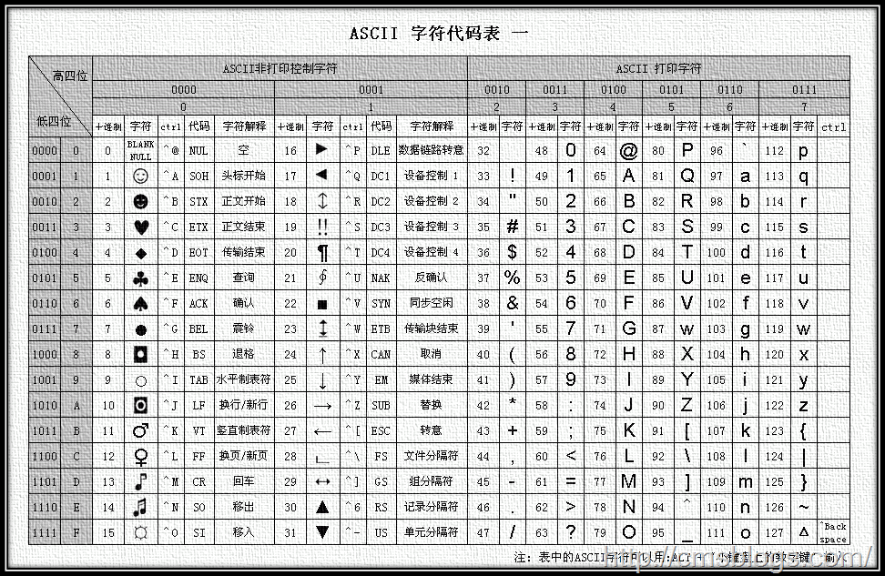
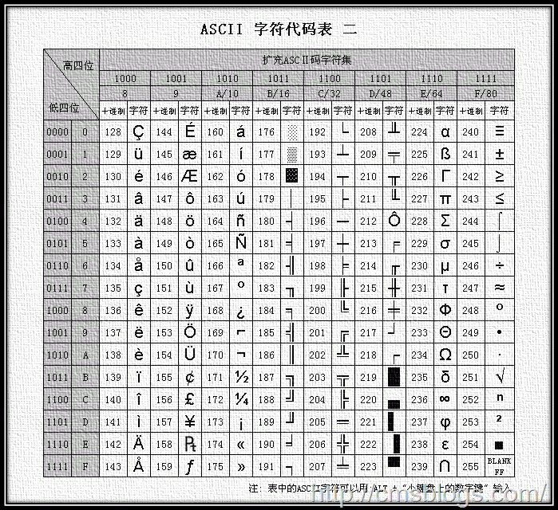
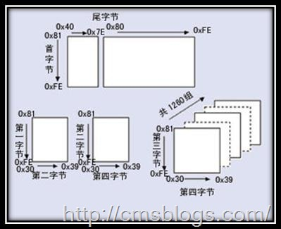
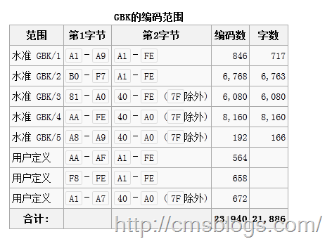

##java中文乱码解决之道（一）-----认识字符集

##
##沉寂了许久（大概有三个多月了吧），LZ“按捺不住”开始写博了！

##
##java编码中的中文问题是一个老生常谈的问题了，每次遇到中文乱码LZ要么是按照以前的经验修改，要么则是baidu.com来解决问题。阅读许多关于中文乱码的解决办法的博文后，发现对于该问题我们都（更加包括我自己）没有一个清晰明了的认识，于是LZ想通过这系列博文（估计只有几篇）来彻底分析、解决java中文乱码问题，如有错误之处望各位同仁指出！当然，此系列博文并非LZ完全原创，都是在前辈基础上总结，归纳，如果雷同纯属借鉴……
##问题起源

##
##对于计算机而言，它仅认识两个0和1，不管是在内存中还是外部存储设备上，我们所看到的文字、图片、视频等等“数据”在计算机中都是已二进制形式存在的。不同字符对应二进制数的规则，就是字符的编码。字符编码的集合称为字符集。

##
##在早期的计算机系统中，使用的字符是非常少的，他们只包括26个英文字母、数字符号和一些常用符号，对于这些字符进行编码，用1个字节就足够了，但是随着计算机的不断发展，为了适应全世界其他各国民族的语言，这些少得可怜的字符编码肯定是不够的。于是人们提出了UNICODE编码，它采用双字节编码，兼容英文字符和其他国家民族的双字节字符编码。

##
##每个国家为了统一编码都会规定该国家/地区计算机信息交换用的字符集编码，为了解决本地字符信息的计算机处理，于是出现了各种本地化版本，引进LANG, Codepage 等概念。现在大部分具有国际化特征的软件核心字符处理都是以 Unicode 为基础的，在软件运行时根据当时的 Locale/Lang/Codepage 设置确定相应的本地字符编码设置，并依此处理本地字符。在处理过程中需要实现 Unicode 和本地字符集的相互转换。

##
##同然，java内部采用的就是Unicode编码，所以在java运行的过程中就必然存在从Unicode编码与相应的计算机操作系统或者浏览器支持的编码格式相互转化的过程，这个转换的过程有一系列的步骤，如果某个步骤出现错误，则输出的文字就会是乱码。

##
##所以产生java乱码的问题就在于JVM与对应的操作系统/浏览器进行编码格式转换时出现了错误。

##
##其实要解决java乱码问题的方法还是比较简单的，但是要究其原因，理解背后的原理还是需要了解

##
##其实解决 JAVA 程序中的汉字编码问题的方法往往很简单，但理解其背后的原因，定位问题，还需要了解现有的汉字编码和编码转换。 
##常见字符编码

##
##计算机要准确的处理各种字符集文字，需要进行字符编码，以便计算机能够识别和存储各种文字。常见的字符编码主要包括：ASCII编码、GB**编码、Unicode。下面LZ就简单地介绍下！（为什么是简单介绍？因为LZ在网上查找资料想去了解字符编码时，发现这个问题比我想象的复杂太多了，所以LZ需要另起一篇详细介绍，所以各位看客就简单看看吧！！）1.ASCII编码

##
##ASCII，American Standard Code for Information Interchange，是基于拉丁字母的一套电脑编码系统，主要用于显示现代英语和其他西欧语言。它是现今最通用的单字节编码系统。

##
##ASCII码使用指定的7位或者8为二进制数字组合表示128或者256种可能的字符。标准的ASCII编码使用的是7（2^7 = 128）位二进制数来表示所有的大小写字母、数字和标点符号已经一些特殊的控制字符，最前面的一位统一规定为0。其中0～31及127(共33个)是控制字符或通信专用字符，32～126(共95个)是字符(32是空格），其中48～57为0到9十个阿拉伯数字，65～90为26个大写英文字母，97～122号为26个小写英文字母，其余为一些标点符号、运算符号等。

##
##  2.GBK***编码

##
##ASCII最大的缺点就是显示字符有限，他虽然解决了部分西欧语言的显示问题，但是对更多的其他语言他实在是无能为了。随着计算机技术的发展，使用范围越来越广泛了，ASCII的缺陷越来越明显了，其他国家和地区需要使用计算机，必须要设计一套符合本国/本地区的编码规则。例如为了显示中文，我们就必须要设计一套编码规则用于将汉字转换为计算机可以接受的数字系统的数。 

##
##GB2312，用于汉字处理、汉字通信等系统之间的信息交换，通行于中国大陆。它的编码规则是：小于127的字符的意义与原来相同，但两个大于127的字符连在一起时，就表示一个汉字，前面的一个字节（他称之为高字节）从0xA1用到 0xF7，后面一个字节（低字节）从0xA1到0xFE，这样我们就可以组合出大约7000多个简体汉字了。虽然GB2312收录了这么多汉子，他所覆盖的使用率可以达到99%，但是对于那些不常见的汉字，例如人名、地名、古汉语，它就不能处理了，于是就有下面的GBK、GB 18030的出现。（点击GB2312简体中文编码表查看）。

##
##GB18030，全称：国家标准GB 18030-2005《信息技术 中文编码字符集》,是我国计算机系统必须遵循的基础性标准之一,GB18030有两个版本：GB18030-2000和GB18030-2005。GB18030-2000是GBK的取代版本，它的主要特点是在GBK基础上增加了CJK统一汉字扩充A的汉字。

##
##GB 18030主要有以下特点： 

##
## 与UTF-8相同，采用多字节编码，每个字可以由1个、2个或4个字节组成。 

##
## 编码空间庞大，最多可定义161万个字符。 

##
## 支持中国国内少数民族的文字，不需要动用造字区。 

##
## 汉字收录范围包含繁体汉字以及日韩汉字 

##
## 

##
##GBK，汉字编码标准之一，全称《汉字内码扩展规范》，它 向下与 GB 2312 编码兼容，向上支持 ISO 10646.1 国际标准，是前者向后者过渡过程中的一个承上启下的标准。它的编码范围如下图：

##
## 3.Unicode编码

##
##正如前面前面所提到的一样，世界存在这么多国家，也存在着多种编码风格，像中文的GB232、GBK、GB18030，这样乱搞一套，虽然在本地运行没有问题，但是一旦出现在网络上，由于互不兼容，访问则会出现乱码。为了解决这个问题，伟大的Unicode编码腾空出世。

##
##Unicode编码的作用就是能够使计算机实现夸平台、跨语言的文本转换和处理。它几乎包含了世界上所有的符号，并且每个符号都是独一无二的。在它的编码世界里，每一个数字代表一个符号，每一个符号代表了一个数字，不存在二义性。

##
##Unicode编码又称统一码、万国码、单一码，它是业界的一种标准，是为了解决传统的字符编码方案的局限而产生的，它为每种语言中的每个字符设定了统一并且唯一的二进制编码，以满足跨语言、跨平台进行文本转换、处理的要求。同时Unicode是字符集，它存在很多几种实现方式如：UTF-8、UTF-16.UTF-8

##
##互联网的普及，强烈要求出现一种统一的编码方式。UTF-8就是在互联网上使用最广的一种unicode的实现方式。其他实现方式还包括UTF-16和UTF-32，不过在互联网上基本不用。重复一遍：UTF-8是Unicode的实现方式之一。 

##
##UTF-8最大的一个特点，就是它是一种变长的编码方式。它可以使用1~4个字节表示一个符号，根据不同的符号而变化字节长度。    UTF-8的编码规则很简单，只有两条：     1）对于单字节的符号，字节的第一位设为0，后面7位为这个符号的unicode码。因此对于英语字母，UTF-8编码和ASCII码是相同的。     2）对于n字节的符号（n>1），第一个字节的前n位都设为1，第n+1位设为0，后面字节的前两位一律设为10。剩下的没有提及的二进制位，全部为这个符号的unicode码。 
##推荐阅读

##
##此篇博文只是开篇之作，启下之用， 对字符集的介绍也只是简简单单，没有太多的描述，因为LZ在查字符集的资料过程中发现字符集真的是太复杂了，LZ有点儿驾驭不了，需要仔细研究，然后写一篇较为详细的博文！各位敬请期待！！

##
##参考文献：字符集和字符编码：http://www.cnblogs.com/skynet/archive/2011/05/03/2035105.html

##
##百度百科 ASCII:http://baike.baidu.com/view/15482.htm

##
##百度百科：GB2312：http://baike.baidu.com/view/443268.htm?fromtitle=GB2312&amp;fromid=483170&amp;type=syn

##
##百度百科：GB18030：http://baike.baidu.com/view/889058.htm

##
##百度百科：GBK：http://baike.baidu.com/view/931619.htm?fromtitle=GBK&amp;fromid=481954&amp;type=search

##
##百度百科：Unicode：http://baike.baidu.com/view/40801.htm

##
##百度百科：UTF-8：http://baike.baidu.com/view/25412.htm

##
##如有错误之处，忘指出！！不胜感激！！！

##
##-----原文出自:http://cmsblogs.com/?p=1395,请尊重作者辛勤劳动成果,转载说明出处.

##
##-----个人站点:http://cmsblogs.com