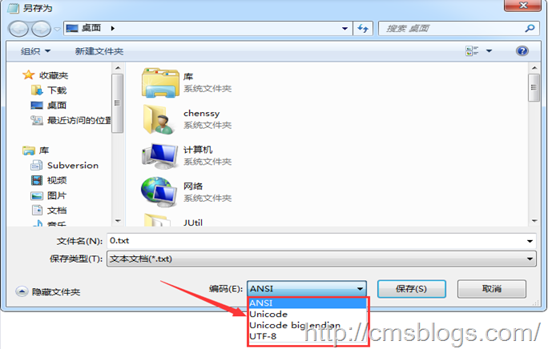
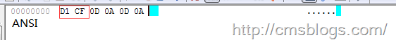
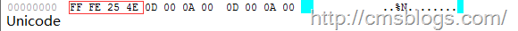
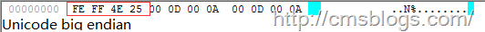
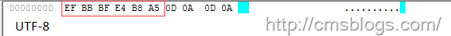

随着计算机的发展、普及，世界各国为了适应本国的语言和字符都会自己设计一套自己的编码风格，正是由于这种乱，导致存在很多种编码方式，以至于同一个二进制数字可能会被解释成不同的符号。为了解决这种不兼容的问题，伟大的创想
**Unicode** 编码应时而生！！

## Unicode

Unicode又称为统一码、万国码、单一码，它是为了解决传统的字符编码方案的局限而产生的，它为每种语言中的每个字符设定了统一并且唯一的二进制编码，以满足跨语言、跨平台进行文本转换、处理的要求。可以想象Unicode作为一个“字符大容器”，它将世界上所有的符号都包含其中，并且每一个符号都有自己独一无二的编码，这样就从根本上解决了乱码的问题。所以
**Unicode是一种所有符号的编码** [2]。

Unicode伴随着通用字符集的标准而发展，同时也以书本的形式对外发表，它是业界的标准，对世界上大部分的文字系统进行了整理、编码，使得电脑可以用更为简单的方式来呈现和处理文字。Unicode至今仍在不断增修，迄今而至已收入超过十万个字符，它备受业界认可，并广泛地应用于电脑软件的国际化与本地化过程。

我们知道Unicode是为了解决传统的字符编码方案的局限而产生的，对于传统的编码方式而言，他们都存在一个共同的问题：无法支持多语言环境，这对于互联网这个开放的环境是不允许的。而目前几乎所有的电脑系统都支持基本拉丁字母，并各自支持不同的其他编码方式。Unicode为了和它们相互兼容，其首256字符保留给ISO
8859-1所定义的字符，使既有的西欧语系文字的转换不需特别考量；并且把大量相同的字符重复编到不同的字符码中去，使得旧有纷杂的编码方式得以和Unicode编码间互相直接转换，而不会丢失任何信息[1]。

## 实现方式

一个字符的Unicode编码是确定的，但是在实际传输过程中，由于不同系统平台的设计不一定一致，以及出于节省空间的目的，对Unicode编码的实现方式有所不同。Unicode的实现方式称为
**Unicode转换格式** （Unicode Transformation Format，简称为UTF）[1]。

Unicode是字符集，它主要有UTF-8、UTF-16、UTF-32三种实现方式。由于UTF-8是目前主流的实现方式，UTF-16、UTF-32相对而言使用较少，所以下面就主要介绍UTF-8。

### UCS

提到Unicode可能有必要了解下，UCS。UCS（Universal Character Set，通用字符集），是由ISO制定的 **ISO
10646** （或称 **ISO/IEC 10646**
）标准所定义的标准字符集。它包括了其他所有字符集，保证了与其他字符集的双向兼容，即，如果你将任何文本字符串翻译到UCS格式，然后再翻译回原编码，你不会丢失任何信息。

UCS不仅给每个字符分配一个代码，而且赋予了一个正式的名字。表示一个UCS或Unicode值的十六进制数通常在前面加上“U+”，例如“U+0041”代表字符“A”。

### **Little endian & Big endian**

由于各个系统平台的设计不同，可能会导致某些平台对字符的理解不同（比如字节顺序的理解）。这时将会导致同意字节流可能会被解释为不同的内容。如某个字符的十六进制为4E59，拆分为4E、59，在MAC上读取时是欧诺个低位开始的，那么MAC在遇到该字节流时会被解析为594E，找到的字符为“奎”，但是在Windows平台是从高字节开始读取，为4E59，找到的字符为“乙”。也就是说在Windows平台保存的“乙”跑到MAC平台上就变成了“奎”。这样势必会引起混乱，于是在Unicode编码中采用了大头（Big
endian）、小头（Little
endian）两种方式来进行区分。即第一个字节在前，就是大头方式，第二个字节在前就是小头方式。那么这个时候就出现了一个问题：计算机怎么知道某个文件到底是采用哪种编码方式的呢？

Unicode规范中定义，每一个文件的最前面分别加入一个表示编码顺序的字符，这个字符的名字叫做"零宽度非换行空格"（ZERO WIDTH NO-BREAK
SPACE），用FEFF表示。这正好是两个字节，而且FF比FE大1。

如果一个文本文件的头两个字节是FE FF，就表示该文件采用大头方式；如果头两个字节是FF FE，就表示该文件采用小头方式。

### UTF-8

UTF-8是一种针对Unicode的可变长度字符编码,可以使用1~4个字节表示一个符号，根据不同的符号而变化字节长度。它可以用来表示Unicode标准中的任何字符，且其编码中的第一个字节仍与ASCII兼容，这使得原来处理ASCII字符的系统无须或只须做少部份修改，即可继续使用。因此，它逐渐成为电子邮件、网页及其他存储或传送文字的应用中，优先采用的编码。

UTF-8使用一到四个字节为每个字符编码，编码规则如下：

1）对于单字节的符号，字节的第一位设为0，后面7位为这个符号的unicode码。因此对于英语字母，UTF-8编码和ASCII码是相同的。

2）对于n字节的符号（n>1），第一个字节的前n位都设为1，第n+1位设为0，后面字节的前两位一律设为10。剩下的没有提及的二进制位，全部为这个符号的unicode码。

转换表如下：  
  
<table>  
<tr>  
<td>

**Unicode**

</td>  
<td>

**UTF-8**

</td> </tr>  
<tr>  
<td>

0000 ~007F

</td>  
<td>

**0** XXX XXXX

</td> </tr>  
<tr>  
<td>

0080 ~07FF

</td>  
<td>

**110** X XXXX **10** XX XXXX

</td> </tr>  
<tr>  
<td>

0800 ~FFFF

</td>  
<td>

**1110** XXXX **10** XX XXXX **10** XX XXXX

</td> </tr>  
<tr>  
<td>

1 0000 ~1F FFFF

</td>  
<td>

**1111 0** XXX **10** XX XXXX **10** XX XXXX **10** XX XXXX

</td> </tr>  
<tr>  
<td>

20 0000 ~3FF FFFF

</td>  
<td>

**1111 10** XX **10** XX XXXX **10** XX XXXX **10** XX XXXX **10** XX XXXX

</td> </tr>  
<tr>  
<td>

400 0000 ~7FFF FFFF

</td>  
<td>

**1111 110** X **10** XX XXXX **10** XX XXXX **10** XX XXXX **10** XX XXXX
**10** XX XXXX

</td> </tr> </table>

根据上面的转换表，理解UTF-8的转换编码规则就变得非常简单了：第一个字节的第一位如果为0，则表示这个字节单独就是一个字符;如果为1，连续多少个1就表示该字符占有多少个字节。

以汉字"严"为例，演示如何实现UTF-8编码[3]。

已知"严"的unicode是4E25（100111000100101），根据上表，可以发现4E25处在第三行的范围内（0000 0800-0000
FFFF），因此"严"的UTF-8编码需要三个字节，即格式是"1110xxxx 10xxxxxx
10xxxxxx"。然后，从"严"的最后一个二进制位开始，依次从后向前填入格式中的x，多出的位补0。这样就得到了，"严"的UTF-8编码是"11100100
10111000 10100101"，转换成十六进制就是E4B8A5。

### Unicode与UTF-8之间的转换

通过上面的例子我们可以看到"严"的Unicode码为4E25，UTF-8编码为E4B8A5，他们两者是不一样的，需要通过程序的转换来实现，在Window平台最简单的直观的方法就是记事本。

在最下面的"编码（E）"处有四个选项：ANSI、Unicode、Unicode big endian、UTF-8。

ANSI：记事本的默认的编码方式，对于英文文件是ASCII编码，对于简体中文文件是GB2312编码。注意：不同 ANSI
编码之间互不兼容，当信息在国际间交流时，无法将属于两种语言的文字，存储在同一段 ANSI 编码的文本中

Unicode：UCS-2编码方式，即直接用两个字节存入字符的Unicode码。该方式是"小头"little endian方式。

Unicode big endian：UCS-2编码方式，"大头"方式。

UTF-8：阅读上面（UTF-8）。

>>>实例：在记事本中输入"严"字，依次选择ANSI、Unicode、Unicode big
endian、UTF-8四种编码风格，然后另存为，使用EditPlus文本工具使用"16进制查看器"进行查看，得到如下结果：

ANSI：两个字节"D1 CF"正是"严"的GB2312编码。

Unicode：四个字节"FF FE 25 4E"，其中"FF FE"表示小头存储方式，真正的编码为"25 4E"。

Unicode big endian：四个字节"FE FF 4E 25"，"FE FF"表示大头存储方式，真正编码为"4E 25"。

UTF-8：编码是六个字节"EF BB BF E4 B8 A5"，前三个字节"EF BB
BF"表示这是UTF-8编码，后三个"E4B8A5"就是"严"的具体编码，它的存储顺序与编码顺序是一致的。

## 参考文献&更多阅读

1、Unicode维基百科：<http://zh.wikipedia.org/wiki/Unicode>

2、Unicode百度百科：<http://baike.baidu.com/view/40801.htm>

3、字符编码笔记：ASCII，Unicode和UTF-8：<http://www.ruanyifeng.com/blog/2007/10/ascii_unicode_and_utf-8.html>

4、UTF-8百度百科：<http://baike.baidu.com/view/25412.htm>

* * *

**\-----原文出自:<http://cmsblogs.com/?p=1458>**[
****](http://cmsblogs.com/?p=1201) **,请尊重作者辛勤劳动成果,转载说明出处.**

**\-----个人站点:**[ **http://cmsblogs.com**](http://cmsblogs.com/)

