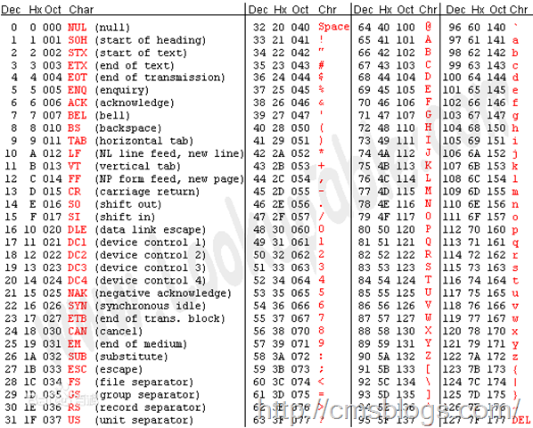
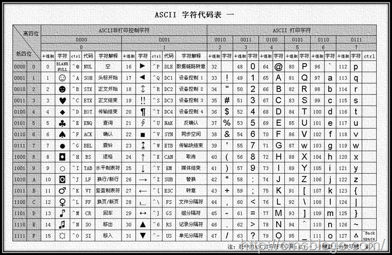
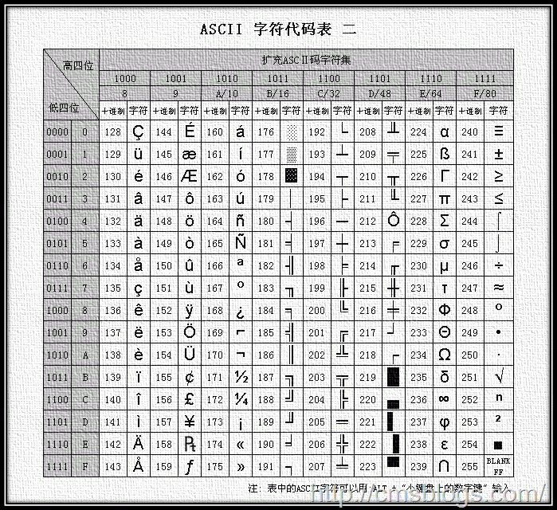
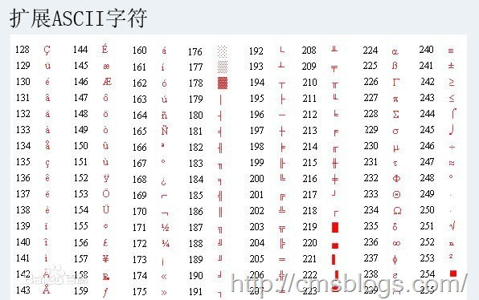
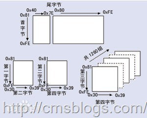

##java中文乱码解决之道（二）-----字符编码详解：基础知识 + ASCII + GB**

##
##在上篇博文（java中文乱码解决之道（一）-----认识字符集）中，LZ简单介绍了主流的字符编码，对各种编码都是点到为止，以下LZ将详细阐述字符集、字符编码等基础知识和ASCII、GB的详情。
##一、基础知识

##
##在了解各种字符集之前我们需要了解一些最基础的知识，如：编码、字符、字符集、字符编码基础知识。编码

##
##计算机中存储的信息都是用二进制表示的，我们在屏幕上所看到文字、图片等都是通过二进制转换的结果。编码是信息从一种形式或格式转换为另一种形式的过程，通俗点讲就是就是将我们看到的文字、图片等信息按照某种规则存储在计算机中，例如‘c’在计算机中怎么表达，‘陈’在计算机中怎么表达，这个过程就称之为编码。解码是编码的逆过程，它是将存储在计算机的二进制转换为我们可以看到的文字、图片等信息，它体现的是视觉上的刺激。

##
##n位二进制数可以组合成2的n次方个不同的信息，给每个信息规定一个具体码组，这种过程也叫编码。

##
##在编码和解码中，他们就如加密、解密一般，他们一定会遵循某个规则，即y = f(x)，那么x = f(y)；否则在解密过程就会导致‘a’解析成‘b’或者乱码。字符

##
##字符是可使用多种不同字符方案或代码页来表示的抽象实体，它是一个单位的字形、类字形单位或符号的基本信息，也是各种文字和符号的总称，包括各国家文字、标点符号、图形符号、数字等。

##
##字符是指计算机中使用的字母、数字、字和符号，包括：1、2、3、A、B、C、~！·#￥%……—*（）——+等等。在 ASCII 编码中，一个英文字母字符存储需要1个字节。在 GB 2312 编码或 GBK 编码中，一个汉字字符存储需要2个字节。在UTF-8编码中，一个英文字母字符存储需要1个字节，一个汉字字符储存需要3到4个字节。在UTF-16编码中，一个英文字母字符或一个汉字字符存储都需要2个字节（Unicode扩展区的一些汉字存储需要4个字节）。在UTF-32编码中，世界上任何字符的存储都需要4个字节。

##
## 字符集

##
##字符是各种文字和符号的总称，而字符集则是多个字符的集合，字符集种类较多，每个字符集包含的字符个数不同。而计算机要准确的处理各种字符集文字，需要进行字符编码，以便计算机能够识别和存储各种文字。

##
##常见字符集名称：ASCII字符集、GB2312字符集、BIG5字符集、 GB18030字符集、Unicode字符集等。字符编码

##
##计算机中的信息包括数据信息和控制信息，然而不管是那种信息，他们都是以二进制编码的方式存入计算机中，但是他们是怎么展示在屏幕上的呢？同时在展现过程中如何才能保证他们不出错？这个时候字符编码就起到了重要作用！字符编码是一套规则，一套建立在符合集合与数字系统之间的对应关系之上的规则，它是信息处理的基本技术。

##
##使用字符编码这套规则能够对自然语言的字符的一个集合（如字母表或音节表），与其他东西的一个集合（如号码或电脉冲）进行配对。

##
## 
##二、ASCII2.1、标准ASCII码

##
##ASCII（American Standard Code for Information Interchange，美国信息交换标准代码）是基于拉丁字母的一套电脑编码系统。它主要用于显示现代英语和其他西欧英语，它是现今最通用的单字节编码系统。

##
##ASCII使用7位或者8位来表示128或者256种可能的字符。标准的ASCII码则是使用7位二进制数来表示所有的大小写字母、数字、标点符合和一些控制字符，其中：

##
##0~31、127（共33个）是控制字符或者通信专用字符，如控制符：LF（换行）、CR（回车）、DEL（删除）等；通信专用字符：SOH（文头）、EOT（文尾）、ACK（确认）等。ASCII值为8、9、10、13分别表示退格、制表、换号、回车字符。

##
##32~126（共95个）字符，32为空格、48~57为阿拉伯数字、65~90为大写字母、97~122为小写字母，其余为一些标点符号和运算符号！

##
##前面提过标准的ASCII码是使用七位来表示字符的，而最高位（b7）则是用作奇偶校验的。所谓奇偶校验，是指在代码传送过程中用来检验是否出现错误的一种方法，一般分奇校验和偶校验两种。奇校验规定：正确的代码一个字节中1的个数必须是奇数，若非奇数，则在最高位b7添1；偶校验规定：正确的代码一个字节中1的个数必须是偶数，若非偶数，则在最高位b7添1。 （参考百度百科）

##
##下面是ASCII字符对照表，更多详情请关注：》》 ASCII码表 《《

##
##  2.2、扩展ASCII码

##
##标准的ASCII是用七位来表示的，那么它的缺陷就非常明显了：只能显示26个基本拉丁字母、阿拉伯数目字和英式标点符号，基本上只能应用于现代美国英语，对于其他国家，128个字符肯定不够。于是，这些欧洲国家决定利用字节中闲置的最高位编入新的符号，这样一来，可以表达的字符数最多就为256个，但是随着产生的问题也就来了：不同的国家有不同的字母，可能同一个编码在不同的国家所表示的字符不同。但是不管怎么样，在这些编码中0~127所表示的字符肯定是一样的，不一样的也只是128~255这一段。

##
##8位的ASCII在欧洲国家表现的不尽人意，那么在其他国家就更加不用说了，我们拥有五千年历史文化的中华名族所包含的汉字多大10多万，不知道是多少个256。所以一个字节8位表示的256个字符肯定是不够的，那么两个字节呢？可能够了吧！我们常见的汉字就是用两个字节表示的，如GB2312。

##
## 
##三、GB**

##
##对于欧美国家来说，ASCII能够很好的满足用户的需求，但是当我们中华名族使用计算机时，ASCII明显就不满足需求了，有5000年历史文化的我们，拥有的汉字达到将近10万，所以为了显示中文，我们必须设计一套编码规则用于将汉字转换为计算机可以接受的数字系统的数。显示中文的常用字符编码有：GB2312、GBK、GB18030。GB2312

##
##GB2312，中国国家标准简体中文字符集，全称《信息交换用汉字编码字符集·基本集》，由中国国家标准总局发布，1981年5月1日实施。

##
##GB2312编码的规则：一个小于127的字符的意义与原来相同，但两个大于127的字符连在一起时，就表示一个汉字，前面的一个字节（他称之为高字节）从0xA1用到 0xF7，后面一个字节（低字节）从0xA1到0xFE，这样我们就可以组合出大约7000多个简体汉字了。在这些编码里，还把数学符号、罗马希腊的 字母、日文的假名们都编进去了，连在ASCII里本来就有的数字、标点、字母都统统重新编了两个字节长的编码，这就是常说的"全角"字符，而原来在127 号以下的那些就叫"半角"字符了。

##
##在GB2312中，GB2312共收录6763个汉字，其中一级汉字3755个，二级汉字3008个，还收录了拉丁字母、希腊字母、日文等682个全角字符。由于GB2312的出现，它基本上解决了我们日常的需要，它所收录的汉子已经覆盖了中国大陆99.75%的使用平率。但是我国文化博大精深，对于人名、古汉语等方面出现的罕用字，GB2312还是不能处理，于是后面的GBK和GB18030汉字字符集出现了。

##
##GB2312字符集库非常庞大，详情：GB2312简体中文编码表。GBK

##
##GBK，全称《汉字内码扩展规范》，由中华人民共和国全国信息技术标准化技术委员会1995年12月1日制订，也是汉字编码的标准之一。

##
##GBK是GB2312的扩展，他向下与GB2312兼容，，向上支持 ISO 10646.1 国际标准，是前者向后者过渡过程中的一个承上启下的标准。同时它是使用双字节编码方案，其编码范围从8140至FEFE（剔除xx7F），首字节在 81-FE 之间，尾字节在 40-FE 之间，共23940个码位，共收录了21003个汉字。GB18030

##
##GB18030，国家标准GB18030《信息技术 中文编码字符集》，是我国计算机系统必须遵循的基础性标准之一。它有两个版本：GB18030-2000、GB18030-2005。其中GB18030-2000仅规定了常用非汉字符号和27533个汉字（包括部首、部件等）的编码，而GB18030-2005是全文强制性标准，市场上销售的产品必须符合，它是GB18030-2000的基础上增加了42711个汉字和多种我国少数民族文字的编码。

##
##GB18030标准采用单字节、双字节和四字节三种方式对字符编码。（码位总体结构见下图）

##
##单字节部分采用GB/T 11383的编码结构与规则，使用0×00至0×7F码位(对应于ASCII码的相应码位)。双字节部分，首字节码位从0×81至0×FE，尾字节码位分别是0×40至0×7E和0×80至0×FE。四字节部分采用GB/T 11383未采用的0×30到0×39作为对双字节编码扩充的后缀，这样扩充的四字节编码，其范围为0×81308130到0×FE39FE39。其中第一、三个字节编码码位均为0×81至0×FE，第二、四个字节编码码位均为0×30至0×39。

##
## 
##四、参考文献&amp;进一步阅读

##
##编码：http://baike.baidu.com/subview/237708/11062012.htm（百度百科）

##
##字符：http://baike.baidu.com/view/263416.htm（百度百科）

##
##字符集：http://baike.baidu.com/view/51987.htm（百度百科）

##
##字符编码：http://baike.baidu.com/view/1204863.htm（百度百科）

##
##字符集和字符编码：http://www.cnblogs.com/skynet/archive/2011/05/03/2035105.html（吴秦）

##
##ASCII：http://baike.baidu.com/view/15482.htm

##
##GB2312：http://baike.baidu.com/view/443268.htm

##
##GBK：http://baike.baidu.com/view/931619.htm

##
##GB18030：http://baike.baidu.com/view/889058.htm

##
##-----原文出自:http://cmsblogs.com/?p=1412请尊重作者辛勤劳动成果,转载说明出处. 

##
##-----个人站点:http://cmsblogs.com