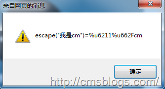
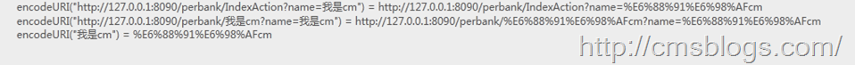

我们主要通过两种形式提交向服务器发送请求：URL、表单。而表单形式一般都不会出现乱码问题，乱码问题主要是在URL上面。通过前面几篇博客的介绍我们知道URL向服务器发送请求编码过程实在是实在太混乱了。不同的操作系统、不同的浏览器、不同的网页字符集，将导致完全不同的编码结果。如果程序员要把每一种结果都考虑进去，是不是太恐怖了？有没有办法，能够保证客户端只用一种编码方法向服务器发出请求？

有！这里我主要提供以下几种方法

## 一、javascript

使用javascript编码不给浏览器插手的机会，编码之后再向服务器发送请求，然后在服务器中解码。在掌握该方法的时候，我们需要料及javascript编码的三个方法：escape()、encodeURI()、encodeURIComponent()。

### escape

采用SIO
Latin字符集对指定的字符串进行编码。所有非ASCII字符都会被编码为%xx格式的字符串，其中xx表示该字符在字符集中所对应的16进制数字。例如，格式对应的编码为%20。它对应的解码方法为unescape()。

事实上escape()不能直接用于URL编码，它的真正作用是返回一个字符的Unicode编码值。比如上面“我是cm”的结果为%u6211%u662Fcm，其中“我”对应的编码为6211，“是”的编码为662F，“cm”编码为cm。

注意，escape()不对"+"编码。但是我们知道，网页在提交表单的时候，如果有空格，则会被转化为+字符。服务器处理数据的时候，会把+号处理成空格。所以，使用的时候要小心。

### encodeURI

对整个URL进行编码，它采用的是UTF-8格式输出编码后的字符串。不过encodeURI除了ASCII编码外对于一些特殊的字符也不会进行编码如：! @ #
$& * ( ) = : / ; ? + "。

### encodeURIComponent()

把URI字符串采用UTF-8编码格式转化成escape格式的字符串。相对于encodeURI，encodeURIComponent会更加强大，它会对那些在encodeURI()中不被编码的符号（;
/ ? : @ & = + $ ,
#）统统会被编码。但是encodeURIComponent只会对URL的组成部分进行个别编码，而不用于对整个URL进行编码。对应解码函数方法decodeURIComponent。

当然我们一般都是使用encodeURI方来进行编码操作。所谓的javascript两次编码后台两次解码就是使用该方法。javascript解决该问题有一次转码、两次转码两种解决方法。

### 一次转码

javascript转码：

    
    
    var url = "<s:property value="webPath" />/ShowMoblieQRCode.servlet?name=我是cm";
    window.location.href = encodeURI(url);

转码后的URL：<http://127.0.0.1:8080/perbank/ShowMoblieQRCode.servlet?name=%E6%88%91%E6%98%AFcm>

后台处理:

    
    
    String name = request.getParameter("name");
            System.out.println("前台传入参数：" + name);
            name  = new String(name.getBytes("ISO-8859-1"),"UTF-8");
            System.out.println("经过解码后参数：" + name);

输出结果：

前台传入参数：??????cm  
经过解码后参数：我是cm

### 二次转码

javascript

    
    
    var url = "<s:property value="webPath" />/ShowMoblieQRCode.servlet?name=我是cm";
    window.location.href = encodeURI(encodeURI(url));

转码后的url:<http://127.0.0.1:8080/perbank/ShowMoblieQRCode.servlet?name=%25E6%2588%2591%25E6%2598%25AFcm>

后台处理：

    
    
            String name = request.getParameter("name");
            System.out.println("前台传入参数：" + name);
            name  = URLDecoder.decode(name,"UTF-8");
            System.out.println("经过解码后参数：" + name);

输出结果：

前台传入参数：E68891E698AFcm

  
经过解码后参数：我是cm

## filter

使用过滤器，过滤器LZ提供两种，第一种设置编码，第二种直接在过滤器中进行解码操作。

### 过滤器1

该过滤器是直接设置request的编码格式的。

    
    
    public class CharacterEncoding implements Filter {
    
        private FilterConfig config ;
        String encoding = null;
        
        public void destroy() {
            config = null;
        }
    
        public void doFilter(ServletRequest request, ServletResponse response,
                FilterChain chain) throws IOException, ServletException {
            request.setCharacterEncoding(encoding);
            chain.doFilter(request, response);
        }
    
        public void init(FilterConfig config) throws ServletException {
            this.config = config;
            //获取配置参数
            String str = config.getInitParameter("encoding");
            if(str!=null){
                encoding = str;
            }
        }
    
    }

配置：

    
    
    <!-- 中文过滤器的配置 -->
        <filter>
            <filter-name>chineseEncoding</filter-name>
            <filter-class>com.test.filter.CharacterEncoding</filter-class>
            
            <init-param>
                <param-name>encoding</param-name>
                <param-value>utf-8</param-value>
            </init-param>
        </filter>
        
        <filter-mapping>
            <filter-name>chineseEncoding</filter-name>
            <url-pattern>/*</url-pattern>
        </filter-mapping>

### 过滤器2

该过滤器在处理方法中将参数直接进行解码操作，然后将解码后的参数重新设置到request的attribute中。

    
    
    public class CharacterEncoding implements Filter {
        protected FilterConfig filterConfig ;
        String encoding = null;
        
        public void destroy() {
            this.filterConfig = null;
        }
    
        /**
         * 初始化
         */
        public void init(FilterConfig filterConfig) {
            this.filterConfig = filterConfig;
        }
    
        /**
         * 将 inStr 转为 UTF-8 的编码形式
         * 
         * @param inStr 输入字符串
         * @return UTF - 8 的编码形式的字符串
         * @throws UnsupportedEncodingException
         */
        private String toUTF(String inStr) throws UnsupportedEncodingException {
            String outStr = "";
            if (inStr != null) {
                outStr = new String(inStr.getBytes("iso-8859-1"), "UTF-8");
            }
            return outStr;
        }
    
        /**
         * 中文乱码过滤处理
         */
        public void doFilter(ServletRequest servletRequest,
                ServletResponse servletResponse, FilterChain chain) throws IOException,
                ServletException {
            HttpServletRequest request = (HttpServletRequest) servletRequest;
            HttpServletResponse response = (HttpServletResponse) servletResponse;
    
            // 获得请求的方式 (1.post or 2.get), 根据不同请求方式进行不同处理
            String method = request.getMethod();
            // 1. 以 post 方式提交的请求 , 直接设置编码为 UTF-8
            if (method.equalsIgnoreCase("post")) {
                try {
                    request.setCharacterEncoding("UTF-8");
                } catch (UnsupportedEncodingException e) {
                    e.printStackTrace();
                }
            }
            // 2. 以 get 方式提交的请求
            else {
                // 取出客户提交的参数集
                Enumeration<String> paramNames = request.getParameterNames();
                // 遍历参数集取出每个参数的名称及值
                while (paramNames.hasMoreElements()) {
                    String name = paramNames.nextElement(); // 取出参数名称
                    String values[] = request.getParameterValues(name); // 根据参数名称取出其值
                    // 如果参数值集不为空
                    if (values != null) {
                        // 遍历参数值集
                        for (int i = 0; i < values.length; i++) {
                            try {
                                // 回圈依次将每个值调用 toUTF(values[i]) 方法转换参数值的字元编码
                                String vlustr = toUTF(values[i]);
                                values[i] = vlustr;
                            } catch (UnsupportedEncodingException e) {
                                e.printStackTrace();
                            }
                        }
                        // 将该值以属性的形式藏在 request
                        request.setAttribute(name, values);
                    }
                }
    
            }
            // 设置响应方式和支持中文的字元集
            response.setContentType("text/html;charset=UTF-8");
    
            // 继续执行下一个 filter, 无一下个 filter 则执行请求
            chain.doFilter(request, response);
        }
    }

配置：

    
    
    <!-- 中文过滤器的配置 -->
        <filter>
            <filter-name>chineseEncoding</filter-name>
            <filter-class>com.test.filter.CharacterEncoding</filter-class>
        </filter>
        
        <filter-mapping>
            <filter-name>chineseEncoding</filter-name>
            <url-pattern>/*</url-pattern>
        </filter-mapping>

## 其他

1、设置pageEncoding、contentType

    
    
    <%@ page language="java" contentType="text/html;charset=UTF-8" pageEncoding="UTF-8"%>

2、设置tomcat的URIEncoding

在默认情况下，tomcat服务器使用的是ISO-8859-1编码格式来编码的，URIEncoding参数对get请求的URL进行编码，所以我们只需要在tomcat的server.xml文件的<Connector>标签中加上URIEncoding="utf-8"即可。

* * *

**\-----原文出自:<http://cmsblogs.com/?p=1526>**[
****](http://cmsblogs.com/?p=1201) **,请尊重作者辛勤劳动成果,转载说明出处.**

**\-----个人站点:**[ **http://cmsblogs.com**](http://cmsblogs.com/)

