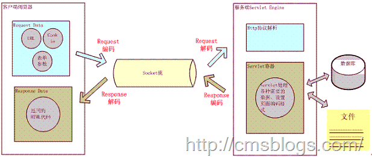
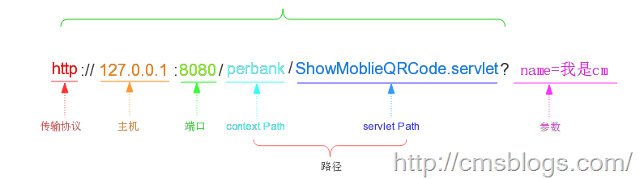
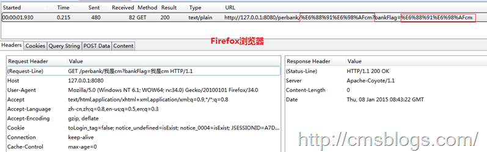
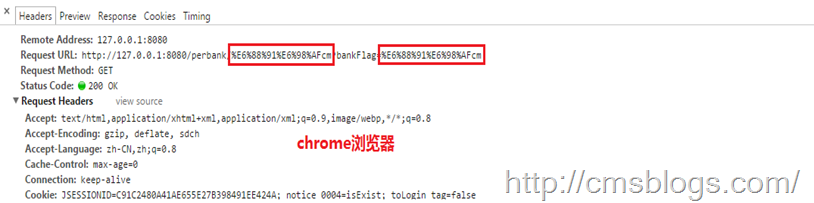
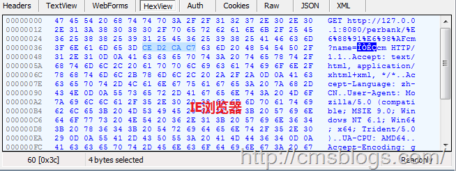

在上篇博客中LZ介绍了前面两种场景（IO、内存）中的java编码解码操作，其实在这两种场景中我们只需要在编码解码过程中设置正确的编码解码方式一般而言是不会出现乱码的。对于我们从事java开发的人而言，其实最容易也是产生乱码最多的地方就是web部分。首先我们来看在javaWeb中有哪些地方存在编码转换操作。

## 编码&解码

通过下图我们可以了解在javaWeb中有哪些地方有转码：

用户想服务器发送一个HTTP请求，需要编码的地方有url、cookie、parameter，经过编码后服务器接受HTTP请求，解析HTTP请求，然后对url、cookie、parameter进行解码。在服务器进行业务逻辑处理过程中可能需要读取数据库、本地文件或者网络中的其他文件等等，这些过程都需要进行编码解码。当处理完成后，服务器将数据进行编码后发送给客户端，浏览器经过解码后显示给用户。在这个整个过程中涉及的编码解码的地方较多，其中最容易出现乱码的位置就在于服务器与客户端进行交互的过程。

上面整个过程可以概括成这样，页面编码数据传递给服务器，服务器对获得的数据进行解码操作，经过一番业务逻辑处理后将最终结果编码处理后传递给客户端，客户端解码展示给用户。所以下面我就请求对javaweb的编码&解码进行阐述。

## 请求

客户端想服务器发送请求无非就通过四中情况：

1、URL方式直接访问。

2、页面链接。

3、表单get提交

4、表单post提交

### URL方式

对于URL，如果该URL中全部都是英文的那倒是没有什么问题，如果有中文就要涉及到编码了。如何编码？根据什么规则来编码？又如何来解码呢？下面LZ将一一解答！首先看URL的组成部分：

在这URL中浏览器将会对path和parameter进行编码操作。为了更好地解释编码过程，使用如下URL

http://127.0.0.1:8080/perbank/我是cm?name=我是cm

将以上地址输入到浏览器URL输入框中，通过查看http
报文头信息我们可以看到浏览器是如何进行编码的。下面是IE、Firefox、Chrome三个浏览器的编码情况：

可以看到各大浏览器对“我是”的编码情况如下：  
  
<table>  
<tr>  
<td>

</td>  
<td>

path部分

</td>  
<td>

Query String

</td> </tr>  
<tr>  
<td>

Firefox

</td>  
<td>

E6 88 91 E6 98 AF

</td>  
<td>

E6 88 91 E6 98 AF

</td> </tr>  
<tr>  
<td>

Chrome

</td>  
<td>

E6 88 91 E6 98 AF

</td>  
<td>

E6 88 91 E6 98 AF

</td> </tr>  
<tr>  
<td>

IE

</td>  
<td>

E6 88 91 E6 98 AF

</td>  
<td>

CE D2 CA C7

</td> </tr> </table>

查阅上篇博客的编码可知对于path部分Firefox、chrome、IE都是采用UTF-8编码格式，对于Query
String部分Firefox、chrome采用UTF-8，IE采用GBK。至于为什么会加上%，这是因为URL的编码规范规定浏览器将ASCII字符非
ASCII 字符按照某种编码格式编码成 16 进制数字然后将每个 16 进制表示的字节前加上“%”。

当然对于不同的浏览器，相同浏览器不同版本，不同的操作系统等环境都会导致编码结果不同，上表某一种情况，对于URL编码规则下任何结论都是过早的。由于各大浏览器、各个操作系统对URL的URI、QueryString编码都可能存在不同，这样对服务器的解码势必会造成很大的困扰，下面我们将已tomcat，看tomcat是如何对URL进行解码操作的。

解析请求的 URL 是在 org.apache.coyote.HTTP11.InternalInputBuffer 的 parseRequestLine
方法中，这个方法把传过来的 URL 的 byte[] 设置到 org.apache.coyote.Request 的相应的属性中。这里的 URL 仍然是
byte 格式，转成 char 是在 org.apache.catalina.connector.CoyoteAdapter 的 convertURI
方法中完成的：

    
    
    protected void convertURI(MessageBytes uri, Request request) 
                 throws Exception { 
                        ByteChunk bc = uri.getByteChunk(); 
                        int length = bc.getLength(); 
                        CharChunk cc = uri.getCharChunk(); 
                        cc.allocate(length, -1); 
                        String enc = connector.getURIEncoding();     //获取URI解码集
                        if (enc != null) { 
                            B2CConverter conv = request.getURIConverter(); 
                            try { 
                                if (conv == null) { 
                                    conv = new B2CConverter(enc); 
                                    request.setURIConverter(conv); 
                                } 
                            } catch (IOException e) {...} 
                            if (conv != null) { 
                                try { 
                                    conv.convert(bc, cc, cc.getBuffer().length - cc.getEnd()); 
                                    uri.setChars(cc.getBuffer(), cc.getStart(), cc.getLength()); 
                                    return; 
                                } catch (IOException e) {...} 
                            } 
                        } 
                        // Default encoding: fast conversion 
                        byte[] bbuf = bc.getBuffer(); 
                        char[] cbuf = cc.getBuffer(); 
                        int start = bc.getStart(); 
                        for (int i = 0; i < length; i++) { 
                            cbuf[i] = (char) (bbuf[i + start] & 0xff); 
                        } 
                        uri.setChars(cbuf, 0, length); 
        }

从上面的代码可知，对URI的解码操作是首先获取Connector的解码集，该配置在server.xml中

    
    
    <Connector URIEncoding="utf-8"  />

如果没有定义则会采用默认编码ISO-8859-1来解析。

对于Query
String部分，我们知道无论我们是通过get方式还是POST方式提交，所有的参数都是保存在Parameters，然后我们通过request.getParameter，解码工作就是在第一次调用getParameter方法时进行的。在getParameter方法内部它调用org.apache.catalina.connector.Request
的 parseParameters 方法，这个方法将会对传递的参数进行解码。下面代码只是parseParameters方法的一部分：

    
    
              //获取编码
                 String enc = getCharacterEncoding();
                //获取ContentType 中定义的 Charset
                boolean useBodyEncodingForURI = connector.getUseBodyEncodingForURI();
                if (enc != null) {    //如果设置编码不为空，则设置编码为enc
                    parameters.setEncoding(enc);
                    if (useBodyEncodingForURI) {   //如果设置了Chartset，则设置queryString的解码为ChartSet
                        parameters.setQueryStringEncoding(enc);    
                    }
                } else {     //设置默认解码方式
                    parameters.setEncoding(org.apache.coyote.Constants.DEFAULT_CHARACTER_ENCODING);
                    if (useBodyEncodingForURI) {
                        parameters.setQueryStringEncoding(org.apache.coyote.Constants.DEFAULT_CHARACTER_ENCODING);
                    }
                }

从上面代码可以看出对query
String的解码格式要么采用设置的ChartSet要么采用默认的解码格式ISO-8859-1。注意这个设置的ChartSet是在 http
Header中定义的ContentType，同时如果我们需要改指定属性生效，还需要进行如下配置：

    
    
    <Connector URIEncoding="UTF-8" useBodyEncodingForURI="true"/>

上面部分详细介绍了URL方式请求的编码解码过程。其实对于我们而言，我们更多的方式是通过表单的形式来提交。

### 表单GET

我们知道通过URL方式提交数据是很容易产生乱码问题的，所以我们更加倾向于通过表单形式。当用户点击submit提交表单时，浏览器会更加设定的编码来编码数据传递给服务器。通过GET方式提交的数据都是拼接在URL后面（可以当做query
String？？）来提交的，所以tomcat服务器在进行解码过程中URIEncoding就起到作用了。tomcat服务器会根据设置的URIEncoding来进行解码，如果没有设置则会使用默认的ISO-8859-1来解码。假如我们在页面将编码设置为UTF-8，而URIEncoding设置的不是或者没有设置，那么服务器进行解码时就会产生乱码。这个时候我们一般可以通过new
String(request.getParameter("name").getBytes("iso-8859-1"),"utf-8")
的形式来获取正确数据。

### 表单POST

对于POST方式，它采用的编码也是由页面来决定的即contentType。当我通过点击页面的submit按钮来提交表单时，浏览器首先会根据ontentType的charset编码格式来对POST表单的参数进行编码然后提交给服务器，在服务器端同样也是用contentType中设置的字符集来进行解码（这里与get方式就不同了），这就是通过POST表单提交的参数一般而言都不会出现乱码问题。当然这个字符集编码我们是可以自己设定的：request.setCharacterEncoding(charset)
。

* * *

**\-----原文出自:<http://cmsblogs.com/?p=1510>**[
****](http://cmsblogs.com/?p=1201) **,请尊重作者辛勤劳动成果,转载说明出处.**

**\-----个人站点:**[ **http://cmsblogs.com**](http://cmsblogs.com/)

