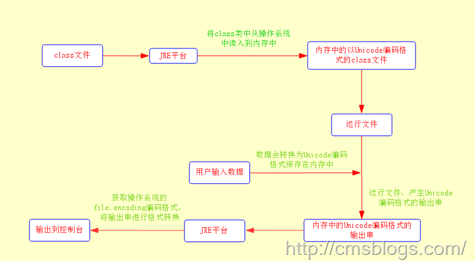
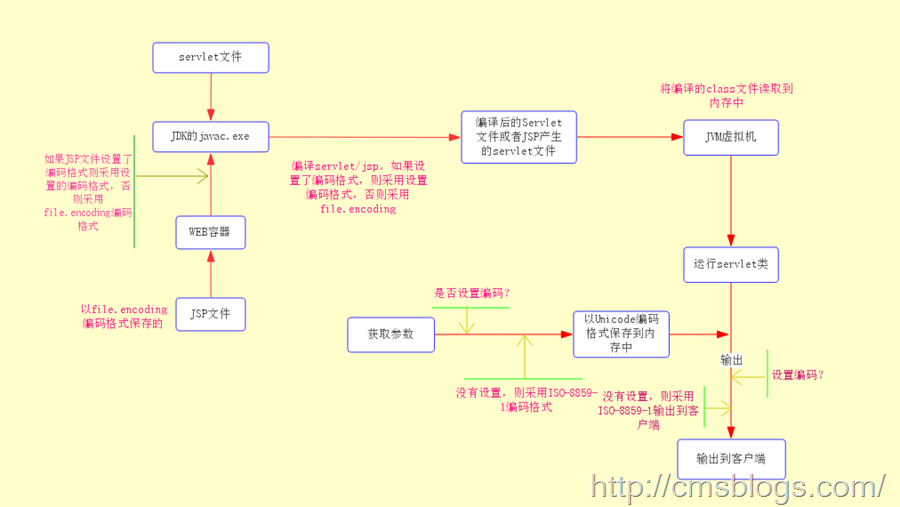
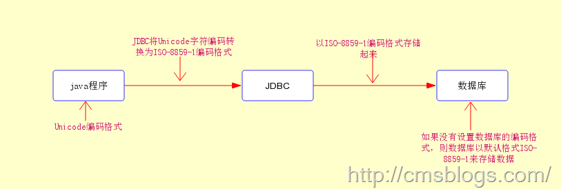

##java中文乱码解决之道（四）-----java编码转换过程

##
##前面三篇博客侧重介绍字符、编码问题，通过这三篇博客各位博友对各种字符编码有了一个初步的了解，要了解java的中文问题这是必须要了解的。但是了解这些仅仅只是一个开始，以下博客将侧重介绍java乱码是如何产生的、存在哪些乱码的情况、该如何从根本上解决乱码问题。各位随博主一起征服令人厌烦的java乱码问题吧！！！
##java编码转换过程

##
##我们总是用一个java类文件和用户进行最直接的交互（输入、输出），这些交互内容包含的文字可能会包含中文。无论这些java类是与数据库交互，还是与前端页面交互，他们的生命周期总是这样的：

##
##1、程序员在操作系统上通过编辑器编写程序代码并且以.java的格式保存操作系统中，这些文件我们称之为源文件。

##
##2、通过JDK中的javac.exe编译这些源文件形成.class类。

##
##3、直接运行这些类或者部署在WEB容器中运行，得到输出结果。

##
##这些过程是从宏观上面来观察的，了解这个肯定是不行的，我们需要真正来了解java是如何来编码和被解码的：

##
##第一步：当我们用编辑器编写java源文件，程序文件在保存时会采用操作系统默认的编码格式（一般我们中文的操作系统采用的是GBK编码格式）形成一个.java文件。java源文件是采用操作系统默认支持的file.encoding编码格式保存的。下面代码可以查看系统的file.encoding参数值。   	System.out.println(System.getProperty("file.encoding"));

##
##第二步：当我们使用javac.exe编译我们的java文件时，JDK首先会确认它的编译参数encoding来确定源代码字符集，如果我们不指定该编译参数，JDK首先会获取操作系统默认的file.encoding参数，然后JDK就会把我们编写的java源程序从file.encoding编码格式转化为JAVA内部默认的UNICODE格式放入内存中。

##
##第三步：JDK将上面编译好的且保存在内存中信息写入class文件中，形成.class文件。此时.class文件是Unicode编码的，也就是说我们常见的.class文件中的内容无论是中文字符还是英文字符，他们都已经转换为Unicode编码格式了。

##
##在这一步中对对JSP源文件的处理方式有点儿不同：WEB容器调用JSP编译器，JSP编译器首先会查看JSP文件是否设置了文件编码格式，如果没有设置则JSP编译器会调用调用JDK采用默认的编码方式将JSP文件转化为临时的servlet类，然后再编译为.class文件并保持到临时文件夹中。

##
##第四步：运行编译的类：在这里会存在一下几种情况

##
##1、直接在console上运行。

##
##2、JSP/Servlet类。

##
##3、java类与数据库之间。

##
##这三种情况每种情况的方式都会不同，1.Console上运行的类

##
##这种情况下，JVM首先会把保存在操作系统中的class文件读入到内存中，这个时候内存中class文件编码格式为Unicode，然后JVM运行它。如果需要用户输入信息，则会采用file.encoding编码格式对用户输入的信息进行编码同时转换为Unicode编码格式保存到内存中。程序运行后，将产生的结果再转化为file.encoding格式返回给操作系统并输出到界面去。整个流程如下：

##
## 

##
##在上面整个流程中，凡是涉及的编码转换都不能出现错误，否则将会产生乱码。2.Servlet类

##
##由于JSP文件最终也会转换为servlet文件（只不过存储的位置不同而已），所以这里我们也将JSP文件纳入其中。

##
##当用户请求Servlet时，WEB容器会调用它的JVM来运行Servlet。首先JVM会把servlet的class加载到内存中去，内存中的servlet代码是Unicode编码格式的。然后JVM在内存中运行该Servlet，在运行过程中如果需要接受从客户端传递过来的数据（如表单和URL传递的数据），则WEB容器会接受传入的数据，在接收过程中如果程序设定了传入参数的的编码则采用设定的编码格式，如果没有设置则采用默认的ISO-8859-1编码格式，接收的数据后JVM会将这些数据进行编码格式转换为Unicode并且存入到内存中。运行Servlet后产生输出结果，同时这些输出结果的编码格式仍然为Unicode。紧接着WEB容器会将产生的Unicode编码格式的字符串直接发送置客户端，如果程序指定了输出时的编码格式，则按照指定的编码格式输出到浏览器，否则采用默认的ISO-8859-1编码格式。整个过程流程图如下：

##
## 3.数据库部分

##
##我们知道java程序与数据库的连接都是通过JDBC驱动程序来连接的，而JDBC驱动程序默认的是ISO-8859-1编码格式的，也就是说我们通过java程序向数据库传递数据时，JDBC首先会将Unicode编码格式的数据转换为ISO-8859-1的编码格式，然后在存储在数据库中，即在数据库保存数据时，默认格式为ISO-8859-1。

##
## 

##
##-----原文出自:http://cmsblogs.com/?p=1475,请尊重作者辛勤劳动成果,转载说明出处.

##
##-----个人站点:http://cmsblogs.com