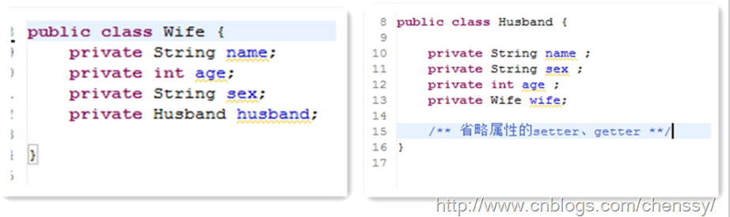

##java提高篇(二)-----理解java的三大特性之继承

##
## 在《Think in java》中有这样一句话：复用代码是Java众多引人注目的功能之一。但要想成为极具革命性的语言，仅仅能够复制代码并对加以改变是不够的，它还必须能够做更多的事情。在这句话中最引人注目的是“复用代码”,尽可能的复用代码使我们程序员一直在追求的，现在我来介绍一种复用代码的方式，也是java三大特性之一---继承。
##继承

##
## 在讲解之前我们先看一个例子，该例子是前篇博文（java提高篇-----理解java的三大特性之封装）的。

##
## 

##
## 从这里我们可以看出，Wife、Husband两个类除了各自的husband、wife外其余部分全部相同，作为一个想最大限度实现复用代码的我们是不能够忍受这样的重复代码，如果再来一个小三、小四、小五……（扯远了 ）我们是不是也要这样写呢？那么我们如何来实现这些类的可复用呢？利用继承！！

##
## 首先我们先离开软件编程的世界，从常识中我们知道丈夫、妻子、小三、小四…，他们都是人，而且都有一些共性，有名字、年龄、性别、头等等，而且他们都能够吃东西、走路、说话等等共同的行为，所以从这里我们可以发现他们都拥有人的属性和行为，同时也是从人那里继承来的这些属性和行为的。

##
## 从上面我们就可以基本了解了继承的概念了，继承是使用已存在的类的定义作为基础建立新类的技术，新类的定义可以增加新的数据或新的功能，也可以用父类的功能，但不能选择性地继承父类。通过使用继承我们能够非常方便地复用以前的代码，能够大大的提高开发的效率。 

##
## 对于Wife、Husband使用继承后，除了代码量的减少我们还能够非常明显的看到他们的关系。

##
## 继承所描述的是“is-a”的关系，如果有两个对象A和B，若可以描述为“A是B”，则可以表示A继承B，其中B是被继承者称之为父类或者超类，A是继承者称之为子类或者派生类。

##
## 实际上继承者是被继承者的特殊化，它除了拥有被继承者的特性外，还拥有自己独有得特性。例如猫有抓老鼠、爬树等其他动物没有的特性。同时在继承关系中，继承者完全可以替换被继承者，反之则不可以，例如我们可以说猫是动物，但不能说动物是猫就是这个道理，其实对于这个我们将其称之为“向上转型”，下面介绍。

##
## 诚然，继承定义了类如何相互关联，共享特性。对于若干个相同或者相识的类，我们可以抽象出他们共有的行为或者属相并将其定义成一个父类或者超类，然后用这些类继承该父类，他们不仅可以拥有父类的属性、方法还可以定义自己独有的属性或者方法。

##
## 同时在使用继承时需要记住三句话：

##
## 1、子类拥有父类非private的属性和方法。

##
## 2、子类可以拥有自己属性和方法，即子类可以对父类进行扩展。

##
##  3、子类可以用自己的方式实现父类的方法。（以后介绍）。

##
## 综上所述，使用继承确实有许多的优点，除了将所有子类的共同属性放入父类，实现代码共享，避免重复外，还可以使得修改扩展继承而来的实现比较简单。

##
## 诚然，讲到继承一定少不了这三个东西：构造器、protected关键字、向上转型。
##构造器

##
## 通过前面我们知道子类可以继承父类的属性和方法，除了那些private的外还有一样是子类继承不了的---构造器。对于构造器而言，它只能够被调用，而不能被继承。 调用父类的构造方法我们使用super()即可。

##
## 对于子类而已,其构造器的正确初始化是非常重要的,而且当且仅当只有一个方法可以保证这点：在构造器中调用父类构造器来完成初始化，而父类构造器具有执行父类初始化所需要的所有知识和能力。

	public class Person {
    protected String name;
    protected int age;
    protected String sex;
    
    Person(){
        System.out.println("Person Constrctor...");
    	}
	}

public class Husband extends Person{
    private Wife wife;

    Husband(){
        System.out.println("Husband Constructor...");
    	}
    
    public static void main(String[] args) {
        Husband husband  = new Husband();
    	}
	}

Output:
Person Constrctor...
Husband Constructor...


##
## 通过这个示例可以看出，构建过程是从父类“向外”扩散的，也就是从父类开始向子类一级一级地完成构建。而且我们并没有显示的引用父类的构造器，这就是java的聪明之处：编译器会默认给子类调用父类的构造器。

##
## 但是，这个默认调用父类的构造器是有前提的：父类有默认构造器。如果父类没有默认构造器，我们就要必须显示的使用super()来调用父类构造器，否则编译器会报错：无法找到符合父类形式的构造器。

	public class Person {
    protected String name;
    protected int age;
    protected String sex;
    
    Person(String name){
        System.out.println("Person Constrctor-----" + name);
    	}
	}

public class Husband extends Person{
    private Wife wife;

    Husband(){
        super("chenssy");
        System.out.println("Husband Constructor...");
    	}
    
    public static void main(String[] args) {
        Husband husband  = new Husband();
    	}
	}

Output:
Person Constrctor-----chenssy
Husband Constructor...


##
##  所以综上所述：对于继承而已，子类会默认调用父类的构造器，但是如果没有默认的父类构造器，子类必须要显示的指定父类的构造器，而且必须是在子类构造器中做的第一件事(第一行代码)。
##protected关键字

##
## private访问修饰符，对于封装而言，是最好的选择，但这个只是基于理想的世界，有时候我们需要这样的需求：我们需要将某些事物尽可能地对这个世界隐藏，但是仍然允许子类的成员来访问它们。这个时候就需要使用到protected。

##
## 对于protected而言，它指明就类用户而言，他是private，但是对于任何继承与此类的子类而言或者其他任何位于同一个包的类而言，他却是可以访问的。

	public class Person {
    private String name;
    private int age;
    private String sex;

    protected String getName() {
        return name;
    	}

    protected void setName(String name) {
        this.name = name;
    	}

    public String toString(){
        return "this name is " + name;
    	}
    
    /** 省略其他setter、getter方法 **/
	}

public class Husband extends Person{
    private Wife wife;

    public  String toString(){
        setName("chenssy");    //调用父类的setName();
        return  super.toString();    //调用父类的toString()方法
    	}

    public static void main(String[] args) {
        Husband husband = new Husband();
        
        System.out.println(husband.toString());
    	}
	}

Output：
this name is chenssy


##
## 从上面示例可以看书子类Husband可以明显地调用父类Person的setName()。

##
## 诚然尽管可以使用protected访问修饰符来限制父类属性和方法的访问权限，但是最好的方式还是将属性保持为private(我们应当一致保留更改底层实现)，通过protected方法来控制类的继承者的访问权限。
##向上转型

##
## 在上面的继承中我们谈到继承是is-a的相互关系，猫继承与动物，所以我们可以说猫是动物，或者说猫是动物的一种。这样将猫看做动物就是向上转型。如下：

	public class Person {
    public void display(){
        System.out.println("Play Person...");
    	}
    
    static void display(Person person){
        person.display();
    	}
	}

public class Husband extends Person{
    public static void main(String[] args) {
        Husband husband = new Husband();
        Person.display(husband);      //向上转型
    	}
	}


##
## 在这我们通过Person.display(husband)。这句话可以看出husband是person类型。

##
## 将子类转换成父类，在继承关系上面是向上移动的，所以一般称之为向上转型。由于向上转型是从一个叫专用类型向较通用类型转换，所以它总是安全的，唯一发生变化的可能就是属性和方法的丢失。这就是为什么编译器在“未曾明确表示转型”活“未曾指定特殊标记”的情况下，仍然允许向上转型的原因。
##谨慎继承

##
## 上面讲了继承所带来的诸多好处，那我们是不是就可以大肆地使用继承呢？送你一句话：慎用继承。

##
## 首先我们需要明确，继承存在如下缺陷：

##
##  1、父类变，子类就必须变。

##
## 2、继承破坏了封装，对于父类而言，它的实现细节对与子类来说都是透明的。

##
## 3、继承是一种强耦合关系。 

##
## 所以说当我们使用继承的时候，我们需要确信使用继承确实是有效可行的办法。那么到底要不要使用继承呢？《Think in java》中提供了解决办法：问一问自己是否需要从子类向父类进行向上转型。如果必须向上转型，则继承是必要的，但是如果不需要，则应当好好考虑自己是否需要继承。

##
## 慎用继承！！！！！！！！！！！！！！！！！！！！！！！！！！！