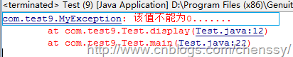

##java提高篇(十七)-----异常(二)

##
## 承接上篇博文：java提高篇-----异常(一)
##五、自定义异常

##
## Java确实给我们提供了非常多的异常，但是异常体系是不可能预见所有的希望加以报告的错误，所以Java允许我们自定义异常来表现程序中可能会遇到的特定问题，总之就是一句话：我们不必拘泥于Java中已有的异常类型。

##
## Java自定义异常的使用要经历如下四个步骤：

##
## 1、定义一个类继承Throwable或其子类。

##
## 2、添加构造方法(当然也可以不用添加，使用默认构造方法)。

##
## 3、在某个方法类抛出该异常。

##
## 4、捕捉该异常。

	/** 自定义异常 继承Exception类 **/
public class MyException extends Exception{
    public MyException(){
        
    	}
    
    public MyException(String message){
        super(message);
    	}
	}

public class Test {
    public void display(int i) throws MyException{
        if(i == 0){
            throw new MyException("该值不能为0.......");
        	}
        else{
            System.out.println( i / 2);
        	}
    	}
    
    public static void main(String[] args) {
        Test test = new Test();
        try {
            test.display(0);
            System.out.println("---------------------");
        	} catch (MyException e) {
            e.printStackTrace();
        	}
    	}
	}



##
## 运行结果：

##
## 
##六、异常链

##
## 在设计模式中有一个叫做责任链模式，该模式是将多个对象链接成一条链，客户端的请求沿着这条链传递直到被接收、处理。同样Java异常机制也提供了这样一条链：异常链。

##
## 我们知道每遇到一个异常信息，我们都需要进行try…catch,一个还好，如果出现多个异常呢？分类处理肯定会比较麻烦，那就一个Exception解决所有的异常吧。这样确实是可以，但是这样处理势必会导致后面的维护难度增加。最好的办法就是将这些异常信息封装，然后捕获我们的封装类即可。

##
## 诚然在应用程序中，我们有时候不仅仅只需要封装异常，更需要传递。怎么传递？throws!！binge，正确！！但是如果仅仅只用throws抛出异常，那么你的封装类，怎么办？？

##
## 我们有两种方式处理异常，一是throws抛出交给上级处理，二是try…catch做具体处理。但是这个与上面有什么关联呢？try…catch的catch块我们可以不需要做任何处理，仅仅只用throw这个关键字将我们封装异常信息主动抛出来。然后在通过关键字throws继续抛出该方法异常。它的上层也可以做这样的处理，以此类推就会产生一条由异常构成的异常链。

##
##  通过使用异常链，我们可以提高代码的可理解性、系统的可维护性和友好性。

##
## 同理，我们有时候在捕获一个异常后抛出另一个异常信息，并且希望将原始的异常信息也保持起来，这个时候也需要使用异常链。

##
## 在异常链的使用中，throw抛出的是一个新的异常信息，这样势必会导致原有的异常信息丢失，如何保持？在Throwable及其子类中的构造器中都可以接受一个cause参数，该参数保存了原有的异常信息，通过getCause()就可以获取该原始异常信息。

##
## 语法：

	public void test() throws XxxException{
        try {
            //do something:可能抛出异常信息的代码块
        	} catch (Exception e) {
            throw new XxxException(e);
        	}
    	}


##
## 示例：

	public class Test {
    public void f() throws MyException{
         try {
            FileReader reader = new FileReader("G:\\myfile\\struts.txt");  
             Scanner in = new Scanner(reader);  
             System.out.println(in.next());
        	} catch (FileNotFoundException e) {
            //e 保存异常信息
            throw new MyException("文件没有找到--01",e);
        	}  
    	}
    
    public void g() throws MyException{
        try {
            f();
        	} catch (MyException e) {
            //e 保存异常信息
            throw new MyException("文件没有找到--02",e);
        	}
    	}
    
    public static void main(String[] args) {
        Test t = new Test();
        try {
            t.g();
        	} catch (MyException e) {
            e.printStackTrace();
        	}
    	}
	}


##
## 运行结果:

	com.test9.MyException: 文件没有找到--02
    at com.test9.Test.g(Test.java:31)
    at com.test9.Test.main(Test.java:38)
Caused by: com.test9.MyException: 文件没有找到--01
    at com.test9.Test.f(Test.java:22)
    at com.test9.Test.g(Test.java:28)
    ... 1 more
Caused by: java.io.FileNotFoundException: G:\myfile\struts.txt (系统找不到指定的路径。)
    at java.io.FileInputStream.open(Native Method)
    at java.io.FileInputStream.<init>(FileInputStream.java:106)
    at java.io.FileInputStream.<init>(FileInputStream.java:66)
    at java.io.FileReader.<init>(FileReader.java:41)
    at com.test9.Test.f(Test.java:17)
    ... 2 more


##
## 如果在程序中,去掉e，也就是：throw new MyException("文件没有找到--02");

##
## 那么异常信息就保存不了，运行结果如下：

	com.test9.MyException: 文件没有找到--02
    at com.test9.Test.g(Test.java:31)
    at com.test9.Test.main(Test.java:38)


##
## PS:其实对于异常链鄙人使用的也不是很多，理解的不是很清楚，望各位指正！！！！
##七、异常的使用误区

##
## 首先我们先看如下示例：该实例能够反映java异常的不正确使用（其实这也是我刚刚学Java时写的代码）！！

	OutputStreamWriter out = null;
        java.sql.Connection conn = null;
        try {            //   ---------1
            Statement stat = conn.createStatement();
            ResultSet rs = stat.executeQuery("select *from user");
            while (rs.next()){
                out.println("name:" + rs.getString("name") + "sex:"
                        + rs.getString("sex"));
            	}
            conn.close();         //------2
            out.close();
        	} 
        catch (Exception ex){    //------3
            ex.printStackTrace();    //------4
        	}


##
##  1、-----------1

##
## 对于这个try…catch块，我想他的真正目的是捕获SQL的异常，但是这个try块是不是包含了太多的信息了。这是我们为了偷懒而养成的代码坏习惯。有些人喜欢将一大块的代码全部包含在一个try块里面，因为这样省事，反正有异常它就会抛出，而不愿意花时间来分析这个大代码块有那几块会产生异常，产生什么类型的异常，反正就是一篓子全部搞定。这就想我们出去旅游将所有的东西全部装进一个箱子里面，而不是分类来装，虽不知装进去容易，找出来难啊！！！所有对于一个异常块，我们应该仔细分清楚每块的抛出异常，因为一个大代码块有太多的地方会出现异常了。

##
## 结论一：尽可能的减小try块！！！

##
##  2、--------2

##
## 在这里你发现了什么？异常改变了运行流程！！不错就是异常改变了程序运行流程。如果该程序发生了异常那么conn.close(); out.close();是不可能执行得到的，这样势必会导致资源不能释放掉。所以如果程序用到了文件、Socket、JDBC连接之类的资源，即使遇到了异常，我们也要确保能够正确释放占用的资源。这里finally就有用武之地了：不管是否出现了异常，finally总是有机会运行的，所以finally用于释放资源是再适合不过了。

##
## 结论二：保证所有资源都被正确释放。充分运用finally关键词。

##
## 3、----------3

##
## 对于这个代码我想大部分人都是这样处理的，（LZ也是 ）。使用这样代码的人都有这样一个心理，一个catch解决所有异常，这样是可以，但是不推荐！为什么！首先我们需要明白catch块所表示是它预期会出现何种异常，并且需要做何种处理，而使用Exception就表示他要处理所有的异常信息，但是这样做有什么意义呢？

##
## 这里我们再来看看上面的程序实例，很显然它可能需要抛出两个异常信息，SQLException和IOException。所以一个catch处理两个截然不同的Exception明显的不合适。如果用两个catch，一个处理SQLException、一个处理IOException就好多了。所以：

##
## 结论三：catch语句应当尽量指定具体的异常类型，而不应该指定涵盖范围太广的Exception类。 不要一个Exception试图处理所有可能出现的异常。

##
## 4、----------4

##
## 这个就问题多多了，我敢保证几乎所有的人都这么使用过。这里涉及到了两个问题，一是，捕获了异常不做处理，二是异常信息不够明确。

##
## 4.1、捕获异常不做处理，就是我们所谓的丢弃异常。我们都知道异常意味着程序出现了不可预期的问题，程序它希望我们能够做出处理来拯救它，但是你呢？一句ex.printStackTrace()搞定，这是多么的不负责任对程序的异常情况不理不顾。虽然这样在调试可能会有一定的帮助，但是调试阶段结束后呢？不是一句ex.printStackTrace()就可以搞定所有的事情的！

##
## 那么怎么改进呢？有四种选择：

##
## 1、处理异常。对所发生的的异常进行一番处理，如修正错误、提醒。再次申明ex.printStackTrace()算不上已经“处理好了异常”.

##
## 2、重新抛出异常。既然你认为你没有能力处理该异常，那么你就尽情向上抛吧！！！

##
## 3、封装异常。这是LZ认为最好的处理方法，对异常信息进行分类，然后进行封装处理。

##
## 4、不要捕获异常。

##
## 4.2、异常信息不明确。我想对于这样的：java.io.FileNotFoundException: ………信息除了我们IT人没有几个人看得懂和想看吧！所以在出现异常后，我们最好能够提供一些文字信息，例如当前正在执行的类、方法和其他状态信息，包括以一种更适合阅读的方式整理和组织printStackTrace提供的信息。起码我公司是需要将异常信息所在的类、方法、何种异常都需要记录在日志文件中的。

##
## 所以：

##
## 结论四：既然捕获了异常，就要对它进行适当的处理。不要捕获异常之后又把它丢弃，不予理睬。 不要做一个不负责的人。

##
## 结论五：在异常处理模块中提供适量的错误原因信息，组织错误信息使其易于理解和阅读。

##
## 对于异常还有以下几个注意地方：

##
## 六、不要在finally块中处理返回值。

##
## 七、不要在构造函数中抛出异常。

##
##

##
##
##八、try…catch、throw、throws

##
## 在这里主要是区分throw和throws。

##
## throws是方法抛出异常。在方法声明中，如果添加了throws子句，表示该方法即将抛出异常，异常的处理交由它的调用者，至于调用者任何处理则不是它的责任范围内的了。所以如果一个方法会有异常发生时，但是又不想处理或者没有能力处理，就使用throws吧！

##
## 而throw是语句抛出异常。它不可以单独使用，要么与try…catch配套使用，要么与throws配套使用。

	//使用throws抛出异常
    public void f() throws MyException{
         try {
            FileReader reader = new FileReader("G:\\myfile\\struts.txt");  
             Scanner in = new Scanner(reader);  
             System.out.println(in.next());
        	} catch (FileNotFoundException e) {
            throw new MyException("文件没有找到", e);    //throw
        	}  
        
    	}


##
##

##
##

##
##
##九、总结

##
## 其实对于异常使用的优缺点现在确实存在很多的讨论。例如：http://www.cnblogs.com/mailingfeng/archive/2012/11/14/2769974.html。这篇博文对于是否需要使用异常进行了比较深刻的讨论。LZ实乃菜鸟一枚，不能理解异常深奥之处。但是有一点LZ可以肯定，那就是异常必定会影响系统的性能。

##
## 异常使用指南（摘自：Think in java）

##
## 应该在下列情况下使用异常。

##
## 1、在恰当的级别处理问题（在知道该如何处理异常的情况下才捕获异常）。

##
## 2、解决问题并且重新调用产生异常的方法。

##
## 3、进行少许修补，然后绕过异常发生的地方继续执行。

##
## 4、用别的数据进行计算，以代替方法预计会返回的值。

##
## 5、把当前运行环境下能做的事情尽量做完。然后把相同（不同）的异常重新抛到更高层。

##
## 6、终止程序。

##
## 7、进行简化。

##
## 8、让类库和程序更加安全。（这既是在为调试做短期投资，也是在为程序的健壮做长期投资）

##
##

##
##更多阅读：java提高篇-----异常(一)。