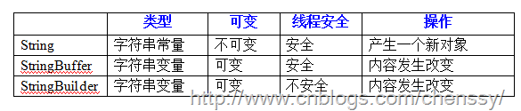

##java提高篇(十四)-----字符串

##
## 可以证明，字符串操作是计算机程序设计中最常见的行为。

##一、String

##
## 首先我们要明确，String并不是基本数据类型，而是一个对象，并且是不可变的对象。查看源码就会发现String类为final型的（当然也不可被继承），而且通过查看JDK文档会发现几乎每一个修改String对象的操作，实际上都是创建了一个全新的String对象。

##
## 字符串为对象，那么在初始化之前，它的值为null，到这里就有必要提下””、null、new String()三者的区别。null 表示string还没有new ，也就是说对象的引用还没有创建，也没有分配内存空间给他，而””、new String()则说明了已经new了，只不过内部为空，但是它创建了对象的引用，是需要分配内存空间的。打个比方：一个空玻璃杯，你不能说它里面什么都没有，因为里面有空气，当然也可以把它弄成真空，null与" "、new String()的区别就象真空与空气一样。

##
## 在字符串中存在一个非常特殊的地方，那就是字符串池。每当我们创建一个字符串对象时，首先就会检查字符串池中是否存在面值相等的字符串，如果有，则不再创建，直接放回字符串池中对该对象的引用，若没有则创建然后放入到字符串池中并且返回新建对象的引用。这个机制是非常有用的，因为可以提高效率，减少了内存空间的占用。所以在使用字符串的过程中，推荐使用直接赋值（即String s=”aa”），除非有必要才会新建一个String对象（即String s = new String(”aa”)）。

##
## 对于字符串的使用无非就是这几个方面：

##
## 1、字符串比较

##
## equals() ------判断内容是否相同。

##
## compareTo() ------判断字符串的大小关系。

##
## compareToIgnoreCase(String int) ------在比较时忽略字母大小写。

##
## == ------判断内容与地址是否相同。

##
## equalsIgnoreCase() ------忽略大小写的情况下判断内容是否相同。

##
## reagionMatches() ------对字符串中的部分内容是否相同进行比较（详情请参考API）。

##
## 2、字符串查找

##
## charAt(int index) ------返回指定索引index位置上的字符，索引范围从0开始。

##
## indexOf(String str)------从字符串开始检索str，并返回第一次出现的位置，未出现返回-1。

##
## indexOf(String str，int fromIndex);------从字符串的第fromIndex个字符开始检索str。

##
## lastIndexOf(String str)------查找最后一次出现的位置。

##
## lastIndexOf(String str，int fromIndex)----从字符串的第fromIndex个字符查找最后一次出现的位置。

##
## starWith(String prefix，int toffset)-----测试此字符串从指定索引开始的子字符串是否以指定前缀开始。

##
## starWith(String prefix)------测试此字符串是否以指定的前缀开始。

##
## endsWith(String suffix)------测试此字符串是否以指定的后缀结束。 

##
## 3、字符串截取

##
## public String subString(int beginIndex)------返回一个新的字符串，它是此字符串的一个子字符串。

##
## public String subString(int beginIndex，int endIndex)------返回的字符串是从beginIndex开始到endIndex-1的串。

##
## 4、字符串替换

##
## public String replace(char oldChar，char newChar)。

##
## public String replace(CharSequence target，CharSequence replacement)------把原来的etarget子序列替换为replacement序列，返回新串。

##
## public String replaceAll(String regex，String replacement)------用正则表达式实现对字符串的匹配。注意replaceAll第一个参数为正则表达式，鄙人曾经深受其害。

##
## 5、更多方法请参考API
##二、StringBuffer

##
## StringBuffer和String一样都是用来存储字符串的，只不过由于他们内部的实现方式不同，导致他们所使用的范围不同，对于StringBuffer而言，他在处理字符串时，若是对其进行修改操作，它并不会产生一个新的字符串对象，所以说在内存使用方面它是优于String的。

##
## 其实在使用方法，StringBuffer的许多方法和String类都差不多，所表示的功能几乎一模一样，只不过在修改时StringBuffer都是修改自身，而String类则是产生一个新的对象，这是他们之间最大的区别。

##
## 同时StringBuffer是不能使用=进行初始化的，它必须要产生StringBuffer实例，也就是说你必须通过它的构造方法进行初始化。

##
## 在StringBuffer的使用方面，它更加侧重于对字符串的变化，例如追加、修改、删除，相对应的方法：

##
## 1、append()：追加指定内容到当前StringBuffer对象的末尾，类似于字符串的连接，这里StringBuffer对象的内容会发生改变。

##
## 2、insert：该类方法主要是在StringBuffer对象中插入内容。

##
## 3、delete：该类方法主要用于移除StringBuffer对象中的内容。

##
##

##
##
##三、StringBuilder

##
## StringBuilder也是一个可变的字符串对象，他与StringBuffer不同之处就在于它是线程不安全的，基于这点，它的速度一般都比StringBuffer快。与StringBuffer一样，StringBuider的主要操作也是append与insert方法。这两个方法都能有效地将给定的数据转换成字符串，然后将该字符串的字符添加或插入到字符串生成器中。

##
## 上面只是简单的介绍了String、StringBuffer、StringBuilder，其实对于这三者我们应该更加侧重于他们只见到的区别，只有理清楚他们之间的区别才能够更好的使用他们。
##四、正确使用String、StringBuffer、StringBuilder

##
## 我们先看如下表格：

##
## 

##
## 这里对于String是否为线程安全，鄙人也不是很清楚，原因：String不可变，所有的操作都是不可能改变其值的，是否存在线程安全一说还真不好说？但是如果硬要说线程是否安全的话，因为内容不可变，永远都是安全的。

##
## 在使用方面由于String每次修改都需要产生一个新的对象，所以对于经常需要改变内容的字符串最好选择StringBuffer或者StringBuilder.而对于StringBuffer，每次操作都是对StringBuffer对象本身，它不会生成新的对象，所以StringBuffer特别适用于字符串内容经常改变的情况下。

##
## 但是并不是所有的String字符串操作都会比StringBuffer慢，在某些特殊的情况下，String字符串的拼接会被JVM解析成StringBuilder对象拼接，在这种情况下String的速度比StringBuffer的速度快。如：

##
## String name = ”I ” + ”am ” + ”chenssy ” ;

##
## StringBuffer name = new StringBuffer(”I ”).append(” am ”).append(” chenssy ”);

##
## 对于这两种方式，你会发现第一种比第二种快太多了，在这里StringBuffer的优势荡然无存。其真实的原因就在于JVM做了一下优化处理，其实String name = ”I ” + ”am ” + ”chenssy ” ;在JVM眼中就是String name = ”I am chenssy ” ;这样的方式对于JVM而言，真的是不要什么时间。但是如果我们在这个其中增加一个String对象，那么JVM就会按照原来那种规范来构建String对象了。

##
## 对于这三者使用的场景做如下概括（参考：《编写搞质量代码：改善java程序的151个建议》）：

##
## 1、String：在字符串不经常变化的场景中可以使用String类，如：常量的声明、少量的变量运算等。

##
## 2、StringBuffer：在频繁进行字符串的运算（拼接、替换、删除等），并且运行在多线程的环境中，则可以考虑使用StringBuffer，例如XML解析、HTTP参数解析和封装等。

##
## 3、StringBuilder：在频繁进行字符串的运算（拼接、替换、删除等），并且运行在多线程的环境中，则可以考虑使用StringBuffer，如SQL语句的拼装、JSON封装等（貌似这两个我也是使用|StringBuffer）。

##
## 更多有关于他们之间区别，请参考：http://www.cnblogs.com/zuoxiaolong/p/lang1.html。鄙人就不画蛇添足了。

##
##
##五、字符串拼接方式

##
## 对于字符串而言我们经常是要对其进行拼装处理的，在java中提高了三种拼装的方法：+、concat()以及append()方法。这三者之间存在什么区别呢？先看如下示例：

	public class StringTest {
    
    /**
     * @desc 使用+、concat()、append()方法循环10W次
     * @author chenssy
     * @data 2013-11-16
     * @param args
     * @return void
     */
    public static void main(String[] args) {
        //+
        long start_01 = System.currentTimeMillis();
        String a = "a";
        for(int i = 0 ; i < 100000 ; i++){
            a += "b";
        	}
        long end_01 = System.currentTimeMillis();
        System.out.println("  +   所消耗的时间：" + (end_01 - start_01) + "毫米");
        
        //concat()
        long start_02 = System.currentTimeMillis();
        String c = "c";
        for(int i = 0 ; i < 100000 ; i++){
            c = c.concat("d");
        	}
        long end_02 = System.currentTimeMillis();
        System.out.println("concat所消耗的时间：" + (end_02 - start_02) + "毫米");
        
        //append
        long start_03 = System.currentTimeMillis();
        StringBuffer e = new StringBuffer("e");
        for(int i = 0 ; i < 100000 ; i++){
            e.append("d");
        	}
        long end_03 = System.currentTimeMillis();
        System.out.println("append所消耗的时间：" + (end_03 - start_03) + "毫米");
    	}
	}

------------
Output:
  +   所消耗的时间：19080毫米
concat所消耗的时间：9089毫米
append所消耗的时间：10毫米


##
## 从上面的运行结果可以看出，append()速度最快，concat()次之，+最慢。原因请看下面分解:

##
##  (一)+方式拼接字符串

##
## 在前面我们知道编译器对+进行了优化，它是使用StringBuilder的append()方法来进行处理的，我们知道StringBuilder的速度比StringBuffer的速度更加快，但是为何运行速度还是那样呢？主要是因为编译器使用append()方法追加后要同toString()转换成String字符串，也就说 str +=”b”等同于

##
## str = new StringBuilder(str).append("b").toString();

##
## 它变慢的关键原因就在于new StringBuilder()和toString()，这里可是创建了10W个StringBuilder对象，而且每次还需要将其转换成String，速度能不慢么？

##
## （二）concat()方法拼接字符串

	public String concat(String str) {
    int otherLen = str.length();
    if (otherLen == 0) {
        return this;
    	}
    char buf[] = new char[count + otherLen];
    getChars(0, count, buf, 0);
    str.getChars(0, otherLen, buf, count);
    return new String(0, count + otherLen, buf);
    	}


##
## 这是concat()的源码，它看上去就是一个数字拷贝形式，我们知道数组的处理速度是非常快的，但是由于该方法最后是这样的：return new String(0, count + otherLen, buf);这同样也创建了10W个字符串对象，这是它变慢的根本原因。

##
##  （三）append()方法拼接字符串

	public synchronized StringBuffer append(String str) {
    super.append(str);
        return this;
    	}


##
## StringBuffer的append()方法是直接使用父类AbstractStringBuilder的append()方法，该方法的源码如下：

	public AbstractStringBuilder append(String str) {
    if (str == null) str = "null";
        int len = str.length();
    if (len == 0) return this;
    int newCount = count + len;
    if (newCount > value.length)
        expandCapacity(newCount);
    str.getChars(0, len, value, count);
    count = newCount;
    return this;
    	}


##
## 与concat()方法相似，它也是进行字符数组处理的，加长，然后拷贝，但是请注意它最后是返回并没有返回一个新串，而是返回本身，也就说这这个10W次的循环过程中，它并没有产生新的字符串对象。

##
## 通过上面的分析，我们需要在合适的场所选择合适的字符串拼接方式，但是并不一定就要选择append()和concat()方法，原因在于+根据符合我们的编程习惯，只有到了使用append()和concat()方法确实是可以对我们系统的效率起到比较大的帮助，才会考虑，同时鄙人也真的没有怎么用过concat()方法。

##
##


##
##巩固基础，提高技术，不惧困难，攀登高峰！！！！！！
