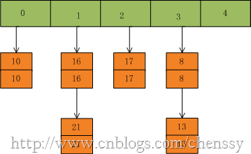
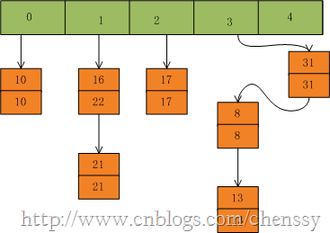

在java中与有两个类都提供了一个多种用途的hashTable机制，他们都可以将可以key和value结合起来构成键值对通过put(key,value)方法保存起来，然后通过get(key)方法获取相对应的value值。一个是前面提到的HashMap，还有一个就是马上要讲解的HashTable。对于HashTable而言，它在很大程度上和HashMap的实现差不多，如果我们对HashMap比较了解的话，对HashTable的认知会提高很大的帮助。他们两者之间只存在几点的不同，这个后面会阐述。

## 一、定义

HashTable在Java中的定义如下：

    
    
    public class Hashtable<K,V>
        extends Dictionary<K,V>
        implements Map<K,V>, Cloneable, java.io.Serializable

从中可以看出HashTable继承Dictionary类，实现Map接口。其中Dictionary类是任何可将键映射到相应值的类（如
`Hashtable`）的抽象父类。每个键和每个值都是一个对象。在任何一个 `Dictionary` 对象中，每个键至多与一个值相关联。Map是"key-
value键值对"接口。

HashTable采用"拉链法"实现哈希表，它定义了几个重要的参数：table、count、threshold、loadFactor、modCount。

table：为一个Entry[]数组类型，Entry代表了“拉链”的节点，每一个Entry代表了一个键值对，哈希表的"key-
value键值对"都是存储在Entry数组中的。

count：HashTable的大小，注意这个大小并不是HashTable的容器大小，而是他所包含Entry键值对的数量。

threshold：Hashtable的阈值，用于判断是否需要调整Hashtable的容量。threshold的值="容量*加载因子"。

loadFactor：加载因子。

modCount：用来实现“fail-
fast”机制的（也就是快速失败）。所谓快速失败就是在并发集合中，其进行迭代操作时，若有其他线程对其进行结构性的修改，这时迭代器会立马感知到，并且立即抛出ConcurrentModificationException异常，而不是等到迭代完成之后才告诉你（你已经出错了）。

## 二、构造方法

在HashTabel中存在5个构造函数。通过这5个构造函数我们构建出一个我想要的HashTable。

    
    
    public Hashtable() {
            this(11, 0.75f);
        }

默认构造函数，容量为11，加载因子为0.75。

    
    
    public Hashtable(int initialCapacity) {
            this(initialCapacity, 0.75f);
        }

用指定初始容量和默认的加载因子 (0.75) 构造一个新的空哈希表。

    
    
    public Hashtable(int initialCapacity, float loadFactor) {
            //验证初始容量
            if (initialCapacity < 0)
                throw new IllegalArgumentException("Illegal Capacity: "+
                                                   initialCapacity);
            //验证加载因子
            if (loadFactor <= 0 || Float.isNaN(loadFactor))
                throw new IllegalArgumentException("Illegal Load: "+loadFactor);
    
            if (initialCapacity==0)
                initialCapacity = 1;
            
            this.loadFactor = loadFactor;
            
            //初始化table，获得大小为initialCapacity的table数组
            table = new Entry[initialCapacity];
            //计算阀值
            threshold = (int)Math.min(initialCapacity * loadFactor, MAX_ARRAY_SIZE + 1);
            //初始化HashSeed值
            initHashSeedAsNeeded(initialCapacity);
        }

用指定初始容量和指定加载因子构造一个新的空哈希表。其中initHashSeedAsNeeded方法用于初始化hashSeed参数，其中hashSeed用于计算key的hash值，它与key的hashCode进行按位异或运算。这个hashSeed是一个与实例相关的随机值，主要用于解决hash冲突。

    
    
    private int hash(Object k) {
            return hashSeed ^ k.hashCode();
        }

构造一个与给定的 Map 具有相同映射关系的新哈希表。

    
    
    public Hashtable(Map<? extends K, ? extends V> t) {
            //设置table容器大小，其值==t.size * 2 + 1
            this(Math.max(2*t.size(), 11), 0.75f);
            putAll(t);
        }

## 三、主要方法

HashTable的API对外提供了许多方法，这些方法能够很好帮助我们操作HashTable，但是这里我只介绍两个最根本的方法：put、get。

首先我们先看put方法：将指定 `key` 映射到此哈希表中的指定 `value`。注意这里键key和值value都不可为空。

    
    
    public synchronized V put(K key, V value) {
            // 确保value不为null
            if (value == null) {
                throw new NullPointerException();
            }
    
            /*
             * 确保key在table[]是不重复的
             * 处理过程：
             * 1、计算key的hash值，确认在table[]中的索引位置
             * 2、迭代index索引位置，如果该位置处的链表中存在一个一样的key，则替换其value，返回旧值
             */
            Entry tab[] = table;
            int hash = hash(key);    //计算key的hash值
            int index = (hash & 0x7FFFFFFF) % tab.length;     //确认该key的索引位置
            //迭代，寻找该key，替换
            for (Entry<K,V> e = tab[index] ; e != null ; e = e.next) {
                if ((e.hash == hash) && e.key.equals(key)) {
                    V old = e.value;
                    e.value = value;
                    return old;
                }
            }
    
            modCount++;
            if (count >= threshold) {  //如果容器中的元素数量已经达到阀值，则进行扩容操作
                rehash();
                tab = table;
                hash = hash(key);
                index = (hash & 0x7FFFFFFF) % tab.length;
            }
    
            // 在索引位置处插入一个新的节点
            Entry<K,V> e = tab[index];
            tab[index] = new Entry<>(hash, key, value, e);
            //容器中元素+1
            count++;
            return null;
        }

put方法的整个处理流程是：计算key的hash值，根据hash值获得key在table数组中的索引位置，然后迭代该key处的Entry链表（我们暂且理解为链表），若该链表中存在一个这个的key对象，那么就直接替换其value值即可，否则在将改key-
value节点插入该index索引位置处。如下：

首先我们假设一个容量为5的table，存在8、10、13、16、17、21。他们在table中位置如下：

然后我们插入一个数：put(16,22)，key=16在table的索引位置为1，同时在1索引位置有两个数，程序对该“链表”进行迭代，发现存在一个key=16,这时要做的工作就是用newValue=22替换oldValue16，并将oldValue=16返回。

在put(33,33)，key=33所在的索引位置为3，并且在该链表中也没有存在某个key=33的节点，所以就将该节点插入该链表的第一个位置。

在HashTabled的put方法中有两个地方需要注意：

**1、**
HashTable的扩容操作，在put方法中，如果需要向table[]中添加Entry元素，会首先进行容量校验，如果容量已经达到了阀值，HashTable就会进行扩容处理rehash()，如下:

    
    
    protected void rehash() {
            int oldCapacity = table.length;
            //元素
            Entry<K,V>[] oldMap = table;
    
            //新容量=旧容量 * 2 + 1
            int newCapacity = (oldCapacity << 1) + 1;
            if (newCapacity - MAX_ARRAY_SIZE > 0) {
                if (oldCapacity == MAX_ARRAY_SIZE)
                    return;
                newCapacity = MAX_ARRAY_SIZE;
            }
            
            //新建一个size = newCapacity 的HashTable
            Entry<K,V>[] newMap = new Entry[];
    
            modCount++;
            //重新计算阀值
            threshold = (int)Math.min(newCapacity * loadFactor, MAX_ARRAY_SIZE + 1);
            //重新计算hashSeed
            boolean rehash = initHashSeedAsNeeded(newCapacity);
    
            table = newMap;
            //将原来的元素拷贝到新的HashTable中
            for (int i = oldCapacity ; i-- > 0 ;) {
                for (Entry<K,V> old = oldMap[i] ; old != null ; ) {
                    Entry<K,V> e = old;
                    old = old.next;
    
                    if (rehash) {
                        e.hash = hash(e.key);
                    }
                    int index = (e.hash & 0x7FFFFFFF) % newCapacity;
                    e.next = newMap[index];
                    newMap[index] = e;
                }
            }
        }

在这个rehash()方法中我们可以看到容量扩大两倍+1，同时需要将原来HashTable中的元素一一复制到新的HashTable中，这个过程是比较消耗时间的，同时还需要重新计算hashSeed的，毕竟容量已经变了。这里对阀值啰嗦一下：比如初始值11、加载因子默认0.75，那么这个时候阀值threshold=8，当容器中的元素达到8时，HashTable进行一次扩容操作，容量
= 8 * 2 + 1 =17，而阀值threshold=17*0.75 =
13，当容器元素再一次达到阀值时，HashTable还会进行扩容操作，一次类推。

**2、** _其实这里是我的一个疑问，在计算索引位置index时，HashTable进行了一个与运算过程（hash &
0x7FFFFFFF），为什么需要做一步操作，这么做有什么好处？_如果哪位知道，望指导，LZ不胜感激！！下面是计算key的hash值，这里hashSeed发挥了作用。

    
    
    private int hash(Object k) {
            return hashSeed ^ k.hashCode();
        }

相对于put方法，get方法就会比较简单，处理过程就是计算key的hash值，判断在table数组中的索引位置，然后迭代链表，匹配直到找到相对应key的value,若没有找到返回null。

    
    
    public synchronized V get(Object key) {
            Entry tab[] = table;
            int hash = hash(key);
            int index = (hash & 0x7FFFFFFF) % tab.length;
            for (Entry<K,V> e = tab[index] ; e != null ; e = e.next) {
                if ((e.hash == hash) && e.key.equals(key)) {
                    return e.value;
                }
            }
            return null;
        }

## 四、HashTable与HashMap的区别

HashTable和HashMap存在很多的相同点，但是他们还是有几个比较重要的不同点。

**第一：**
我们从他们的定义就可以看出他们的不同，HashTable基于Dictionary类，而HashMap是基于AbstractMap。Dictionary是什么？它是任何可将键映射到相应值的类的抽象父类，而AbstractMap是基于Map接口的骨干实现，它以最大限度地减少实现此接口所需的工作。

**第二：**
HashMap可以允许存在一个为null的key和任意个为null的value，但是HashTable中的key和value都不允许为null。如下：

当HashMap遇到为null的key时，它会调用putForNullKey方法来进行处理。对于value没有进行任何处理，只要是对象都可以。

    
    
    if (key == null)
                return putForNullKey(value);

而当HashTable遇到null时，他会直接抛出NullPointerException异常信息。

    
    
    if (value == null) {
                throw new NullPointerException();
            }

**第三：**
Hashtable的方法是同步的，而HashMap的方法不是。所以有人一般都建议如果是涉及到多线程同步时采用HashTable，没有涉及就采用HashMap，但是在Collections类中存在一个静态方法：synchronizedMap()，该方法创建了一个线程安全的Map对象，并把它作为一个封装的对象来返回，所以通过Collections类的synchronizedMap方法是可以我们你同步访问潜在的HashMap。这样君该如何选择呢？？？

