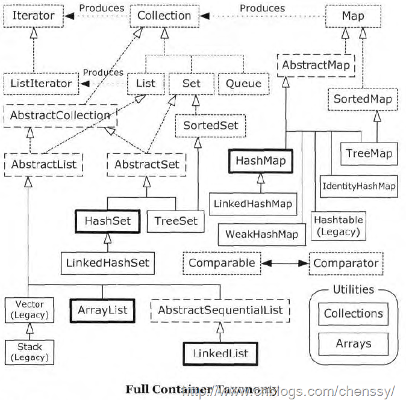

##java提高篇（二十）-----集合大家族

##
## 在编写java程序中，我们最常用的除了八种基本数据类型，String对象外还有一个集合类，在我们的的程序中到处充斥着集合类的身影！java中集合大家族的成员实在是太丰富了，有常用的ArrayList、HashMap、HashSet，也有不常用的Stack、Queue，有线程安全的Vector、HashTable，也有线程不安全的LinkedList、TreeMap等等！  

##
##   

##
## 上面的图展示了整个集合大家族的成员以及他们之间的关系。下面就上面的各个接口、基类做一些简单的介绍(主要介绍各个集合的特点。区别)，更加详细的介绍会在不久的将来一一讲解。  
##一、Collection接口   

##
## Collection接口是最基本的集合接口，它不提供直接的实现，Java SDK提供的类都是继承自Collection的“子接口”如List和Set。Collection所代表的是一种规则，它所包含的元素都必须遵循一条或者多条规则。如有些允许重复而有些则不能重复、有些必须要按照顺序插入而有些则是散列，有些支持排序但是有些则不支持。  

##
## 在Java中所有实现了Collection接口的类都必须提供两套标准的构造函数，一个是无参，用于创建一个空的Collection，一个是带有Collection参数的有参构造函数，用于创建一个新的Collection，这个新的Collection与传入进来的Collection具备相同的元素。  
##二、List接口  

##
## List接口为Collection直接接口。List所代表的是有序的Collection，即它用某种特定的插入顺序来维护元素顺序。用户可以对列表中每个元素的插入位置进行精确地控制，同时可以根据元素的整数索引（在列表中的位置）访问元素，并搜索列表中的元素。实现List接口的集合主要有：ArrayList、LinkedList、Vector、Stack。  2.1、ArrayList  

##
## ArrayList是一个动态数组，也是我们最常用的集合。它允许任何符合规则的元素插入甚至包括null。每一个ArrayList都有一个初始容量（10），该容量代表了数组的大小。随着容器中的元素不断增加，容器的大小也会随着增加。在每次向容器中增加元素的同时都会进行容量检查，当快溢出时，就会进行扩容操作。所以如果我们明确所插入元素的多少，最好指定一个初始容量值，避免过多的进行扩容操作而浪费时间、效率。  

##
## size、isEmpty、get、set、iterator 和 listIterator 操作都以固定时间运行。add 操作以分摊的固定时间运行，也就是说，添加 n 个元素需要 O(n) 时间（由于要考虑到扩容，所以这不只是添加元素会带来分摊固定时间开销那样简单）。  

##
## ArrayList擅长于随机访问。同时ArrayList是非同步的。  2.2、LinkedList  

##
## 同样实现List接口的LinkedList与ArrayList不同，ArrayList是一个动态数组，而LinkedList是一个双向链表。所以它除了有ArrayList的基本操作方法外还额外提供了get，remove，insert方法在LinkedList的首部或尾部。  

##
## 由于实现的方式不同，LinkedList不能随机访问，它所有的操作都是要按照双重链表的需要执行。在列表中索引的操作将从开头或结尾遍历列表（从靠近指定索引的一端）。这样做的好处就是可以通过较低的代价在List中进行插入和删除操作。  

##
## 与ArrayList一样，LinkedList也是非同步的。如果多个线程同时访问一个List，则必须自己实现访问同步。一种解决方法是在创建List时构造一个同步的List：    List list = Collections.synchronizedList(new LinkedList(...));  2.3、Vector  

##
## 与ArrayList相似，但是Vector是同步的。所以说Vector是线程安全的动态数组。它的操作与ArrayList几乎一样。  2.4、Stack  

##
## Stack继承自Vector，实现一个后进先出的堆栈。Stack提供5个额外的方法使得Vector得以被当作堆栈使用。基本的push和pop 方法，还有peek方法得到栈顶的元素，empty方法测试堆栈是否为空，search方法检测一个元素在堆栈中的位置。Stack刚创建后是空栈。  
##三、Set接口  

##
## Set是一种不包括重复元素的Collection。它维持它自己的内部排序，所以随机访问没有任何意义。与List一样，它同样运行null的存在但是仅有一个。由于Set接口的特殊性，所有传入Set集合中的元素都必须不同，同时要注意任何可变对象，如果在对集合中元素进行操作时，导致e1.equals(e2)==true，则必定会产生某些问题。实现了Set接口的集合有：EnumSet、HashSet、TreeSet。  3.1、EnumSet  

##
## 是枚举的专用Set。所有的元素都是枚举类型。  3.2、HashSet  

##
## HashSet堪称查询速度最快的集合，因为其内部是以HashCode来实现的。它内部元素的顺序是由哈希码来决定的，所以它不保证set 的迭代顺序；特别是它不保证该顺序恒久不变。  3.3、TreeSet  

##
## 基于TreeMap，生成一个总是处于排序状态的set，内部以TreeMap来实现。它是使用元素的自然顺序对元素进行排序，或者根据创建Set 时提供的 Comparator 进行排序，具体取决于使用的构造方法。   
##四、Map接口  

##
## Map与List、Set接口不同，它是由一系列键值对组成的集合，提供了key到Value的映射。同时它也没有继承Collection。在Map中它保证了key与value之间的一一对应关系。也就是说一个key对应一个value，所以它不能存在相同的key值，当然value值可以相同。实现map的有：HashMap、TreeMap、HashTable、Properties、EnumMap。  4.1、HashMap  

##
## 以哈希表数据结构实现，查找对象时通过哈希函数计算其位置，它是为快速查询而设计的，其内部定义了一个hash表数组（Entry[] table），元素会通过哈希转换函数将元素的哈希地址转换成数组中存放的索引，如果有冲突，则使用散列链表的形式将所有相同哈希地址的元素串起来，可能通过查看HashMap.Entry的源码它是一个单链表结构。  4.2、TreeMap  

##
## 键以某种排序规则排序，内部以red-black（红-黑）树数据结构实现，实现了SortedMap接口  4.3、HashTable  

##
## 也是以哈希表数据结构实现的，解决冲突时与HashMap也一样也是采用了散列链表的形式，不过性能比HashMap要低        
##五、Queue  

##
## 队列，它主要分为两大类，一类是阻塞式队列，队列满了以后再插入元素则会抛出异常，主要包括ArrayBlockQueue、PriorityBlockingQueue、LinkedBlockingQueue。另一种队列则是双端队列，支持在头、尾两端插入和移除元素，主要包括：ArrayDeque、LinkedBlockingDeque、LinkedList。          
##六、异同点  

##
## 出处：http://blog.csdn.net/softwave/article/details/4166598  6.1、Vector和ArrayList  

##
## 1，vector是线程同步的，所以它也是线程安全的，而arraylist是线程异步的，是不安全的。如果不考虑到线程的安全因素，一般用arraylist效率比较高。    2，如果集合中的元素的数目大于目前集合数组的长度时，vector增长率为目前数组长度的100%,而arraylist增长率为目前数组长度的50%.如过在集合中使用数据量比较大的数据，用vector有一定的优势。     3，如果查找一个指定位置的数据，vector和arraylist使用的时间是相同的，都是0(1),这个时候使用vector和arraylist都可以。而如果移动一个指定位置的数据花费的时间为0(n-i)n为总长度，这个时候就应该考虑到使用linklist,因为它移动一个指定位置的数据所花费的时间为0(1),而查询一个指定位置的数据时花费的时间为0(i)。  

##
## ArrayList 和Vector是采用数组方式存储数据，此数组元素数大于实际存储的数据以便增加和插入元素，都允许直接序号索引元素，但是插入数据要设计到数组元素移动等内存操作，所以索引数据快插入数据慢，Vector由于使用了synchronized方法（线程安全）所以性能上比ArrayList要差，LinkedList使用双向链表实现存储，按序号索引数据需要进行向前或向后遍历，但是插入数据时只需要记录本项的前后项即可，所以插入数度较快！  6.2、Aarraylist和Linkedlist  

##
## 1.ArrayList是实现了基于动态数组的数据结构，LinkedList基于链表的数据结构。    2.对于随机访问get和set，ArrayList觉得优于LinkedList，因为LinkedList要移动指针。     3.对于新增和删除操作add和remove，LinedList比较占优势，因为ArrayList要移动数据。     这一点要看实际情况的。若只对单条数据插入或删除，ArrayList的速度反而优于LinkedList。但若是批量随机的插入删除数据，LinkedList的速度大大优于ArrayList. 因为ArrayList每插入一条数据，要移动插入点及之后的所有数据。  6.3、HashMap与TreeMap  

##
## 1、HashMap通过hashcode对其内容进行快速查找，而TreeMap中所有的元素都保持着某种固定的顺序，如果你需要得到一个有序的结果你就应该使用TreeMap（HashMap中元素的排列顺序是不固定的）。HashMap中元素的排列顺序是不固定的）。  

##
## 2、 HashMap通过hashcode对其内容进行快速查找，而TreeMap中所有的元素都保持着某种固定的顺序，如果你需要得到一个有序的结果你就应该使用TreeMap（HashMap中元素的排列顺序是不固定的）。集合框架”提供两种常规的Map实现：HashMap和TreeMap (TreeMap实现SortedMap接口)。  

##
## 3、在Map 中插入、删除和定位元素，HashMap 是最好的选择。但如果您要按自然顺序或自定义顺序遍历键，那么TreeMap会更好。使用HashMap要求添加的键类明确定义了hashCode()和 equals()的实现。 这个TreeMap没有调优选项，因为该树总处于平衡状态。  6.4、hashtable与hashmap  

##
## 1、历史原因:Hashtable是基于陈旧的Dictionary类的，HashMap是Java 1.2引进的Map接口的一个实现 。  

##
## 2、同步性:Hashtable是线程安全的，也就是说是同步的，而HashMap是线程序不安全的，不是同步的 。  

##
## 3、值：只有HashMap可以让你将空值作为一个表的条目的key或value 。          
##七、对集合的选择  7.1、对List的选择  

##
## 1、对于随机查询与迭代遍历操作，数组比所有的容器都要快。所以在随机访问中一般使用ArrayList  

##
## 2、LinkedList使用双向链表对元素的增加和删除提供了非常好的支持，而ArrayList执行增加和删除元素需要进行元素位移。  

##
## 3、对于Vector而已，我们一般都是避免使用。  

##
## 4、将ArrayList当做首选，毕竟对于集合元素而已我们都是进行遍历，只有当程序的性能因为List的频繁插入和删除而降低时，再考虑LinkedList。  7.2、对Set的选择  

##
## 1、HashSet由于使用HashCode实现，所以在某种程度上来说它的性能永远比TreeSet要好，尤其是进行增加和查找操作。  

##
## 3、虽然TreeSet没有HashSet性能好，但是由于它可以维持元素的排序，所以它还是存在用武之地的。  7.3、对Map的选择  

##
## 1、HashMap与HashSet同样，支持快速查询。虽然HashTable速度的速度也不慢，但是在HashMap面前还是稍微慢了些，所以HashMap在查询方面可以取代HashTable。  

##
## 2、由于TreeMap需要维持内部元素的顺序，所以它通常要比HashMap和HashTable慢。  

##
##  

##
## 个人网站：CMSBLOGS