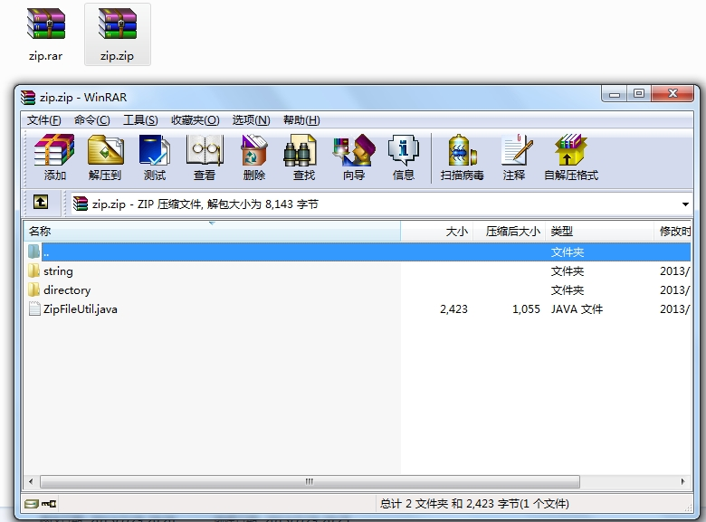

在工作过程中，需要将一个文件夹生成压缩文件，然后提供给用户下载。所以自己写了一个压缩文件的工具类。该工具类支持单个文件和文件夹压缩。放代码：

    
    
     1 import java.io.BufferedOutputStream;
     2 import java.io.File;
     3 import java.io.FileInputStream;
     4 import java.io.FileOutputStream;
     5 
     6 import org.apache.tools.zip.ZipEntry;
     7 import org.apache.tools.zip.ZipOutputStream;
     8 
     9 /** 
    10  * @project: Test 
    11  * @author chenssy
    12  * @date 2013-7-28 
    13  * @Description: 文件压缩工具类
    14  *                   将指定文件/文件夹压缩成zip、rar压缩文件
    15  */
    16 public class CompressedFileUtil {
    17     /**
    18      * 默认构造函数
    19      */
    20     public CompressedFileUtil(){
    21         
    22     }
    23 
    24     /**
    25      * @desc 将源文件/文件夹生成指定格式的压缩文件,格式zip
    26      * @param resourePath 源文件/文件夹
    27      * @param targetPath  目的压缩文件保存路径
    28      * @return void
    29      * @throws Exception 
    30      */
    31     public void compressedFile(String resourcesPath,String targetPath) throws Exception{
    32         File resourcesFile = new File(resourcesPath);     //源文件
    33         File targetFile = new File(targetPath);           //目的
    34         //如果目的路径不存在，则新建
    35         if(!targetFile.exists()){     
    36             targetFile.mkdirs();  
    37         }
    38         
    39         String targetName = resourcesFile.getName()+".zip";   //目的压缩文件名
    40         FileOutputStream outputStream = new FileOutputStream(targetPath+"\\"+targetName);
    41         ZipOutputStream out = new ZipOutputStream(new BufferedOutputStream(outputStream));
    42         
    43         createCompressedFile(out, resourcesFile, "");
    44         
    45         out.close();  
    46     }
    47     
    48     /**
    49      * @desc 生成压缩文件。
    50      *                  如果是文件夹，则使用递归，进行文件遍历、压缩
    51      *       如果是文件，直接压缩
    52      * @param out  输出流
    53      * @param file  目标文件
    54      * @return void
    55      * @throws Exception 
    56      */
    57     public void createCompressedFile(ZipOutputStream out,File file,String dir) throws Exception{
    58         //如果当前的是文件夹，则进行进一步处理
    59         if(file.isDirectory()){
    60             //得到文件列表信息
    61             File[] files = file.listFiles();
    62             //将文件夹添加到下一级打包目录
    63             out.putNextEntry(new ZipEntry(dir+"/"));
    64             
    65             dir = dir.length() == 0 ? "" : dir +"/";
    66             
    67             //循环将文件夹中的文件打包
    68             for(int i = 0 ; i < files.length ; i++){
    69                 createCompressedFile(out, files[i], dir + files[i].getName());         //递归处理
    70             }
    71         }
    72         else{   //当前的是文件，打包处理
    73             //文件输入流
    74             FileInputStream fis = new FileInputStream(file);
    75             
    76             out.putNextEntry(new ZipEntry(dir));
    77             //进行写操作
    78             int j =  0;
    79             byte[] buffer = new byte[1024];
    80             while((j = fis.read(buffer)) > 0){
    81                 out.write(buffer,0,j);
    82             }
    83             //关闭输入流
    84             fis.close();
    85         }
    86     }
    87     
    88     public static void main(String[] args){
    89         CompressedFileUtil compressedFileUtil = new CompressedFileUtil();
    90         
    91         try {
    92             compressedFileUtil.compressedFile("G:\\zip", "F:\\zip");
    93             System.out.println("压缩文件已经生成...");
    94         } catch (Exception e) {
    95             System.out.println("压缩文件生成失败...");
    96             e.printStackTrace();
    97         }
    98     }
    99 }

运行程序结果如下：

压缩之前的文件目录结构：

**提示：**
如果是使用java.util下的java.util.zip进行打包处理，可能会出现中文乱码问题，这是因为java的zip方法不支持编码格式的更改，我们可以使用ant.java下的zip工具类来进行打包处理。所以需要将ant.jar导入项目的lib目录下。

