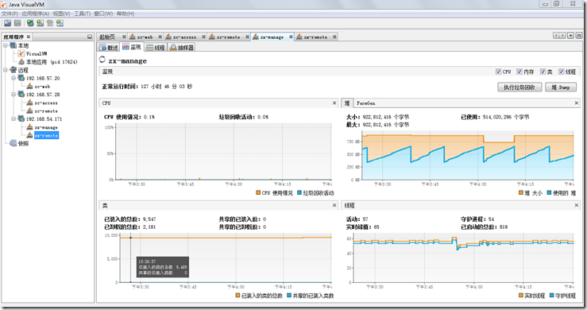

## **tomcat 服务器优化**

1、 **JDK 内存优化**

根据服务器物理内容情况配置相关参数优化tomcat性能。当应用程序需要的内存超出堆的最大值时虚拟机就会提示内存溢出，并且导致应用服务崩溃。因此一般建议堆的最大值设置为可用内存的最大值的80%。
Tomcat默认可以使用的内存为128MB，在较大型的应用项目中，这点内存是不够的，需要调大.

Tomcat默认可以使用的内存为128MB,Windows下,在文件/bin/catalina.bat，Unix下，在文件/bin/catalina.sh的前面，增加如下设置：
JAVA_OPTS="-Xms【初始化内存大小】 -Xmx【可以使用的最大内存】 -XX:PermSize=64M
-XX:MaxPermSize=128m" 需要把几个参数值调大。例如： JAVA_OPTS="-Xms256m -Xmx512m"
表示初始化内存为256MB，可以使用的最大内存为512MB。

参数详解

    
    
       -server  启用jdk 的 server 版；
       -Xms    java虚拟机初始化时的最小内存；
       -Xmx    java虚拟机可使用的最大内存；
       -XX:PermSize    内存永久保留区域
       -XX:MaxPermSize   内存最大永久保留区域 
       -Xmn    jvm最小内存

32G 内存配置示例：

    
    
    JAVA_OPTS="$JAVA_OPTS  -Xms10g -Xmx10g -XX:PermSize=1g -XX:MaxPermSize=2g -Xshare:off -Xmn1024m

2、 **tomcat 线程优化**

**在 tomcat配置文件server.xml中的配置中，和连接数相关的参数有：**

maxThreads： Tomcat使用线程来处理接收的每个请求。这个值表示Tomcat可创建的最大的线程数。默认值150。

acceptCount： 指定当所有可以使用的处理请求的线程数都被使用时，可以放到处理队列中的请求数，超过这个数的请求将不予处理。默认值10。

minSpareThreads： Tomcat初始化时创建的线程数。默认值25。

maxSpareThreads： 一旦创建的线程超过这个值，Tomcat就会关闭不再需要的socket线程。默认值75。

enableLookups： 是否反查域名，默认值为true。为了提高处理能力，应设置为false

connnectionTimeout： 网络连接超时，默认值60000，单位：毫秒。设置为0表示永不超时，这样设置有隐患的。通常可设置为30000毫秒。

maxKeepAliveRequests： 保持请求数量，默认值100。 bufferSize： 输入流缓冲大小，默认值2048 bytes。

compression： 压缩传输，取值on/off/force，默认值off。
其中和最大连接数相关的参数为maxThreads和acceptCount。如果要加大并发连接数，应同时加大这两个参数。

32G 内存配置示例：

    
    
    <Connector port="8080" protocol="HTTP/1.1"
                   connectionTimeout="20000" maxThreads="1000" minSpareThreads="60" maxSpareThreads="600"  acceptCount="120"  
                   redirectPort="8443" URIEncoding="utf-8"/>

## **使用 visualvm性能监控**

1、 **什么是 VisualVM**

**visualvm** 是jdk自带的一款监控工具。它提供了一个可视界面，用于查看 Java 虚拟机上运行的基于 Java
技术的程序的详细信息。VisualVM 对 Java Development Kit (JDK) 工具所检索的 JVM
软件相关数据进行组织，并通过一种使您可以快速查看有关多个 Java
应用程序的数据的方式提供该信息。您可以查看本地应用程序以及远程主机上运行的应用程序的相关数据

2、 **如何安装**

在jkd bin目录下有一个jvisualvm.exe文件 双击就可以使用

3、 **如何使用 jvisualvm**

1、配置JMX管理tomcat：

    
    
    set JAVA_OPTS=-Dcom.sun.management.jmxremote -Dcom.sun.management.jmxremote.port=9008 -Dcom.sun.management.jmxremote.authenticate=false -    Dcom.sun.management.jmxremote.ssl=false

2、重启tomcat即可

3、双击jvisualvm.exe 添加服务器IP地址，添加需要监控jmx端口即可

效果如下：

