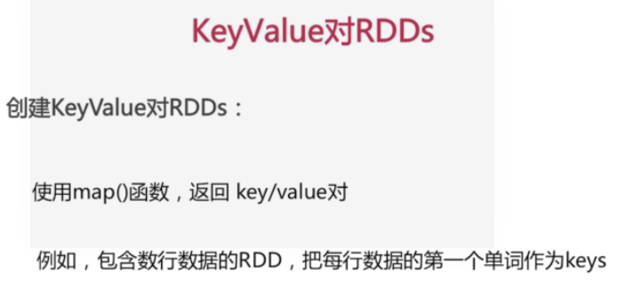
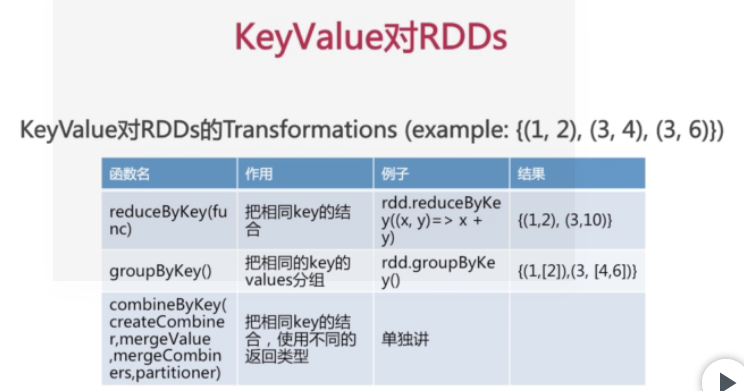
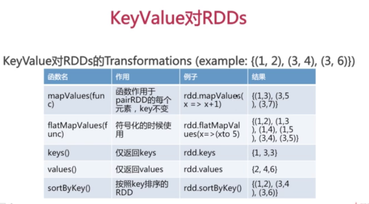
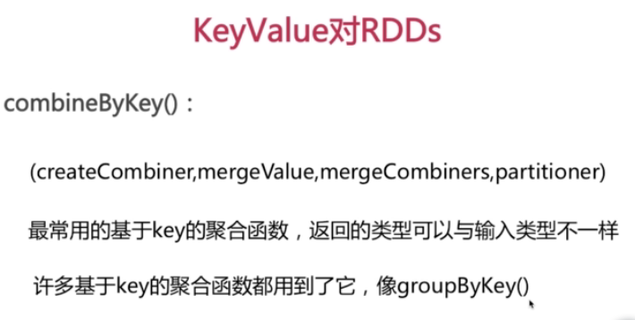
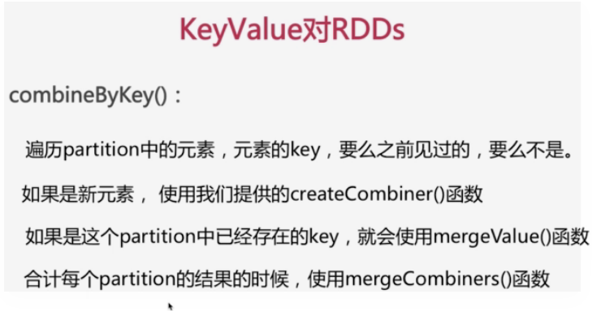
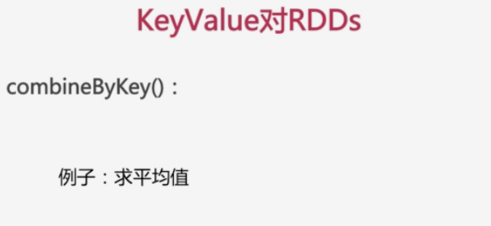

scala> val input =sc.textFile("/home/simon/SparkWorkspace/test.txt")  
input: org.apache.spark.rdd.RDD[String] = /home/simon/SparkWorkspace/test.txt
MapPartitionsRDD[32] at textFile at <console>:24  
  
scala> input.foreach(println)  
hello simon!  
hello world!  
hello gg  
  
scala> val rdds=input.map(line=>(line.split(" ")(0),line))  
rdds: org.apache.spark.rdd.RDD[(String, String)] = MapPartitionsRDD[33] at map
at <console>:25  
  
scala> rdds.foreach(println)  
(hello,hello simon!)  
(hello,hello world!)  
(hello,hello gg)  
  
scala>  
  

  
scala> val rdd=sc.parallelize(Array((1,2),(2,3),(3,4),(3,5),(4,6),(2,4)))  
rdd: org.apache.spark.rdd.RDD[(Int, Int)] = ParallelCollectionRDD[34] at
parallelize at <console>:24  
  
scala> rdd.foreach(println)  
(3,5)  
(2,3)  
(3,4)  
(1,2)  
(4,6)  
(2,4)  
  
scala> val rdd1=rdd.reduceByKey((x,y)=>x+y)  
rdd1: org.apache.spark.rdd.RDD[(Int, Int)] = ShuffledRDD[35] at reduceByKey at
<console>:25  
  
scala> rdd1.foreach(println)  
(1,2)  
(4,6)  
(2,7)  
(3,9)  
  
scala> val rdd2=rdd.keys  
rdd2: org.apache.spark.rdd.RDD[Int] = MapPartitionsRDD[36] at keys at
<console>:25  
  
scala> rdd2.foreach(println)  
1  
4  
2  
3  
2  
3  
  
scala> val rdd3=rdd.values  
rdd3: org.apache.spark.rdd.RDD[Int] = MapPartitionsRDD[37] at values at
<console>:25  
  
scala> rdd3.foreach(println)  
2  
6  
4  
5  
3  
4  
  
scala> val rdd4=rdd.groupByKey()  
rdd4: org.apache.spark.rdd.RDD[(Int, Iterable[Int])] = ShuffledRDD[38] at
groupByKey at <console>:25  
  
scala> rdd4.foreach(println)  
(3,CompactBuffer(4, 5))  
(4,CompactBuffer(6))  
(1,CompactBuffer(2))  
(2,CompactBuffer(3, 4))  
  
scala> val rdd5=rdd.sortByKey()  
rdd5: org.apache.spark.rdd.RDD[(Int, Int)] = ShuffledRDD[41] at sortByKey at
<console>:25  
  
scala> rdd5.foreach(println)  
(3,4)  
(3,5)  
(4,6)  
(1,2)  
(2,3)  
(2,4)  
  
scala> val rdd6=rdd4.sortByKey()  
rdd6: org.apache.spark.rdd.RDD[(Int, Iterable[Int])] = ShuffledRDD[44] at
sortByKey at <console>:25  
  
scala> rdd6.foreach(println)  
(1,CompactBuffer(2))  
(4,CompactBuffer(6))  
(3,CompactBuffer(4, 5))  
(2,CompactBuffer(3, 4))  
  
scala>

val
scores=sc.parallelize(Array(("jack",89),("jack",90),("jack",99),("Tom",89),("Tom",95),("Tom",99)))  
scores.foreach(println)  
val
scores2=scores.combineByKey(score=>(1,score),(c1:(Int,Double),newScore)=>(c1._1+1,c1._2+newScore),(c1:(Int,Double),c2:(Int,Double)=>(c1._1+c2._1,c1._2+c2._2))  
scores2.foreach(println)  
val average =scores2.map{case(name,(num,score))=>(name,score/num)}  
average.foreach(println)

