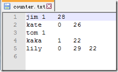
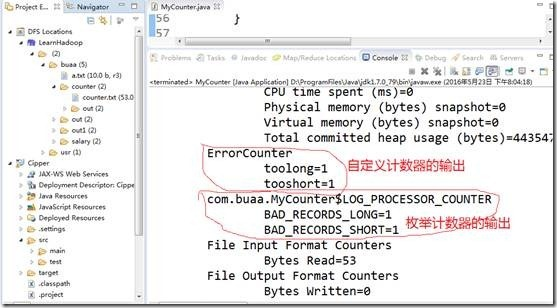

1、MapReduce计数器是什么？

计数器是用来记录job的执行进度和状态的。它的作用可以理解为日志。我们可以在程序的某个位置插入计数器，记录数据或者进度的变化情况。

2、MapReduce计数器能做什么？

MapReduce 计数器（Counter）为我们提供一个窗口，用于观察 MapReduce Job
运行期的各种细节数据。对MapReduce性能调优很有帮助，MapReduce性能优化的评估大部分都是基于这些 Counter 的数值表现出来的。

3、MapReduce 都有哪些内置计数器？

MapReduce 自带了许多默认Counter，现在我们来分析这些默认 Counter 的含义，方便大家观察 Job
结果，如输入的字节数、输出的字节数、Map端输入/输出的字节数和条数、Reduce端的输入/输出的字节数和条数等。下面我们只需了解这些内置计数器，知道计数器组名称（groupName）和计数器名称（counterName），以后使用计数器会查找groupName和counterName即可。

1、任务计数器

在任务执行过程中，任务计数器采集任务的相关信息，每个作业的所有任务的结果会被聚集起来。例如，MAP_INPUT_RECORDS
计数器统计每个map任务输入记录的总数，并在一个作业的所有map任务上进行聚集，使得最终数字是整个作业的所有输入记录的总数。任务计数器由其关联任务维护，并定期发送给TaskTracker，再由TaskTracker发送给
JobTracker。因此，计数器能够被全局地聚集。下面我们分别了解各种任务计数器。

1、MapReduce 任务计数器

MapReduce 任务计数器的
groupName为org.apache.hadoop.mapreduce.TaskCounter，它包含的计数器如下表所示  
  
<table>  
<tr>  
<td>

**计数器名称**

</td>  
<td>

**说明**

</td> </tr>  
<tr>  
<td>

map 输入的记录数（MAP_INPUT_RECORDS）

</td>  
<td>

作业中所有 map 已处理的输入记录数。每次 RecorderReader 读到一条记录并将其传给 map 的 map() 函数时，该计数器的值增加。

</td> </tr>  
<tr>  
<td>

map 跳过的记录数（MAP_SKIPPED_RECORDS）

</td>  
<td>

作业中所有 map 跳过的输入记录数。

</td> </tr>  
<tr>  
<td>

map 输入的字节数（MAP_INPUT_BYTES）

</td>  
<td>

作业中所有 map 已处理的未经压缩的输入数据的字节数。每次 RecorderReader 读到一条记录并 将其传给 map 的 map()
函数时，该计数器的值增加

</td> </tr>  
<tr>  
<td>

分片split的原始字节数（SPLIT_RAW_BYTES）

</td>  
<td>

由 map 读取的输入-分片对象的字节数。这些对象描述分片元数据（文件的位移和长度），而不是分片的数据自身，因此总规模是小的

</td> </tr>  
<tr>  
<td>

map 输出的记录数（MAP_OUTPUT_RECORDS）

</td>  
<td>

作业中所有 map 产生的 map 输出记录数。每次某一个 map 的Context 调用 write() 方法时，该计数器的值增加

</td> </tr>  
<tr>  
<td>

map 输出的字节数（MAP_OUTPUT_BYTES）

</td>  
<td>

作业中所有 map 产生的 未经压缩的输出数据的字节数。每次某一个 map 的 Context 调用 write() 方法时，该计数器的值增加。

</td> </tr>  
<tr>  
<td>

map 输出的物化字节数（MAP_OUTPUT_MATERIALIZED_BYTES）

</td>  
<td>

map 输出后确实写到磁盘上的字节数；若 map 输出压缩功能被启用，则会在计数器值上反映出来

</td> </tr>  
<tr>  
<td>

combine 输入的记录数（COMBINE_INPUT_RECORDS）

</td>  
<td>

作业中所有 Combiner（如果有）已处理的输入记录数。Combiner 的迭代器每次读一个值，该计数器的值增加。

</td> </tr>  
<tr>  
<td>

combine 输出的记录数（COMBINE_OUTPUT_RECORDS）

</td>  
<td>

作业中所有 Combiner（如果有）已产生的输出记录数。每当一个 Combiner 的 Context 调用 write() 方法时，该计数器的值增加。

</td> </tr>  
<tr>  
<td>

reduce 输入的组（REDUCE_INPUT_GROUPS）

</td>  
<td>

作业中所有 reducer 已经处理的不同的码分组的个数。每当某一个 reducer 的 reduce() 被调用时，该计数器的值增加。

</td> </tr>  
<tr>  
<td>

reduce 输入的记录数（REDUCE_INPUT_RECORDS）

</td>  
<td>

作业中所有 reducer 已经处理的输入记录的个数。每当某个 reducer 的迭代器读一个值时，该计数器的值增加。如果所有 reducer
已经处理完所有输入， 则该计数器的值与计数器 “map 输出的记录” 的值相同

</td> </tr>  
<tr>  
<td>

reduce 输出的记录数（REDUCE_OUTPUT_RECORDS）

</td>  
<td>

作业中所有 map 已经产生的 reduce 输出记录数。每当某一个 reducer 的 Context 调用 write() 方法时，该计数器的值增加。

</td> </tr>  
<tr>  
<td>

reduce 跳过的组数（REDUCE_SKIPPED_GROUPS）

</td>  
<td>

作业中所有 reducer 已经跳过的不同的码分组的个数。

</td> </tr>  
<tr>  
<td>

reduce 跳过的记录数（REDUCE_SKIPPED_RECORDS）

</td>  
<td>

作业中所有 reducer 已经跳过输入记录数。

</td> </tr>  
<tr>  
<td>

reduce 经过 shuffle 的字节数（REDUCE_SHUFFLE_BYTES）

</td>  
<td>

shuffle 将 map 的输出数据复制到 reducer 中的字节数。

</td> </tr>  
<tr>  
<td>

溢出的记录数（SPILLED_RECORDS）

</td>  
<td>

作业中所有 map和reduce 任务溢出到磁盘的记录数

</td> </tr>  
<tr>  
<td>

CPU 毫秒（CPU_MILLISECONDS）

</td>  
<td>

总计的 CPU 时间，以毫秒为单位，由/proc/cpuinfo获取

</td> </tr>  
<tr>  
<td>

物理内存字节数（PHYSICAL_MEMORY_BYTES）

</td>  
<td>

一个任务所用物理内存的字节数，由/proc/cpuinfo获取

</td> </tr>  
<tr>  
<td>

虚拟内存字节数（VIRTUAL_MEMORY_BYTES）

</td>  
<td>

一个任务所用虚拟内存的字节数，由/proc/cpuinfo获取

</td> </tr>  
<tr>  
<td>

有效的堆字节数（COMMITTED_HEAP_BYTES）

</td>  
<td>

在 JVM 中的总有效内存量（以字节为单位），可由Runtime().getRuntime().totaoMemory()获取。

</td> </tr>  
<tr>  
<td>

GC 运行时间毫秒数（GC_TIME_MILLIS）

</td>  
<td>

在任务执行过程中，垃圾收集器（garbage collection）花费的时间（以毫秒为单位）， 可由 GarbageCollector
MXBean.getCollectionTime()获取；该计数器并未出现在1.x版本中。

</td> </tr>  
<tr>  
<td>

由 shuffle 传输的 map 输出数（SHUFFLED_MAPS）

</td>  
<td>

有 shuffle 传输到 reducer 的 map 输出文件数。

</td> </tr>  
<tr>  
<td>

失败的 shuffle 数（SHUFFLE_MAPS）

</td>  
<td>

在 shuffle 过程中，发生拷贝错误的 map 输出文件数，该计数器并没有包含在 1.x 版本中。

</td> </tr>  
<tr>  
<td>

被合并的 map 输出数

</td>  
<td>

在 shuffle 过程中，在 reduce 端被合并的 map 输出文件数，该计数器没有包含在 1.x 版本中。

</td> </tr> </table>

2、文件系统计数器

文件系统计数器的 groupName为org.apache.hadoop.mapreduce.FileSystemCounter，它包含的计数器如下表所示  
  
<table>  
<tr>  
<td>

**计数器名称**

</td>  
<td>

**说明**

</td> </tr>  
<tr>  
<td>

文件系统的读字节数（BYTES_READ）

</td>  
<td>

由 map 和 reduce 等任务在各个文件系统中读取的字节数，各个文件系统分别对应一个计数器，可以是 Local、HDFS、S3和KFS等。

</td> </tr>  
<tr>  
<td>

文件系统的写字节数（BYTES_WRITTEN）

</td>  
<td>

由 map 和 reduce 等任务在各个文件系统中写的字节数。

</td> </tr> </table>

3、FileInputFormat 计数器

FileInputFormat 计数器的
groupName为org.apache.hadoop.mapreduce.lib.input.FileInputFormatCounter，它包含的计数器如下表所示，计数器名称列的括号（）内容即为counterName  
  
<table>  
<tr>  
<td>

**计数器名称**

</td>  
<td>

**说明**

</td> </tr>  
<tr>  
<td>

读取的字节数（BYTES_READ）

</td>  
<td>

由 map 任务通过 FileInputFormat 读取的字节数。

</td> </tr> </table>

4、FileOutputFormat 计数器

FileOutputFormat 计数器的
groupName为org.apache.hadoop.mapreduce.lib.input.FileOutputFormatCounter，它包含的计数器如下表所示  
  
<table>  
<tr>  
<td>

**计数器名称**

</td>  
<td>

**说明**

</td> </tr>  
<tr>  
<td>

写的字节数（BYTES_WRITTEN）

</td>  
<td>

由 map 任务（针对仅含 map 的作业）或者 reduce 任务通过 FileOutputFormat 写的字节数。

</td> </tr> </table>

2、作业计数器

作业计数器由 JobTracker（或者 YARN）维护，因此无需在网络间传输数据，这一点与包括 “用户定义的计数器”
在内的其它计数器不同。这些计数器都是作业级别的统计量，其值不会随着任务运行而改变。 作业计数器计数器的
groupName为org.apache.hadoop.mapreduce.JobCounter，它包含的计数器如下表所示  
  
<table>  
<tr>  
<td>

**计数器名称**

</td>  
<td>

**说明**

</td> </tr>  
<tr>  
<td>

启用的map任务数（TOTAL_LAUNCHED_MAPS）

</td>  
<td>

启动的map任务数，包括以“推测执行” 方式启动的任务。

</td> </tr>  
<tr>  
<td>

启用的 reduce 任务数（TOTAL_LAUNCHED_REDUCES）

</td>  
<td>

启动的reduce任务数，包括以“推测执行” 方式启动的任务。

</td> </tr>  
<tr>  
<td>

失败的map任务数（NUM_FAILED_MAPS）

</td>  
<td>

失败的map任务数。

</td> </tr>  
<tr>  
<td>

失败的 reduce 任务数（NUM_FAILED_REDUCES）

</td>  
<td>

失败的reduce任务数。

</td> </tr>  
<tr>  
<td>

数据本地化的 map 任务数（DATA_LOCAL_MAPS）

</td>  
<td>

与输入数据在同一节点的 map 任务数。

</td> </tr>  
<tr>  
<td>

机架本地化的 map 任务数（RACK_LOCAL_MAPS）

</td>  
<td>

与输入数据在同一机架范围内、但不在同一节点上的 map 任务数。

</td> </tr>  
<tr>  
<td>

其它本地化的 map 任务数（OTHER_LOCAL_MAPS）

</td>  
<td>

与输入数据不在同一机架范围内的 map 任务数。由于机架之间的宽带资源相对较少，Hadoop 会尽量让 map
任务靠近输入数据执行，因此该计数器值一般比较小。

</td> </tr>  
<tr>  
<td>

map 任务的总运行时间（SLOTS_MILLIS_MAPS）

</td>  
<td>

map 任务的总运行时间，单位毫秒。该计数器包括以推测执行方式启动的任务。

</td> </tr>  
<tr>  
<td>

reduce 任务的总运行时间（SLOTS_MILLIS_REDUCES）

</td>  
<td>

reduce任务的总运行时间，单位毫秒。该值包括以推测执行方式启动的任务。

</td> </tr>  
<tr>  
<td>

在保留槽之后，map任务等待的总时间（FALLOW_SLOTS_MILLIS_MAPS）

</td>  
<td>

在为 map 任务保留槽之后所花费的总等待时间，单位是毫秒。

</td> </tr>  
<tr>  
<td>

在保留槽之后，reduce 任务等待的总时间（FALLOW_SLOTS_MILLIS_REDUCES）

</td>  
<td>

在为 reduce 任务保留槽之后，花在等待上的总时间，单位为毫秒。

</td> </tr> </table>

4、计数器的该如何使用？

下面我们来介绍如何使用计数器。

1、定义计数器

1)枚举声明计数器

    
    
    // 自定义枚举变量Enum 
    Counter counter = context.getCounter(Enum enum)

2)自定义计数器

    
    
    // 自己命名groupName和counterName 
    Counter counter = context.getCounter(String groupName,String counterName)

2、为计数器赋值

1)初始化计数器

    
    
    counter.setValue(long value);// 设置初始值

2)计数器自增

    
    
    counter.increment(long incr);// 增加计数

3、获取计数器的值

1) 获取枚举计数器的值

    
    
    Configuration conf = new Configuration(); 
    Job job = new Job(conf, "MyCounter"); 
    job.waitForCompletion(true); 
    Counters counters=job.getCounters(); 
    Counter counter=counters.findCounter(LOG_PROCESSOR_COUNTER.BAD_RECORDS_LONG);// 查找枚举计数器，假如Enum的变量为BAD_RECORDS_LONG 
    long value=counter.getValue();//获取计数值

2) 获取自定义计数器的值

    
    
    Configuration conf = new Configuration(); 
    Job job = new Job(conf, "MyCounter"); 
    job.waitForCompletion(true); 
    Counters counters = job.getCounters(); 
    Counter counter=counters.findCounter("ErrorCounter","toolong");// 假如groupName为ErrorCounter，counterName为toolong 
    long value = counter.getValue();// 获取计数值

3) 获取内置计数器的值

    
    
    Configuration conf = new Configuration(); 
    Job job = new Job(conf, "MyCounter"); 
    job.waitForCompletion(true); 
    Counters counters=job.getCounters(); 
    // 查找作业运行启动的reduce个数的计数器，groupName和counterName可以从内置计数器表格查询（前面已经列举有） 
    Counter counter=counters.findCounter("org.apache.hadoop.mapreduce.JobCounter","TOTAL_LAUNCHED_REDUCES");// 假如groupName为org.apache.hadoop.mapreduce.JobCounter，counterName为TOTAL_LAUNCHED_REDUCES 
    long value=counter.getValue();// 获取计数值

4) 获取所有计数器的值

    
    
    Configuration conf = new Configuration(); 
    Job job = new Job(conf, "MyCounter"); 
    Counters counters = job.getCounters(); 
    for (CounterGroup group : counters) { 
      for (Counter counter : group) { 
        System.out.println(counter.getDisplayName() + ": " + counter.getName() + ": "+ counter.getValue()); 
      } 
    }

5、自定义计数器

自定义计数器用的比较广泛，特别是统计无效数据条数的时候，我们就会用到计数器来记录错误日志的条数。下面我们自定义计数器，统计输入的无效数据。

1、数据集

假如一个文件，规范的格式是3个字段，“\t”作为分隔符，其中有2条异常数据，一条数据是只有2个字段，一条数据是有4个字段。其内容如下所示

2、实现

    
    
    package com.buaa;
    
    import java.io.IOException;
    
    import org.apache.hadoop.conf.Configuration;
    import org.apache.hadoop.fs.FileSystem;
    import org.apache.hadoop.fs.Path;
    import org.apache.hadoop.io.LongWritable;
    import org.apache.hadoop.io.Text;
    import org.apache.hadoop.mapreduce.Job;
    import org.apache.hadoop.mapreduce.Mapper;
    import org.apache.hadoop.mapreduce.lib.input.FileInputFormat;
    import org.apache.hadoop.mapreduce.lib.output.FileOutputFormat;
    
    /** 
    * @ProjectName CustomCounterDemo
    * @PackageName com.buaa
    * @ClassName MyCounter
    * @Description 假如一个文件，规范的格式是3个字段，“\t”作为分隔符，其中有2条异常数据，一条数据是只有2个字段，一条数据是有4个字段
    * @Author 刘吉超
    * @Date 2016-05-23 20:10:14
    */
    public class MyCounter {
        // \t键
        private static String TAB_SEPARATOR = "\t";
    
        public static class MyCounterMap extends
                Mapper<LongWritable, Text, Text, Text> {
            // 定义枚举对象
            public static enum LOG_PROCESSOR_COUNTER {
                BAD_RECORDS_LONG, BAD_RECORDS_SHORT
            };
            
            protected void map(LongWritable key, Text value, Context context) throws IOException, InterruptedException {
                String arr_value[] = value.toString().split(TAB_SEPARATOR);
                if (arr_value.length > 3) {
                    /* 自定义计数器 */
                    context.getCounter("ErrorCounter", "toolong").increment(1);
                    /* 枚举计数器 */
                    context.getCounter(LOG_PROCESSOR_COUNTER.BAD_RECORDS_LONG).increment(1);
                } else if (arr_value.length < 3) {
                    // 自定义计数器
                    context.getCounter("ErrorCounter", "tooshort").increment(1);
                    // 枚举计数器
                    context.getCounter(LOG_PROCESSOR_COUNTER.BAD_RECORDS_SHORT).increment(1);
                }
            }
        }
    
        @SuppressWarnings("deprecation")
        public static void main(String[] args) throws IOException, InterruptedException, ClassNotFoundException {
            String[] args0 = { 
                    "hdfs://hadoop2:9000/buaa/counter/counter.txt",
                    "hdfs://hadoop2:9000/buaa/counter/out/" 
                };
            // 读取配置文件
            Configuration conf = new Configuration();
            
            // 如果输出目录存在，则删除
            Path mypath = new Path(args0[1]);
            FileSystem hdfs = mypath.getFileSystem(conf);
            if (hdfs.isDirectory(mypath)) {
                hdfs.delete(mypath, true);
            }
    
            // 新建一个任务
            Job job = new Job(conf, "MyCounter");
            // 主类
            job.setJarByClass(MyCounter.class);
            // Mapper
            job.setMapperClass(MyCounterMap.class);
    
            // 输入目录
            FileInputFormat.addInputPath(job, new Path(args0[0]));
            // 输出目录
            FileOutputFormat.setOutputPath(job, new Path(args0[1]));
            
            // 提交任务，并退出
            System.exit(job.waitForCompletion(true) ? 0 : 1);
        }
    }

3、运行结果

在输出日志中，查看计数器的值

从日志中可以看出，通过枚举声明和自定义计数器两种方式，统计出的不规范数据是一样的

