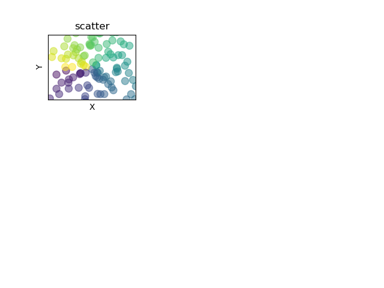

    fig=plt.figure()
    fig.add_subplot(3,3,1)#3行3列 第一个图
    n=128
    X=np.random.normal(0,1,n)
    Y=np.random.normal(0,1,n)
    T=np.arctan2(Y,X)#T用来上色的
    plt.axes([0.025,0.025,0.95,0.95])#显示的范围
    plt.scatter(X,Y,s=75,c=T,alpha=.5)#s表示点的大小，c表示颜色,用T的值来给c上色
    plt.xlim(-1.5,1.5)
    plt.xticks([])
    plt.ylim(-1.5,1.5)
    plt.yticks([])
    plt.xlabel("X")
    plt.ylabel("Y")
    plt.title("scatter")
    plt.show()#显示图

    
    
    fig=plt.figure()
    ax=fig.add_subplot(3,3,1)#3行3列 第一个图
    n=128
    X=np.random.normal(0,1,n)
    Y=np.random.normal(0,1,n)
    T=np.arctan2(Y,X)#T用来上色的
    #plt.axes([0.025,0.025,0.95,0.95])#显示的范围
    ax.scatter(X,Y,s=75,c=T,alpha=.5)#s表示点的大小，c表示颜色,用T的值来给c上色
    plt.xlim(-1.5,1.5)
    plt.xticks([])
    plt.ylim(-1.5,1.5)
    plt.yticks([])
    plt.xlabel("X")
    plt.ylabel("Y")
    plt.title("scatter")
    plt.show()#显示图

    
    
    #scatter
    fig=plt.figure()
    fig.add_subplot(3,3,1)#3行3列 第一个图
    n=128
    X=np.random.normal(0,1,n)
    Y=np.random.normal(0,1,n)
    T=np.arctan2(Y,X)#T用来上色的
    #plt.axes([0.025,0.025,0.95,0.95])#显示的范围
    plt.scatter(X,Y,s=75,c=T,alpha=.5)#s表示点的大小，c表示颜色,用T的值来给c上色
    plt.xlim(-1.5,1.5)
    plt.xticks([])
    plt.ylim(-1.5,1.5)
    plt.yticks([])
    plt.xlabel("X")
    plt.ylabel("Y")
    plt.title("scatter")
    #bar
    fig.add_subplot(332)
    n=10
    X=np.arange(n)
    Y1=(1-X/float(n))*np.random.uniform(0.5,1.0,n)
    Y2=(1-X/float(n))*np.random.uniform(0.5,1.0,n)
    plt.bar(X,+Y1,facecolor="#9999ff",edgecolor="red")
    #+Y1表示把柱状图画在横轴上面；facecolor配置柱子颜色；edgecolor配置柱子边缘颜色
    plt.bar(X,-Y2,facecolor="#ff9999",edgecolor="green")
    #-Y2表示把柱状图画在横轴下面；
    for x,y in zip(X,Y1):
        plt.text(x+0.4, y+0.05, "%.2f"%y, ha="center", va="top")
        #添加注释；x+0.4, y+0.05表示注释的位置；"%.2f"%y表示注释的格式；
        #ha="center"注释的水平位置；va="bottom"注释在条的位置,top表示在条的里面，bottom表示在条的上面（外面）
    for x,y in zip(X,Y2):
        plt.text(x+0.4, -y-0.05, "%.2f"%y, ha="center", va="top")
    plt.show()#显示图

    
    
    #scatter
    fig=plt.figure()
    ax=fig.add_subplot(3,3,1)#3行3列 第一个图
    n=128
    X=np.random.normal(0,1,n)
    Y=np.random.normal(0,1,n)
    T=np.arctan2(Y,X)#T用来上色的
    #plt.axes([0.025,0.025,0.95,0.95])#显示的范围
    ax.scatter(X,Y,s=75,c=T,alpha=.5)#s表示点的大小，c表示颜色,用T的值来给c上色
    plt.xlim(-1.5,1.5)
    plt.xticks([])
    plt.ylim(-1.5,1.5)
    plt.yticks([])
    plt.xlabel("X")
    plt.ylabel("Y")
    plt.title("scatter")
    #bar
    ax=fig.add_subplot(332)####################################这里改了一下ax 和上面是一样的
    n=10
    X=np.arange(n)
    Y1=(1-X/float(n))*np.random.uniform(0.5,1.0,n)
    Y2=(1-X/float(n))*np.random.uniform(0.5,1.0,n)
    ax.bar(X,+Y1,facecolor="#9999ff",edgecolor="red")
    #+Y1表示把柱状图画在横轴上面；facecolor配置柱子颜色；edgecolor配置柱子边缘颜色
    ax.bar(X,-Y2,facecolor="#ff9999",edgecolor="green")
    #-Y2表示把柱状图画在横轴下面；
    for x,y in zip(X,Y1):
        plt.text(x+0.4, y+0.05, "%.2f"%y, ha="center", va="top")
        #添加注释；x+0.4, y+0.05表示注释的位置；"%.2f"%y表示注释的格式；
        #ha="center"注释的水平位置；va="bottom"注释在条的位置,top表示在条的里面，bottom表示在条的上面（外面）
    for x,y in zip(X,Y2):
        plt.text(x+0.4, -y-0.05, "%.2f"%y, ha="center", va="top")
    plt.show()#显示图

