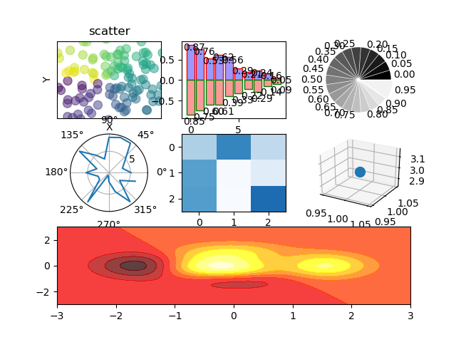

    #scatter
    fig=plt.figure()
    ax=fig.add_subplot(3,3,1)#3行3列 第一个图
    n=128
    X=np.random.normal(0,1,n)
    Y=np.random.normal(0,1,n)
    T=np.arctan2(Y,X)#T用来上色的
    #plt.axes([0.025,0.025,0.95,0.95])#显示的范围
    ax.scatter(X,Y,s=75,c=T,alpha=.5)#s表示点的大小，c表示颜色,用T的值来给c上色
    plt.xlim(-1.5,1.5)
    plt.xticks([])
    plt.ylim(-1.5,1.5)
    plt.yticks([])
    plt.xlabel("X")
    plt.ylabel("Y")
    plt.title("scatter")
    #bar
    fig.add_subplot(332)
    n=10
    X=np.arange(n)
    Y1=(1-X/float(n))*np.random.uniform(0.5,1.0,n)
    Y2=(1-X/float(n))*np.random.uniform(0.5,1.0,n)
    plt.bar(X,+Y1,facecolor="#9999ff",edgecolor="red")
    #+Y1表示把柱状图画在横轴上面；facecolor配置柱子颜色；edgecolor配置柱子边缘颜色
    plt.bar(X,-Y2,facecolor="#ff9999",edgecolor="green")
    #-Y2表示把柱状图画在横轴下面；
    for x,y in zip(X,Y1):
        plt.text(x+0.4, y+0.05, "%.2f"%y, ha="center", va="top")
        #添加注释；x+0.4, y+0.05表示注释的位置；"%.2f"%y表示注释的格式；
        #ha="center"注释的水平位置；va="bottom"注释在条的位置,top表示在条的里面，bottom表示在条的上面（外面）
    for x,y in zip(X,Y2):
        plt.text(x+0.4, -y-0.05, "%.2f"%y, ha="center", va="top")
    
    #Pie
    fig.add_subplot(333)
    n=20
    Z=np.ones(n)
    Z[-1]*=2
    plt.pie(Z,explode=Z*.05,colors=["%f"%(i/float(n)) for i in range(n)],
            labels=["%.2f"%(i/float(n)) for i in range(n)])
    #plt.pie传入一个数组；explode=Z*.05表示每一个扇形里中心的距离；colors=["%f"%设置的为灰度颜色；
    #labels=标签，在此打印为颜色的值
    plt.gca().set_aspect("equal")#set_aspect("equal")成为一个正的圆形，不是为椭圆
    plt.xticks()
    plt.yticks()
    #Polar
    fig.add_subplot(334,polar=True)#polar=True为下面plt.plot(theta,radii)话极坐标图，做铺垫
    #否则的话，为折线图
    n=20
    theta=np.arange(0.0,2*np.pi,2*np.pi/n)#0-2pi;2*np.pi/n为间隔
    radii=10*np.random.rand(n)#radii为半径
    plt.plot(theta,radii)
    #或者为plt.polar(theta,radii)
    #plt.polar(theta,radii)
    
    #heatmap热图
    fig.add_subplot(335)
    from matplotlib import cm
    data=np.random.rand(3,3)
    cmap=cm.Blues#指定颜色cmap=cmap表示color map
    map=plt.imshow(data,  interpolation="nearest", cmap=cmap,aspect="auto",vmin=0,vmax=1)
    #interpolation="nearest"表示最近插值 ；vmin=0,vmax=1代表颜色的调整；aspect="auto"自动调整大小；
    #
    #3D图
    from mpl_toolkits.mplot3d import Axes3D
    ax=fig.add_subplot(336,projection="3d")
    ax.scatter(1,1,3,s=100)
    
    #hot map 热力图
    fig.add_subplot(313)#横跨3个位置
    def f(x,y):
        return (1-x/2+x**5+y**3)*np.exp(-x**2-y**2)
    n=256
    x=np.linspace(-3,3,n)
    y=np.linspace(-3,3,n)
    X,Y=np.meshgrid(x,y)
    plt.contourf(X,Y,f(X,Y),8,alpha=.75,cmap=plt.cm.hot)
    plt.savefig("./data/fig.png")#保存图形
    plt.show()#显示图

