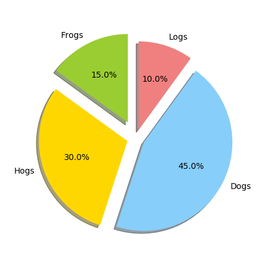

    #!/usr/bin/env python
    # -*- coding: utf-8 -*-
    # @Time    : 2018/5/28 16:05
    # @Author  : zhang chao
    # @File    : test.py
    import matplotlib.pyplot as plt
    labels="Frogs","Hogs","Dogs","Logs"#定义标签
    sizes=[15,30,45,10]#定义每一块的比例
    colors=["yellowgreen","gold","lightskyblue","lightcoral"]#定义每一块的颜色
    explode=(0.2,0.1,0.1,0.1)#定义每一块偏离中心的距离
    plt.pie(sizes,explode=explode,labels=labels,colors=colors,autopct="%1.1f%%",
            shadow=True,startangle=90)
    plt.axis("equal")#显示为圆，避免比例压缩为椭圆
    plt.show()

