## CentOS6.7安装mysql5.7.18

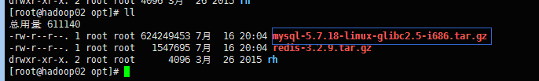

1、 解压到/usr/local目录

# tar -zxvf mysql-5.7.18-linux-glibc2.5-i686.tar.gz -C /usr/local

2、 mysql-5.7.18-linux-glibc2.5-i686文件夹重命名为mysql

# cd /usr/local

# mv mysql-5.7.18-linux-glibc2.5-i686/ mysql

3、 新建mysql用户组和mysql用户

# groupadd mysql

# useradd -r -g mysql mysql

4、 新建数据目录

# cd /usr/local/mysql

# mkdir data

5、 更改所有者以及授权755

# cd /usr/local

# chown -R mysql:mysql mysql/

# chmod -R 755 mysql/

6、 初始化mysqld

# cd /usr/local/mysql

# ./bin/mysqld --user=mysql --basedir=/usr/local/mysql
--datadir=/usr/local/mysql/data --initialize

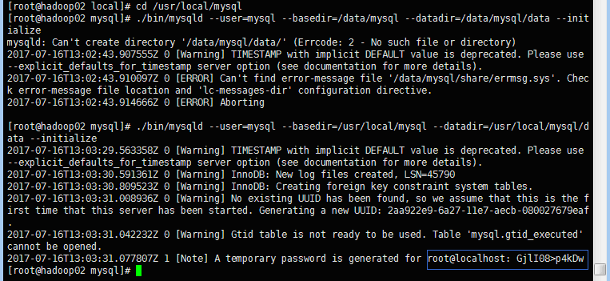

记录下root的初始密码: GjlI08>p4kDw

7、 将mysqld添加成服务，并启动它

# cp /usr/local/mysql/support-files/mysql.server /etc/init.d/mysqld

建立mysql默认的配置文件/etc/my.cnf，并添加图片中内容

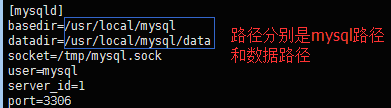

# vim /etc/my.cnf

保存并退出my.cnf，启动mysqld

# service mysqld start

出现如下信息表示启动成功

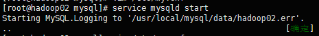

查看mysql是否启动成功

# ps -ef|grep mysql

出现如下信息表示启动成功

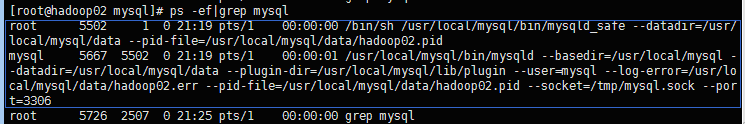

当然也可以查看mysqld的状态

# service mysqld status

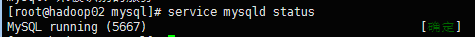

8、 登录mysql并修改root密码

# cd /usr/local/mysql

# ./bin/mysql -uroot –p

输入初始密码，步骤6中有生成，出现如下信息表示登录成功

修改root密码

mysql> SET PASSWORD = PASSWORD("123456");

mysql> FLUSH PRIVILEGES;

初次登录没有修改root的密码，操作数据库会出现如下错误提示，那么需要修改root用户的密码

ERROR 1820 (HY000): You must reset your password using ALTER USER statement
before executing this statement.

9、 设置mysql远程可访问（前提是防火墙必须关闭，chkconfig iptables off:设置自动启动为关闭，service iptables
sto:关闭防火墙）

先登录到mysql

mysql> use mysql

mysql> update user set host = "192.168.0.4" where user = "root";

mysql> FLUSH PRIVILEGES;

192.168.0.4即是可远程访问本地mysql的远程ip，若想任意ip都能访问本地mysql，那么只需要将192.168.0.4换成%即可

mysql> update user set host = "%" where user = "root";

## mysql主从复制

windows上mysql做master，linux上mysql做slave，mysql版本是5.7.18；windows的ip为192.168.0.4，linux的ip为192.168.0.223

1、master上开启binlog日志

在mysql的home目录找到my.ini文件(没有则新建)，配置上如下内容

    
    
    [mysqld]
    # set basedir to your installation path
    basedir=D:\\mysql-5.7.18
    # set datadir to the location of your data directory
    datadir=D:\\mysql-5.7.18\\data
    port = 3306  
      
    
    log-bin           = mysql-bin  #[必须]启用二进制日志
    server-id         = 4          #[必须]服务器唯一ID，默认是1，最好取ip的后3位
    expire-logs-days  = 7           #只保留7天的二进制日志，以防磁盘被日志占满
    binlog-ignore-db  = mysql       #不备份的数据库
    binlog-ignore-db  = information_schema
    binlog-ignore-db  = performation_schema
    binlog-ignore-db  = sys
    binlog-do-db=mybatis #需要做复制的数据库名

测试log_bin是否成功开启

mysql> show variables like "%log_bin%";

出现下图，log_bin为ON则表示开启成功，OFF表示开启失败

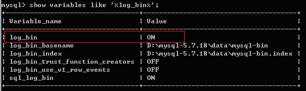

2、master的数据库中建立备份账号：backup为用户名，%表示任何远程地址，如下表示密码为1234的任何远程地址的backup都可以连接master主机

mysql> grant replication slave on *.* to "backup"@"%" identified by "1234";

mysql> use mysql

mysql> select user,authentication_string,host from user;

可看到我们刚创建的备份账号：

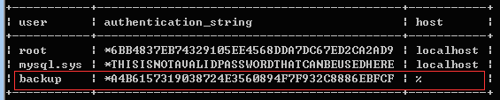

3、拷贝数据

重启MySQL服务并设置读取锁定

net stop MySQL

net start MySQL

登录mysql

mysql> flush tables with read lock;

读取锁定的意思是只能读取，不能更新，以便获得一个一致性的快照

查看主服务器上当前的二进制日志名和偏移量值

mysql> show master status \G

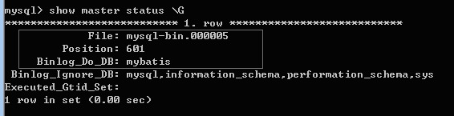

复制的过程如下：

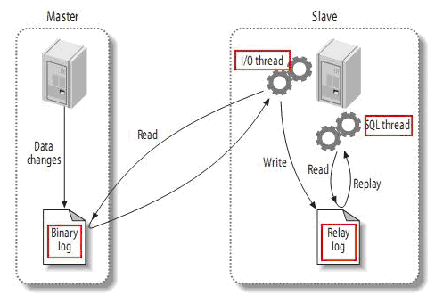

File表示实现复制功能的日志，即上图中的Binary
log；Position则表示binlog日志文件的偏移量之后的都会同步到slave中，那么在偏移量之前的则需要我们手动导入

从master导出数据，然后导入到slave中

另外开一个命令窗口，用mysqldump命令进行数据的导出

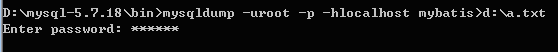

将d:\a.txt拷贝到slave上，然后导入到mysql数据库中，slave上的mybatis数据库不存在则先创建，然后再导入

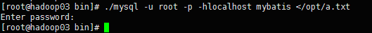

导出是mysqldump，导入是mysql

4、配置slave(192.168.0.223)

slave是linux环境，mysql的配置文件是/etc/my.cnf，不存在则新建，配上如下内容

    
    
    [mysqld]
    basedir=/usr/local/mysql
    datadir=/usr/local/mysql/data
    socket=/tmp/mysql.sock
    user=mysql
    port=3306
    
    log-bin=mysql-bin
    server-id=223

重启slave数据库

# service mysqld restart

登录slave数据库，并做如下设置

mysql> stop slave;

mysql> change master to

master_host="192.168.0.4",

master_user="backup",

master_password="1234",

master_log_file="mysql-bin.000005",

master_log_pos=601;

各个参数含义：

master_host 实现复制的主机的IP地址

master_user 实现复制的远程登录master的mysql的用户，在步骤2有设置

master_password 实现复制的远程登录master的mysql的面，在步骤2有设置

master_log_file 实现复制的binlog日志文件 在步骤3标红的框框中

master_log_pos 实现复制的binlog日志文件的偏移量 在步骤3标红的框框中

mysql> start slave;

查看slave从机的状态

mysql> show slave status \G

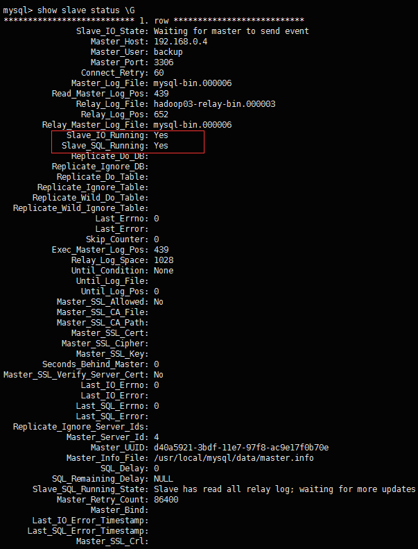

若图中标记的那两项的值为Yes，则表示slave设置成功

5、关闭掉主数据库的读取锁定

mysql> unlock tables;

6、测试

前面没出问题的话,那么master上的mybatis数据的操作都会同步到slave的mybatis上

## 文档地址

[点这里](https://github.com/youzhibing/maven-ssm-
web/blob/master/mysql5.7%E5%AE%89%E8%A3%85.doc)

