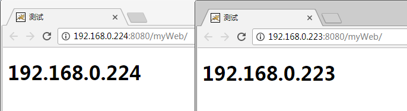

## 前言

使用集群是网站解决高并发、海量数据问题的常用手段。当一台服务器的处理能力、存储空间不足时，不要企图去换更强大的服务器，对大型网站而言，不管多么强大的服务器，都满足不了网站持续增长的业务需求。这种情况下，更恰当的做法是增加一台服务器分担原有服务器的访问及存储压力。通过负载均衡调度服务器，将来自浏览器的访问请求分发到应用服务器集群中的任何一台服务器上，如果有更多的用户，就在集群中加入更多的应用服务器，使应用服务器的负载压力不再成为整个网站的瓶颈。

摘自《大型网站技术架构_核心原理与案例分析》

另外，大家可以看我的这两篇博客：[LVS + keepalived + nginx + tomcat 实现主从热备 +
负载均衡](http://www.cnblogs.com/youzhibing/p/5061786.html) 和 [主从热备+负载均衡（LVS +
keepalived）](http://www.cnblogs.com/youzhibing/p/5021224.html)，对比下这三篇博客，其中区别及各自的优缺点需要大家好好体会。

## 环境准备

192.168.0.221：nginx + keepalived master

192.168.0.222：nginx + keepalived backup

192.168.0.223：tomcat

192.168.0.224：tomcat

虚拟ip(VIP):192.168.0.200，对外提供服务的ip，也可称作浮动ip

各个组件之间的关系图如下：

## tomcat做应用服务器

tomcat的安装不在本博客范围之内，具体可参考[virtualBox安装centos，并搭建tomcat](http://www.cnblogs.com/youzhibing/p/5031080.html)，tomcat的webapps下记得放自己的应用，我的是[myWeb](http://files.cnblogs.com/files/youzhibing/myWeb.rar)，如果大家也用我的myWeb，那么index.jsp中的ip需要换成自己的

将192.168.0.223、192.168.0.224上的tomcat启动起来，tomcat的路径可能和我的不一致，需要写成自己的

# cd /usr/local/tomcat7/bin

# ./startup.sh

访问myWeb如下

## nginx做负载均衡

nginx的安装，本文就不讲述了，具体可参考[LVS + keepalived + nginx + tomcat 实现主从热备 +
负载均衡](http://www.cnblogs.com/youzhibing/p/5061786.html)

nginx.conf内容如下

    
    
    user  root;            #运行用户
    worker_processes  1;        #启动进程,通常设置成和cpu的数量相等
    
    #全局错误日志及PID文件
    error_log  /usr/local/nginx/logs/error.log;
    error_log  /usr/local/nginx/logs/error.log  notice;
    error_log  /usr/local/nginx/logs/error.log  info;
    pid        /usr/local/nginx/logs/nginx.pid;
    
    # 工作模式及连接数上线
    events 
    {
        use epoll;            #epoll是多路复用IO(I/O Multiplexing)中的一种方式,但是仅用于linux2.6以上内核,可以大大提高nginx的性能
    
        worker_connections  1024;    #单个后台worker process进程的最大并发链接数
    }
    
    #设定http服务器,利用它的反向代理功能提供负载均衡支持
    http 
    {
        include       mime.types;
        default_type  application/octet-stream;
    
        #设定请求缓冲
        server_names_hash_bucket_size  128;
        client_header_buffer_size   32K;
        large_client_header_buffers  4 32k;
        # client_max_body_size   8m;
        
        #sendfile 指令指定 nginx 是否调用 sendfile 函数（zero copy 方式）来输出文件，对于普通应用，
        #必须设为 on,如果用来进行下载等应用磁盘IO重负载应用，可设置为 off，以平衡磁盘与网络I/O处理速度，降低系统的uptime.
        sendfile        on;
        tcp_nopush     on;
        tcp_nodelay    on;
    
        #连接超时时间
        keepalive_timeout  65;
    
        #开启gzip压缩，降低传输流量
        gzip  on;
        gzip_min_length    1k;
        gzip_buffers    4 16k;
        gzip_http_version  1.1;
        gzip_comp_level  2;
        gzip_types  text/plain application/x-javascript text/css  application/xml;
        gzip_vary on;
    
        #添加tomcat列表，真实应用服务器都放在这
        upstream tomcat_pool 
        {
           #server tomcat地址:端口号 weight表示权值，权值越大，被分配的几率越大;  
    　　　　server 192.168.0.223:8080 weight=4 max_fails=2 fail_timeout=30s;
        　 server 192.168.0.224:8080 weight=4 max_fails=2 fail_timeout=30s;
        }
    
        server 
        {
            listen       80;        #监听端口    
            server_name  localhost;
        
        #默认请求设置
        location / {
            proxy_pass http://tomcat_pool;    #转向tomcat处理
        }
        
        #所有的jsp页面均由tomcat处理
        location ~ \.(jsp|jspx|dp)?$
        {
            proxy_set_header Host $host;
            proxy_set_header X-Real-IP $remote_addr;
            proxy_pass http://tomcat_pool;    #转向tomcat处理
        }
        
        #所有的静态文件直接读取不经过tomcat,nginx自己处理
        location ~ .*\.(htm|html|gif|jpg|jpeg|png|bmp|swf|ioc|rar|zip|txt|flv|mid|doc|ppt|pdf|xls|mp3|wma)$ 
        { 
            expires  30d;
        }
        location ~ .*\.(js|css)?$
        {
           expires  1h;
        }
    
        #定义错误提示页面
            error_page   500 502 503 504  /50x.html;
            location = /50x.html {
                root   html;
            }
    
        }
    }

主从nginx的配置文件完全一样，nginx.conf配置可复杂可简单，大家根据自己的情况自行配置，照搬上述配置也是可以的。

配置好后，启动nginx，路径要写自己的

# cd /usr/local/nginx/sbin

# ./nginx

访问nginx，效果如下：

两台nginx服务器服务正常，此时是没有主从之分的，两者级别一样高，当配置keepalived之后就有了主从之分了。

## keepalived实现nginx高可用(HA)

keepalived的安装本文就不讲述了，具体可参考[主从热备+负载均衡（LVS +
keepalived）](http://www.cnblogs.com/youzhibing/p/5021224.html)

keepalived作用其实在第一张图中已经有所体现，主要起到两个作用：实现VIP到本地ip的映射； 以及检测nginx状态。

master上的keepalived.conf内容如下：

    
    
    global_defs {
        notification_email {
            997914490@qq.com
        }
        notification_email_from sns-lvs@gmail.com
        smtp_server smtp.hysec.com
        smtp_connection_timeout 30
        router_id nginx_master        # 设置nginx master的id，在一个网络应该是唯一的
    }
    vrrp_script chk_http_port {
        script "/usr/local/src/check_nginx_pid.sh"    #最后手动执行下此脚本，以确保此脚本能够正常执行
        interval 2                          #（检测脚本执行的间隔，单位是秒）
        weight 2
    }
    vrrp_instance VI_1 {
        state MASTER            # 指定keepalived的角色，MASTER为主，BACKUP为备
        interface eth0            # 当前进行vrrp通讯的网络接口卡(当前centos的网卡)
        virtual_router_id 66        # 虚拟路由编号，主从要一直
        priority 100            # 优先级，数值越大，获取处理请求的优先级越高
        advert_int 1            # 检查间隔，默认为1s(vrrp组播周期秒数)
        authentication {
            auth_type PASS
            auth_pass 1111
        }
        track_script {
        chk_http_port            #（调用检测脚本）
        }
        virtual_ipaddress {
            192.168.0.200            # 定义虚拟ip(VIP)，可多设，每行一个
        }
    }

backup上的keepalived.conf内容如下：

    
    
    global_defs {
        notification_email {
            997914490@qq.com
        }
        notification_email_from sns-lvs@gmail.com
        smtp_server smtp.hysec.com
        smtp_connection_timeout 30
        router_id nginx_backup              # 设置nginx backup的id，在一个网络应该是唯一的
    }
    vrrp_script chk_http_port {
        script "/usr/local/src/check_nginx_pid.sh"
        interval 2                          #（检测脚本执行的间隔）
        weight 2
    }
    vrrp_instance VI_1 {
        state BACKUP                        # 指定keepalived的角色，MASTER为主，BACKUP为备
        interface eth0                      # 当前进行vrrp通讯的网络接口卡(当前centos的网卡)
        virtual_router_id 66                # 虚拟路由编号，主从要一直
        priority 99                         # 优先级，数值越大，获取处理请求的优先级越高
        advert_int 1                        # 检查间隔，默认为1s(vrrp组播周期秒数)
        authentication {
            auth_type PASS
            auth_pass 1111
        }
        track_script {
            chk_http_port                   #（调用检测脚本）
        }
        virtual_ipaddress {
            192.168.0.200                   # 定义虚拟ip(VIP)，可多设，每行一个
        }
    }

nginx检测脚本check_nginx_pid.sh内容如下：

    
    
    #!/bin/bash
    A=`ps -C nginx --no-header |wc -l`        
    if [ $A -eq 0 ];then                            
          /usr/local/nginx/sbin/nginx                #重启nginx
          if [ `ps -C nginx --no-header |wc -l` -eq 0 ];then    #nginx重启失败，则停掉keepalived服务，进行VIP转移
                  killall keepalived                    
          fi
    fi

启动keepalived

# service keepalived start

访问VIP，效果如下：

我们来看下keepalived的日志信息

master（192.168.0.221）：

backup（192.168.0.222）：

当我们把master上的keepalived停掉（模拟宕机），再来看下keepalived日志

原master（192.168.0.221）：

原backup（192.168.0.222）：

通过VIP可以正常访问服务，前端请求感受不到后端nginx的切换；重新唤醒原master（192.168.0.221）的测试这里就不进行了，大家自行测试

## 注意点

1、执行脚本时报错：/bin/sh^M: bad interpreter: 没有那个文件或目录

因为操作系统是windows，我在windows下编辑的脚本，所以有可能有不可见字符。脚本文件是DOS格式的, 即每一行的行尾以回车符和换行符来标识,
其ASCII码分别是0x0D, 0x0A。可以有很多种办法看这个文件是DOS格式的还是UNIX格式的, 还是MAC格式的

解决方法：

vim filename

:set ff? #可以看到dos或unix的字样. 如果的确是dos格式的。

:set ff=unix #把它强制为unix格式的, 然后存盘退出。

再次运行脚本。

从windows编辑文件再拷贝到linux时要特别注意，另外，脚本需要赋予可执行权限才能执行，可执行文件的一种直观表现就是文件本身呈绿色。

2、负载均衡最好进行多浏览器测试，有些浏览器会缓存，会产生没有负载均衡的效果，例如我这次测试中谷歌浏览器就出现了类似的情况(还没搞清楚是否是缓存的原因)，火狐，360、IE浏览器都是正常的负载均衡效果。

3、请求走向

访问虚拟IP(VIP)，keepalived将请求映射到本地nginx，nginx将请求转发至tomcat，例如：<http://192.168.0.200/myWeb/>，被映射成<http://192.168.0.221/myWeb/>，端口是80，而221上nginx的端口正好是80；映射到nginx上后，nginx再进行请求的转发。

keepalived服务器的ip情况

VIP总会在keepalived服务器中的某一台上，也只会在其中的某一台上；VIP绑定的服务器上的nginx就是master，当VIP所在的服务器宕机了，keepalived会将VIP转移到backup上，并将backup提升为master。

4、VIP也称浮动ip，是公网ip，与域名进行映射，对外提供服务； 其他ip一般而言都是内网ip， 外部是直接访问不了的

## 参考

《大型网站技术架构_核心原理与案例分析》

[keepalived+nginx双机热备+负载均衡](http://blog.csdn.net/e421083458/article/details/30092795)

[浮动IP（FLOAT IP）](http://blog.csdn.net/readiay/article/details/53538085)

