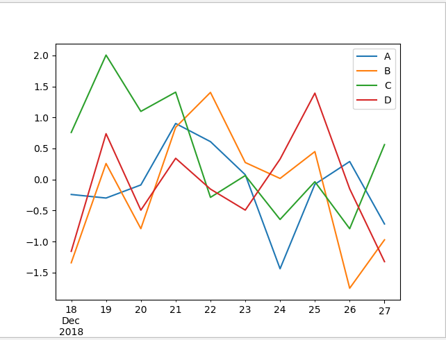
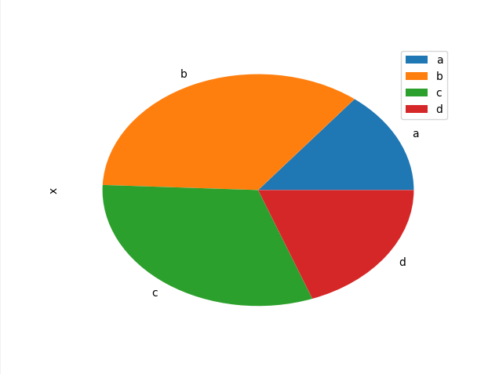

    #encoding:utf8
    import pandas as pd
    import numpy as np
    import matplotlib.pyplot as plt
    df = pd.DataFrame(np.random.randn(10,4),index=pd.date_range("2018/12/18",
       periods=10), columns=list("ABCD"))
    plt.figure()
    df.plot()
    df = pd.DataFrame(3 * np.random.rand(4), index=["a", "b", "c", "d"], columns=["x"])
    df.plot.pie(subplots=True)
    plt.show()
    
    
    #或者
    #encoding:utf8
    import pandas as pd
    import numpy as np
    from pylab import *
    df = pd.DataFrame(np.random.randn(10,4),index=pd.date_range("2018/12/18",
       periods=10), columns=list("ABCD"))
    df.plot()
    df = pd.DataFrame(3 * np.random.rand(4), index=["a", "b", "c", "d"], columns=["x"])
    df.plot.pie(subplots=True)
    show()

