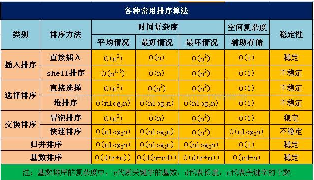

# 排序算法概览

归并排序的 空间复杂度为O(n)

# 插入排序

基本思想是每次讲一个待排序的记录，按其关键字大小插入到前面已拍好的子序列中，直到全部完成。

## 直接插入排序

讲元素L(i)插入到有序序列L[1,…,i-1]中，执行以下操作：  
1\. 查找出L(i)在L[1,…,i-1]中的插入位置k。  
2\. 将L[k,…,i-1]中所有元素全部后移一位。  
3\. 将L(i)复制到L(k)

    
    
    def InsertSort(array_a, n):
        for i in range(1, n):
            temp = array_a[i]
            j = i - 1
            while temp < array_a[j] and j >= 0:
                array_a[j + 1] = array_a[j]  # 如果小于其前驱，则从后往前寻找插入位置并后移。
                j -= 1
            array_a[j + 1] = temp
        return array_a

## 希尔排序

希尔排序的实质就是分组插入排序。  
基本思想：  
1\. 先取一个小于n的步长d1（一般为n/2），把表分为d1个组，每个组的元素间隔个d1。  
2\. 在各组之内使用直接插入排序。  
3\. 选取第二个步长，一般为d1/2，重复上述过程，直到步长为1.

严格意义的希尔排序：

    
    
    def ShellSort(array_a, n):
        dk = n / 2
        while dk >= 1:
            for i in xrange(0, dk):
                for j in range(i + dk, n, dk):
                    temp = array_a[j]
                    k = j - dk
                    while temp < array_a[k] and k >= 0:
                        array_a[k + dk] = array_a[k]  # 如果小于其前驱，则从后往前寻找插入位置并后移。
                        k -= dk
                    array_a[k + dk] = temp
            dk = dk / 2
        return array_a

其实每次元素和间隔dk倍数的前驱比较，做插入排序即可，简化版：

    
    
    def ShellSort2(array_a, n):
        dk = n / 2
        while dk >= 1:
            for i in range(dk, n):
                temp = array_a[i]
                k = i - dk
                while temp < array_a[k] and k >= 0:
                    array_a[k + dk] = array_a[k]  # 如果小于其前驱，则从后往前寻找插入位置并后移。
                    k -= dk
                array_a[k + dk] = temp
            dk = dk / 2
        return array_a

# 交换排序

交换即根据序列中两个元素比较结果来交换两个元素的位置。

## 冒泡排序

  1. 对于长度为n的表，从后往前依次比较两两相邻的元素值，若为逆序则交换他们的值，直到这个序列比较完，此为一趟。
  2. 下一趟减少一个排好元素，最终n-1趟排序完成。

    
    
    def BubbleSort(array_a, n):
        for i in range(0, n - 1):
            flag = 0  # 交换标志
            for j in range(n - 1, i, -1):
                if array_a[j] < array_a[j - 1]:
                    temp = array_a[j]
                    array_a[j] = array_a[j - 1]
                    array_a[j - 1] = temp
                    flag = 1
            if flag == 0:
                return array_a  # 若此趟未发生交换，说明已经有序，返回
        return array_a

## 快速排序

快速排序基本思想：  
1\. 在待排序表中任选一个元素作为pivot，以它为基准将数组分为比它大和小的两部分，此时pivot放在了最终的位置上。  
2\. 然后递归地对两个子表进行上述过程  
3\. 直到每部分都只有一个元素或者为空为止

    
    
    def QuickSort(array_a, low, high):
        if low < high:
            pivotpos = Partition(array_a, low, high)
            QuickSort(array_a, pivotpos + 1, high)
            QuickSort(array_a, low, pivotpos - 1)
        return array_a
    
    def Partition(array_a, low, high):
        pivot = array_a[low]
        while low < high:
            while low < high and array_a[high] >= pivot:
                high -= 1
            array_a[low] = array_a[high]  # 左移比pivot小的元素
            while low < high and array_a[low] <= pivot:
                low += 1
            array_a[high] = array_a[low]  # 右移比pivot大的元素
        array_a[low] = pivot
        return low

# 选择排序

基本思想：  
1\. 初始i=0。  
2\. 第i趟在后面n-i+1个元素中，选取最小的，作为第i个元素的值。  
3\. 一直到i=n-1做完。

## 简单选择排序

和上面思想一致，每趟找出最小值和第i个元素交换。找最小元素使用遍历的方法：

    
    
    def SelectSort(arrau_a, n):
        for i in xrange(n - 1):
            min = i
            for j in range(i + 1, n):
                if array_a[j] < array_a[min]:
                    min = j
            temp = array_a[i]
            array_a[i] = array_a[min]
            array_a[min] = temp
    

## 堆排序

堆排序是一种树形的选择排序方法，利用二叉树中双亲和孩子结点的关系，选择无序区域的关键最大（最小）的元素。  
堆定义：n个关键字的序列称为堆，当且仅当其满足：  
1\. L(i)≤L(2i) 且L(i)≤L(2i+1)  
或者  
2\. L(i)≥L(2i) 且L(i)≥L(2i+1)  
其中1是小根堆，2是大根堆。

堆排序关键是构建初始堆，直接大根堆代码

    
    
    def BuildMaxHeap(array_a, n):
        for i in range(n / 2, 0, -1):  # 从i=[n/2-1]~0，反复调整堆。
            AdjustDown(array_a, i, n - 1)
    
    
    def AdjustDown(array_a, k, n):
        array_a[0] = array_a[k]
        i = 2 * k
        while (i <= n):  # 沿着k的子结点筛选
            if i < n:
                if array_a[i] < array_a[i + 1]:
                    i += 1  # 取值更大的子结点
            if array_a[0] > array_a[i]:
                break
            else:
                array_a[k] = array_a[i]  # array_a[i]调整到双亲上。
                k = i
            i *= 2
            array_a[k] = array_a[0]  # 被筛选的点放入最终位置。
    
    
    def HeapSort(array_a, n):
        array_a.insert(0, 0)  # 首先array_a所有元素后移，rray_a[0]不存放元素
        n = len(array_a)
        BuildMaxHeap(array_a, n)
        for i in range(n - 1, 1, -1):
            temp = array_a[i]
            array_a[i] = array_a[1]
            array_a[1] = temp  # 将最大的元素放在当前无序数组的最后
            AdjustDown(array_a, 1, i - 1)  # 把剩余的i-1整理成堆。

# 归并排序

归并排序是将两个或者以上的有序表组成新的有序表。下面以二路归并为例：  
递归实现:  
1\. 先把待排序区间[s,t]以中点二分，接着把左边子区间排序，再把右边子区间排序，最后把左区间和右区间用一次归并操作合并成有序的区间[s,t]。  
2\. 合并两个有序数组：  
1\. 数组比较a[i]和a[j]的大小。  
1\. 若a[i]≤a[j]，则将第一个有序表中的元素a[i]复制到r[k]中，并令i和k分别加上1；  
2\. 否则将第二个有序表中的元素a[j]复制到r[k]中，并令j和k分别加上1。  
2\. 如此循环下去，直到其中一个有序表取完，然后再将另一个有序表中剩余的元素复制到r中从下标k到下标t的单元。

    
    
    def Merge(array_a, low, mid, high):
        # 合并array_a的[low,...mid]和[mid+1,...high]的各自有序的两部分为一个新的有序表
        b = []
        for each in array_a[low:high + 1]:
            b.append(each)  # 将序列保存到b中。
        i, j = low, mid + 1  # 其实i，j就是标记两个表比较到的位置。
        k = i
        while i <= mid and j <= high:
            # 将较小的元素一个加入到数组array_a中。
            if b[i - low] <= b[j - low]:
                array_a[k] = b[i - low]
                i += 1
            else:
                array_a[k] = b[j - low]
                j += 1
            k += 1
        # 如果两个表有一个没有检测完，则复制。
        while i <= mid:
            array_a[k] = b[i - low]
            k += 1
            i += 1
        while j <= high:
            array_a[k] = b[j - low]
            k += 1
            j += 1
    
    
    def MergeSort(array_a, low, high):
        if low < high:
            mid = (low + high) / 2  # 划分为两个子序列。
            MergeSort(array_a, low, mid)  # 分别对子序列递归排序。
            MergeSort(array_a, mid + 1, high)
            Merge(array_a, low, mid, high)  # 合并左右两个有序的子序列。
    

# 基数排序

基数排序并不是基于比较败絮，而是采用多关键字排序思想，即基于关键字的各位大小排序，分为最高位有限和最低位优先排序。

