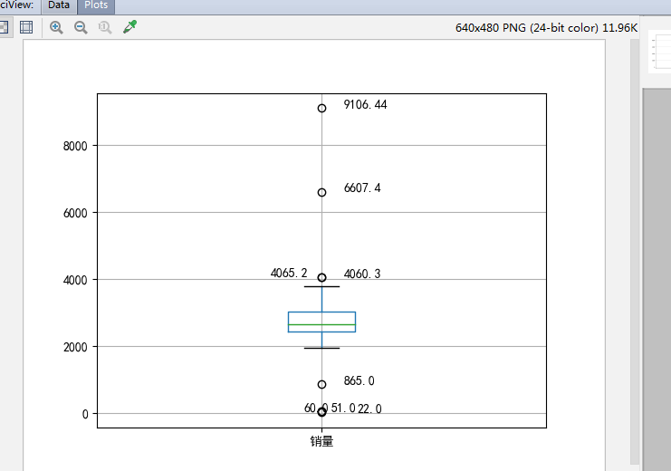

    #-*- coding: utf-8 -*-
    import pandas as pd
    
    catering_sale = "../data/catering_sale.xls" #餐饮数据
    data = pd.read_excel(catering_sale, index_col = u"日期") #读取数据，指定“日期”列为索引列
    
    import matplotlib.pyplot as plt #导入图像库
    plt.rcParams["font.sans-serif"] = ["SimHei"] #用来正常显示中文标签
    plt.rcParams["axes.unicode_minus"] = False #用来正常显示负号
    
    plt.figure() #建立图像
    p = data.boxplot(return_type="dict") #画箱型图，直接使用DataFrame的方法，检测异常值
    x = p["fliers"][0].get_xdata() # "flies"即为异常值的标签
    y = p["fliers"][0].get_ydata()
    y.sort() #从小到大排序，该方法直接改变原对象
    
    #用annotate添加注释
    #其中有些相近的点，注解会出现重叠，难以看清，需要一些技巧来控制。
    #以下参数都是经过调试的，需要具体问题具体调试。
    for i in range(len(x)): 
      if i>0:
        plt.annotate(y[i], xy = (x[i],y[i]), xytext=(x[i]+0.05 -0.8/(y[i]-y[i-1]),y[i]))
      else:
        plt.annotate(y[i], xy = (x[i],y[i]), xytext=(x[i]+0.08,y[i]))
    
    plt.show() #展示箱线图

