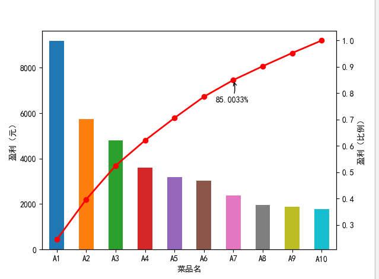

    #-*- coding: utf-8 -*-
    #菜品盈利数据 帕累托图
    from __future__ import print_function
    import pandas as pd
    
    #初始化参数
    dish_profit = "../data/catering_dish_profit.xls" #餐饮菜品盈利数据
    data = pd.read_excel(dish_profit, index_col = u"菜品名")
    data = data[u"盈利"].copy()
    data.sort_values(ascending = False)
    
    import matplotlib.pyplot as plt #导入图像库
    plt.rcParams["font.sans-serif"] = ["SimHei"] #用来正常显示中文标签
    plt.rcParams["axes.unicode_minus"] = False #用来正常显示负号
    
    plt.figure()
    data.plot(kind="bar")
    plt.ylabel(u"盈利（元）")
    p = 1.0*data.cumsum()/data.sum()#cumsum()表示累加
    p.plot(color = "r",  secondary_y = True,style = "-o",linewidth = 2)# secondary_y = True表示第二y轴显示
    plt.annotate(format(p[6], ".4%"), xy = (6, p[6]), xytext=(6*0.9, p[6]*0.9), arrowprops=dict(arrowstyle="->", connectionstyle="arc3,rad=.2"))   
    #添加注释，即85%处的标记。这里包括了指定箭头样式。
    plt.ylabel(u"盈利（比例）")
    plt.show()

