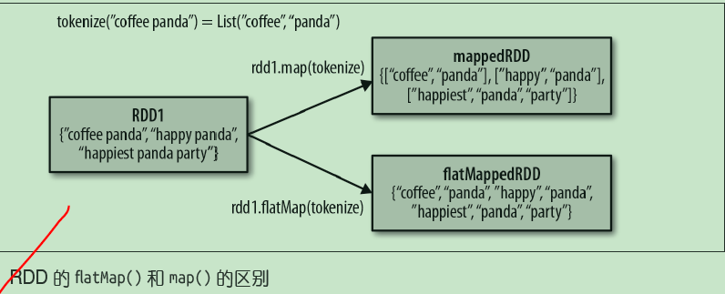
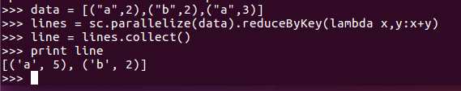
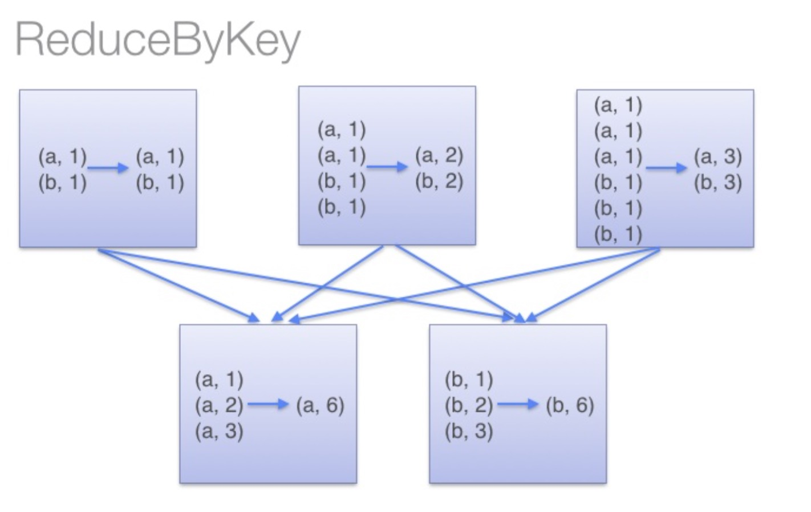
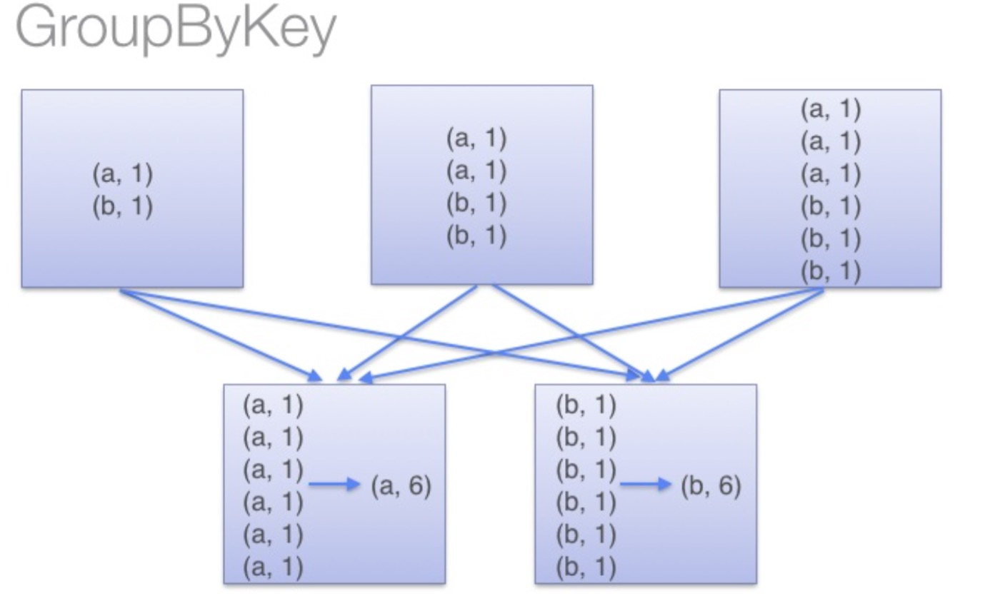
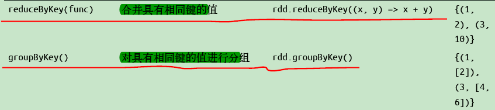
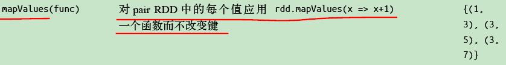
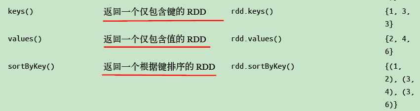

1、test.txt文件中存放

    
    
    asd sd fd gf g 
    dkf dfd dfml dlf
    dff gfl pkdfp dlofkp
    
    
    // 创建一个Scala版本的Spark Context
    val conf = new SparkConf().setAppName("wordCount")
    val sc = new SparkContext(conf)
    // 读取我们的输入数据
    val input = sc.textFile(inputFile)
    // 把它切分成一个个单词
    val words = input.flatMap(line => line.split(" "))

//words为------------------

asd

sd

fd

gf

g

dkf

dfd

dfml

dlf

dff

gfl

pkdfp

dlofkp

    
    
    val counts = words.map(word => (word, 1)).reduceByKey{case (x, y) => x + y}
    // 将统计出来的单词总数存入一个文本文件，引发求值
    counts.saveAsTextFile(outputFile)

//reduceByKey 合并key计算

2、reduceByKey 合并key计算

    
    
    按key求和 
    val rdd = sc.parallelize(List((“a”,2),(“b”,3),(“a”,3)))
    
    合并key计算 
    val r1 = rdd.reduceByKey((x,y) => x + y)
    
    输出结果如下
    
    (a,5)
    (b,3)

reduceByKey：reduceByKey会在结果发送至reducer之前会对每个mapper在本地进行merge，有点类似于在MapReduce中的combiner。

这样做的好处在于，在map端进行一次reduce之后，数据量会大幅度减小，从而减小传输，保证reduce端能够更快的进行结果计算。

groupByKey：groupByKey会对每一个RDD中的value值进行聚合形成一个序列(Iterator)，

此操作发生在reduce端，所以势必会将所有的数据通过网络进行传输，造成不必要的浪费。

同时如果数据量十分大，可能还会造成OutOfMemoryError。

通过以上对比可以发现在进行大量数据的reduce操作时候建议使用reduceByKey。

不仅可以提高速度，还是可以防止使用groupByKey造成的内存溢出问题。

