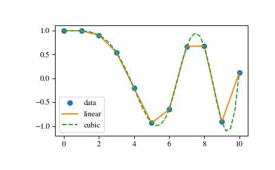
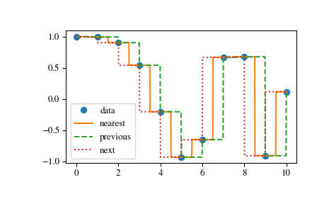

    >>> from scipy.interpolate import interp1d  
    #interp1d表示1维插值

>>>

    
    
    >>> x = np.linspace(0, 10, num=11, endpoint=True)
    >>> y = np.cos(-x**2/9.0)
    >>> f = interp1d(x, y)
    >>> f2 = interp1d(x, y, kind="cubic")  
    #kind="cubic" 省去kind参数  默认为线性插值

>>>

    
    
    >>> xnew = np.linspace(0, 10, num=41, endpoint=True)  
    #xnew表示插值之后，画图，选取的画图点数，再用线将这些点连起来
    >>> import matplotlib.pyplot as plt
    >>> plt.plot(x, y, "o", xnew, f(xnew), "-", xnew, f2(xnew), "--")
    >>> plt.legend(["data", "linear", "cubic"], loc="best")
    >>> plt.show()
    

插值的方法 通过kind 导入；

    
    
    f2 = interp1d(x, y, kind="cubic") 返回一个插值后的函数  
      
    
    
    
    >>> from scipy.interpolate import interp1d
    

>>>

    
    
    >>> x = np.linspace(0, 10, num=11, endpoint=True)
    >>> y = np.cos(-x**2/9.0)
    >>> f1 = interp1d(x, y, kind="nearest")
    >>> f2 = interp1d(x, y, kind="previous")
    >>> f3 = interp1d(x, y, kind="next")
    

>>>

    
    
    >>> xnew = np.linspace(0, 10, num=1001, endpoint=True)
    >>> import matplotlib.pyplot as plt
    >>> plt.plot(x, y, "o")
    >>> plt.plot(xnew, f1(xnew), "-", xnew, f2(xnew), "--", xnew, f3(xnew), ":")
    >>> plt.legend(["data", "nearest", "previous", "next"], loc="best")
    >>> plt.show()
    

    
    
     

