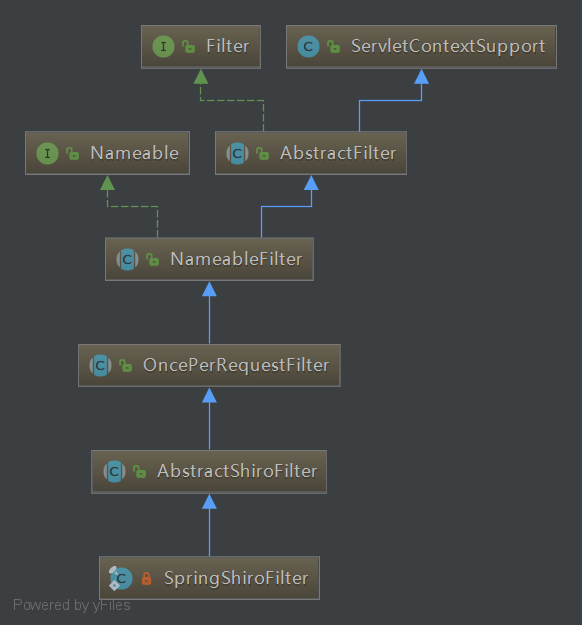

## 前言

开心一刻

已经报废了一年多的电脑，今天特么突然开机了，吓老子一跳，只见电脑管家缓缓地出来了，本次开机一共用时一年零六个月，打败了全国0%的电脑，电脑管家已经对您的电脑失去信心，然后它把自己卸载了，只剩我在一旁发呆。

路漫漫其修远兮，吾将上下而求索！

github：[https://github.com/youzhibing](https://github.com/youzhibing)

码云(gitee)：[https://gitee.com/youzhibing](https://gitee.com/youzhibing)

## shiroFilter的注册

[此篇博文](https://www.cnblogs.com/youzhibing/p/9866690.html)讲到了springboot的filter注册，但只是filter注册的一种方式：通过FilterRegistrationBean实现。而Shiro
Filter的注册是采用另外的方式实现的，我们接着往下看

ShiroFilterFactoryBean实现了FactoryBean，我们来看下ShiroFilterFactoryBean对FactoryBean的getObject方法的实现

git图一

可以看到createInstance()返回的是SpringShiroFilter的实例；SpringShiroFilter的类图如下

getObject方法只是创建了一个SpringShiroFilter实例，并注册到了spring容器中，那是如何注册到servlet容器的呢？我们来跟下源码

[这篇博文](https://www.cnblogs.com/youzhibing/p/9866690.html)其实涉及到了，只是那时候没细讲，我们还是从那里开始

gif图二

ServletContextInitializerBeans.java的构造方法，里面有addServletContextInitializerBeans(beanFactory)方法和addAdaptableBeans(beanFactory)，我们来好好瞅一瞅

###  addServletContextInitializerBeans(beanFactory)

    
    
    private void addServletContextInitializerBeans(ListableBeanFactory beanFactory) {
        for (Entry<String, ServletContextInitializer> initializerBean : getOrderedBeansOfType(
                beanFactory, ServletContextInitializer.class)) {
            addServletContextInitializerBean(initializerBean.getKey(),
                    initializerBean.getValue(), beanFactory);
        }
    }
    
    
    private void addServletContextInitializerBean(String beanName,
            ServletContextInitializer initializer, ListableBeanFactory beanFactory) {
        if (initializer instanceof ServletRegistrationBean) {
            Servlet source = ((ServletRegistrationBean<?>) initializer).getServlet();
            addServletContextInitializerBean(Servlet.class, beanName, initializer,
                    beanFactory, source);
        }
        else if (initializer instanceof FilterRegistrationBean) {
            Filter source = ((FilterRegistrationBean<?>) initializer).getFilter();
            addServletContextInitializerBean(Filter.class, beanName, initializer,
                    beanFactory, source);
        }
        else if (initializer instanceof DelegatingFilterProxyRegistrationBean) {
            String source = ((DelegatingFilterProxyRegistrationBean) initializer)
                    .getTargetBeanName();
            addServletContextInitializerBean(Filter.class, beanName, initializer,
                    beanFactory, source);
        }
        else if (initializer instanceof ServletListenerRegistrationBean) {
            EventListener source = ((ServletListenerRegistrationBean<?>) initializer)
                    .getListener();
            addServletContextInitializerBean(EventListener.class, beanName, initializer,
                    beanFactory, source);
        }
        else {
            addServletContextInitializerBean(ServletContextInitializer.class, beanName,
                    initializer, beanFactory, initializer);
        }
    }

View Code

会将spring
bean工厂（beanFactory）中类型是ServletContextInitalizer类型的实例（包括ServletRegistrationBean、FilterRegistrationBean、DelegatingFilterProxyRegistrationBean、ServletListenerRegistrationBean）添加进ServletContextInitializerBeans的initializers属性中。

    
    
    private final MultiValueMap<Class<?>, ServletContextInitializer> initializers;

ServletContextInitalizer的子类图如下所示

这也就是[上篇博文](https://www.cnblogs.com/youzhibing/p/9866690.html)注册Filter的方式，以RegistrationBean方式实现的，但是SpringShiroFilter不是在这添加进ServletContextInitializerBeans的initializers中的哦

###  addAdaptableBeans(beanFactory)

    
    
    private void addAdaptableBeans(ListableBeanFactory beanFactory) {
        MultipartConfigElement multipartConfig = getMultipartConfig(beanFactory);
        addAsRegistrationBean(beanFactory, Servlet.class,
                new ServletRegistrationBeanAdapter(multipartConfig));
        addAsRegistrationBean(beanFactory, Filter.class,
                new FilterRegistrationBeanAdapter());
        for (Class<?> listenerType : ServletListenerRegistrationBean
                .getSupportedTypes()) {
            addAsRegistrationBean(beanFactory, EventListener.class,
                    (Class<EventListener>) listenerType,
                    new ServletListenerRegistrationBeanAdapter());
        }
    }

View Code

会将beanFactory中的Servlet、Filter、Listener实例封装成对应的RegistrationBean，然后添加到ServletContextInitializerBeans的initializers；部分细节没去跟，有兴趣的可以自行去跟下源代码。

ServletContextInitializerBeans的sortedList的内容最终如下

然后遍历这个sortedList，逐个注入到servlet容器

###  小结

springboot下有3种方式注册Filter（Servlet、Listener类似），FilterRegistrationBean、@WebFilter
和@Bean，@WebFilter我还没试过，另外这3种方式注册的Filter的优先级是：FilterRegistrationBean >
@WebFilter > @Bean（网上查阅的资料，我没试哦，使用过程中需要注意！）。

不管是FilterRegistrationBean方式、@WebFilter方式，还是@Bean方式，只要是受spring容器管理，最终都会添加到ServletContextInitializerBeans的initializers中，都会成功注册到servlet容器。@WebFilter方式和@Bean方式注册的Filter都会被封装成FilterRegistrationBean，然后添加进ServletContextInitializerBeans的initializers；3种方式最终殊途同归，都以FilterRegistrationBean的形式存在ServletContextInitializerBeans的initializers中。SpringShiroFilter的注册算是@Bean方式注册的，至此SpringShiroFilter就注册到了servlet容器中了。

ServletContextInitializerBeans的sortedList如下：

    
    
    private List<ServletContextInitializer> sortedList;

是一个有序的ServletContextInitializer
List，这个有序针对的同类型，比如所有的FilterRegistrationBean有序，所有的ServletRegistrationBean有序，FilterRegistrationBean与ServletRegistrationBean之间有没有序是无意义的。

## shiro中的Filter链

###  shiro的默认filter列表

除了SpringShiroFilter之外，shiro还有默认的11个Filter；细心的朋友应该在git图一中已经发现了，在创建DefaultFilterChainManager，就把默认的11个Filter添加到它的filters中

    
    
    private Map<String, Filter> filters; //pool of filters available for creating chains
    
    private Map<String, NamedFilterList> filterChains; //key: chain name, value: chain
    
    public DefaultFilterChainManager() {
        this.filters = new LinkedHashMap<String, Filter>();
        this.filterChains = new LinkedHashMap<String, NamedFilterList>();
        addDefaultFilters(false);    // 将默认的11个Filter添加到filters
    }

这11个Filter具体如下

    
    
    anon(AnonymousFilter.class),
    authc(FormAuthenticationFilter.class),
    authcBasic(BasicHttpAuthenticationFilter.class),
    logout(LogoutFilter.class),
    noSessionCreation(NoSessionCreationFilter.class),
    perms(PermissionsAuthorizationFilter.class),
    port(PortFilter.class),
    rest(HttpMethodPermissionFilter.class),
    roles(RolesAuthorizationFilter.class),
    ssl(SslFilter.class),
    user(UserFilter.class);

###  Filter链

SpringShiroFilter注册到servlet容器中，请求肯定会经过SpringShiroFilter的doFilter方法，我们就从此开始跟一跟源代码

gif图三

上图中可能展示的不够细，主要就是两点：1、路径匹配：pathMatches(pathPattern,
requestURI)，默认的Fliter逐个与请求URI进行匹配；2、代理FilterChain：ProxiedFilterChain。如果匹配不上，那么直接走servlet的FilterChain，否则先走shiro的代理FilterChain（ProxiedFilterChain），之后再走servlet的FilterChain。

ProxiedFilterChain源代码如下

    
    
    /*
     * Licensed to the Apache Software Foundation (ASF) under one
     * or more contributor license agreements.  See the NOTICE file
     * distributed with this work for additional information
     * regarding copyright ownership.  The ASF licenses this file
     * to you under the Apache License, Version 2.0 (the
     * "License"); you may not use this file except in compliance
     * with the License.  You may obtain a copy of the License at
     *
     *     http://www.apache.org/licenses/LICENSE-2.0
     *
     * Unless required by applicable law or agreed to in writing,
     * software distributed under the License is distributed on an
     * "AS IS" BASIS, WITHOUT WARRANTIES OR CONDITIONS OF ANY
     * KIND, either express or implied.  See the License for the
     * specific language governing permissions and limitations
     * under the License.
     */
    package org.apache.shiro.web.servlet;
    
    import org.slf4j.Logger;
    import org.slf4j.LoggerFactory;
    
    import javax.servlet.*;
    import java.io.IOException;
    import java.util.List;
    
    /**
     * A proxied filter chain is a {@link FilterChain} instance that proxies an original {@link FilterChain} as well
     * as a {@link List List} of other {@link Filter Filter}s that might need to execute prior to the final wrapped
     * original chain.  It allows a list of filters to execute before continuing the original (proxied)
     * {@code FilterChain} instance.
     *
     * @since 0.9
     */
    public class ProxiedFilterChain implements FilterChain {
    
        //TODO - complete JavaDoc
    
        private static final Logger log = LoggerFactory.getLogger(ProxiedFilterChain.class);
    
        private FilterChain orig;                    // 原FilterChain，也就是servlet容器的FilterChain
        private List<Filter> filters;                // shiro默认的11个Filter
        private int index = 0;
    
        public ProxiedFilterChain(FilterChain orig, List<Filter> filters) {
            if (orig == null) {
                throw new NullPointerException("original FilterChain cannot be null.");
            }
            this.orig = orig;
            this.filters = filters;
            this.index = 0;
        }
    
        public void doFilter(ServletRequest request, ServletResponse response) throws IOException, ServletException {
            if (this.filters == null || this.filters.size() == this.index) {
                //we"ve reached the end of the wrapped chain, so invoke the original one:
                if (log.isTraceEnabled()) {
                    log.trace("Invoking original filter chain.");
                }
                this.orig.doFilter(request, response);                        // 当shiro的11个Filter走完之后，继续走servlet容器的FilterChain
            } else {
                if (log.isTraceEnabled()) {
                    log.trace("Invoking wrapped filter at index [" + this.index + "]");
                }
                this.filters.get(this.index++).doFilter(request, response, this);    // 递归逐个走shiro的11个Filter
            }
        }
    }

View Code

Shiro对Servlet容器的FilterChain进行了代理，即ShiroFilter在继续Servlet容器的Filter链的执行之前，通过ProxiedFilterChain对Servlet容器的FilterChain进行了代理；即先走Shiro自己的Filter体系，然后才会委托给Servlet容器的FilterChain进行Servlet容器级别的Filter链执行；Shiro的ProxiedFilterChain执行流程：1、先执行Shiro自己的Filter链；2、再执行Servlet容器的Filter链（即原始的
Filter）。

## 总结

1、SpringShiroFilter注册到spring容器，会被包装成FilterRegistrationBean，通过FilterRegistrationBean注册到servlet容器；

2、一般而言，shiro的PathMatchingFilterChainResolver会匹配所有的请求，Shiro对Servlet容器的FilterChain进行了代理，生成代理FilterChain：ProxiedFilterChain，请求先走Shiro自己的Filter链，再走Servelt容器的Filter链；

3、题外话，springboot注册Filter、Servlet、Listener方式类似，都有3种，具体是哪三种，大家去上文看；关于Shiro的Filter，本文没做更详细的讲解，需要了解的可以去看《跟我学shiro》

## 参考

《跟我学shiro》

shiro源码

