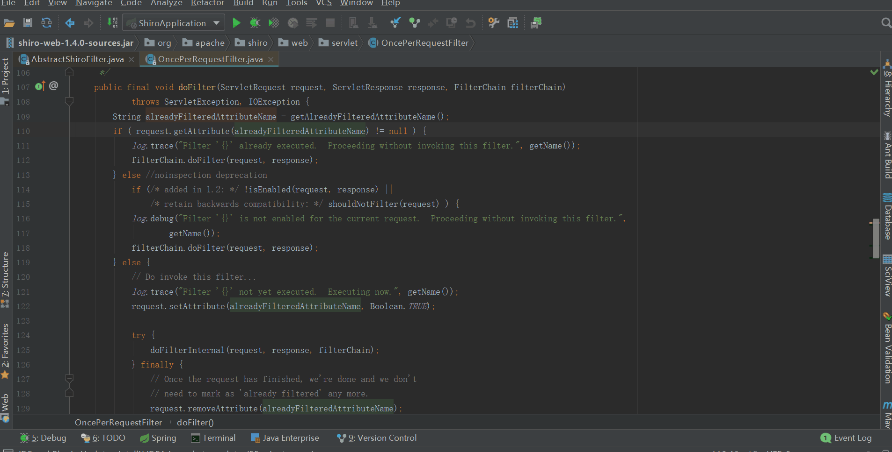

## 前言

开心一刻

老师对小明说："乳就是小的意思，比如乳猪就是小猪，乳名就是小名，请你用乳字造个句"  
小明："我家很穷，只能住在40平米的乳房"  
老师："..., 这个不行，换一个"  
小明："我每天上学都要跳过我家门口的一条乳沟"  
老师："......, 这个也不行，再换一个"  
小明："老师，我想不出来了，把我的乳头都想破了！"

路漫漫其修远兮，吾将上下而求索！

github：<https://github.com/youzhibing>

码云(gitee)：<https://gitee.com/youzhibing>

## 前情回顾

[shiro的session创建](https://www.cnblogs.com/youzhibing/p/9679134.html)与[session的查询、更新、过期、删除](https://www.cnblogs.com/youzhibing/p/9810342.html)中，shiro对session的操作基本都讲到了，但还缺一个session共享没有讲解；session共享的原理其实在[自定义session管理](https://www.cnblogs.com/youzhibing/p/9568178.html)一文已经讲过了，本文不讲原理，只看看shiro的session共享的实现。

###  为何需要session共享

如果是单机应用，那么谈不上session共享，session放哪都无所谓，不在乎放到默认的servlet容器中，还是抽出来放到单独的地方；

也就是说session共享是针对集群（或分布式、或分布式集群）的；如果不做session共享，仍然采用默认的方式（session存放到默认的servlet容器），当我们的应用是以集群的方式发布的时候，同个用户的请求会被分发到不同的集群节点（分发依赖具体的负载均衡规则），那么每个处理同个用户请求的节点都会重新生成该用户的session，这些session之间是毫无关联的。那么同个用户的请求会被当成多个不同用户的请求，这肯定是不行的。

###  如何实现session共享

实现方式其实有很多，甚至可以不做session共享，具体有哪些，大家自行去查资料。本文提供一种方式：redis实现session共享，就是将session从servlet容器抽出来，放到redis中存储，所有集群节点都从redis中对session进行操作。

## SessionDAO

SessionDAO其实是用于session持久化的，但里面有缓存部分，具体细节我们往下看

shiro已有SessionDAO的实现如下

SessionDAO接口提供的方法如下

    
    
    package org.apache.shiro.session.mgt.eis;
    
    import org.apache.shiro.session.Session;
    import org.apache.shiro.session.UnknownSessionException;
    
    import java.io.Serializable;
    import java.util.Collection;
    
    
    /**
     * 从EIS操作session的规范（EIS：例如关系型数据库, 文件系统, 持久化缓存等等, 具体依赖DAO实现）
     * 提供了典型的CRUD的方法：create, readSession, update, delete
     */
    public interface SessionDAO {
    
        /**
         * 插入一个新的sesion记录到EIS 
         */
        Serializable create(Session session);
    
        /**
         * 根据会话ID获取会话
         */
        Session readSession(Serializable sessionId) throws UnknownSessionException;
    
        /**
         * 更新session; 如更新session最后访问时间/停止会话/设置超时时间/设置移除属性等会调用
         */
        void update(Session session) throws UnknownSessionException;
    
        /**
         * 删除session; 当会话过期/会话停止（如用户退出时）会调用
         */
        void delete(Session session);
    
        /**
         * 获取当前所有活跃session, 所有状态不是stopped/expired的session
         * 如果用户量多此方法影响性能
         */
        Collection<Session> getActiveSessions();
    }

View Code

SessionDAO给出了从持久层（一般而言是关系型数据库）操作session的标准。

AbstractSessionDAO提供了SessionDAO的基本实现，如下

    
    
    package org.apache.shiro.session.mgt.eis;
    
    import org.apache.shiro.session.Session;
    import org.apache.shiro.session.UnknownSessionException;
    import org.apache.shiro.session.mgt.SimpleSession;
    
    import java.io.Serializable;
    
    
    /**
     * SessionDAO的抽象实现, 在会话创建和读取时做一些健全性检查，并在需要时允许可插入的会话ID生成策略.
     * SessionDAO的update和delete则留给子类来实现
     * EIS需要子类自己实现
     */
    public abstract class AbstractSessionDAO implements SessionDAO {
    
        /**
         * sessionId生成器
         */
        private SessionIdGenerator sessionIdGenerator;
    
        public AbstractSessionDAO() {
            this.sessionIdGenerator = new JavaUuidSessionIdGenerator();    // 指定JavaUuidSessionIdGenerator为默认sessionId生成器
        }
    
        /**
         * 获取sessionId生成器
         */
        public SessionIdGenerator getSessionIdGenerator() {
            return sessionIdGenerator;
        }
    
        /**
         * 设置sessionId生成器
         */
        public void setSessionIdGenerator(SessionIdGenerator sessionIdGenerator) {
            this.sessionIdGenerator = sessionIdGenerator;
        }
    
        /**
         * 生成一个新的sessionId, 并将它应用到session实例
         */
        protected Serializable generateSessionId(Session session) {
            if (this.sessionIdGenerator == null) {
                String msg = "sessionIdGenerator attribute has not been configured.";
                throw new IllegalStateException(msg);
            }
            return this.sessionIdGenerator.generateId(session);
        }
    
        /**
         * SessionDAO中create实现; 将创建的sesion保存到EIS.
         * 子类doCreate方法的代理，具体的细节委托给了子类的doCreate方法
         */
        public Serializable create(Session session) {
            Serializable sessionId = doCreate(session);
            verifySessionId(sessionId);
            return sessionId;
        }
    
        /**
         * 保证从doCreate返回的sessionId不是null，并且不是已经存在的.
         * 目前只实现了null校验，是否已存在是没有校验的，可能shiro的开发者会在后续补上吧.
         */
        private void verifySessionId(Serializable sessionId) {
            if (sessionId == null) {
                String msg = "sessionId returned from doCreate implementation is null.  Please verify the implementation.";
                throw new IllegalStateException(msg);
            }
        }
    
        /**
         * 分配sessionId给session实例
         */
        protected void assignSessionId(Session session, Serializable sessionId) {
            ((SimpleSession) session).setId(sessionId);
        }
    
        /**
         * 子类通过实现此方法来持久化Session实例到EIS.
         */
        protected abstract Serializable doCreate(Session session);
    
        /**
         * SessionDAO中readSession实现; 通过sessionId从EIS获取session对象.
         * 子类doReadSession方法的代理，具体的获取细节委托给了子类的doReadSession方法.
         */
        public Session readSession(Serializable sessionId) throws UnknownSessionException {
            Session s = doReadSession(sessionId);
            if (s == null) {
                throw new UnknownSessionException("There is no session with id [" + sessionId + "]");
            }
            return s;
        }
    
        /**
         * 子类通过实现此方法从EIS获取session实例
         */
        protected abstract Session doReadSession(Serializable sessionId);
    
    }

View Code

SessionDao的基本实现，实现了SessionDao的create、readSession（具体还是依赖AbstractSessionDAO子类的doCreate、doReadSession实现）；同时加入了自己的sessionId生成器，负责sessionId的操作。

CachingSessionDAO提供了session缓存的功能，如下

    
    
    package org.apache.shiro.session.mgt.eis;
    
    import org.apache.shiro.cache.Cache;
    import org.apache.shiro.cache.CacheManager;
    import org.apache.shiro.cache.CacheManagerAware;
    import org.apache.shiro.session.Session;
    import org.apache.shiro.session.UnknownSessionException;
    import org.apache.shiro.session.mgt.ValidatingSession;
    
    import java.io.Serializable;
    import java.util.Collection;
    import java.util.Collections;
    
    /**
     * 应用层与持久层(EIS，如关系型数据库、文件系统、NOSQL)之间的缓存层实现
     * 缓存着所有激活状态的session
     * 实现了CacheManagerAware，会在shiro加载的过程中调用此对象的setCacheManager方法
     */
    public abstract class CachingSessionDAO extends AbstractSessionDAO implements CacheManagerAware {
    
        /**
         * 激活状态的sesion的默认缓存名
         */
        public static final String ACTIVE_SESSION_CACHE_NAME = "shiro-activeSessionCache";
    
        /**
         * 缓存管理器，用来获取session缓存
         */
        private CacheManager cacheManager;
    
        /**
         * 用来缓存session的缓存实例
         */
        private Cache<Serializable, Session> activeSessions;
    
        /**
         * session缓存名, 默认是ACTIVE_SESSION_CACHE_NAME.
         */
        private String activeSessionsCacheName = ACTIVE_SESSION_CACHE_NAME;
    
        public CachingSessionDAO() {
        }
    
        /**
         * 设置缓存管理器
         */
        public void setCacheManager(CacheManager cacheManager) {
            this.cacheManager = cacheManager;
        }
    
        /**
         * 获取缓存管理器
         */
        public CacheManager getCacheManager() {
            return cacheManager;
        }
    
        /**
         * 获取缓存实例的名称，也就是获取activeSessionsCacheName的值
         */
        public String getActiveSessionsCacheName() {
            return activeSessionsCacheName;
        }
    
        /**
         * 设置缓存实例的名称，也就是设置activeSessionsCacheName的值
         */
        public void setActiveSessionsCacheName(String activeSessionsCacheName) {
            this.activeSessionsCacheName = activeSessionsCacheName;
        }
    
        /**
         * 获取缓存实例
         */
        public Cache<Serializable, Session> getActiveSessionsCache() {
            return this.activeSessions;
        }
    
        /**
         * 设置缓存实例
         */
        public void setActiveSessionsCache(Cache<Serializable, Session> cache) {
            this.activeSessions = cache;
        }
    
        /**
         * 获取缓存实例
         * 注意：不会返回non-null值
         *
         * @return the active sessions cache instance.
         */
        private Cache<Serializable, Session> getActiveSessionsCacheLazy() {
            if (this.activeSessions == null) {
                this.activeSessions = createActiveSessionsCache();
            }
            return activeSessions;
        }
    
        /**
         * 创建缓存实例
         */
        protected Cache<Serializable, Session> createActiveSessionsCache() {
            Cache<Serializable, Session> cache = null;
            CacheManager mgr = getCacheManager();
            if (mgr != null) {
                String name = getActiveSessionsCacheName();
                cache = mgr.getCache(name);
            }
            return cache;
        }
    
        /**
         * AbstractSessionDAO中create的重写
         * 调用父类(AbstractSessionDAO)的create方法, 然后将session缓存起来
         * 返回sessionId
         */
        public Serializable create(Session session) {
            Serializable sessionId = super.create(session);    // 调用父类的create方法
            cache(session, sessionId);                        // 以sessionId作为key缓存session
            return sessionId;
        }
    
        /**
         * 从缓存中获取session; 若sessionId为null，则返回null
         */
        protected Session getCachedSession(Serializable sessionId) {
            Session cached = null;
            if (sessionId != null) {
                Cache<Serializable, Session> cache = getActiveSessionsCacheLazy();
                if (cache != null) {
                    cached = getCachedSession(sessionId, cache);
                }
            }
            return cached;
        }
    
        /**
         * 从缓存中获取session
         */
        protected Session getCachedSession(Serializable sessionId, Cache<Serializable, Session> cache) {
            return cache.get(sessionId);
        }
    
        /**
         * 缓存session，以sessionId作为key
         */
        protected void cache(Session session, Serializable sessionId) {
            if (session == null || sessionId == null) {
                return;
            }
            Cache<Serializable, Session> cache = getActiveSessionsCacheLazy();
            if (cache == null) {
                return;
            }
            cache(session, sessionId, cache);
        }
    
        protected void cache(Session session, Serializable sessionId, Cache<Serializable, Session> cache) {
            cache.put(sessionId, session);
        }
    
        /**
         * AbstractSessionDAO中readSession的重写
         * 先从缓存中获取，若没有则调用父类的readSession方法获取session
         */
        public Session readSession(Serializable sessionId) throws UnknownSessionException {
            Session s = getCachedSession(sessionId);        // 从缓存中获取
            if (s == null) {
                s = super.readSession(sessionId);           // 调用父类readSession方法获取
            }
            return s;
        }
    
        /**
         * SessionDAO中update的实现
         * 更新session的状态
         */
        public void update(Session session) throws UnknownSessionException {
            doUpdate(session);                               // 更新EIS中的session
            if (session instanceof ValidatingSession) {
                if (((ValidatingSession) session).isValid()) {
                    cache(session, session.getId());         // 更新缓存中的session
                } else {
                    uncache(session);                        // 移除缓存中的sesson
                }
            } else {
                cache(session, session.getId());
            }
        }
    
        /**
         * 由子类去实现，持久化session到EIS
         */
        protected abstract void doUpdate(Session session);
    
        /**
         * SessionDAO中delete的实现
         * 删除session
         */
        public void delete(Session session) {
            uncache(session);                                // 从缓存中移除
            doDelete(session);                               // 从EIS中删除
        }
    
        /**
         * 由子类去实现，从EIS中删除session
         */
        protected abstract void doDelete(Session session);
    
        /**
         * 从缓存中移除指定的session
         */
        protected void uncache(Session session) {
            if (session == null) {
                return;
            }
            Serializable id = session.getId();
            if (id == null) {
                return;
            }
            Cache<Serializable, Session> cache = getActiveSessionsCacheLazy();
            if (cache != null) {
                cache.remove(id);
            }
        }
    
        /**
         * SessionDAO中getActiveSessions的实现
         * 获取所有的存活的session
         */
        public Collection<Session> getActiveSessions() {
            Cache<Serializable, Session> cache = getActiveSessionsCacheLazy();
            if (cache != null) {
                return cache.values();
            } else {
                return Collections.emptySet();
            }
        }
    }

View Code

是应用层与持久化层之间的缓存层，不用频繁请求持久化层以提升效率。重写了AbstractSessionDAO中的create、readSession方法，实现了SessionDAO中的update、delete、getActiveSessions方法，预留doUpdate和doDelele给子类去实现（doXXX方法操作的是持久层）

MemorySessionDAO，SessionDAO的简单内存实现，如下

    
    
    package org.apache.shiro.session.mgt.eis;
    
    import org.apache.shiro.session.Session;
    import org.apache.shiro.session.UnknownSessionException;
    import org.apache.shiro.util.CollectionUtils;
    import org.slf4j.Logger;
    import org.slf4j.LoggerFactory;
    
    import java.io.Serializable;
    import java.util.Collection;
    import java.util.Collections;
    import java.util.concurrent.ConcurrentHashMap;
    import java.util.concurrent.ConcurrentMap;
    
    
    /**
     * 基于内存的SessionDao的简单实现，所有的session存在ConcurrentMap中
     * DefaultSessionManager默认用的MemorySessionDAO
     */
    public class MemorySessionDAO extends AbstractSessionDAO {
    
        private static final Logger log = LoggerFactory.getLogger(MemorySessionDAO.class);
    
        private ConcurrentMap<Serializable, Session> sessions;                // 存放session的容器
    
        public MemorySessionDAO() {
            this.sessions = new ConcurrentHashMap<Serializable, Session>();
        }
    
        // AbstractSessionDAO 中doCreate的重写; 将session存入sessions
        protected Serializable doCreate(Session session) {
            Serializable sessionId = generateSessionId(session);        // 生成sessionId
            assignSessionId(session, sessionId);                        // 将sessionId赋值到session
            storeSession(sessionId, session);                            // 存储session到sessions
            return sessionId;
        }
    
        // 存储session到sessions
        protected Session storeSession(Serializable id, Session session) {
            if (id == null) {
                throw new NullPointerException("id argument cannot be null.");
            }
            return sessions.putIfAbsent(id, session);
        }
    
        // AbstractSessionDAO 中doReadSession的重写; 从sessions中获取session
        protected Session doReadSession(Serializable sessionId) {
            return sessions.get(sessionId);
        }
    
        // SessionDAO中update的实现; 更新sessions中指定的session
        public void update(Session session) throws UnknownSessionException {
            storeSession(session.getId(), session);
        }
    
        // SessionDAO中delete的实现; 从sessions中移除指定的session
        public void delete(Session session) {
            if (session == null) {
                throw new NullPointerException("session argument cannot be null.");
            }
            Serializable id = session.getId();
            if (id != null) {
                sessions.remove(id);
            }
        }
    
        // SessionDAO中SessionDAO中delete的实现的实现; 获取sessions中全部session
        public Collection<Session> SessionDAO中delete的实现() {
            Collection<Session> values = sessions.values();
            if (CollectionUtils.isEmpty(values)) {
                return Collections.emptySet();
            } else {
                return Collections.unmodifiableCollection(values);
            }
        }
    
    }

View Code

将session保存在内存中，存储结构是ConcurrentHashMap；项目中基本不用，即使我们不实现自己的SessionDAO，一般用的也是EnterpriseCacheSessionDAO。

EnterpriseCacheSessionDAO，提供了缓存功能的session维护，如下

    
    
    package org.apache.shiro.session.mgt.eis;
    
    import org.apache.shiro.cache.AbstractCacheManager;
    import org.apache.shiro.cache.Cache;
    import org.apache.shiro.cache.CacheException;
    import org.apache.shiro.cache.MapCache;
    import org.apache.shiro.session.Session;
    
    import java.io.Serializable;
    import java.util.concurrent.ConcurrentHashMap;
    
    public class EnterpriseCacheSessionDAO extends CachingSessionDAO {
    
        public EnterpriseCacheSessionDAO() {
            
            // 设置默认缓存器，并实例化MapCache作为cache实例
            setCacheManager(new AbstractCacheManager() {
                @Override
                protected Cache<Serializable, Session> createCache(String name) throws CacheException {
                    return new MapCache<Serializable, Session>(name, new ConcurrentHashMap<Serializable, Session>());
                }
            });
        }
    
        // AbstractSessionDAO中doCreate的重写; 
        protected Serializable doCreate(Session session) {
            Serializable sessionId = generateSessionId(session);
            assignSessionId(session, sessionId);
            return sessionId;
        }
    
        // AbstractSessionDAO中doReadSession的重写
        protected Session doReadSession(Serializable sessionId) {
            return null; //should never execute because this implementation relies on parent class to access cache, which
            //is where all sessions reside - it is the cache implementation that determines if the
            //cache is memory only or disk-persistent, etc.
        }
    
        // CachingSessionDAO中doUpdate的重写
        protected void doUpdate(Session session) {
            //does nothing - parent class persists to cache.
        }
    
        // CachingSessionDAO中doDelete的重写
        protected void doDelete(Session session) {
            //does nothing - parent class removes from cache.
        }
    }

View Code

设置了默认的缓存管理器（AbstractCacheManager）和默认的缓存实例（MapCache），实现了缓存效果。从父类继承的持久化操作方法（doXXX）都是空实现，也就说EnterpriseCacheSessionDAO是没有实现持久化操作的，仅仅只是简单的提供了缓存实现。当然我们可以继承EnterpriseCacheSessionDAO，重写doXXX方法来实现持久化操作。

总结下：SessionDAO定义了从持久层操作session的标准；AbstractSessionDAO提供了SessionDAO的基础实现，如生成会话ID等；CachingSessionDAO提供了对开发者透明的session缓存的功能，只需要设置相应的
CacheManager
即可；MemorySessionDAO直接在内存中进行session维护；而EnterpriseCacheSessionDAO提供了缓存功能的session维护，默认情况下使用
MapCache
实现，内部使用ConcurrentHashMap保存缓存的会话。因为shiro不知道我们需要将session持久化到哪里（关系型数据库，还是文件系统），所以只提供了MemorySessionDAO持久化到内存（听起来怪怪的，内存中能说成持久层吗）

## shiro session共享

###  共享实现

shiro的session共享其实是比较简单的，重写CacheManager，将其操作指向我们的redis，然后实现我们自己的CachingSessionDAO定制缓存操作和缓存持久化。

自定义CacheManager

ShiroRedisCacheManager

    
    
    package com.lee.shiro.config;
    
    import org.apache.shiro.cache.Cache;
    import org.apache.shiro.cache.CacheException;
    import org.apache.shiro.cache.CacheManager;
    import org.springframework.beans.factory.annotation.Autowired;
    import org.springframework.stereotype.Component;
    
    @Component
    public class ShiroRedisCacheManager implements CacheManager {
    
        @Autowired
        private Cache shiroRedisCache;
    
        @Override
        public <K, V> Cache<K, V> getCache(String s) throws CacheException {
            return shiroRedisCache;
        }
    }

View Code

ShiroRedisCache

    
    
    package com.lee.shiro.config;
    
    import org.apache.shiro.cache.Cache;
    import org.apache.shiro.cache.CacheException;
    import org.springframework.beans.factory.annotation.Autowired;
    import org.springframework.beans.factory.annotation.Value;
    import org.springframework.data.redis.core.RedisTemplate;
    import org.springframework.stereotype.Component;
    
    import java.util.Collection;
    import java.util.Set;
    import java.util.concurrent.TimeUnit;
    
    @Component
    public class ShiroRedisCache<K,V> implements Cache<K,V>{
    
        @Autowired
        private RedisTemplate<K,V> redisTemplate;
    
        @Value("${spring.redis.expireTime}")
        private long expireTime;
    
        @Override
        public V get(K k) throws CacheException {
            return redisTemplate.opsForValue().get(k);
        }
    
        @Override
        public V put(K k, V v) throws CacheException {
            redisTemplate.opsForValue().set(k,v,expireTime, TimeUnit.SECONDS);
            return null;
        }
    
        @Override
        public V remove(K k) throws CacheException {
            V v = redisTemplate.opsForValue().get(k);
            redisTemplate.opsForValue().getOperations().delete(k);
            return v;
        }
    
        @Override
        public void clear() throws CacheException {
        }
    
        @Override
        public int size() {
            return 0;
        }
    
        @Override
        public Set<K> keys() {
            return null;
        }
    
        @Override
        public Collection<V> values() {
            return null;
        }
    }

View Code

自定义CachingSessionDAO

继承EnterpriseCacheSessionDAO，然后重新设置其CacheManager（替换掉默认的内存缓存器），这样也可以实现我们的自定义CachingSessionDAO，但是这是优选吗；如若我们实现持久化，继承EnterpriseCacheSessionDAO是优选，但如果只是实现session缓存，那么CachingSessionDAO是优选，自定义更灵活。那么我们还是继承CachingSessionDAO来实现我们的自定义CachingSessionDAO

ShiroSessionDAO

    
    
    package com.lee.shiro.config;
    
    import org.apache.shiro.session.Session;
    import org.apache.shiro.session.mgt.eis.CachingSessionDAO;
    import org.springframework.stereotype.Component;
    
    import java.io.Serializable;
    
    @Component
    public class ShiroSessionDAO extends CachingSessionDAO {
    
        @Override
        protected void doUpdate(Session session) {
        }
    
        @Override
        protected void doDelete(Session session) {
        }
    
        @Override
        protected Serializable doCreate(Session session) {
            // 这里绑定sessionId到session，必须要有
            Serializable sessionId = generateSessionId(session);
            assignSessionId(session, sessionId);
            return sessionId;
        }
    
        @Override
        protected Session doReadSession(Serializable sessionId) {
            return null;
        }
    }

View Code

最后将ShiroSessionDAO实例赋值给SessionManager实例，再讲SessionManager实例赋值给SecurityManager实例即可

具体代码请参考[spring-boot-shiro](https://gitee.com/youzhibing/spring-
boot-2.0.3/tree/master/spring-boot-shiro)

###  源码解析

底层还是利用Filter +
HttpServletRequestWrapper将对session的操作接入到自己的实现中来，而不走默认的servlet容器，这样对session的操作完全由我们自己掌握。

[shiro的session创建](https://www.cnblogs.com/youzhibing/p/9679134.html)中其实讲到了shiro中对session操作的基本流程，这里不再赘述，没看的朋友可以先去看看再回过头来看这篇。本文只讲shiro中，如何将一个请求的session接入到自己的实现中来的；shiro中有很多默认的filter，我会单独开一篇来讲shiro的filter，这篇我们先不纠结这些filter。

OncePerRequestFilter中doFilter方法如下

    
    
    public final void doFilter(ServletRequest request, ServletResponse response, FilterChain filterChain)
            throws ServletException, IOException {
        String alreadyFilteredAttributeName = getAlreadyFilteredAttributeName();
        if ( request.getAttribute(alreadyFilteredAttributeName) != null ) {    // 当前filter已经执行过了，进行下一个filter
            log.trace("Filter "{}" already executed.  Proceeding without invoking this filter.", getName());
            filterChain.doFilter(request, response);
        } else //noinspection deprecation
            if (/* added in 1.2: */ !isEnabled(request, response) ||
                /* retain backwards compatibility: */ shouldNotFilter(request) ) {    // 当前filter未被启用或忽略此filter，则进行下一个filter；shouldNotFilter已经被废弃了
            log.debug("Filter "{}" is not enabled for the current request.  Proceeding without invoking this filter.",
                    getName());
            filterChain.doFilter(request, response);
        } else {
            // Do invoke this filter...
            log.trace("Filter "{}" not yet executed.  Executing now.", getName());
            request.setAttribute(alreadyFilteredAttributeName, Boolean.TRUE);
    
            try {
                // 执行当前filter
                doFilterInternal(request, response, filterChain);
            } finally {
                // 一旦请求完成，我们清除当前filter的"已经过滤"的状态
                request.removeAttribute(alreadyFilteredAttributeName);
            }
        }
    }

View Code

上图中，我可以看到AbstractShiroFilter的doFilterInternal放中将request封装成了shiro自定义的ShiroHttpServletRequest，将response也封装成了shiro自定义的ShiroHttpServletResponse。既然Filter中将request封装了ShiroHttpServletRequest，那么到我们应用的request就是ShiroHttpServletRequest类型，也就是说我们对session的操作最终都是由shiro完成的，而不是默认的servlet容器。

另外补充一点，shiro的session创建不是懒创建的。servlet容器中的session创建是第一次请求session（第一调用request.getSession()）时才创建。shiro的session创建如下图

此时，还没登录，但是subject、session已经创建了，只是subject的认证状态为false，说明还没进行登录认证的。至于session创建过程已经保存到redis的流程需要大家自行去跟，或者阅读我之前的博文

## 总结

1、当以集群方式对外提供服务的时候，不做session共享也是可以的

可以通过ip_hash的机制将同个ip的请求定向到同一台后端，这样保证用户的请求始终是同一台服务处理，与单机应用基本一致了；但这有很多方面的缺陷（具体就不详说了），不推荐使用。

2、servlet容器之间做session同步也是可以实现session共享的

一个servlet容器生成session，其他节点的servlet容器从此servlet容器进行session同步，以达到session信息一致。这个也不推荐，某个时间点会有session不一致的问题，毕竟同步过程受到各方面的影响，不能保证session实时一致。

3、session共享实现的原理其实都是一样的，都是filter +
HttpServletRequestWrapper，只是实现细节会有所区别；有兴趣的可以看下spring-session的实现细节。

4、如果我们采用的spring集成shiro，其实可以将缓存管理器交由spring管理，相当于由spring统一管理缓存。

5、shiro的CacheManager不只是管理session缓存，还管理着身份认证缓存、授权缓存，shiro的缓存都是CacheManager管理。但是身份认证缓存默认是关闭的，个人也不推荐开启。

6、shiro的session创建时机是在登录认证之前，而不是第一次调用getSession()时。

## 参考

《跟我学shiro》

