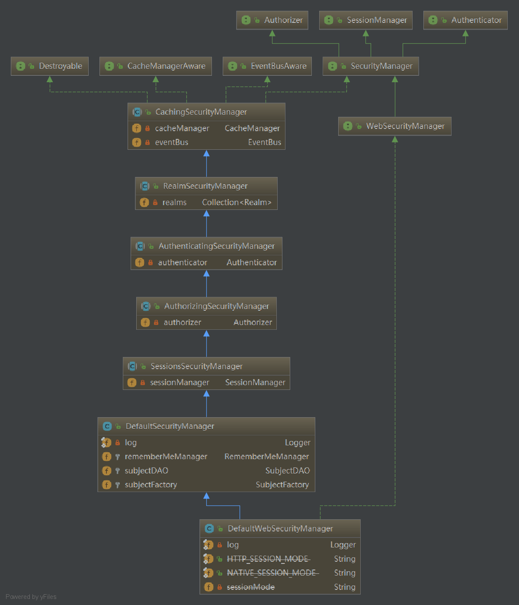
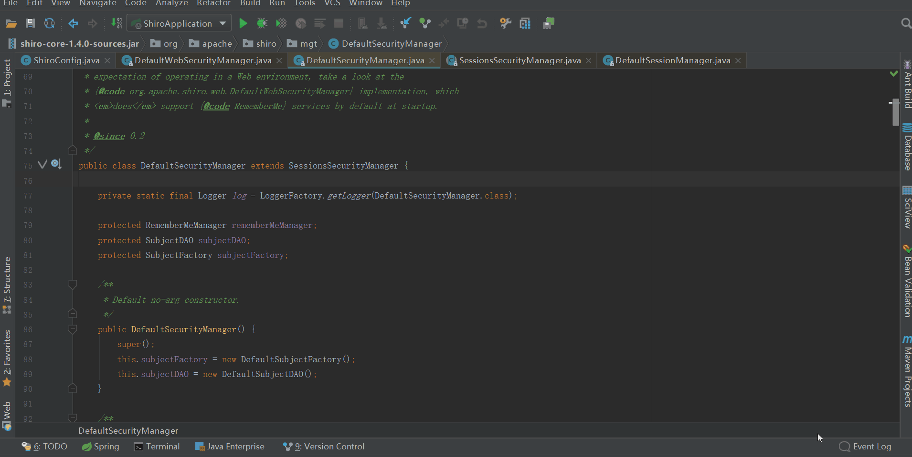
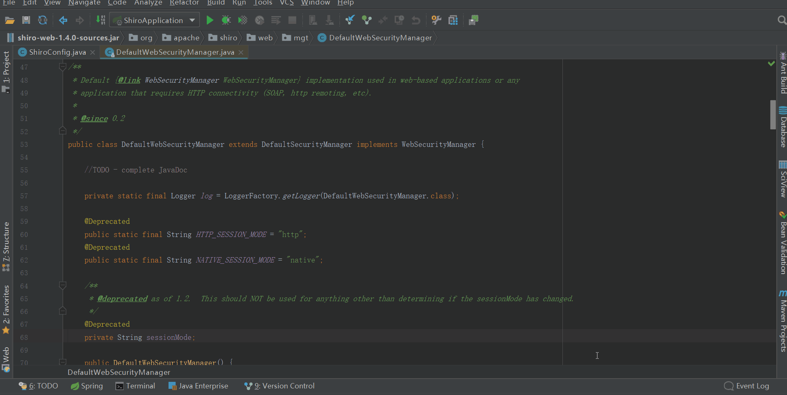
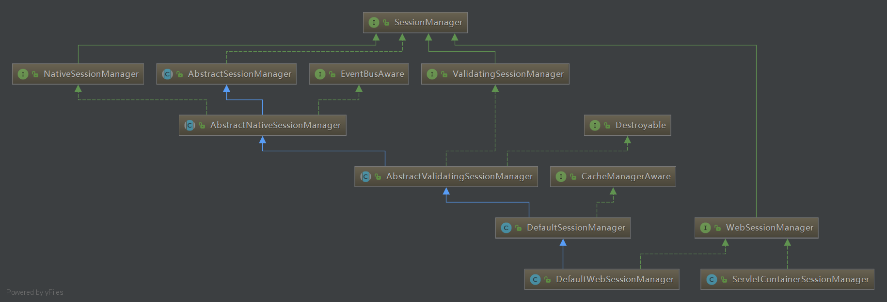
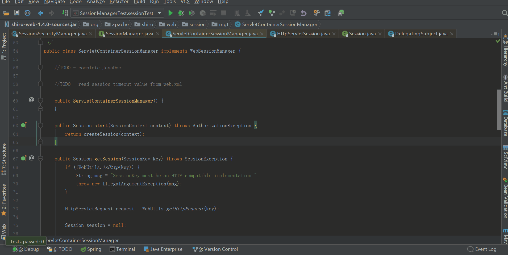

## 前言

开心一刻

开学了，表弟和同学因为打架，老师让他回去叫家长。表弟硬气的说：不用，我打得过他。老师板着脸对他说：和你打架的那位同学已经回去叫家长了。表弟犹豫了一会依然硬气的说：可以，两个我也打得过。老师：......

路漫漫其修远兮，吾将上下而求索！

github：[https://github.com/youzhibing](https://github.com/youzhibing)

码云(gitee)：[https://gitee.com/youzhibing](https://gitee.com/youzhibing)

## 前情回顾

大家还记得[上篇博文](https://www.cnblogs.com/youzhibing/p/9568178.html)讲了什么吗，我们来一起简单回顾下：

HttpServletRequestWrapper是HttpServletRequest的装饰类，我们通过继承HttpServletRequestWrapper来实现我们自定义的HttpServletRequest：CustomizeSessionHttpServletRequest，重写CustomizeSessionHttpServletRequest的getSession，将其指向我们自定义的session。然后通过Filter将CustomizeSessionHttpServletRequest添加到Filter
chain中，使得到达Servlet的ServletRequest是我们的CustomizeSessionHttpServletRequest。

今天不讲session共享，我们先来看看shiro的session创建

## SecurityManager

SecurityManager，安全管理器；即所有与安全相关的操作都会与SecurityManager交互；它管理着所有Subject，所有Subject都绑定到SecurityManager，与Subject的所有交互都会委托给SecurityManager；SecurityManager是shiro的核心，它负责与shiro的其他组件进行交互，类似SpringMVC中的DispatcherServlet或Struts2中的FilterDispatcher。

我们在使用shiro的时候，首先都会先初始化SecurityManager，然后往SecurityManager中注入shiro的其他组件，像sessionManager、realm等。我们的[spring-
boot-shiro](https://gitee.com/youzhibing/spring-boot-2.0.3/tree/master/spring-
boot-shiro)中初始化的是DefaultWebSecurityManager，如下

    
    
    @Bean
    public SecurityManager securityManager(AuthorizingRealm myShiroRealm, CacheManager shiroRedisCacheManager) {
        DefaultWebSecurityManager securityManager = new DefaultWebSecurityManager();
        securityManager.setCacheManager(shiroRedisCacheManager);
        securityManager.setRememberMeManager(cookieRememberMeManager());
        securityManager.setRealm(myShiroRealm);
        return securityManager;
    }

View Code

###  SecurityManager类图

结构如下，认真看看，注意看下属性

顶层组件SecurityManager直接继承了SessionManager且提供了SessionsSecurityManager实现，SessionsSecurityManager直接把会话管理委托给相应的SessionManager；SecurityManager的默认实现：DefaultSecurityManager及DefaultWebSecurityManager都继承了SessionsSecurityManager，也就是说：默认情况下，session的管理由DefaultSecurityManager或DefaultWebSecurityManager中的SessionManager来负责。

###  DefaultSecurityManager

默认安全管理器，用于我们的javaSE安全管理，一般而言用到的少，但我们需要记住，万一哪次有这个需求呢。

我们来看下他的构造方法

默认的sessionManager是DefaultSessionManager，DefaultSessionManager具体详情请看下文。

###  DefaultWebSecurityManager

默认web安全管理器，用于我们的web安全管理；一般而言，我们的应用中初始化此安全管理器。

我们来看看其构造方法

    
    
    public DefaultWebSecurityManager() {
        super();                                                    // 会调用SessionsSecurityManager的构造方法，实例化DefaultSessionManager
        ((DefaultSubjectDAO) this.subjectDAO).setSessionStorageEvaluator(new DefaultWebSessionStorageEvaluator());
        this.sessionMode = HTTP_SESSION_MODE;
        setSubjectFactory(new DefaultWebSubjectFactory());
        setRememberMeManager(new CookieRememberMeManager());
        setSessionManager(new ServletContainerSessionManager());    // 设置sessionManager，替换掉上面的DefaultSessionManager
    }

View Code

可以看出此时的sessionManager是ServletContainerSessionManager，ServletContainerSessionManager具体详情请看下文。

由此可知默认情况下，DefaultSecurityManager会将session管理委托给DefaultSessionManager，而DefaultWebSecurityManager则将session管理委托给ServletContainerSessionManager。

我们可以通过继承DefaultSecurityManager或DefaultWebSecurityManager来实现自定义SecurityManager，但一般而言没必要，DefaultSecurityManager和DefaultWebSecurityManager基本能满足我们的需要了，我们根据需求二选其一即可。无论DefaultSecurityManager还是DefaultWebSecurityManager，我们都可以通过setSessionManager方法来指定sessionManager，如果不指定sessionManager的话就用的SecurityManager默认的sessionManager。

## SessionManager

shiro提供了完整的会话管理功能，不依赖底层容器，JavaSE应用和JavaEE应用都可以使用。会话管理器管理着应用中所有Subject的会话，包括会话的创建、维护、删除、失效、验证等工作。

###  SessionManager类图

###  DefaultSessionManager

DefaultSecurityManager默认使用的SessionManager，用于JavaSE环境的session管理。

通过上图可知（结合SecurityManager类图），session创建的关键入口是SessionsSecurityManager的start方法，此方法中会将session的创建任务委托给具体的SessionManager实现。

DefaultSessionManager继承自AbstractNativeSessionManager，没用重写start方法，所以此时AbstractNativeSessionManager的start方法会被调用，start方法如下

    
    
    public Session start(SessionContext context) {
        Session session = createSession(context);            // 创建session，类型是SimpleSession
        applyGlobalSessionTimeout(session);                    // 设置session的timeout，也就是有效时间，默认30分钟
        onStart(session, context);                            
        notifyStart(session);                                // 通知session监听器
        //Don"t expose the EIS-tier Session object to the client-tier:
        return createExposedSession(session, context);        // 创建对外暴露的session，SimpleSession的代理；类型是DelegatingSession，持有sessionManager的引用
    }

View Code

跟进createSession()，代码入下

    
    
    protected Session createSession(SessionContext context) throws AuthorizationException {
        enableSessionValidationIfNecessary();        // 初次被调用时启动定时任务来验证session，具体请看下篇博客
        return doCreateSession(context);            // 真正创建session
    }

View Code

其中doCreateSession方法完成session的创建，doCreateSession方法大家可以自行去跟下，我在这总结一下：

创建session，并生成sessionId，session是shiro的SimpleSession类型，sessionId采用的是随机的UUID字符串；  
sessionDAO类型是MemorySessionDAO，session存放在sessionDAO的private
ConcurrentMap<Serializable, Session>
sessions;属性中，key是sessionId，value是session对象；  
除了MemorySessionDAO，shiro还提供了EnterpriseCacheSessionDAO，具体两者有啥区别请看我的[另一篇博客](https://www.cnblogs.com/youzhibing/p/9749427.html)讲解。

###  ServletContainerSessionManager

DefaultWebSecurityManager默认使用的SessionManager，用于Web环境，直接使用的Servlet容器的会话，具体实现我们往下看。

ServletContainerSessionManager实现了SessionManager，并重写了SessionManager的start方法，那么我们从ServletContainerSessionManager的start方法开始来看看session的创建过程，如下图

shiro有自己的HttpServletSession，HttpServletSession持有servlet的HttpSession的引用，最终对HttpServletSession的操作都会委托给HttpSession（[装饰模式](https://www.cnblogs.com/youzhibing/p/9568178.html)）。那么此时的session是标准servlet容器支持的HttpSession实例，它不与Shiro的任何与会话相关的组件（如SessionManager，SecurityManager等）交互，完全由servlet容器管理。

###  DefaultWebSessionManager

用于Web环境，可以替换ServletContainerSessionManager，废弃了Servlet容器的会话管理；通过此可以实现我们自己的session管理；

从SessionManager类图可知，DefaultWebSessionManager继承自DefaultSessionManager，也没有重写start方法，那么创建过程还是沿用的AbstractNativeSessionManager的start方法；如果我们没有指定自己的sessionDao，那么session还是存在MemorySessionDAO的ConcurrentMap<Serializable,
Session> sessions中，具体可以看上述中的DefaultSessionManager。

通过DefaultWebSessionManager实现session共享，请点[此处](https://www.cnblogs.com/youzhibing/p/9749427.html)！

## 总结

SecurityManager和SessionManager的类图需要认真看看；

Subject的所有交互都会委托给SecurityManager；SecurityManager是shiro的核心，它负责与shiro的其他组件进行交互，类似SpringMVC中的DispatcherServlet或Struts2中的FilterDispatcher；

SecurityManager会将session管理委托给SessionManager；SessionsSecurityManager的start方法中将session的创建委托给了具体的sessionManager，是创建session的关键入口。  
shiro的SimpleSession与HttpServletSession  
HttpServletSession只是servlet容器的session的装饰，最终还是依赖servlet容器，是shiro对servlet容器的session的一种支持；  
而SimpleSession是shiro完完全全的自己实现，是shiro对session的一种拓展。但SimpleSession不对外暴露，我们一般操作的是SimpleSession的代理：DelegatingSession，或者是DelegatingSession的代理：StoppingAwareProxiedSession；对session的操作，会通过一层层代理，来到DelegatingSession，DelegatingSession将session的操作转交给sessionMananger，sessionManager通过一些校验后，最后转交给SimpleSession处理。

## 参考

《跟我学shiro》

