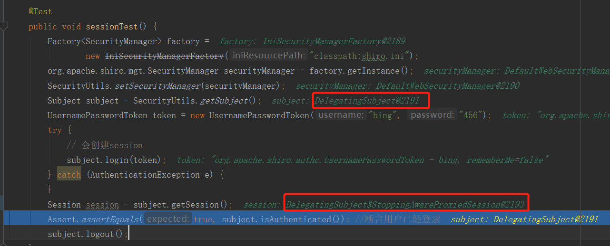
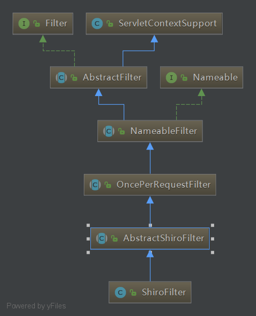
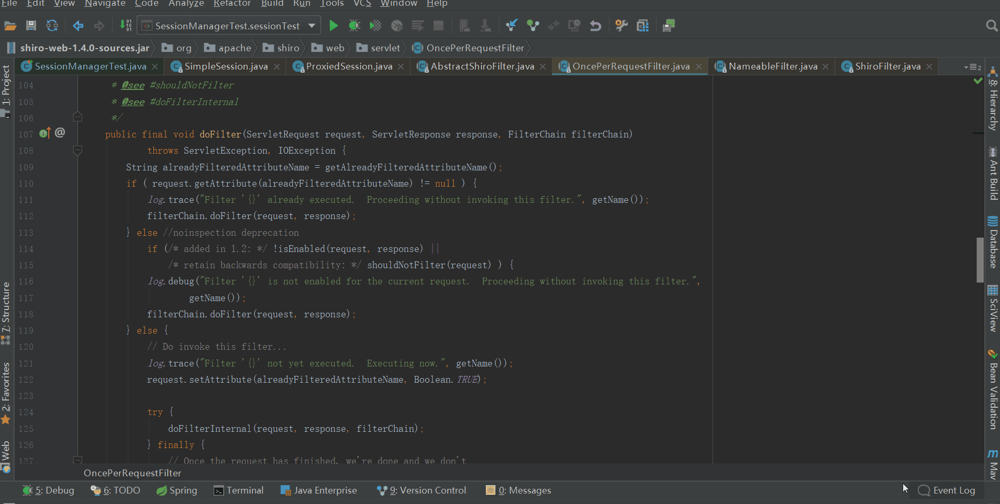
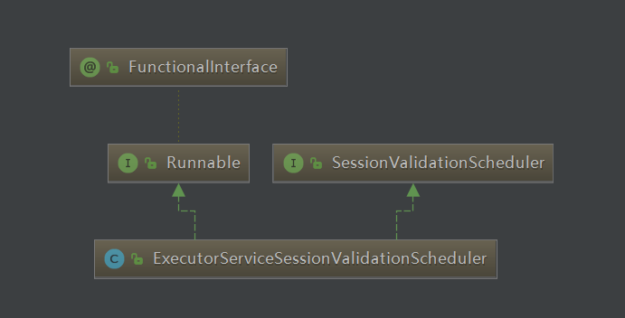

## 前言

开心一刻

老公酷爱网络游戏，老婆无奈，只得告诫他：你玩就玩了，但是千万不可以在游戏里找老婆，不然，哼哼。。。  
老公嘴角露出了微笑：放心吧亲爱的，我绝对不会在游戏里找老婆的！因为我有老公！  
老婆：......

路漫漫其修远兮，吾将上下而求索！

github：[https://github.com/youzhibing](https://github.com/youzhibing)

码云(gitee)：[https://gitee.com/youzhibing](https://gitee.com/youzhibing)

## 前情回顾

大家还记得[上篇博文](https://www.cnblogs.com/youzhibing/p/9679134.html)讲了什么吗，我们来一起简单回顾下：

SecurityManager是shiro的核心，负责与shiro的其他组件进行交互；SessionManager是session的真正管理者，负责shiro的session管理；

SessionsSecurityManager的start方法中将session的创建委托给了具体的sessionManager，是创建session的关键入口。

SimpleSession是shiro完完全全的自己实现，是shiro对session的一种拓展；实现了ValidatingSession接口，具有自我校验的功能；一般不对外暴露，暴露的往往是他的代理：DelegatingSession；SimpleSession有几个属性值得重点关注下，如下

id：就是session id；

startTimestamp：session的创建时间；

stopTimestamp：session的失效时间；

lastAccessTime：session的最近一次访问时间，初始值是startTimestamp

timeout：session的有效时长，默认30分钟

expired：session是否到期

attributes：session的属性容器

## 查询

session的创建完成后，会将session（SimpleSession类型）对象的代理对象（DelegatingSession）装饰成StoppingAwareProxiedSession对象，然后绑定到subject（类型是DelegatingSubject）；

Session session =
subject.getSession();返回的就是绑定在当前subjuct的session。注意subject的实际类型是：DelegatingSubject，如下图

## 刷新

shiro的Session接口提供了一个touch方法，负责session的刷新；session的代理对象最终会调用SimpleSession的touch()：

    
    
    public void touch() {
        this.lastAccessTime = new Date();        // 更新最后被访问时间为当前时间
    }

但是touch方法是什么时候被调用的呢？JavaSE需要我们自己定期的调用session的touch()
去更新最后访问时间；如果是Web应用，每次进入ShiroFilter都会自动调用session.touch()来更新最后访问时间，ShiroFilter的类图如下：

ShiroFilter自动调用session.touch()如下

## 过期

如果是让我们自己实现session过期的判断，我们会怎么做了？我们来看看shiro是怎么做的，或许我们能够从中学到一些经验。

###  启动校验定时任务

还记得AbstractValidatingSessionManager中createSession方法吗？在调用doCreateSession方法之前调用enableSessionValidationIfNecessary()，enableSessionValidationIfNecessary代码如下

    
    
    private void enableSessionValidationIfNecessary() {
        // 获取session验证调度器
        SessionValidationScheduler scheduler = getSessionValidationScheduler();
        // session验证调度器开启 && (调度器为空或调度器不可用)
        if (isSessionValidationSchedulerEnabled() && (scheduler == null || !scheduler.isEnabled())) {
            enableSessionValidation();        // 开启session验证
        }
    }

View Code

第一次创建session的时候，如果session验证调度器启用（默认是启用），那么调用enableSessionValidation()，enableSessionValidation代码如下

    
    
    protected synchronized void enableSessionValidation() {
        SessionValidationScheduler scheduler = getSessionValidationScheduler();        // 获取调取器
        if (scheduler == null) {
            scheduler = createSessionValidationScheduler();                            // 创建调取器，实际类型是ExecutorServiceSessionValidationScheduler
            setSessionValidationScheduler(scheduler);                                // 将调度器绑定到sessionManager
        }
        // it is possible that that a scheduler was already created and set via "setSessionValidationScheduler()"
        // but would not have been enabled/started yet
        if (!scheduler.isEnabled()) {
            if (log.isInfoEnabled()) {
                log.info("Enabling session validation scheduler...");
            }
            scheduler.enableSessionValidation();                                    // 启动定时任务，验证session
            afterSessionValidationEnabled();                                        // 什么也没做，供继承，便于拓展
        }
    }

View Code

ExecutorServiceSessionValidationScheduler类图如下，它实现了Runnable接口  

调用scheduler的enableSessionValidation()，enableSessionValidation方法如下

    
    
    public void enableSessionValidation() {
        if (this.interval > 0l) {
            // 创建ScheduledExecutorService
            this.service = Executors.newSingleThreadScheduledExecutor(new ThreadFactory() {  
                private final AtomicInteger count = new AtomicInteger(1);
    
                public Thread newThread(Runnable r) {  
                    Thread thread = new Thread(r);  
                    thread.setDaemon(true);  
                    thread.setName(threadNamePrefix + count.getAndIncrement());
                    return thread;  
                }  
            });
            //  初始化service interval时长之后开始执行this的run方法，每隔interval执行一次；注意interval的单位是TimeUnit.MILLISECONDS
            this.service.scheduleAtFixedRate(this, interval, interval, TimeUnit.MILLISECONDS);    // this就是ExecutorServiceSessionValidationScheduler自己
        }
        this.enabled = true;
    }

View Code

###  session校验

定时（默认每隔60分钟）的调用ExecutorServiceSessionValidationScheduler的run方法，run方法中调用sessionManager的validateSessions方法来完成session的验证，validateSessions方法如下

    
    
    /**
     * @see ValidatingSessionManager#validateSessions()
     */
    public void validateSessions() {
        if (log.isInfoEnabled()) {
            log.info("Validating all active sessions...");
        }
    
        int invalidCount = 0;
    
        // 从sessionDao中获取全部的session
        // sessionDao可以是默认的MemorySessionDAO，也可以是我们定制的CachingSessionDAO
        Collection<Session> activeSessions = getActiveSessions();
    
        if (activeSessions != null && !activeSessions.isEmpty()) {
            // 一个一个校验
            for (Session s : activeSessions) {
                try {
                    //simulate a lookup key to satisfy the method signature.
                    //this could probably stand to be cleaned up in future versions:
                    SessionKey key = new DefaultSessionKey(s.getId());
                    validate(s, key);        // 真正校验的方法
                } catch (InvalidSessionException e) {
                    if (log.isDebugEnabled()) {
                        boolean expired = (e instanceof ExpiredSessionException);
                        String msg = "Invalidated session with id [" + s.getId() + "]" +
                                (expired ? " (expired)" : " (stopped)");
                        log.debug(msg);
                    }
                    invalidCount++;            // 统计上次到这次定时任务间隔内过期的session个数
                }
            }
        }
    
        if (log.isInfoEnabled()) {
            String msg = "Finished session validation.";
            if (invalidCount > 0) {
                msg += "  [" + invalidCount + "] sessions were stopped.";
            } else {
                msg += "  No sessions were stopped.";
            }
            log.info(msg);
        }
    }

View Code

validate方法如下

    
    
    protected void validate(Session session, SessionKey key) throws InvalidSessionException {
        try {
            doValidate(session);                    // 真正校验session
        } catch (ExpiredSessionException ese) {
            onExpiration(session, ese, key);        // 从sessionDao中删除过期的session
            throw ese;                                // 抛出异常供上层统计用
        } catch (InvalidSessionException ise) {
            onInvalidation(session, ise, key);        // 从sessionDao中删除不合法的session
            throw ise;                                // 抛出异常供上层统计用
        }
    }

View Code

通过捕获doValidate()抛出的异常来剔除过期的或不合法的session，并将异常接着往上抛，供上层统计过期数量。注意：ExpiredSessionException的父类是StoppedSessionException，而StoppedSessionException的父类是InvalidSessionException。

doValidate方法如下

    
    
    protected void doValidate(Session session) throws InvalidSessionException {
        if (session instanceof ValidatingSession) {
            ((ValidatingSession) session).validate();        // 校验session是否过期
        } else {                                            // 若session不是ValidatingSession类型，则抛出IllegalStateException异常
            String msg = "The " + getClass().getName() + " implementation only supports validating " +
                    "Session implementations of the " + ValidatingSession.class.getName() + " interface.  " +
                    "Please either implement this interface in your session implementation or override the " +
                    AbstractValidatingSessionManager.class.getName() + ".doValidate(Session) method to perform validation.";
            throw new IllegalStateException(msg);
        }
    }

View Code

若session不是ValidatingSession类型，则抛出IllegalStateException异常

validate方法如下

    
    
    public void validate() throws InvalidSessionException {
        //check for stopped:
        if (isStopped()) {                    
        // sesson已经停止了，则抛出StoppedSessionException；理论上来讲不会出现这种情况，但程序的事没有100%保障
            //timestamp is set, so the session is considered stopped:
            String msg = "Session with id [" + getId() + "] has been " +
                    "explicitly stopped.  No further interaction under this session is " +
                    "allowed.";
            throw new StoppedSessionException(msg);
        }
    
        //check for expiration
        if (isTimedOut()) {     // 校验是否过期，校验方法是：lastAccessTime是否小于(当前时间 - session有效时长)
            expire();            // 更新session的stopTimestamp为当前时间，session的expired为true
    
            //throw an exception explaining details of why it expired:
            Date lastAccessTime = getLastAccessTime();
            long timeout = getTimeout();
    
            Serializable sessionId = getId();
    
            DateFormat df = DateFormat.getInstance();
            String msg = "Session with id [" + sessionId + "] has expired. " +
                    "Last access time: " + df.format(lastAccessTime) +
                    ".  Current time: " + df.format(new Date()) +
                    ".  Session timeout is set to " + timeout / MILLIS_PER_SECOND + " seconds (" +
                    timeout / MILLIS_PER_MINUTE + " minutes)";
            if (log.isTraceEnabled()) {
                log.trace(msg);
            }
            throw new ExpiredSessionException(msg);    // 抛出ExpiredSessionException供上层使用
        }
    }

View Code

###  校验总结

1、sesion的有效时长默认30分钟；定时任务默认是每60分钟执行一次，第一次执行是在定时器初始化完成60分钟后执行；

2、session不是ValidatingSession类型，则抛出IllegalStateException异常；session已经停止了则抛出StoppedSessionException；session过期则抛出ExpiredSessionException异常；理论上来讲IllegalStateException与StoppedSessionException不会被抛出，应该全是ExpiredSessionException异常；ExpiredSessionException继承自StoppedSessionException，而StoppedSessionException又继承自IllegalStateException；

3、校验session的时候，抛出了异常，将其捕获，从sessionDao中删除对应的session，并使过期数量自增1

## 删除

夹杂在过期定时任务中，与过期是同时进行的，利用的异常机制；当然session操作的时候sessionManager也有session的校验，伴随着就有session的删除。

## 疑问

定时任务默认每60分钟执行一次，而session有效时长默认是30分钟，那么定时任务执行的间隔内肯定有session过期了，而我们在这个间隔内操作了过期的session怎么办？

其实这个问题应该这么来问：在定时任务间隔期间，对session的操作有没有做校验处理？答案是肯定的。

通过上面的讲解我们知道：session的操作通过代理之后，都会来到sessionManager，sessionManager通过处理之后再到SimpleSession；AbstractNativeSessionManager中将session操作放给SimpleSession之前，都会调用lookupSession方法，跟进lookupSession你会发现，里面也有session的校验。

所以session的校验，不只是定制任务在执行，很多session的操作都有做session的校验。

## 总结

1、一般我们操作subject是DelegatingSubject类型，DelegatingSubject中将subject的操作委托给了securityManager；一般操作的session是session的代理，代理将session操作委托给sessionManager，sesionManager校验之后再转交给SimpleSession；

2、session过期定时任务默认60分钟执行一次，所session已过期或不合法，则抛出对应的异常，上层通过捕获异常从sessionDao中删除session

3、不只定时任务做session的校验，session的基本操作都在sessionManager中有做session的校验

## 参考

《跟我学shiro》

