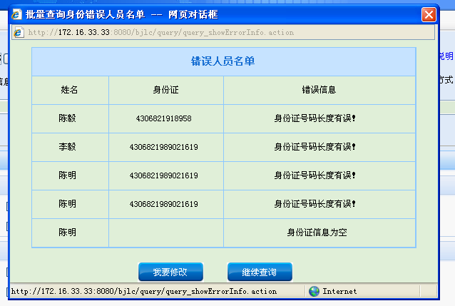

前两天接到这样一个任务：在用户上传附件，需要校验用户上传附件中身份证信息，如果存在错误信息需要将所有的错误信息展示出来。

这个需求我一开始考虑得就是使用jQuery
Dialog。但是看到这个项目没有使用而是使用showModelDialog，所以为了统一，也需要使用showModelDialog。所以就记录下来以供后面使用。

正文：

window.showModalDialog()方法用来创建一个显示HTML内容的模态对话框，由于是对话框，因此它并没有一般用window.open()打开的窗口的所有属性。

使用方法：

varreturnValue = window.showModalDialog(URL [, arguments] [, features])

参数说明：

URL:必选参数：用来指定对话框要显示的文档的URL。

arguments：可选参数。用来向对话框传递参数。传递的参数类型不限，包括数组等。对话框通过
window.dialogArguments来取得传递进来的参数。

features可选参数。用来描述对话框的外观等信息，可以使用以下的一个或几个，用分号”;”隔开。

dialogHeight 对话框高度，不小于１００px。

dialogWidth: 对话框宽度。

dialogLeft: 距离桌面左的距离。

dialogTop: 离桌面上的距离。

center: {yes| no | 1 | 0 }：窗口是否居中，默认yes，但仍可以指定高度和宽度。  help: {yes | no | 1 | 0
}：是否显示帮助按钮，默认yes。  resizable: {yes | no | 1 | 0 } ［ＩＥ５＋］：是否可被改变大小。默认no。
status: {yes | no | 1 | 0 } ［IE5+］：是否显示状态栏。默认为yes[ Modeless]或no[Modal]。
scroll:{ yes | no | 1 | 0 | on | off }：指明对话框是否显示滚动条。默认为yes。

示例：

    
    
    1 var rv = window.showModalDialog("<%=path%>/query/query_showErrorInfo.action","","dialogWidth=600px;dialogHeight="+height+"px;dialogLeft=400px;dialogTop=200px;center=no;resizable=no");

height：是根据展示的个数进行控制的。

url：为一个action，该action用户获取所有的错误人员信息。同时跳转到errorInfo.jsp页面

errorInfo.jsp

    
    
     1 <%@ page language="java" import="java.util.*" pageEncoding="UTF-8"%>
     2 <%@ taglib uri="/struts-tags" prefix="s" %>
     3 <!DOCTYPE HTML PUBLIC "-//W3C//DTD HTML 4.01 Transitional//EN">
     4 <html>
     5   <head>
     6     <title>批量查询身份错误人员名单</title>
     7     
     8     <link href="/bjlc/css/queryErrorInfo.css" rel="stylesheet" type="text/css" />
     9     <link href="/bjlc/css/index.css" rel="stylesheet" type="text/css" />  </head>
    10     <base target="download">
    11   <body>
    12       

    13       

    14         <input type="button" value="我要修改" class="button_08" onclick="wyxg();"/>   
    15            <input type="button" value="继续查询" class="button_08" onclick="jxcx();"/>   
    16        

    17        

    18            <table class="errorTable" cellpadding="0" cellspacing="0">
    19                <tr>
    20                    <td colspan="3" class="errorTitle">错误人员名单</td>
    21                    <s:form theme="simple" id="error_download" namespace="/query" method="post"></s:form> 
    22                </tr>
    23                <tr>
    24                    <td width="20%" align="center">姓名</td>
    25                    <td width="30%" align="center">身份证</td>
    26                    <td width="50%" align="center">错误信息</td>
    27                </tr>
    28                <s:iterator value="#request.ecList">
    29                    <tr>
    30                        <td><s:property value="xm"/> </td>
    31                        <td><s:property value="sfz"/> </td>
    32                        <td><s:property value="message"/> </td>
    33                    </tr>
    34                </s:iterator>
    35            </table>
    36        

    37       

    38   </body>
    39   
    51 </html>

样式表：queryErrorInfo.css

    
    
     1 html,body,.errorMain{
     2     overflow:hidden;
     3     height: 100%;
     4     height: 100%;
     5 }
     6 
     7 #showErrorInfo{
     8     width: 100%;
     9     OVERFLOW-Y: auto; 
    10     OVERFLOW-X:hidden; 
    11 }
    12 
    13 .errorTable{
    14     width: 90%;
    15     margin: 10px 5%;
    16     font-size: 12px;
    17     border: 1px solid #8DC8FF;
    18 }
    19 
    20 
    21 .errorTable td{
    22     height: 40px;
    23     border-right: 1px solid #8DC8FF;
    24     border-bottom:1px solid #8DC8FF;
    25     text-align: center;
    26 }
    27 
    28 .errorTable td:last-child{
    29     border-right: 0px;
    30 }
    31 
    32 td[id="btn"]{
    33     border-bottom: 0px;
    34 }
    35 
    36 .errorTitle{
    37     font-weight: bold;
    38     font-size: 14px;
    39     background-color: #C6E3FF;
    40     color: #176ED2;
    41     text-align: center;
    42 }
    43 
    44 .errorBtn{
    45     width: 100%;
    46     height: 20px;
    47     text-align: center;
    48     bottom: 0px; 
    49     position:absolute;
    50 }

结果如下：

