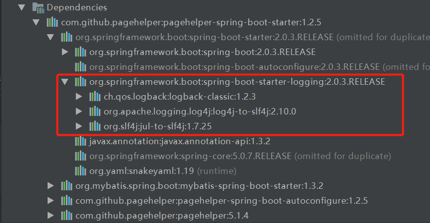
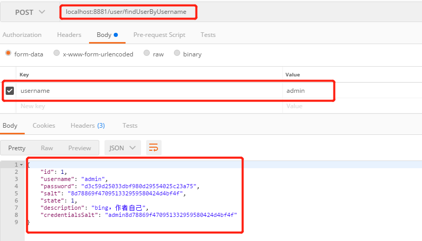
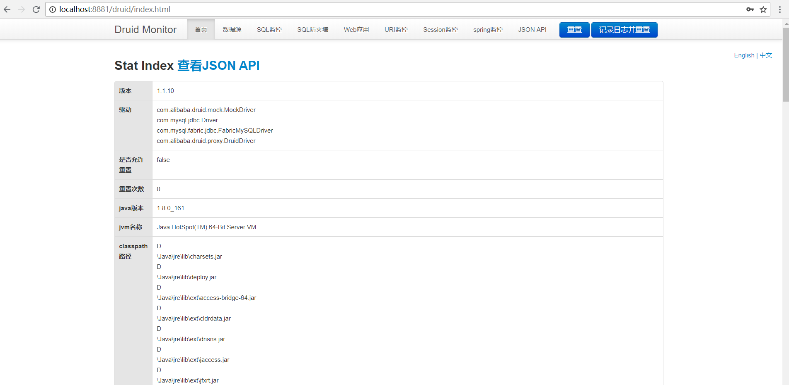
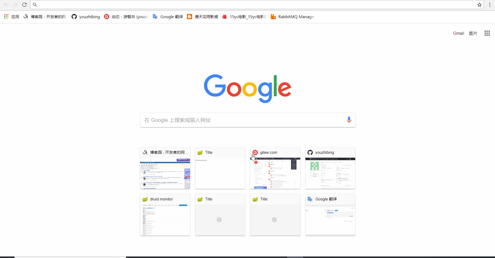
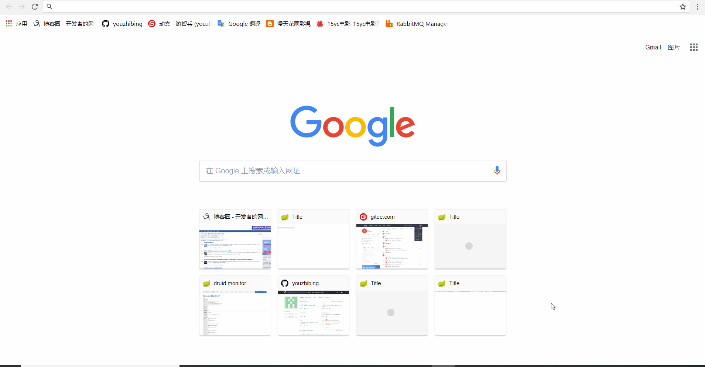
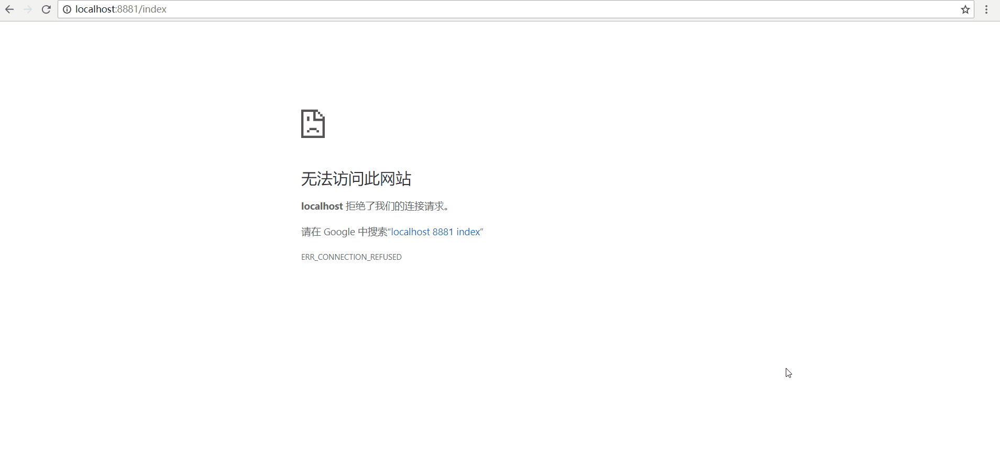

## 前言

上一篇：[spring-
boot-2.0.3不一样系列之国际化](https://www.cnblogs.com/youzhibing/p/9520275.html)，讲了如何实现国际化，实际上我工作用的模版引擎是freemaker，而不是thymeleaf，不过原理都是相通的。

接着上一篇，这一篇我来讲讲spring-boot如何整合工作中用到的一个非常重要的功能：安全，而本文的主角就是一个安全框架：shiro。

Apache Shiro是Java的一个安全框架。目前，使用Apache Shiro的人也越来越多，因为它相当简单，对比Spring
Security，可能没有Spring
Security的功能强大，但是在实际工作时可能并不需要那么复杂的东西，所以使用小而简单的Shiro就足够了。对于它俩到底哪个好，这个不必纠结，能更简单的解决项目问题就好了。

摘自开涛兄的《跟我学Shiro》

本文旨在整合spring-
boot与shiro，实现简单的认证功能，shiro的更多使用细节大家可以去阅读《更我学shiro》或者看官方文档<https://shiro.apache.org/reference.html>。

本文项目地址：[spring-boot-shiro](https://gitee.com/youzhibing/spring-
boot-2.0.3/tree/master/spring-boot-shiro)

## spring-boot整合shiro

###  集成mybatis

Shiro不会去维护用户、维护权限；这些需要我们自己去设计/提供，然后通过相应的接口注入给Shiro；既然用户、权限这些信息需要我们自己设计、维护，那么可想而知需要进行数据库表的设计了（具体表结构看后文），既然涉及到数据库的操作，那么我们就先整合mybatis，实现数据库的操作。

pom.xml：

    
    
    <?xml version="1.0" encoding="UTF-8"?>
    <project xmlns="http://maven.apache.org/POM/4.0.0"
             xmlns:xsi="http://www.w3.org/2001/XMLSchema-instance"
             xsi:schemaLocation="http://maven.apache.org/POM/4.0.0 http://maven.apache.org/xsd/maven-4.0.0.xsd">
        <modelVersion>4.0.0</modelVersion>
    
        <groupId>com.lee</groupId>
        <artifactId>spring-boot-shiro</artifactId>
        <version>1.0-SNAPSHOT</version>
    
        <properties>
            <java.version>1.8</java.version>
        </properties>
    
        <parent>
            <groupId>org.springframework.boot</groupId>
            <artifactId>spring-boot-starter-parent</artifactId>
            <version>2.0.3.RELEASE</version>
        </parent>
    
        <dependencies>
    
            <!-- mybatis相关 -->
            <dependency>
                <groupId>com.github.pagehelper</groupId>
                <artifactId>pagehelper-spring-boot-starter</artifactId>
                <version>1.2.5</version>
            </dependency>
            <dependency>
                <groupId>com.alibaba</groupId>
                <artifactId>druid-spring-boot-starter</artifactId>
                <version>1.1.10</version>
            </dependency>
            <dependency>
                <groupId>mysql</groupId>
                <artifactId>mysql-connector-java</artifactId>
            </dependency>
    
            <!-- test -->
            <dependency>
                <groupId>org.springframework.boot</groupId>
                <artifactId>spring-boot-starter-test</artifactId>
                <scope>test</scope>
            </dependency>
    
        </dependencies>
    
        <build>
            <plugins>
                <plugin>
                    <groupId>org.springframework.boot</groupId>
                    <artifactId>spring-boot-maven-plugin</artifactId>
                </plugin>
            </plugins>
        </build>
    </project>

View Code

配置文件application.yml：

    
    
    spring:
      #连接池配置
      datasource:
        type: com.alibaba.druid.pool.DruidDataSource
        druid:
          driver-class-name: com.mysql.jdbc.Driver
          url: jdbc:mysql://localhost:3306/spring-boot?useSSL=false&useUnicode=true&characterEncoding=utf-8
          username: root
          password: 123456
          initial-size: 1                     #连接池初始大小
          max-active: 20                      #连接池中最大的活跃连接数
          min-idle: 1                         #连接池中最小的活跃连接数
          max-wait: 60000                     #配置获取连接等待超时的时间
          pool-prepared-statements: true    #打开PSCache，并且指定每个连接上PSCache的大小
          max-pool-prepared-statement-per-connection-size: 20
          validation-query: SELECT 1 FROM DUAL
          validation-query-timeout: 30000
          test-on-borrow: false             #是否在获得连接后检测其可用性
          test-on-return: false             #是否在连接放回连接池后检测其可用性
          test-while-idle: true             #是否在连接空闲一段时间后检测其可用性
    #mybatis配置
    mybatis:
      type-aliases-package: com.lee.shiro.entity
      #config-location: classpath:mybatis/mybatis-config.xml
      mapper-locations: classpath:mybatis/mapper/*.xml
    # pagehelper配置
    pagehelper:
      helperDialect: mysql
      #分页合理化，pageNum<=0则查询第一页的记录；pageNum大于总页数，则查询最后一页的记录
      reasonable: true
      supportMethodsArguments: true
      params: count=countSql

View Code

在数据库spring-boot中新建表tbl_user：

    
    
    DROP TABLE IF EXISTS `tbl_user`;
    CREATE TABLE `tbl_user` (
      `id` int(10) unsigned NOT NULL AUTO_INCREMENT COMMENT "自增主键",
      `username` varchar(50) NOT NULL COMMENT "名称",
      `password` char(32) NOT NULL COMMENT "密码",
      `salt` char(32) NOT NULL COMMENT "盐，用于加密",
      `state` tinyint(2) NOT NULL DEFAULT "1" COMMENT "状态, 1:可用, 0:不可用",
      `description` varchar(50) DEFAULT "" COMMENT "描述",
      PRIMARY KEY (`id`)
    ) ENGINE=InnoDB AUTO_INCREMENT=6 DEFAULT CHARSET=utf8mb4 COMMENT="用户表";
    
    -- ----------------------------
    -- Records of tbl_user
    -- ----------------------------
    INSERT INTO `tbl_user` VALUES ("1", "admin", "d3c59d25033dbf980d29554025c23a75", "8d78869f470951332959580424d4bf4f", "1", "bing，作者自己");
    INSERT INTO `tbl_user` VALUES ("2", "brucelee", "5d5c735291a524c80c53ff669d2cde1b", "78d92ba9477b3661bc8be4bd2e8dd8c0", "1", "龙的传人");
    INSERT INTO `tbl_user` VALUES ("3", "zhangsan", "5d5c735291a524c80c53ff669d2cde1b", "78d92ba9477b3661bc8be4bd2e8dd8c0", "1", "张三");
    INSERT INTO `tbl_user` VALUES ("4", "lisi", "5d5c735291a524c80c53ff669d2cde1b", "78d92ba9477b3661bc8be4bd2e8dd8c0", "1", "李四");
    INSERT INTO `tbl_user` VALUES ("5", "jiraya", "5d5c735291a524c80c53ff669d2cde1b", "78d92ba9477b3661bc8be4bd2e8dd8c0", "1", "自来也");

View Code

mapper接口：UserMapper.java

    
    
    package com.lee.shiro.mapper;
    
    import com.lee.shiro.entity.User;
    import org.apache.ibatis.annotations.Mapper;
    import org.apache.ibatis.annotations.Param;
    
    import java.util.List;
    
    @Mapper
    public interface UserMapper {
    
        /**
         * 根据用户名获取用户
         * @param username
         * @return
         */
        User findUserByUsername(@Param("username") String username);
    }

View Code

UserMapper.xml：

    
    
    <?xml version="1.0" encoding="UTF-8" ?>
    <!DOCTYPE mapper PUBLIC "-//mybatis.org//DTD Mapper 3.0//EN" "http://mybatis.org/dtd/mybatis-3-mapper.dtd">
    <mapper namespace="com.lee.shiro.mapper.UserMapper">
        <select id="findUserByUsername" resultType="User">
            SELECT
                id,username,password,salt,state,description
            FROM
                tbl_user
            WHERE username=#{username}
        </select>
    </mapper>

View Code

service接口：IUserService.java

    
    
    package com.lee.shiro.service;
    
    import com.lee.shiro.entity.User;
    
    public interface IUserService {
    
        /**
         * 根据用户名获取用户
         * @param username
         * @return
         */
        User findUserByUsername(String username);
    }

View Code

service实现：UserServiceImpl.java

    
    
    package com.lee.shiro.service.impl;
    
    import com.lee.shiro.entity.User;
    import com.lee.shiro.mapper.UserMapper;
    import com.lee.shiro.service.IUserService;
    import org.springframework.beans.factory.annotation.Autowired;
    import org.springframework.stereotype.Service;
    
    import java.util.List;
    
    @Service
    public class UserServiceImpl implements IUserService {
    
        @Autowired
        private UserMapper userMapper;
    
        @Override
        public User findUserByUsername(String username) {
            User user = userMapper.findUserByUsername(username);
            return user;
        }
    
    }

View Code

启动类：ShiroApplication.java

    
    
    package com.lee.shiro;
    
    import org.springframework.boot.SpringApplication;
    import org.springframework.boot.autoconfigure.SpringBootApplication;
    
    @SpringBootApplication
    public class ShiroApplication {
    
        public static void main(String[] args) {
            SpringApplication.run(ShiroApplication.class, args);
        }
    }

View Code

测试类：MybatisTest.java

    
    
    package com.lee.shiro.test;
    
    import com.lee.shiro.ShiroApplication;
    import com.lee.shiro.entity.User;
    import com.lee.shiro.service.IUserService;
    import org.junit.Assert;
    import org.junit.Test;
    import org.junit.runner.RunWith;
    import org.springframework.beans.factory.annotation.Autowired;
    import org.springframework.boot.test.context.SpringBootTest;
    import org.springframework.test.context.junit4.SpringRunner;
    
    @RunWith(SpringRunner.class)
    @SpringBootTest(classes = ShiroApplication.class)
    public class MybatisTest {
    
        @Autowired
        private IUserService userService;
    
        @Test
        public void testFindUserByUsername() {
            User user = userService.findUserByUsername("brucelee");
            Assert.assertEquals(user.getDescription(), "龙的传人");
        }
    }

View Code

测试用例顺利通过，则表示mybatis集成成功

###  开启logback日志

其实上面的pom配置已经引入了日志依赖，如图：

但是你会发现，spring-boot-starter-
logging引入了3种类型的日志，你用其中任何一种都能正常打印日志；但是我们需要用3种吗？根本用不到，我们只要用一种即可，至于选用那种，全凭大家自己的喜欢；我了，比较喜欢logback（接触的项目中用的比较多，说白了就是这3种中最熟悉的把）；我们来改下pom.xml，重新配置日志依赖：

    
    
    <?xml version="1.0" encoding="UTF-8"?>
    <project xmlns="http://maven.apache.org/POM/4.0.0"
             xmlns:xsi="http://www.w3.org/2001/XMLSchema-instance"
             xsi:schemaLocation="http://maven.apache.org/POM/4.0.0 http://maven.apache.org/xsd/maven-4.0.0.xsd">
        <modelVersion>4.0.0</modelVersion>
    
        <groupId>com.lee</groupId>
        <artifactId>spring-boot-shiro</artifactId>
        <version>1.0-SNAPSHOT</version>
    
        <properties>
            <java.version>1.8</java.version>
        </properties>
    
        <parent>
            <groupId>org.springframework.boot</groupId>
            <artifactId>spring-boot-starter-parent</artifactId>
            <version>2.0.3.RELEASE</version>
        </parent>
    
        <dependencies>
    
            <!-- mybatis相关 -->
            <dependency>
                <groupId>com.github.pagehelper</groupId>
                <artifactId>pagehelper-spring-boot-starter</artifactId>
                <version>1.2.5</version>
            </dependency>
            <dependency>
                <groupId>com.alibaba</groupId>
                <artifactId>druid-spring-boot-starter</artifactId>
                <version>1.1.10</version>
            </dependency>
            <dependency>
                <groupId>mysql</groupId>
                <artifactId>mysql-connector-java</artifactId>
            </dependency>
    
            <!-- 日志 -->
            <dependency>
                <groupId>org.springframework.boot</groupId>
                <artifactId>spring-boot-starter-logging</artifactId>
                <exclusions>                    <!-- 剔除spring-boot-starter-logging中的全部依赖 -->
                    <exclusion>
                        <groupId>*</groupId>
                        <artifactId>*</artifactId>
                    </exclusion>
                </exclusions>
                <scope>test</scope>             <!-- package或install的时候，spring-boot-starter-logging.jar也不会打进去 -->
            </dependency>
            <dependency>
                <groupId>ch.qos.logback</groupId>
                <artifactId>logback-classic</artifactId>
            </dependency>
    
            <!-- test -->
            <dependency>
                <groupId>org.springframework.boot</groupId>
                <artifactId>spring-boot-starter-test</artifactId>
                <scope>test</scope>
            </dependency>
    
        </dependencies>
    
        <build>
            <plugins>
                <plugin>
                    <groupId>org.springframework.boot</groupId>
                    <artifactId>spring-boot-maven-plugin</artifactId>
                </plugin>
            </plugins>
        </build>
    </project>

View Code

logback.xml：

    
    
    <?xml version="1.0" encoding="UTF-8"?>
    <configuration debug="false">
      <!--定义日志文件的存储地址 勿在 LogBack 的配置中使用相对路径 -->
      <property name="LOG_HOME" value="/log" />
      <!-- 控制台输出 -->
      <appender name="STDOUT" class="ch.qos.logback.core.ConsoleAppender">
        <encoder class="ch.qos.logback.classic.encoder.PatternLayoutEncoder">
          <pattern>%d{yyyy-MM-dd HH:mm:ss} |%logger| |%level|%msg%n</pattern>
        </encoder>
      </appender>
      <!-- 按照每天生成日志文件 -->
      <appender name="FILE"
                class="ch.qos.logback.core.rolling.RollingFileAppender">
        <rollingPolicy class="ch.qos.logback.core.rolling.TimeBasedRollingPolicy">
          <!--日志文件输出的文件名 -->
          <FileNamePattern>${LOG_HOME}/spring-boot-shiro.log.%d{yyyy-MM-dd}.log</FileNamePattern>
          <!--日志文件保留天数 -->
          <MaxHistory>30</MaxHistory>
        </rollingPolicy>
        <encoder class="ch.qos.logback.classic.encoder.PatternLayoutEncoder">
          <!--格式化输出：%d表示日期，%thread表示线程名，%-5level：级别从左显示5个字符宽度%msg：日志消息，%n是换行符 -->
          <pattern>%d{yyyy-MM-dd HH:mm:ss} |%logger| |%level|%msg%n</pattern>
        </encoder>
        <!--日志文件最大的大小 -->
        <triggeringPolicy
                class="ch.qos.logback.core.rolling.SizeBasedTriggeringPolicy">
          <MaxFileSize>10MB</MaxFileSize>
        </triggeringPolicy>
      </appender>
    
      <!-- 日志输出级别 -->
      <root level="INFO">
        <appender-ref ref="STDOUT" />
        <appender-ref ref="FILE" />
      </root>
    </configuration>

View Code

###  开启web功能

在pom.xml中加入web依赖和thymeleaf依赖：

    
    
    <?xml version="1.0" encoding="UTF-8"?>
    <project xmlns="http://maven.apache.org/POM/4.0.0"
             xmlns:xsi="http://www.w3.org/2001/XMLSchema-instance"
             xsi:schemaLocation="http://maven.apache.org/POM/4.0.0 http://maven.apache.org/xsd/maven-4.0.0.xsd">
        <modelVersion>4.0.0</modelVersion>
    
        <groupId>com.lee</groupId>
        <artifactId>spring-boot-shiro</artifactId>
        <version>1.0-SNAPSHOT</version>
    
        <properties>
            <java.version>1.8</java.version>
        </properties>
    
        <parent>
            <groupId>org.springframework.boot</groupId>
            <artifactId>spring-boot-starter-parent</artifactId>
            <version>2.0.3.RELEASE</version>
        </parent>
    
        <dependencies>
    
            <!-- mybatis相关 -->
            <dependency>
                <groupId>com.github.pagehelper</groupId>
                <artifactId>pagehelper-spring-boot-starter</artifactId>
                <version>1.2.5</version>
            </dependency>
            <dependency>
                <groupId>com.alibaba</groupId>
                <artifactId>druid-spring-boot-starter</artifactId>
                <version>1.1.10</version>
            </dependency>
            <dependency>
                <groupId>mysql</groupId>
                <artifactId>mysql-connector-java</artifactId>
            </dependency>
    
            <!-- 日志 -->
            <dependency>
                <groupId>org.springframework.boot</groupId>
                <artifactId>spring-boot-starter-logging</artifactId>
                <exclusions>                    <!-- 剔除spring-boot-starter-logging中的全部依赖 -->
                    <exclusion>
                        <groupId>*</groupId>
                        <artifactId>*</artifactId>
                    </exclusion>
                </exclusions>
                <scope>test</scope>             <!-- package或install的时候，spring-boot-starter-logging.jar也不会打进去 -->
            </dependency>
            <dependency>
                <groupId>ch.qos.logback</groupId>
                <artifactId>logback-classic</artifactId>
            </dependency>
    
            <!-- web -->
            <dependency>
                <groupId>org.springframework.boot</groupId>
                <artifactId>spring-boot-starter-web</artifactId>
            </dependency>
            <dependency>
                <groupId>org.springframework.boot</groupId>
                <artifactId>spring-boot-starter-thymeleaf</artifactId>
            </dependency>
    
            <!-- test -->
            <dependency>
                <groupId>org.springframework.boot</groupId>
                <artifactId>spring-boot-starter-test</artifactId>
                <scope>test</scope>
            </dependency>
    
        </dependencies>
    
        <build>
            <plugins>
                <plugin>
                    <groupId>org.springframework.boot</groupId>
                    <artifactId>spring-boot-maven-plugin</artifactId>
                </plugin>
            </plugins>
        </build>
    </project>

View Code

application.yml中加入端口配置：

    
    
    server:
      port: 8881
    spring:
      #连接池配置
      datasource:
        type: com.alibaba.druid.pool.DruidDataSource
        druid:
          driver-class-name: com.mysql.jdbc.Driver
          url: jdbc:mysql://localhost:3306/spring-boot?useSSL=false&useUnicode=true&characterEncoding=utf-8
          username: root
          password: 123456
          initial-size: 1                     #连接池初始大小
          max-active: 20                      #连接池中最大的活跃连接数
          min-idle: 1                         #连接池中最小的活跃连接数
          max-wait: 60000                     #配置获取连接等待超时的时间
          pool-prepared-statements: true    #打开PSCache，并且指定每个连接上PSCache的大小
          max-pool-prepared-statement-per-connection-size: 20
          validation-query: SELECT 1 FROM DUAL
          validation-query-timeout: 30000
          test-on-borrow: false             #是否在获得连接后检测其可用性
          test-on-return: false             #是否在连接放回连接池后检测其可用性
          test-while-idle: true             #是否在连接空闲一段时间后检测其可用性
    #mybatis配置
    mybatis:
      type-aliases-package: com.lee.shiro.entity
      #config-location: classpath:mybatis/mybatis-config.xml
      mapper-locations: classpath:mybatis/mapper/*.xml
    # pagehelper配置
    pagehelper:
      helperDialect: mysql
      #分页合理化，pageNum<=0则查询第一页的记录；pageNum大于总页数，则查询最后一页的记录
      reasonable: true
      supportMethodsArguments: true
      params: count=countSql

View Code

加入controller，处理web请求，具体代码参考：[spring-boot-
shiro](https://gitee.com/youzhibing/spring-boot-2.0.3/tree/master/spring-boot-
shiro)  

用post测试下，出现下图，表示web开启成功  

###  配置druid监控后台

可配可不配，但是建议配置上，它能提供很多监控信息，对排查问题非常有帮助，配置好后，界面如下

提供的内容还是非常多的，更多的druid配置大家可以查看[druid官网](https://github.com/alibaba/druid)

druid配置只需要在application.yml中加入druid配置，同时在config目录下加上DruidConfig.java配置文件即可，具体内容可参考：[spring-
boot-shiro](https://gitee.com/youzhibing/spring-boot-2.0.3/tree/master/spring-
boot-shiro)

###  集成shiro，并用redis实现shiro缓存

集成shiro非常简单，我们只需要将用户、权限信息传给shiro即可。表结构信息：

    
    
    DROP TABLE IF EXISTS `tbl_user`;
    CREATE TABLE `tbl_user` (
      `id` int(10) unsigned NOT NULL AUTO_INCREMENT COMMENT "自增主键",
      `username` varchar(50) NOT NULL COMMENT "名称",
      `password` char(32) NOT NULL COMMENT "密码",
      `salt` char(32) NOT NULL COMMENT "盐，用于加密",
      `state` tinyint(2) NOT NULL DEFAULT "1" COMMENT "状态, 1:可用, 0:不可用",
      `description` varchar(50) DEFAULT "" COMMENT "描述",
      PRIMARY KEY (`id`)
    ) ENGINE=InnoDB DEFAULT CHARSET=utf8mb4 COMMENT="用户表";
    
    -- ----------------------------
    -- Records of tbl_user
    -- ----------------------------
    INSERT INTO `tbl_user` VALUES ("1", "admin", "d3c59d25033dbf980d29554025c23a75", "8d78869f470951332959580424d4bf4f", "1", "bing，作者自己");
    INSERT INTO `tbl_user` VALUES ("2", "brucelee", "5d5c735291a524c80c53ff669d2cde1b", "78d92ba9477b3661bc8be4bd2e8dd8c0", "1", "龙的传人");
    INSERT INTO `tbl_user` VALUES ("3", "zhangsan", "b8432e3a2a5adc908bd4ff22ba1f2d65", "78d92ba9477b3661bc8be4bd2e8dd8c0", "1", "张三");
    INSERT INTO `tbl_user` VALUES ("4", "lisi", "1fdda90367c23a1f1230eb202104270a", "78d92ba9477b3661bc8be4bd2e8dd8c0", "1", "李四");
    INSERT INTO `tbl_user` VALUES ("5", "jiraya", "e7c5afb5e2fe7da78641721f2c5aad82", "78d92ba9477b3661bc8be4bd2e8dd8c0", "1", "自来也");
    
    -- ----------------------------
    -- Table structure for `tbl_user_role`
    -- ----------------------------
    DROP TABLE IF EXISTS `tbl_user_role`;
    CREATE TABLE `tbl_user_role` (
      `id` int(10) unsigned NOT NULL AUTO_INCREMENT COMMENT "自增主键",
      `user_id` int(10) unsigned NOT NULL COMMENT "用户id",
      `role_id` int(10) unsigned NOT NULL COMMENT "角色id",
      PRIMARY KEY (`id`)
    ) ENGINE=InnoDB DEFAULT CHARSET=utf8mb4 COMMENT="用户角色表";
    
    -- ----------------------------
    -- Records of tbl_user_role
    -- ----------------------------
    INSERT INTO `tbl_user_role` VALUES ("1", "1", "1");
    INSERT INTO `tbl_user_role` VALUES ("2", "2", "4");
    
    -- ----------------------------
    -- Table structure for `tbl_permission`
    -- ----------------------------
    DROP TABLE IF EXISTS `tbl_permission`;
    CREATE TABLE `tbl_permission` (
      `id` int(10) unsigned NOT NULL AUTO_INCREMENT COMMENT "自增主键",
      `name` varchar(50) NOT NULL COMMENT "名称",
      `permission` varchar(50) NOT NULL COMMENT "权限",
      `url` varchar(50) NOT NULL COMMENT "url",
      `description` varchar(50) DEFAULT "" COMMENT "描述",
      PRIMARY KEY (`id`)
    ) ENGINE=InnoDB DEFAULT CHARSET=utf8mb4 COMMENT="权限表";
    
    -- ----------------------------
    -- Records of tbl_permission
    -- ----------------------------
    INSERT INTO `tbl_permission` VALUES ("1", "用户列表", "user:view", "user/userList", "用户列表");
    INSERT INTO `tbl_permission` VALUES ("2", "用户添加", "user:add", "user/userAdd", "用户添加");
    INSERT INTO `tbl_permission` VALUES ("3", "用户删除", "user:del", "user/userDel", "用户删除");
    
    -- ----------------------------
    -- Table structure for `tbl_role`
    -- ----------------------------
    DROP TABLE IF EXISTS `tbl_role`;
    CREATE TABLE `tbl_role` (
      `id` int(10) unsigned NOT NULL AUTO_INCREMENT COMMENT "自增主键",
      `name` varchar(50) NOT NULL COMMENT "名称",
      `description` varchar(50) DEFAULT "" COMMENT "描述",
      PRIMARY KEY (`id`)
    ) ENGINE=InnoDB DEFAULT CHARSET=utf8mb4 COMMENT="角色表";
    
    -- ----------------------------
    -- Records of tbl_role
    -- ----------------------------
    INSERT INTO `tbl_role` VALUES ("1", "超级管理员", "拥有全部权限");
    INSERT INTO `tbl_role` VALUES ("2", "角色管理员", "拥有全部查看权限，以及角色的增删改权限");
    INSERT INTO `tbl_role` VALUES ("3", "权限管理员", "拥有全部查看权限，以及权限的增删改权限");
    INSERT INTO `tbl_role` VALUES ("4", "用户管理员", "拥有全部查看权限，以及用户的增删改权限");
    INSERT INTO `tbl_role` VALUES ("5", "审核管理员", "拥有全部查看权限，以及审核的权限");
    
    -- ----------------------------
    -- Table structure for `tbl_role_permission`
    -- ----------------------------
    DROP TABLE IF EXISTS `tbl_role_permission`;
    CREATE TABLE `tbl_role_permission` (
      `id` int(10) unsigned NOT NULL AUTO_INCREMENT COMMENT "自增主键",
      `role_id` int(10) unsigned NOT NULL COMMENT "角色id",
      `permission_id` int(10) unsigned NOT NULL COMMENT "权限id",
      PRIMARY KEY (`id`)
    ) ENGINE=InnoDB DEFAULT CHARSET=utf8mb4 COMMENT="角色权限表";
    
    -- ----------------------------
    -- Records of tbl_role_permission
    -- ----------------------------
    INSERT INTO `tbl_role_permission` VALUES ("1", "1", "1");
    INSERT INTO `tbl_role_permission` VALUES ("2", "1", "2");
    INSERT INTO `tbl_role_permission` VALUES ("3", "1", "3");
    INSERT INTO `tbl_role_permission` VALUES ("4", "4", "1");
    INSERT INTO `tbl_role_permission` VALUES ("5", "4", "2");
    INSERT INTO `tbl_role_permission` VALUES ("6", "4", "3");

View Code

实现role、permission的mapper（user的在之前已经实现了），然后将用户信息、权限信息注入到shiro的realm中即可，ShiroConfig.java：

    
    
    package com.lee.shiro.config;
    
    import com.lee.shiro.entity.Role;
    import com.lee.shiro.entity.User;
    import com.lee.shiro.mapper.PermissionMapper;
    import com.lee.shiro.mapper.RoleMapper;
    import com.lee.shiro.service.IUserService;
    import com.lee.shiro.util.ByteSourceUtils;
    import org.apache.shiro.authc.AuthenticationException;
    import org.apache.shiro.authc.AuthenticationInfo;
    import org.apache.shiro.authc.AuthenticationToken;
    import org.apache.shiro.authc.SimpleAuthenticationInfo;
    import org.apache.shiro.authc.credential.HashedCredentialsMatcher;
    import org.apache.shiro.authz.AuthorizationInfo;
    import org.apache.shiro.authz.SimpleAuthorizationInfo;
    import org.apache.shiro.cache.CacheManager;
    import org.apache.shiro.mgt.SecurityManager;
    import org.apache.shiro.realm.AuthorizingRealm;
    import org.apache.shiro.spring.security.interceptor.AuthorizationAttributeSourceAdvisor;
    import org.apache.shiro.spring.web.ShiroFilterFactoryBean;
    import org.apache.shiro.subject.PrincipalCollection;
    import org.apache.shiro.web.mgt.CookieRememberMeManager;
    import org.apache.shiro.web.mgt.DefaultWebSecurityManager;
    import org.apache.shiro.web.servlet.SimpleCookie;
    import org.slf4j.Logger;
    import org.slf4j.LoggerFactory;
    import org.springframework.aop.framework.autoproxy.DefaultAdvisorAutoProxyCreator;
    import org.springframework.beans.factory.annotation.Autowired;
    import org.springframework.context.annotation.Bean;
    import org.springframework.context.annotation.Configuration;
    import org.springframework.web.servlet.handler.SimpleMappingExceptionResolver;
    
    import java.util.LinkedHashMap;
    import java.util.List;
    import java.util.Map;
    import java.util.Properties;
    
    @Configuration
    public class ShiroConfig {
    
        private static final Logger LOGGER = LoggerFactory.getLogger(ShiroConfig.class);
    
        @Autowired
        private IUserService userService;
        @Autowired
        private RoleMapper roleMapper;
        @Autowired
        private PermissionMapper permissionMapper;
    
        @Bean
        public ShiroFilterFactoryBean shiroFilterFactoryBean(SecurityManager securityManager) {
    
            ShiroFilterFactoryBean shiroFilterFactoryBean = new ShiroFilterFactoryBean();
            shiroFilterFactoryBean.setSecurityManager(securityManager);
    
            Map<String, String> filterChainDefinitionMap = new LinkedHashMap<>();
            filterChainDefinitionMap.put("/logout", "logout");
            filterChainDefinitionMap.put("/favicon.ico", "anon");
            filterChainDefinitionMap.put("/druid/**", "anon");              // druid登录交给druid自己
            filterChainDefinitionMap.put("/**", "authc");
            //authc表示需要验证身份才能访问，还有一些比如anon表示不需要验证身份就能访问等。
            shiroFilterFactoryBean.setLoginUrl("/login");
            shiroFilterFactoryBean.setSuccessUrl("/index");
            shiroFilterFactoryBean.setFilterChainDefinitionMap(filterChainDefinitionMap);
            return shiroFilterFactoryBean;
        }
    
        @Bean
        public SecurityManager securityManager(AuthorizingRealm myShiroRealm, CacheManager shiroRedisCacheManager) {
            DefaultWebSecurityManager securityManager = new DefaultWebSecurityManager();
            securityManager.setCacheManager(shiroRedisCacheManager);
            securityManager.setRememberMeManager(cookieRememberMeManager());
            securityManager.setRealm(myShiroRealm);
            return securityManager;
        }
    
        @Bean
        public AuthorizingRealm myShiroRealm(HashedCredentialsMatcher hashedCredentialsMatcher) {
            AuthorizingRealm  myShiroRealm = new AuthorizingRealm() {
    
                @Override
                protected AuthenticationInfo doGetAuthenticationInfo(AuthenticationToken token) throws AuthenticationException {
                    LOGGER.info("认证 --> MyShiroRealm.doGetAuthenticationInfo()");
                    //获取用户的输入的账号.
                    String username = (String)token.getPrincipal();
                    LOGGER.info("界面输入的用户名：{}", username);
                    //通过username从数据库中查找 User对象，
                    User user = userService.findUserByUsername(username);
                    if(user == null){
                        //没有返回登录用户名对应的SimpleAuthenticationInfo对象时,就会在LoginController中抛出UnknownAccountException异常
                        return null;
                    }
                    SimpleAuthenticationInfo authenticationInfo = new SimpleAuthenticationInfo(
                            user, //用户名
                            user.getPassword(), //密码
                            ByteSourceUtils.bytes(user.getCredentialsSalt()),//salt=username+salt
                            getName()  //realm name
                    );
                    return authenticationInfo;
                }
    
                @Override
                protected AuthorizationInfo doGetAuthorizationInfo(PrincipalCollection principal) {
                    LOGGER.info("权限配置 --> MyShiroRealm.doGetAuthorizationInfo()");
    
                    SimpleAuthorizationInfo authorizationInfo = new SimpleAuthorizationInfo();
                    User user  = (User)principal.getPrimaryPrincipal();
                    List<Role> roles = roleMapper.findRoleByUsername(user.getUsername());
                    LOGGER.info("用户：{}, 角色有{}个", user.getUsername(), roles.size());
                    roles.stream().forEach(
                            role -> {
                                authorizationInfo.addRole(role.getName());
                                permissionMapper.findPermissionByRoleId(role.getId()).stream().forEach(
                                        permission -> {
                                            authorizationInfo.addStringPermission(permission.getPermission());
                                        }
                                );
                            }
                    );
                    return authorizationInfo;
                }
            };
            myShiroRealm.setCredentialsMatcher(hashedCredentialsMatcher); //设置加密规则
            myShiroRealm.setCachingEnabled(true);
            myShiroRealm.setAuthorizationCachingEnabled(true);
            myShiroRealm.setAuthenticationCachingEnabled(true);
            return myShiroRealm;
        }
    
        // 需要与存储密码时的加密规则一致
        @Bean
        public HashedCredentialsMatcher hashedCredentialsMatcher() {
            HashedCredentialsMatcher hashedCredentialsMatcher = new HashedCredentialsMatcher();
            hashedCredentialsMatcher.setHashAlgorithmName("md5");//散列算法:这里使用MD5算法;
            hashedCredentialsMatcher.setHashIterations(2);//散列的次数，比如散列两次，相当于 md5(md5(""));
            return hashedCredentialsMatcher;
        }
    
        /**
         * DefaultAdvisorAutoProxyCreator，Spring的一个bean，由Advisor决定对哪些类的方法进行AOP代理<
         * @return
         */
        @Bean
        public DefaultAdvisorAutoProxyCreator defaultAdvisorAutoProxyCreator() {
            DefaultAdvisorAutoProxyCreator proxyCreator = new DefaultAdvisorAutoProxyCreator();
            proxyCreator.setProxyTargetClass(true);
            return proxyCreator;
        }
    
        /**
         *  开启shiro aop注解支持.
         *  使用代理方式;所以需要开启代码支持;
         * @param securityManager
         * @return
         */
        @Bean
        public AuthorizationAttributeSourceAdvisor authorizationAttributeSourceAdvisor(SecurityManager securityManager){
            AuthorizationAttributeSourceAdvisor authorizationAttributeSourceAdvisor = new AuthorizationAttributeSourceAdvisor();
            authorizationAttributeSourceAdvisor.setSecurityManager(securityManager);
            return authorizationAttributeSourceAdvisor;
        }
    
        @Bean
        public SimpleMappingExceptionResolver resolver() {
            SimpleMappingExceptionResolver exceptionResolver = new SimpleMappingExceptionResolver();
            Properties properties = new Properties();
            properties.setProperty("UnauthorizedException", "/403");
            exceptionResolver.setExceptionMappings(properties);
            return exceptionResolver;
        }
    
        //cookie对象;
        @Bean
        public SimpleCookie rememberMeCookie() {
            LOGGER.info("ShiroConfiguration.rememberMeCookie()");
            //这个参数是cookie的名称，对应前端的checkbox的name = rememberMe
            SimpleCookie simpleCookie = new SimpleCookie("rememberMe");
    
            //<!-- 记住我cookie生效时间 ,单位秒;-->
            simpleCookie.setMaxAge(60);
            return simpleCookie;
        }
    
        //cookie管理对象;
        @Bean
        public CookieRememberMeManager cookieRememberMeManager() {
            LOGGER.info("ShiroConfiguration.rememberMeManager()");
            CookieRememberMeManager manager = new CookieRememberMeManager();
            manager.setCookie(rememberMeCookie());
            return manager;
        }
    
    }

View Code

shiro的缓存也是提供的接口，我们实现该接口即可接入我们自己的缓存实现，至于具体的缓存实现是redis、memcache还是其他的，shiro并不关心；而本文用redis实现shiro的缓存。采用spring的redisTemplate来操作redis，具体的实现，如下

ShiroRedisCacheManager：

    
    
    package com.lee.shiro.config;
    
    import org.apache.shiro.cache.Cache;
    import org.apache.shiro.cache.CacheException;
    import org.apache.shiro.cache.CacheManager;
    import org.springframework.beans.factory.annotation.Autowired;
    import org.springframework.stereotype.Component;
    
    @Component
    public class ShiroRedisCacheManager implements CacheManager {
    
        @Autowired
        private Cache shiroRedisCache;
    
        @Override
        public <K, V> Cache<K, V> getCache(String s) throws CacheException {
            return shiroRedisCache;
        }
    }

View Code

ShiroRedisCache：

    
    
    package com.lee.shiro.config;
    
    import org.apache.shiro.cache.Cache;
    import org.apache.shiro.cache.CacheException;
    import org.springframework.beans.factory.annotation.Autowired;
    import org.springframework.beans.factory.annotation.Value;
    import org.springframework.data.redis.core.RedisTemplate;
    import org.springframework.stereotype.Component;
    
    import java.util.Collection;
    import java.util.Set;
    import java.util.concurrent.TimeUnit;
    
    @Component
    public class ShiroRedisCache<K,V> implements Cache<K,V>{
    
        @Autowired
        private RedisTemplate<K,V> redisTemplate;
    
        @Value("${spring.redis.expireTime}")
        private long expireTime;
    
        @Override
        public V get(K k) throws CacheException {
            return redisTemplate.opsForValue().get(k);
        }
    
        @Override
        public V put(K k, V v) throws CacheException {
            redisTemplate.opsForValue().set(k,v,expireTime, TimeUnit.SECONDS);
            return null;
        }
    
        @Override
        public V remove(K k) throws CacheException {
            V v = redisTemplate.opsForValue().get(k);
            redisTemplate.opsForValue().getOperations().delete(k);
            return v;
        }
    
        @Override
        public void clear() throws CacheException {
        }
    
        @Override
        public int size() {
            return 0;
        }
    
        @Override
        public Set<K> keys() {
            return null;
        }
    
        @Override
        public Collection<V> values() {
            return null;
        }
    }

View Code

更详细、完整的代码请参考[spring-boot-shiro](https://gitee.com/youzhibing/spring-
boot-2.0.3/tree/master/spring-boot-
shiro)，上文的缓存只是针对realm缓存，也就是权限相关的，至于其他缓存像session缓存，大家可以自行去实现。

## 效果展示

经过上述的步骤，工程已经搭建完毕我们来验证下效果

###  druid后台监控

如下图

在shiro配置中，我们放行了/druid/**，所以druid后台的地址都没有被拦截，druid相关的由druid自己控制，不受shiro的影响。

###  shiro权限控制

由spring-boot-
shiro.sql、UserController.java可知，5个用户中只有admin和brucelee有/user/userList、/user/userAdd、/user/userDel的访问权限，而/user/findUserByUsername没做权限限制，那么5个用户都可以访问；但是登录是必须的（5个用户的密码都是123456）；效果如下：

上图中展示了zhangsan用户和admin权限访问的情况，完全按照我们设想的剧本走的，剩下的用户大家可以自己去测试；另外还可以多设置一些权限来进行验证。

预祝大家搭建成功，如果有什么问题，可以@我，或者直接和我的代码进行比较，找出其中的问题。

## 疑问与解答

1、我不修改日志依赖，但是我只用其中的某种日志打印日志不就行了，不会冲突也能正常打日志，为什么要修改日志依赖？

说的没错，你不修改依赖也能正常工作，还不用书写更多的pom配置；但是你仔细去观察的话，你会发现你工程打包出来的时候，这些依赖的日志jar包全在包中，项目部署的时候，这些jar都会加载到内存中的，你没用到的日志jar也会加载到内存中，数量少、jar包小还能接受，一旦无用的jar包数量多、jar文件太大，那可想而知会浪费多少内存资源；内存资源不比磁盘，是比较稀有的。

强烈建议把无用的依赖剔除掉，既能节省资源、也能避免未知的一些错误。

2、日志依赖：为什么按文中的配置就能只依赖logback了

maven的依赖有两个原则：最短路径原则、最先声明原则；以我们的pom.xml为起点，那我们自定义的spring-boot-starter-
logging依赖路径肯定最短了，那么maven就会选用我们自定义的spring-boot-starter-logging，所以就把spring-boot-
starter-
logging的依赖全部剔除了，而<scope>test<scope>，大家都懂的；至于最先声明原则，也就说在路径相同的情况下，谁在前声明就依赖谁。

3、遇到的一个坑，认证通过后，为什么授权回调没有被调用

首先要明白，认证与授权触发的时间点是不同的，登录触发认证，但是登录成功后不会立即触发授权的；授权是有权限校验的时候才触发的；大家请看下图

登录只是触发了认证、当有权限校验的时候才会授权（角色校验的时候也会），第一次权限校验请求数据库，数据会缓存到redis中，下次权限校验的时候就从缓存中获取，而不用再从数据库获取了。

另外shiro注解生效是配置两个bean的，defaultAdvisorAutoProxyCreator和authorizationAttributeSourceAdvisor，我在这个问题上卡了一段时间；只配置authorizationAttributeSourceAdvisor没用，代理没打开，shiro注解的代理类就不会生成，注解配置了相当于没配置，这里需要大家注意。

我的博客即将搬运同步至腾讯云+社区，邀请大家一同入驻：[https://cloud.tencent.com/developer/support-
plan?invite_code=2iqiy8f51wqok](https://cloud.tencent.com/developer/support-
plan?invite_code=2iqiy8f51wqok)

## 参考

《跟我学Shiro》

