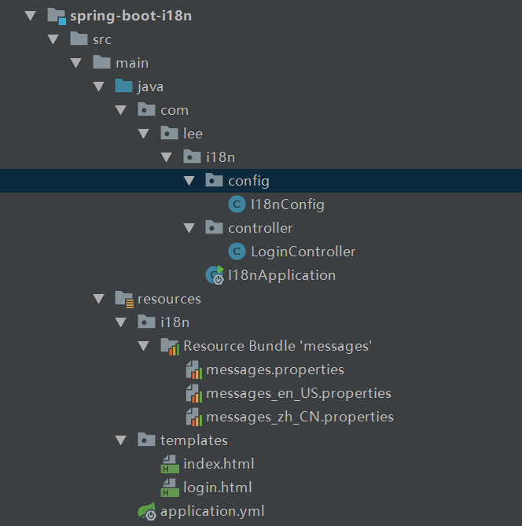
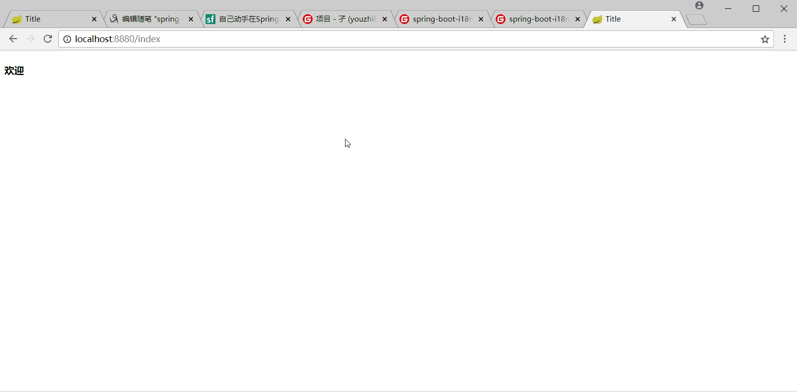
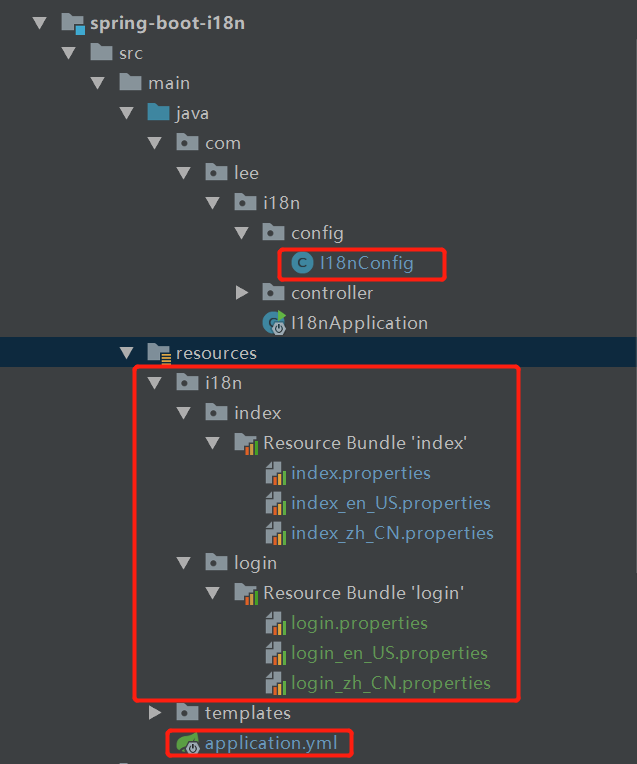
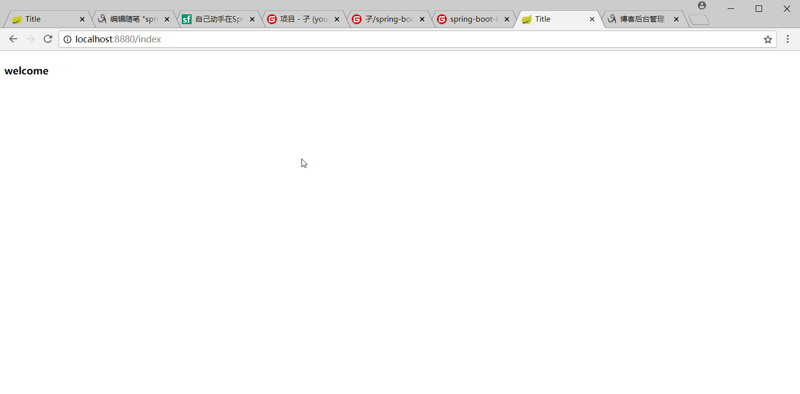
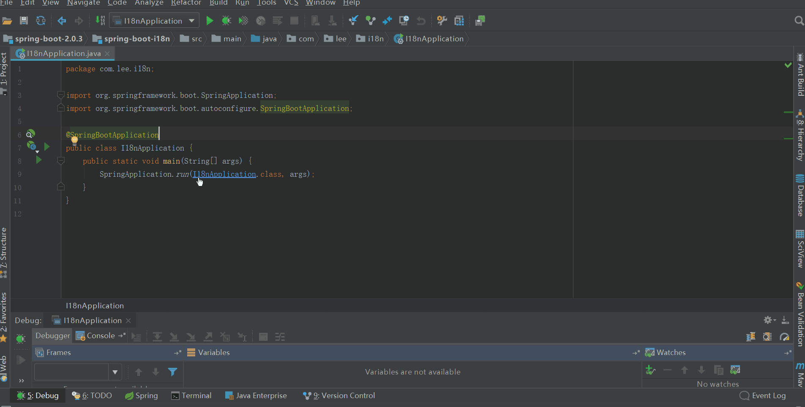
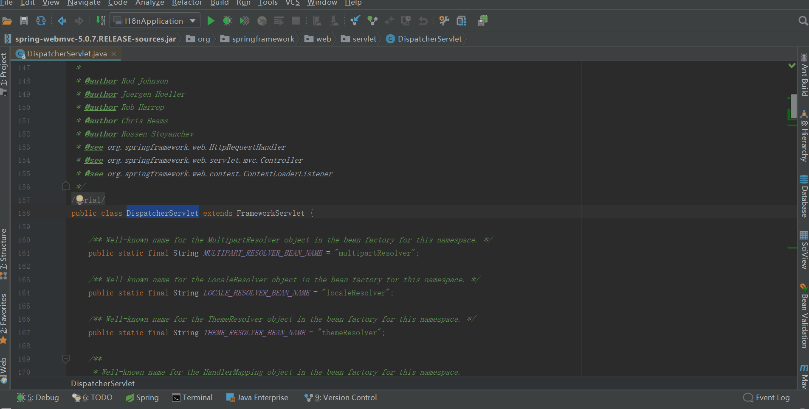
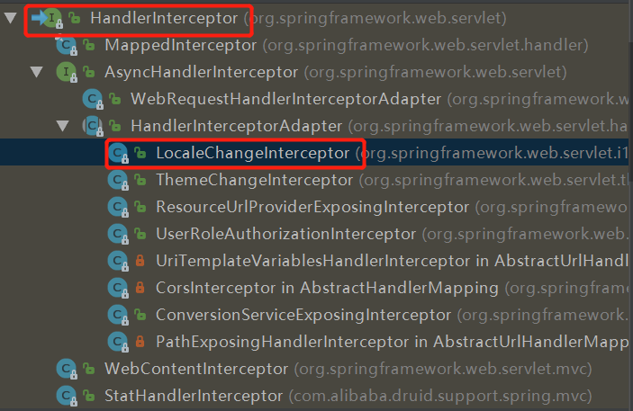
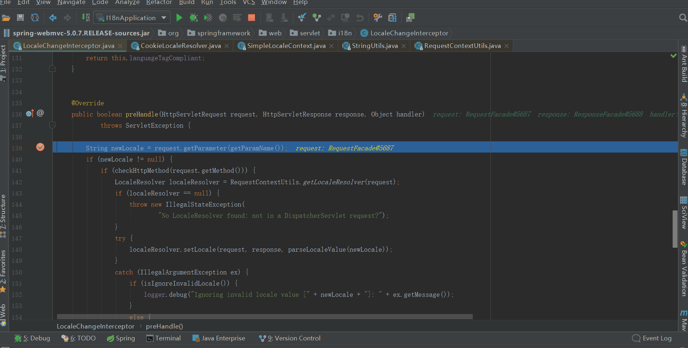

## 前言

针对spring boot，网上已有很多优质的系列教程，我就不再班门弄斧了（实际上是担心没别人写的好，哈哈哈！）。但是还是想蹭蹭spring
boot的热度，即使不考虑微服务，spring
boot还是有很多可取优点的，比如自动化配置、系列Starters简化maven的依赖管理等。本系列主要是将工作中涉及到的一些功能利用spring
boot整合到一起（工作中还没用到spring-boot）。

[maven-ssm-web](https://github.com/youzhibing/maven-ssm-
web)中的内容会陆续集成进来，最近几篇博客会先介绍一些maven-ssm-web中没有的新内容（因为比较熟嘛！）；maven-ssm-
web最近会停更，如果有朋友仍需要，还是会继续更新的；spring boot的集成工程是：[spring-boot-
integrate](https://gitee.com/youzhibing/spring-boot-2.0.3/tree/master/spring-
boot-integrate)，系列工程则是： [spring-
boot-2.0.3](https://gitee.com/youzhibing/spring-boot-2.0.3)。

该系列工程都是基于spring-boot-2.0.3；本文是第一篇，先来点简单的，讲讲spring boot中的国际化，工程地址：[spring-
boot-i18n](https://gitee.com/youzhibing/spring-boot-2.0.3/tree/master/spring-
boot-i18n)

## 基本版

pom.xml:

    
    
    <?xml version="1.0" encoding="UTF-8"?>
    <project xmlns="http://maven.apache.org/POM/4.0.0"
             xmlns:xsi="http://www.w3.org/2001/XMLSchema-instance"
             xsi:schemaLocation="http://maven.apache.org/POM/4.0.0 http://maven.apache.org/xsd/maven-4.0.0.xsd">
        <modelVersion>4.0.0</modelVersion>
    
        <groupId>com .lee</groupId>
        <artifactId>spring-boot-i18n</artifactId>
        <version>1.0-SNAPSHOT</version>
    
        <properties>
            <java.version>1.8</java.version>
        </properties>
    
        <parent>
            <groupId>org.springframework.boot</groupId>
            <artifactId>spring-boot-starter-parent</artifactId>
            <version>2.0.3.RELEASE</version>
        </parent>
    
        <dependencies>
            <dependency>
                <groupId>org.springframework.boot</groupId>
                <artifactId>spring-boot-starter-web</artifactId>
            </dependency>
            <dependency>
                <groupId>org.springframework.boot</groupId>
                <artifactId>spring-boot-starter-thymeleaf</artifactId>
            </dependency>
        </dependencies>
    
        <build>
            <plugins>
                <plugin>
                    <groupId>org.springframework.boot</groupId>
                    <artifactId>spring-boot-maven-plugin</artifactId>
                </plugin>
            </plugins>
        </build>
    </project>

application.yml

    
    
    server:
      port: 8880
    spring:
      #国际化配置
      messages:
        encoding: utf-8
        basename: i18n/messages
      #thymeleaf配置
      thymeleaf:
        cache: false

I18nConfig.java

    
    
    package com.lee.i18n.config;
    
    import org.springframework.context.annotation.Bean;
    import org.springframework.context.annotation.Configuration;
    import org.springframework.web.servlet.LocaleResolver;
    import org.springframework.web.servlet.config.annotation.InterceptorRegistry;
    import org.springframework.web.servlet.config.annotation.WebMvcConfigurer;
    import org.springframework.web.servlet.i18n.CookieLocaleResolver;
    import org.springframework.web.servlet.i18n.LocaleChangeInterceptor;
    
    @Configuration
    public class I18nConfig {
    
        // 配置cookie语言解析器
        @Bean
        public LocaleResolver localeResolver() {
            CookieLocaleResolver resolver = new CookieLocaleResolver();
            resolver.setCookieMaxAge(3600);      // cookie有效时长，单位秒
            resolver.setCookieName("Language");  //设置存储的Cookie的name为Language
            return resolver;
        }
    
        // 配置一个拦截器，拦截国际化语言的变化
        @Bean
        public WebMvcConfigurer webMvcConfigurer() {
            return new WebMvcConfigurer() {
                //拦截器
                @Override
                public void addInterceptors(InterceptorRegistry registry) {
                    registry.addInterceptor(new LocaleChangeInterceptor()).addPathPatterns("/**");
                }
            };
        }
    }

View Code

LoginController.java

    
    
    package com.lee.i18n.controller;
    
    import org.springframework.stereotype.Controller;
    import org.springframework.web.bind.annotation.RequestMapping;
    
    @Controller
    public class LoginController {
    
        @RequestMapping("/login")
        public String login() {
            return "login";
        }
    
        @RequestMapping("/index")
        public String index() {
            return "index";
        }
    }

View Code

messages.properties

    
    
    index.welcome=欢迎
    
    login.username=登录名
    login.password=密码
    login.login=登录

messages_en_US.properties

    
    
    index.welcome=welcome
    
    login.username=username
    login.password=password
    login.login=login

messages_zh_CN.properties

    
    
    index.welcome=欢迎
    
    login.username=登录名
    login.password=密码
    login.login=登录

当如上文件配置好之后（其他的可以去[spring-boot-i18n](https://gitee.com/youzhibing/spring-
boot-2.0.3/tree/master/spring-boot-i18n)拉取），都配置好后，工程跑起来，我们来看看结果，是否达到国际化效果呢？
答案是肯定的嘛！

## 高级版

基本版有一个缺点，就是国际化资源都写在了一个文件中：messages*.properties，内容都写在一个文件中有一个致命的缺点：文件越大，越难以维护；

那么高级版高级在哪了？
你想的没错，就是将资源按某种性质或者功能划分成资源文件夹，再在资源文件夹下放具体的资源文件，如下图

改动的内容已标明，具体改动的内容可以去[spring-boot-i18n](https://gitee.com/youzhibing/spring-
boot-2.0.3/tree/master/spring-
boot-i18n)拉取；工程跑起来，我们看看结果

## 源码探究

从两个容器的初始化来看整个过程，是哪两个容器了，一个是spring根容器、一个是spring
mvc容器，spring根容器也就是根上下文：WebApplicationContext，spring mvc容器即是：DispatcherServlet；

###  spring根容器初始化

我们从main函数入手，如下图

initMessageSource()：初始化国际化资源，finishBeanFactoryInitialization(beanFactory)
实例化非延迟初始化的bean；spring容器初始化的内容还是非常多的，有兴趣的朋友可以跟着断点调试详细看看初始化话过程；
最终全部bean定义都放在了DefaultListableBeanFactory的beanDefinitionMap中了，后续则从beanDefinitionMap中获取bean定义进行实例化。

###  spring mvc容器初始化

我们都知道spring
mvc的核心类就是DispatcherServlet，我们就从他入手，如下图：

从DispatcherServlet继承关系可知，HttpServletBean继承HttpServlet，因此在Web容器启动时将调用它的init方法，我们可以以此为入口来追踪DispatcherServlet的初始化过程；DispatcherServlet中的initStrategies方法比较重要，而其中initLocaleResolver(context)和initHandlerMappings(context)和本文的国际化有直接关系，initLocaleResolver(context)将我们自己定义的localeResolver绑到了DispatcherServlet的属性localeResolver中；而initHandlerMappings(context)又将我们自己新增的拦截器LocaleChangeInterceptor添加到了DispatcherServlet的handlerMappings中；

是不是有种很美妙的预感，我们自定义的一些bean都关联到了DispatcherServlet中，而我们的请求url又必须经过DispatcherServlet，这是不是巧合？
很显然这不是！如果你还是一头雾水，对不起! 我们接着往下看......

###  请求过程

从DispatcherServlet的继承关系可知，请求会经过DispatcherServlet的doService方法，doService会将DispatcherServlet中的localeResolver（也就是我们定义的CookieLocaleResolver对象）绑定到当前request对象中，然后再调用doDispatch进行请求的转发；

LocaleChangeInterceptor的类继承图

可知它继承了HandlerInterceptor，并重写了preHandle，我们就从LocaleChangeInterceptor的preHandle方法开始（请求肯定会经过此方法）阅读源码，打断点追踪，如下如

既然能通过locale参数感知语言的变化，那么肯定也能根据语言加载对应的资源，从而实现国际化（具体如何加载的需要大家自己去阅读源码了！）

源码阅读就此告一段落，不是特别细，只是提供了一个主体流程；强烈建议大家阅读源码的时候，进行断点调试跟踪，不容易跟丢！

## 参考

[自己动手在Spring-Boot上加强国际化功能](https://segmentfault.com/a/1190000014538512)

[第三章 DispatcherServlet详解
——跟开涛学SpringMVC](http://jinnianshilongnian.iteye.com/blog/1602617)

