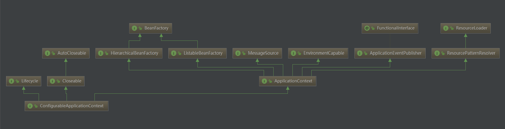
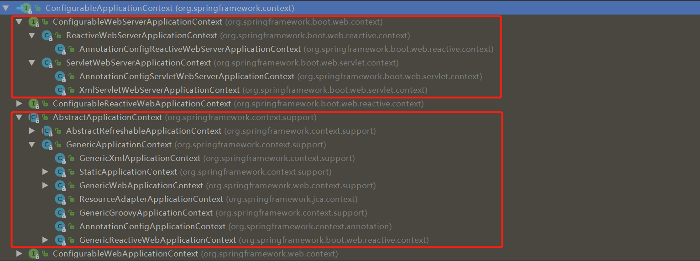
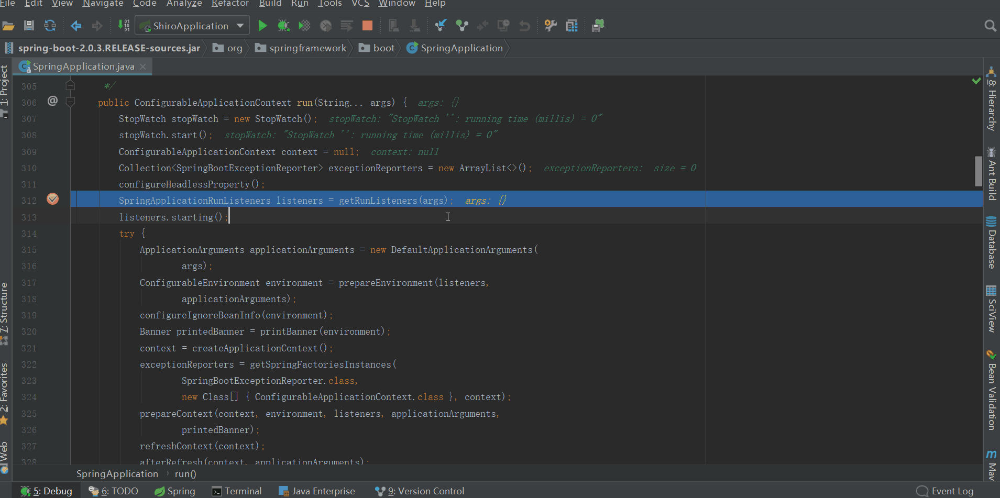
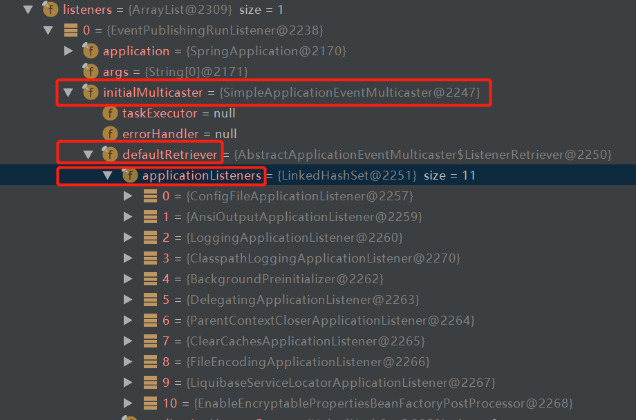
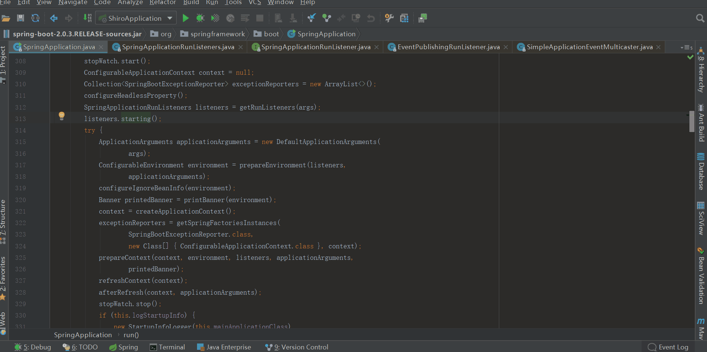
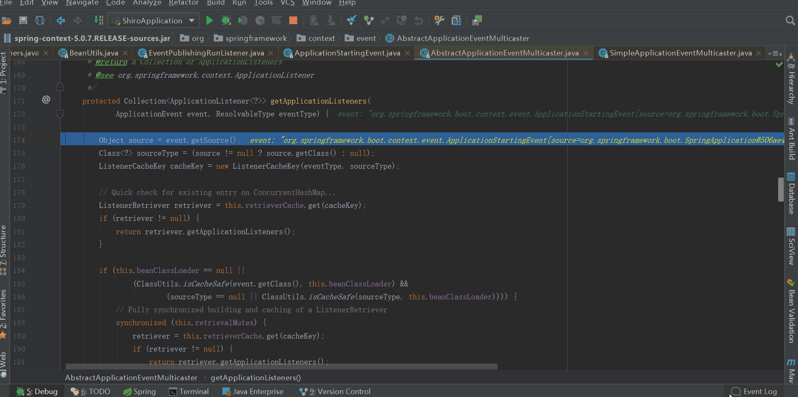
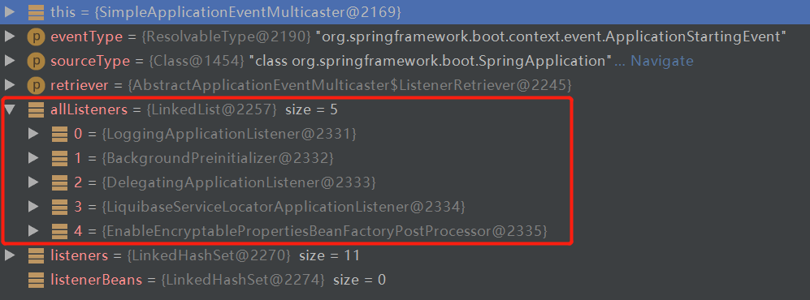

## 前言

Springboot启动源码系列还只写了一篇，已经过去一周，又到了每周一更的时间了（是不是很熟悉？），大家有没有很期待了？我会尽量保证启动源码系列每周一更，争取不让大家每周的期望落空。一周之中可能会插入其他内容的博文，可能和springboot启动源码有关，也可能和启动源码无关。

路漫漫其修远兮，吾将上下而求索！

github：[https://github.com/youzhibing](https://github.com/youzhibing)

码云(gitee)：[https://gitee.com/youzhibing](https://gitee.com/youzhibing)

## 前情回顾

这篇是在[spring-boot-2.0.3不一样系列之源码篇 -
springboot源码一，绝对有值得你看的地方](https://www.cnblogs.com/youzhibing/p/9550343.html)和[spring-
boot-2.0.3不一样系列之番外篇 -
springboot事件机制，绝对有值得你看的地方](https://www.cnblogs.com/youzhibing/p/9593788.html)这两篇的基础上进行的，没看的小伙伴可以先去看看这两篇。如果大家不想去看，这里我帮大家简单回顾下。

[spring-boot-2.0.3不一样系列之源码篇 -
springboot源码一，绝对有值得你看的地方](https://www.cnblogs.com/youzhibing/p/9550343.html)

SpringApplication的构造方法主要做了以下3件事：

1、推测web应用类型，并赋值到属性webApplicationType

2、设置属性List<ApplicationContextInitializer<?>>
initializers和List<ApplicationListener<?>> listeners

中途读取了类路径下所有META-
INF/spring.factories的属性，并缓存到了SpringFactoriesLoader的cache缓存中，而这个cache会在本文中用到

3、 推断主类，并赋值到属性mainApplicationClass

[spring-boot-2.0.3不一样系列之番外篇 -
springboot事件机制，绝对有值得你看的地方](https://www.cnblogs.com/youzhibing/p/9593788.html)

事件机制是基于观察者模式实现的。主要包括几下4个角色：

事件源：触发事件的主体

事件：事件本身，指的是EventObject中的source，具体可以是任何数据（包括事件源），用来传递数据

事件监听器：当事件发生时，负责对事件的处理

事件环境：整个事件所处的上下文，对整个事件提供支持

## SpringApplicationRunListener

run方法的源代码如下

    
    
    /**
     * Run the Spring application, creating and refreshing a new
     * {@link ApplicationContext}.
     * @param args the application arguments (usually passed from a Java main method)
     * @return a running {@link ApplicationContext}
     */
    public ConfigurableApplicationContext run(String... args) {
        // 秒表，用于记录启动时间；记录每个任务的时间，最后会输出每个任务的总费时
        StopWatch stopWatch = new StopWatch();
        stopWatch.start();
        // spring应用上下文，也就是我们所说的spring根容器
        ConfigurableApplicationContext context = null;
        // 自定义SpringApplication启动错误的回调接口
        Collection<SpringBootExceptionReporter> exceptionReporters = new ArrayList<>();
        // 设置jdk系统属性java.awt.headless，默认情况为true即开启；更多java.awt.headless信息大家可以去查阅资料，这不是本文重点
        configureHeadlessProperty();
        // 获取启动时监听器
        SpringApplicationRunListeners listeners = getRunListeners(args)
        // 触发启动事件，相应的监听器会被调用，这是本文重点
        listeners.starting(); 
        try {
            ApplicationArguments applicationArguments = new DefaultApplicationArguments(
                    args);
            ConfigurableEnvironment environment = prepareEnvironment(listeners,
                    applicationArguments);
            configureIgnoreBeanInfo(environment);
            Banner printedBanner = printBanner(environment);
            context = createApplicationContext();
            exceptionReporters = getSpringFactoriesInstances(
                    SpringBootExceptionReporter.class,
                    new Class[] { ConfigurableApplicationContext.class }, context);
            prepareContext(context, environment, listeners, applicationArguments,
                    printedBanner);
            refreshContext(context);
            afterRefresh(context, applicationArguments);
            stopWatch.stop();
            if (this.logStartupInfo) {
                new StartupInfoLogger(this.mainApplicationClass)
                        .logStarted(getApplicationLog(), stopWatch);
            }
            listeners.started(context);
            callRunners(context, applicationArguments);
        }
        catch (Throwable ex) {
            handleRunFailure(context, ex, exceptionReporters, listeners);
            throw new IllegalStateException(ex);
        }
    
        try {
            listeners.running(context);
        }
        catch (Throwable ex) {
            handleRunFailure(context, ex, exceptionReporters, null);
            throw new IllegalStateException(ex);
        }
        return context;
    }

View Code

再讲今天的主角之前，我们先来看看ConfigurableApplicationContext，从名字来看就是：配置应用上下文，会根据class路径下的类初始化配置合适的应用上下文，比如是普通的spring应用（非web应用），还是web应用上下文。类图和类继承图如下

ConfigurableApplicationContext类图

ConfigurableApplicationContext类继承图

ConfigurableApplicationContext不会在本文详解，他的创建会在后续的博文中讲到，这里只是一个提醒。今天的主角是以下两行代码

    
    
    SpringApplicationRunListeners listeners = getRunListeners(args)
    listeners.starting();

我们今天的目的就是看看这两行代码到底做了些什么

## getRunListeners

我们先看看SpringApplicationRunListeners和SpringApplicationRunListener。

SpringApplicationRunListeners的类注释很简单：

一个存SpringApplicationRunListener的集合，里面有些方法，后续都会讲到；

SpringApplicationRunListener的接口注释也简单：

监听SpringApplication的run方法。通过SpringFactoriesLoader加载SpringApplicationRunListener（一个或多个），SpringApplicationRunListener的实现类必须声明一个接收SpringApplication实例和String[]数组的公有构造方法。

接下来我们看看getRunListeners方法，源代码如下

    
    
    private SpringApplicationRunListeners getRunListeners(String[] args) {
            Class<?>[] types = new Class<?>[] { SpringApplication.class, String[].class };
            return new SpringApplicationRunListeners(logger, getSpringFactoriesInstances(
                    SpringApplicationRunListener.class, types, this, args));
        }

初略来看的话，就是返回一个新的SpringApplicationRunListeners实例对象；

细看的话，发现有个getSpringFactoriesInstances方法的调用，这个方法大家还记得吗?（详情请看[spring-
boot-2.0.3不一样系列之源码篇 -
springboot源码一，绝对有值得你看的地方](https://www.cnblogs.com/youzhibing/p/9550343.html)）getSpringFactoriesInstances在SpringApplication的构造方法中调用了两次，分别用来设置属性List<ApplicationContextInitializer<?>>
initializers和List<ApplicationListener<?>>
listeners。getSpringFactoriesInstances在第一次被调用时会将类路径下所有的META-
INF/spring.factories的文件中的属性进行加载并缓存到SpringFactoriesLoader的缓存cache中，下次被调用的时候就直接从SpringFactoriesLoader的cache中取数据了。这次就是从SpringFactoriesLoader的cache中取SpringApplicationRunListener类型的类（全限定名），然后实例化后返回。我们来跟下这次getSpringFactoriesInstances获取的的内容

EventPublishingRunListener的构造方法中，构造了一个SimpleApplicationEventMulticaster对象，并将SpringApplication的listeners中的全部listener赋值到SimpleApplicationEventMulticaster对象的属性defaultRetriever（类型是ListenerRetriever）的applicationListeners集合中，如下图

总的来说，getRunListeners做了什么事呢？就是获取SpringApplicationRunListener类型的实例（EventPublishingRunListener对象），并封装进SpringApplicationRunListeners对象，然后返回这个SpringApplicationRunListeners对象。说的再简单点，getRunListeners就是准备好了运行时监听器EventPublishingRunListener。

## listeners.starting()

我们看看starting方法做了些什么事

构建了一个ApplicationStartingEvent事件，并将其发布出去，其中调用了resolveDefaultEventType方法，该方法返回了一个封装了事件的默认类型（ApplicationStartingEvent）的ResolvableType对象。我们接着往下看，看看这个发布过程做了些什么

###  multicastEvent

源代码如下

    
    
    @Override
    public void multicastEvent(final ApplicationEvent event, @Nullable ResolvableType eventType) {
        ResolvableType type = (eventType != null ? eventType : resolveDefaultEventType(event));
        for (final ApplicationListener<?> listener : getApplicationListeners(event, type)) {
            Executor executor = getTaskExecutor();
            if (executor != null) {
                executor.execute(() -> invokeListener(listener, event));
            }
            else {
                invokeListener(listener, event);
            }
        }
    }

初略的看，就是遍历getApplicationListeners(event,
type)，然后对每个listener进行invokeListener(listener, event)

###  getApplicationListeners

根据其注释可知，该方法作用：返回与给定事件类型匹配的ApplicationListeners集合，非匹配的侦听器会被提前排除；允许根据缓存的匹配结果来返回。

从上图可知，主要涉及到3个点：缓存retrieverCache、retrieveApplicationListeners已经retrieveApplicationListeners中调用的supportsEvent方法。流程是这样的：

1、缓存中是否有匹配的结果，有则返回

2、若缓存中没有匹配的结果，则从this.defaultRetriever.applicationListeners中过滤，这个this表示的EventPublishingRunListener对象的属性initialMulticaster（也就是SimpleApplicationEventMulticaster对象，而defaultRetriever.applicationListeners的值也是在EventPublishingRunListener构造方法中初始化的）

3、过滤过程，遍历defaultRetriever.applicationListeners集合，从中找出ApplicationStartingEvent匹配的listener，具体的匹配规则需要看各个listener的supportsEventType方法（有两个重载的方法）

4、将过滤的结果缓存到retrieverCache

5、将过滤出的结果返回回去

我们看看，过滤出的listener对象有哪些

###  invokeListener

其注释：使用给定的事件调用给定的监听器

getApplicationListeners方法过滤出的监听器都会被调用，过滤出来的监听器包括LoggingApplicationListener、BackgroundPreinitializer、DelegatingApplicationListener、LiquibaseServiceLocatorApplicationListener、EnableEncryptablePropertiesBeanFactoryPostProcessor五种类型的对象。这五个对象的onApplicationEvent都会被调用。

那么这五个监听器的onApplicationEvent都做了些什么了，我这里大概说下，细节的话大家自行去跟源码

LoggingApplicationListener：检测正在使用的日志系统，默认是logback，支持3种，优先级从高到低：logback > log4j
> javalog。此时日志系统还没有初始化

BackgroundPreinitializer：另起一个线程实例化Initializer并调用其run方法，包括验证器、消息转换器等等

DelegatingApplicationListener：此时什么也没做

LiquibaseServiceLocatorApplicationListener：此时什么也没做

EnableEncryptablePropertiesBeanFactoryPostProcessor：此时仅仅打印了一句日志，其他什么也没做

## 总结

###  事件机制要素

这里和大家一起把事件4要素找出来

事件源：SpringApplication

事件：ApplicationStartingEvent

监听器：过滤后的监听器，具体5个上文中已经说过

事件环境：EventPublishingListener，提供环境支持事件，并且发布事件（starting方法）

###  监听器数量

项目中集成的功能的多少的不同，从spring.factories加载的属性数量也不同，自然监听器数量也会有所不同；如果大家看源码的时候发现比我的多或者少，不要惊慌，这是很正常的，因为我们集成的功能有所差别。

###  友情提醒

博文中有些地方分析的不是特别细，需要大家自行去跟源码，没涉及到复杂的模式，相信大家也都能看懂。过滤监听器的时候用到了supportsEvent方法，这个方法里面涉及到了适配器模式，改天我结合session共享给大家分析下适配器模式。

###  高光时刻

有时候，不是对手有多强大，只是我们不敢去尝试；勇敢踏出第一步，你会发现自己比想象中更优秀！诚如海因斯第一次跑进人类10s大关时所说：上帝啊，原来那扇门是虚掩着的！

## 参考

springboot源码

