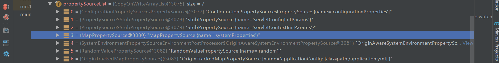
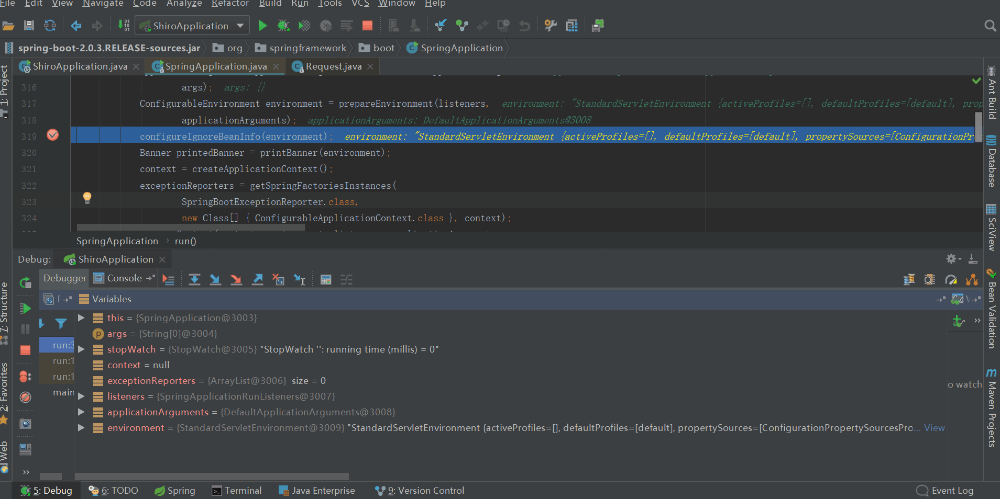
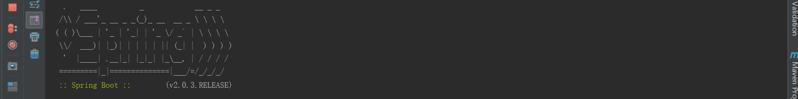
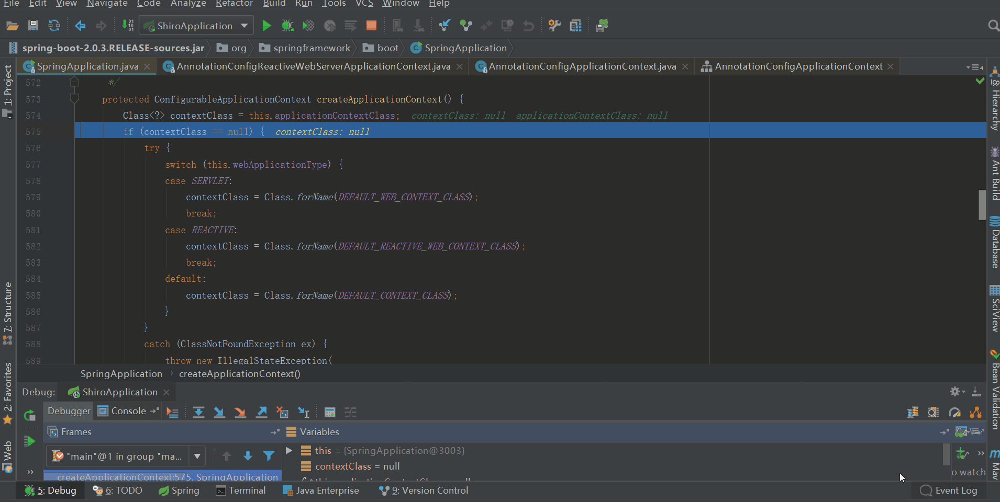
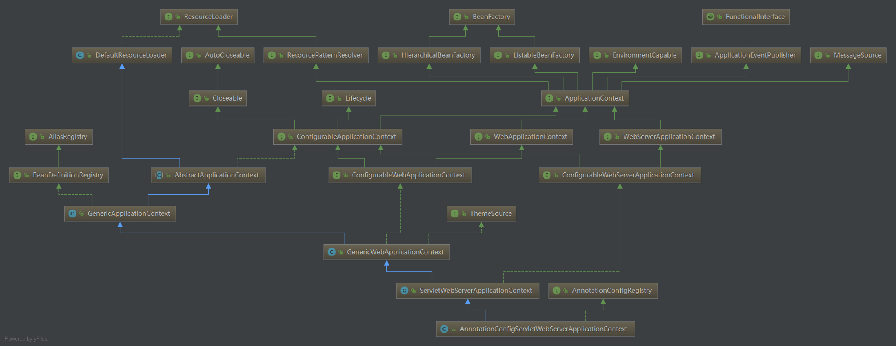
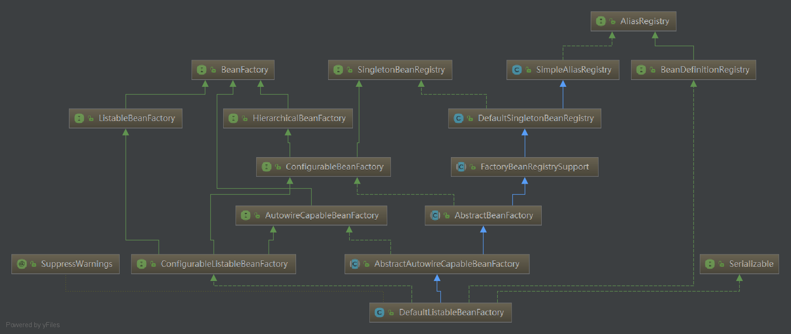
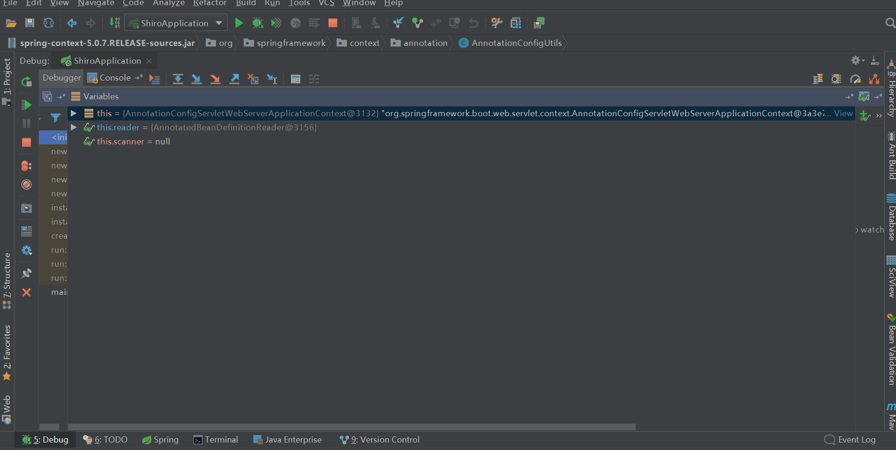
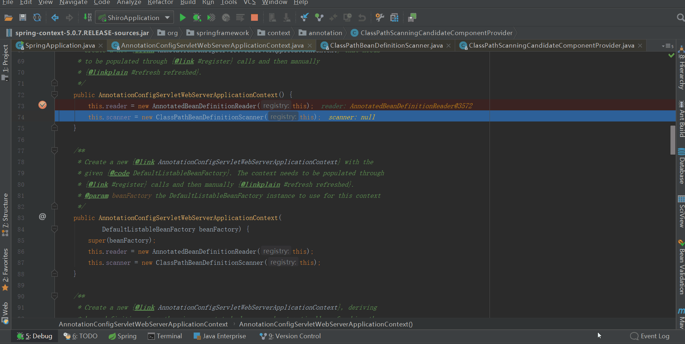
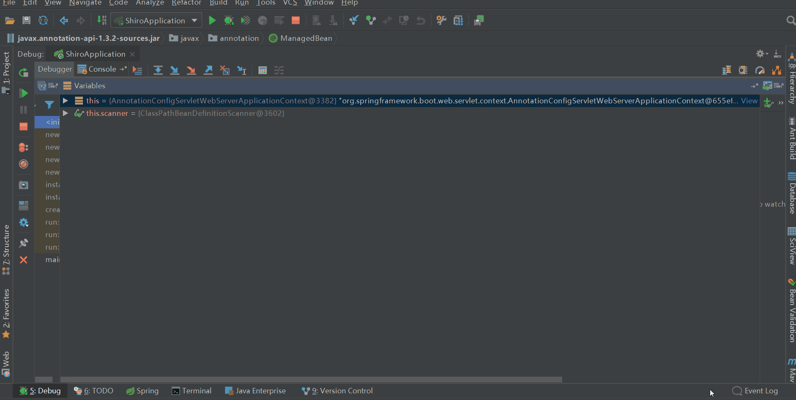

## 前言

此系列是针对springboot的启动，旨在于和大家一起来看看springboot启动的过程中到底做了一些什么事。如果大家对springboot的源码有所研究，可以挑些自己感兴趣或者对自己有帮助的看；但是如果大家没有研究过springboot的源码，不知道springboot在启动过程中做了些什么，那么我建议大家从头开始一篇一篇按顺序读该系列，不至于从中途插入，看的有些懵懂。当然，文中讲的不对的地方也欢迎大家指出，有待改善的地方也希望大家不吝赐教。老规矩：一周至少一更，中途会不定期的更新一些其他的博客，可能是springboot的源码，也可能是其他的源码解析，也有可能是其他的。

路漫漫其修远兮，吾将上下而求索！

github：[https://github.com/youzhibing](https://github.com/youzhibing)

码云(gitee)：[https://gitee.com/youzhibing](https://gitee.com/youzhibing)

## 前情回顾

大家还记得[上篇博文](https://www.cnblogs.com/youzhibing/p/9622441.html)讲了什么吗，或者说大家知道上篇博文讲了什么吗。这里帮大家做个简单回顾，主要做了两件事

1、加载外部化配置的资源到environment

包括命令行参数、servletConfigInitParams、servletContextInitParams、systemProperties、sytemEnvironment、random、application.yml(.yaml/.xml/.properties)，如下所示

2、广播ApplicationEnvironmentPreparedEvent事件，触发相应的监听器

ConfigFileApplicationListener

添加名叫random的RandomValuePropertySource到environment

添加名叫applicationConfig:[classpath:/application.yml]的OriginTrackedMapPropertySource到environment

LoggingApplicationListener

初始化日志系统

## createApplicationContext

先欣赏下我们的战绩，看看我们对run方法完成了多少的源码解读

    
    
    /**
     * Run the Spring application, creating and refreshing a new
     * {@link ApplicationContext}.
     * @param args the application arguments (usually passed from a Java main method)
     * @return a running {@link ApplicationContext}
     */
    public ConfigurableApplicationContext run(String... args) {
        // 秒表，用于记录启动时间；记录每个任务的时间，最后会输出每个任务的总费时
        StopWatch stopWatch = new StopWatch();
        stopWatch.start();
        // spring应用上下文，也就是我们所说的spring根容器
        ConfigurableApplicationContext context = null;
        // 自定义SpringApplication启动错误的回调接口
        Collection<SpringBootExceptionReporter> exceptionReporters = new ArrayList<>();
        // 设置jdk系统属性java.awt.headless，默认情况为true即开启
        configureHeadlessProperty();
        // 获取启动时监听器(EventPublishingRunListener实例)
        SpringApplicationRunListeners listeners = getRunListeners(args)
        // 触发ApplicationStartingEvent事件，启动监听器会被调用，一共5个监听器被调用，但只有两个监听器在此时做了事
        listeners.starting(); 
        try {
            // 参数封装，也就是在命令行下启动应用带的参数，如--server.port=9000
            ApplicationArguments applicationArguments = new DefaultApplicationArguments(
                    args);
            // 准备环境：1、加载外部化配置的资源到environment；2、触发ApplicationEnvironmentPreparedEvent事件
            ConfigurableEnvironment environment = prepareEnvironment(listeners,
                    applicationArguments);
            // 配置spring.beaninfo.ignore，并添加到名叫systemProperties的PropertySource中；默认为true即开启
            configureIgnoreBeanInfo(environment);
            // 打印banner图
            Banner printedBanner = printBanner(environment);
            // 创建应用上下文，这是本文重点
            context = createApplicationContext();
            exceptionReporters = getSpringFactoriesInstances(
                    SpringBootExceptionReporter.class,
                    new Class[] { ConfigurableApplicationContext.class }, context);
            prepareContext(context, environment, listeners, applicationArguments,
                    printedBanner);
            refreshContext(context);
            afterRefresh(context, applicationArguments);
            stopWatch.stop();
            if (this.logStartupInfo) {
                new StartupInfoLogger(this.mainApplicationClass)
                        .logStarted(getApplicationLog(), stopWatch);
            }
            listeners.started(context);
            callRunners(context, applicationArguments);
        }
        catch (Throwable ex) {
            handleRunFailure(context, ex, exceptionReporters, listeners);
            throw new IllegalStateException(ex);
        }
    
        try {
            listeners.running(context);
        }
        catch (Throwable ex) {
            handleRunFailure(context, ex, exceptionReporters, null);
            throw new IllegalStateException(ex);
        }
        return context;
    }

View Code

###  前菜

configureIgnoreBeanInfo(environment)；

    
    
    private void configureIgnoreBeanInfo(ConfigurableEnvironment environment) {
        if (System.getProperty(
                CachedIntrospectionResults.IGNORE_BEANINFO_PROPERTY_NAME) == null) {
            Boolean ignore = environment.getProperty("spring.beaninfo.ignore",
                    Boolean.class, Boolean.TRUE);
            System.setProperty(CachedIntrospectionResults.IGNORE_BEANINFO_PROPERTY_NAME,
                    ignore.toString());
        }
    }

View Code

配置spring.beaninfo.ignore，并添加到名叫systemProperties的PropertySource中，默认为true即开启，如上图所示。至于spring.beaninfo.ignore配置这个有什么用，什么时候用，暂时还没体现，后续应该会有所体现，我们暂时先将其当做一个疑问放着。

printBanner(environment)；

    
    
    private Banner printBanner(ConfigurableEnvironment environment) {
        if (this.bannerMode == Banner.Mode.OFF) {
            return null;
        }
        ResourceLoader resourceLoader = (this.resourceLoader != null ? this.resourceLoader
                : new DefaultResourceLoader(getClassLoader()));
        SpringApplicationBannerPrinter bannerPrinter = new SpringApplicationBannerPrinter(
                resourceLoader, this.banner);
        if (this.bannerMode == Mode.LOG) {
            return bannerPrinter.print(environment, this.mainApplicationClass, logger);
        }
        return bannerPrinter.print(environment, this.mainApplicationClass, System.out);
    }

View Code

打印banner图，就是下面这个图

并返回Banner对象，后续还会用到。

###  正餐

通过前面两道前菜，我相信我们已经胃口大开了，那么请开始我们的正餐 - createApplicationContext

源代码

    
    
    /**
     * Strategy method used to create the {@link ApplicationContext}. By default this
     * method will respect any explicitly set application context or application context
     * class before falling back to a suitable default.
     * @return the application context (not yet refreshed)
     * @see #setApplicationContextClass(Class)
     */
    protected ConfigurableApplicationContext createApplicationContext() {
        Class<?> contextClass = this.applicationContextClass;
        if (contextClass == null) {
            try {
                switch (this.webApplicationType) {
                case SERVLET:
                    contextClass = Class.forName(DEFAULT_WEB_CONTEXT_CLASS);
                    break;
                case REACTIVE:
                    contextClass = Class.forName(DEFAULT_REACTIVE_WEB_CONTEXT_CLASS);
                    break;
                default:
                    contextClass = Class.forName(DEFAULT_CONTEXT_CLASS);
                }
            }
            catch (ClassNotFoundException ex) {
                throw new IllegalStateException(
                        "Unable create a default ApplicationContext, "
                                + "please specify an ApplicationContextClass",
                        ex);
            }
        }
        return (ConfigurableApplicationContext) BeanUtils.instantiateClass(contextClass);
    }

View Code

根据SpringApplication的webApplicationType来实例化对应的上下文；如果webApplicationType的值是SERVLET，那么实例化AnnotationConfigServletWebServerApplicationContext，如果是REACTIVE则实例化AnnotationConfigReactiveWebServerApplicationContext（响应式编程，后续再看），如果既不是SERVLET、也不是REACTIVE，那么则是默认情况（也就是我们所说的非web引用），实例化AnnotationConfigApplicationContext。还记得webApplicationType的值是怎么获取的吗，请点[这里](https://www.cnblogs.com/youzhibing/p/9550343.html)。很显然我们目前的应用类型是SERVLET，那么实例化AnnotationConfigServletWebServerApplicationContext。

利用反射调用AnnotationConfigServletWebServerApplicationContext的构造方法进行实例化，期间有对构造方法进行可访问性设置，同时还进行了Kotlin的校验。我们目前应用中不涉及Kotlin，先放着不用看。

####  AnnotationConfigServletWebServerApplicationContext类图

#### 
AnnotationConfigServletWebServerApplicationContext父级类

从类图中我们可知，类结构比较深，我们从上往下来看各个父类的构造方法（实现的接口先不看），看看构造方法体里面所做的事。

**DefaultResourceLoader** ，默认资源加载器

获取默认的类加载器，获取的是当前线程的上下文类加载器。

**AbstractApplicationContext** ，抽象应用上下文

初始化属性resourcePatternResolver，也就是资源模式解析器；实际类型是PathMatchingResourcePatternResolver，它是基于模式匹配的，默认使用AntPathMatcher进行路径匹配，它除了支持ResourceLoader支持的前缀外，还额外支持“classpath*:”用于加载所有匹配的类路径Resource。

另外beanFactoryPostProcessors属性此时已经初始化了，后续肯定会用到，大家注意下。

**GenericApplicationContext** ，通用应用上下文

初始化属性beanFactory，其类型是DefaultListableBeanFactory，DefaultListableBeanFactory类图如下

**DefaultListableBeanFactory的父级类**

我们根据上图，从上往下读

**SimpleAliasRegistry** ，简单别名注册器

没有明确的定义构造方法，也就是只有默认的无参构造方法，我们可认为只是实例化了自己。

**DefaultSingletonBeanRegistry** ，默认单例bean注册器，用于注册共享的单例bean

没有明确的定义构造方法，也就是只有默认的无参构造方法，我们可认为只是实例化了自己。

**FactoryBeanRegistrySupport** ，工厂bean注册器支持，用于注册工厂bean单例

没有明确的定义构造方法，也就是只有默认的无参构造方法，我们可认为只是实例化了自己。

**AbstractBeanFactory** ，抽象bean工厂

无参构造方法体内为空，我们可认为只是实例化了自己。

**AbstractAutowireCapableBeanFactory** ，抽象的有自动装配装配能力的bean工厂，赋予了自动装配功能

该类提供bean创建（具有构造函数解析），属性填充，接线（包括自动装配）和初始化。
处理运行时bean引用，解析托管集合，调用初始化方法等。支持自动装配构造函数，按名称的属性和按类型的属性。

无参构造方法中，添加了三个非自动装配的接口：BeanNameAware、BeanFactoryAware和BeanClassLoaderAware。

**DefaultListableBeanFactory** ，ListableBeanFactory的默认实现

该类用于注册所有bean定义、也可用作独立的bean工厂，当然也可以用作我们自定义bean工厂的父类。

无参构造方法中也只是调用了super()，我们可认为只是实例化了自己。

**GenericWebApplicationContext**
，通用web应用上下文，在GenericApplicationContext基础上增加web支持

无参构造方法中，只是调用了super()，我们可认为只是实例化了自己。

**ServletWebServerApplicationContext** ，servlet
web服务应用上下文，能够从自身引导，创建，初始化和运行WebServer

无参构造方法中是空内容，我们可认为只是实例化了自己。

DefaultListableBeanFactory类图中，有很多类的属性值得我们留意，比如SimpleAliasRegistry的aliasMap、DefaultSingletonBeanRegistry的singletonObjects、singletonFactories和earlySingletonObjects、FactoryBeanRegistrySupport的factoryBeanObjectCache、AbstractBeanFactory的beanPostProcessors、AbstractAutowireCapableBeanFactory的ignoredDependencyInterfaces、DefaultListableBeanFactory中的属性beanDefinitionMap和beanDefinitionNames。

AnnotationConfigServletWebServerApplicationContext类图中，也有很多类的属性值得我们留意，比如AbstractApplicationContext的beanFactoryPostProcessors、GenericApplicationContext的beanFactory（就是DefaultListableBeanFactory）、GenericWebApplicationContext的servletContext、ServletWebServerApplicationContext的webServer和servletConfig。

####  AnnotationConfigServletWebServerApplicationContext构造方法

    
    
    /**
     * Create a new {@link AnnotationConfigServletWebServerApplicationContext} that needs
     * to be populated through {@link #register} calls and then manually
     * {@linkplain #refresh refreshed}.
     */
    public AnnotationConfigServletWebServerApplicationContext() {
        this.reader = new AnnotatedBeanDefinitionReader(this);        // 实例化注解bean定义读取器
        this.scanner = new ClassPathBeanDefinitionScanner(this);    // 实例化类路径bean定义扫描器
    }

构造方法中的内容也比较简单，就是实例化两个bean，并赋值给自己的属性。我们接着往下看，AnnotatedBeanDefinitionReader和ClassPathBeanDefinitionScanner到底是什么，构造方法中到底做了什么？

**AnnotatedBeanDefinitionReader**

从类注释上来看，作用就是用于编程式注解bean的注册，例如我们平时用到的@Component，还有@Configuration类下的@Bean等。

构造方法中调用getOrCreateEnvironment(registry)来获取environment；大家调试跟进的话会发现，此处新实例化了StandardServletEnvironment，大家还记得[
SpringApplication中的environment](https://www.cnblogs.com/youzhibing/p/9622441.html)吗，它也是StandardServletEnvironment实例，那么此处为什么还要新new一个StandardServletEnvironment呢，总结中给大家答案。

属性ConditionEvaluator conditionEvaluator，大家留意下属性类型ConditionEvaluator
，通常用来评估@Conditional。

另外还注册了注解配置处理器：AnnotationAwareOrderComparator、ContextAnnotationAutowireCandidateResolver、ConfigurationClassPostProcessor、AutowiredAnnotationBeanPostProcessor、RequiredAnnotationBeanPostProcessor、CommonAnnotationBeanPostProcessor、EventListenerMethodProcessor、DefaultEventListenerFactory。

此时beanFactory属性如下

**ClassPathBeanDefinitionScanner**

从类注释上来看，就是一个bean定义扫描器，用来扫描类路径下的bean侯选者。

其中registerDefaultFilters，注册了两个AnnotationTypeFilter：一个针对@Component，一个针对@ManagedBean

此时beanFactory属性如下

此时虽然已经创建了应用上下文，但还只是具有一个骨架（填充了少部分内容），后续会往这个骨架上填充器官和肉体，来构成一个完整的应用。那往哪填充呢？就是我们上面提的到个各个类中的属性。

###  甜点

上面讲了那么多，相信大家此时有点蒙，看似一个简单的createApplicationContext，却引发了一系列类的实例化；大家主要关注上述两个类图中父级类，对每个类进行一遍通读，大致了解下每个类中有些什么属性。后续肯定会对这些属性进行填充，并利用这些属性完成我们的应用。

有时候，不是对手有多强大，只是我们不敢去尝试；勇敢踏出第一步，你会发现自己比想象中更优秀！诚如海因斯第一次跑进人类10s大关时所说：上帝啊，原来那扇门是虚掩着的！

## 总结

1、文中疑问

AnnotatedBeanDefinitionReader中为什么还要实例化一个StandardServletEnvironment？

我们可以把这个问题变一下，为什么不把SpringApplication中的environment直接注入到AnnotatedBeanDefinitionReader，而是要在AnnotatedBeanDefinitionReader中实例化新的StandardServletEnvironment？

我们看下类所在的包可知，SpringApplication是Spring
boot的特有的类，而AnnotatedBeanDefinitionReader是spring中的类，我们知道spring
boot依赖spring，但spring不依赖spring boot，那么我们在spring中能用spring
boot特有的内容吗？我们可能又有另外的疑问了，
那为什么不先实例化spring中的StandardServletEnvironment，然后将它赋值给SpringApplication，就目前而言，我也不知道，不过在后续应该能找到答案，我们暂且先当一个疑问留着。

2、AnnotatedBeanDefinitionReader与ClassPathBeanDefinitionScanner

前者是注解bean定义读取器，用于编程式注解bean的注册；后者是类路径bean定义扫描器，用于检测类路径上的bean候选者。

AnnotatedBeanDefinitionReade用来加载class类型的配置，在它初始化的时候，会预先注册一些BeanPostProcessor和BeanFactoryPostProcessor，这些处理器会在接下来的spring初始化流程中被调用。ClassPathBeanDefinitionScanner是一个扫描指定类路径中注解Bean定义的扫描器，在它初始化的时候，会初始化一些需要被扫描的注解。

3、BeanDefinition

Spring容器里通过BeanDefinition对象来表示Bean，BeanDefinition描述了Bean的配置信息；根据BeanDefinition实例化bean，并放到bean缓存中。

4、spring bean配置方式

有三种：基于XML的配置方式 、基于注解的配置方式和基于Java类的配置方式。

基于XML，这个我们都很熟，类似：<bean id="xx" class="xxx" />

基于注解，这个我们也用的比较多，入@Component、@Service、@Controller等  

基于java类，spring的推荐配置方式，@Configuration配合@Bean

5、createApplicationContext到底做了什么

说的简单点：创建web应用上下文，对其部分属性：reader、scanner、beanFactory进行了实例化；reader中实例化了属性conditionEvaluator；scanner中添加了两个AnnotationTypeFilter：一个针对@Component，一个针对@ManagedBean；beanFactory中注册了8个注解配置处理器。这些就目前而言，可能没体现其作用，后续肯定会用到的。

## 参考

[Spring Boot Reference Guide](https://docs.spring.io/spring-
boot/docs/2.0.3.RELEASE/reference/htmlsingle/)

Spring boot 源码

